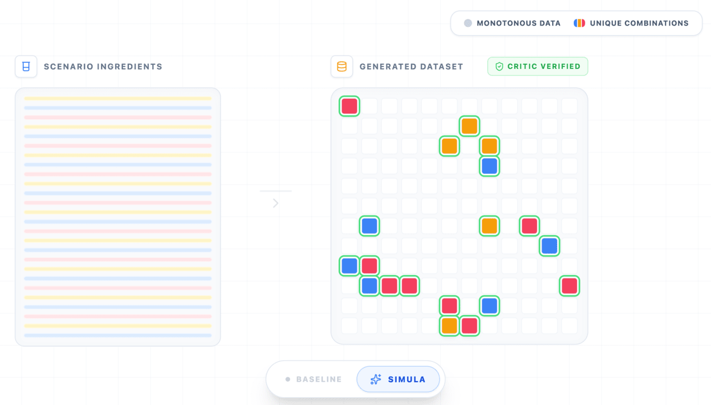
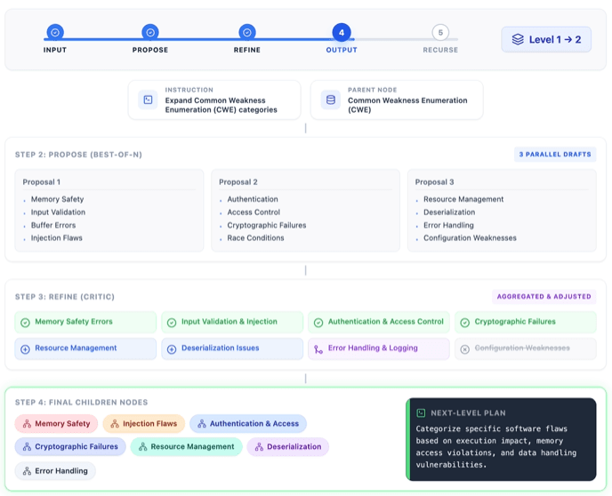

# 구글, AI가 학습 데이터 스스로 설계하는 '시뮬라' 공개..."단순 베끼기는 끝나" - AI타임스 (209779)

Source: https://www.aitimes.com/news/articleView.html?idxno=209779
Saved: 2026-04-28

Original title: 구글, AI가 학습 데이터 스스로 설계하는 '시뮬라' 공개..."단순 베끼기는 끝나" - AI타임스

Canonical URL: https://www.aitimes.com/news/articleView.html?idxno=209779

Author: 박찬 기자

Published: 2026-04-27T18:38:22+09:00

_(사진=구글)_

단순히 양만 늘리던 AI 합성 데이터 시대가 가고, 데이터 자체를 공학적으로 '설계'해 모델의 지능을 높이는 새로운 프레임워크가 등장했다.

구글과 스위스 로잔공과대학교(EPFL) 연구진은 최근 합성 데이터를 체계적으로 설계하고 생성하는 프레임워크 ‘[시뮬라(Simula)](https://openreview.net/pdf?id=NALsdGEPhB)’를 공개했다.

지금까지 대규모 AI 모델의 발전은 인터넷에 축적된 방대한 텍스트와 이미지 데이터에 크게 의존해 왔다. 그러나 사이버보안, 법률, 의료 등 전문 영역으로 AI 활용이 확대되면서 상황이 달라지고 있다. 이 분야는 학습에 필요한 데이터가 절대적으로 부족하거나, 개인정보 및 규제 문제로 접근 자체가 어려운 경우가 많기 때문이다.

이에 따라 연구진은 데이터 생성 자체를 ‘설계 문제’로 바라보는 새로운 방식인 시뮬라를 제안했다. 기존 합성 데이터 방식이 프롬프트 입력이나 일부 샘플 데이터(시드 데이터)를 단순히 흉내 내는 수준에 그쳤다면, 시뮬라는 사물의 근본 법칙인 ‘첫 번째 원칙(First Principles)’으로부터 데이터셋을 구조화하는 ‘메커니즘 디자인’ 접근을 취한다.

즉, 기존 데이터를 복제하는 것이 아니라 물리 법칙이나 경제 논리 같은 근본 원리를 바탕으로 데이터를 처음부터 논리적으로 빌드업하는 방식이다.

이어 단계별로 여러 하위 주제를 만들어낸 뒤, 이를 평가하고 걸러내며 점점 더 정교하게 다듬는다. 이런 ‘제안하고(propose) 다시 다듬는(refine)’ 과정을 반복하면서, 사이버 보안처럼 복잡한 분야도 촘촘한 계층적 분류 체계가 동적으로 구축된다. 이를 통해 특정 영역에 치우치지 않고 다양한 데이터를 만들어낼 수 있다는 설명이다.

시뮬라의 핵심은 4단계로 구성된 생성 프로세스다. 먼저 ‘글로벌 다양성(Global Diversification)’ 단계에서는 특정 분야의 개념 구조를 계층적 분류 체계로 세분화해, 데이터가 한쪽에 치우치지 않도록 한다.

이어 ‘로컬 다양성(Local Diversification)’ 단계에서는 같은 주제라도 다양한 방식으로 표현해 반복을 줄인다. 세번째 ‘복잡도 조정(Complexification)’ 단계에서는 일부 데이터를 더 어렵고 정교하게 만들어 모델의 사고력을 높인다.

마지막으로 ‘품질 검증(Quality Checks)’은 ‘이중 검증(dual-critic)’ 방식을 통해 생성된 데이터의 정답 여부를 독립적으로 평가해 전체 데이터의 신뢰도를 끌어올린다.

_시뮬라 데이터 생성 프로세스 (사진=구글)_

실험 결과도 주목할 만하다. 연구진은 다양한 도메인에서 최대 51만건 이상의 데이터를 생성해 모델 학습에 적용한 결과, 기존 방식 대비 높은 성능을 기록했다고 밝혔다.

또 시뮬라는 데이터 평가 방식에서도 새로운 기준을 제시했다. 단순한 유사도 기반 평가를 넘어, 데이터가 전체 개념 공간을 얼마나 잘 커버하는지를 측정하는 ‘분류 체계 기반 커버리지’와 개별 데이터 난이도를 정량화하는 ‘복잡도 점수’를 도입했다. 이를 통해 데이터셋의 구조적 완성도를 더 정밀하게 분석할 수 있게 됐다.

전문가들은 시뮬라가 단순한 연구 성과를 넘어 실제 서비스에도 영향을 미칠 것으로 보고 있다. 구글은 이미 이 기술을 자체 AI 모델 생태계에 적용, 보안 모델과 온디바이스 AI, 스팸 탐지 기능 등에 활용하고 있다고 밝혔다. 특히 실제 데이터 확보가 어려운 보안 시나리오나 미래 위험 상황을 가정한 테스트에 강점을 보인다고 전했다.

결국 시뮬라는 데이터 부족과 개인정보 문제라는 현실적 한계를 돌파할 수 있는 해법으로, 차세대 AI 개발의 핵심 인프라로 자리 잡을 가능성이 크다는 평이다.

연구진은 "합성 데이터의 가치는 단순히 양적인 팽창에 있는 것이 아니라, 정교하게 설계한 '메커니즘'을 통해 AI 모델이 실제 세상의 논리와 물리 법칙을 깊이 있게 추론하도록 유도하는 데 있다"라고 강조했다.

박찬 기자 cpark@aitimes.com
