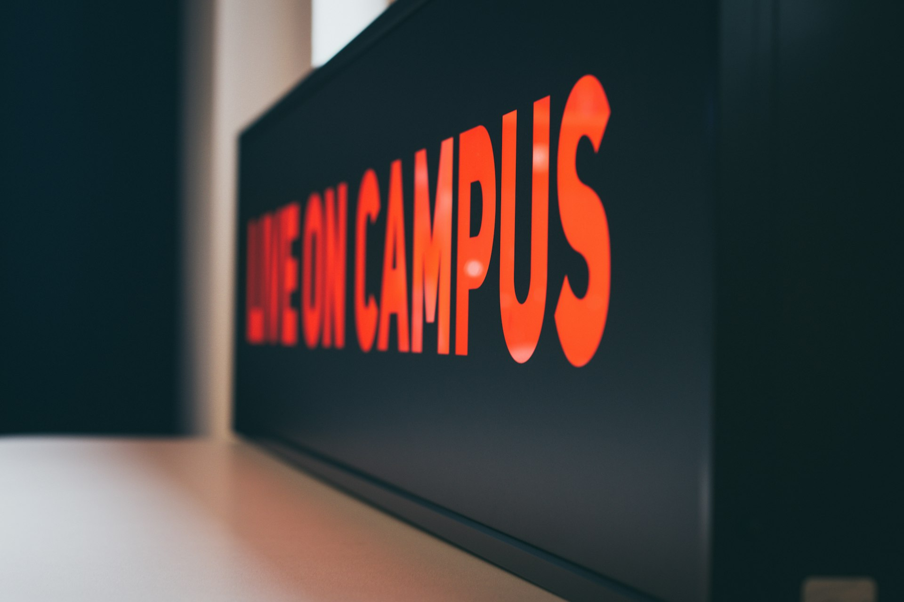
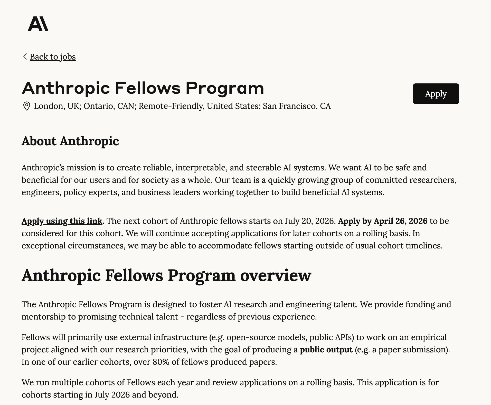
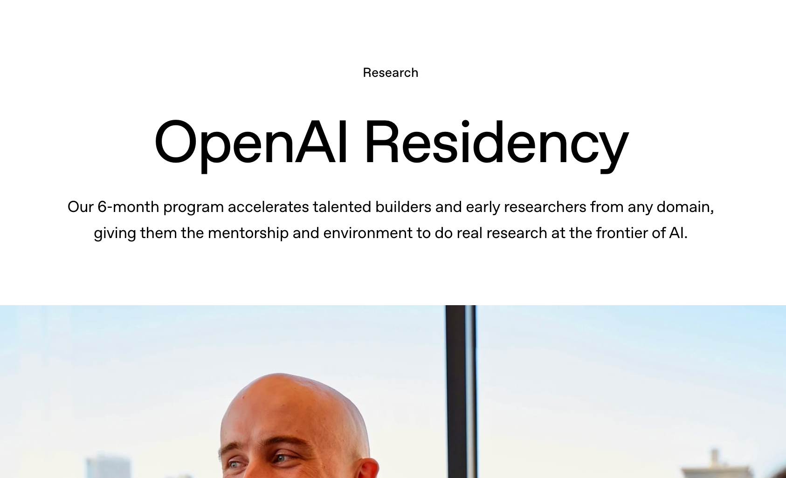
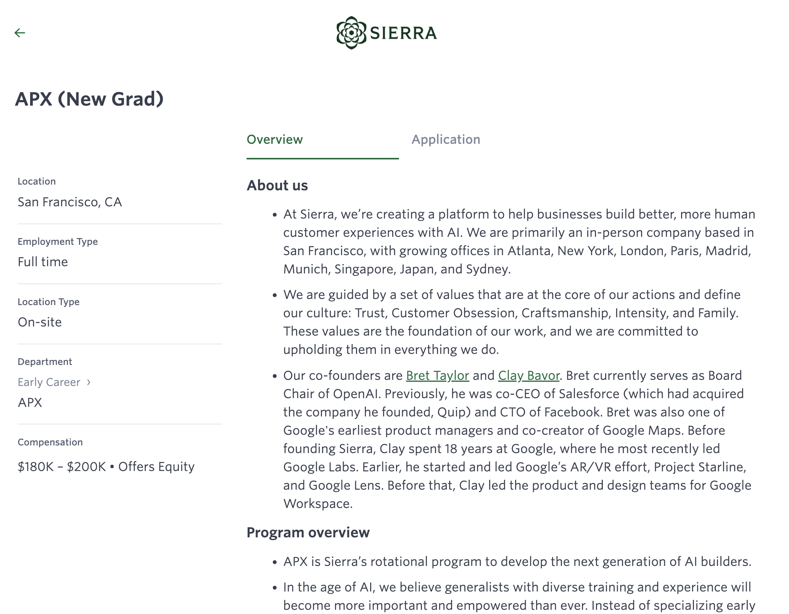
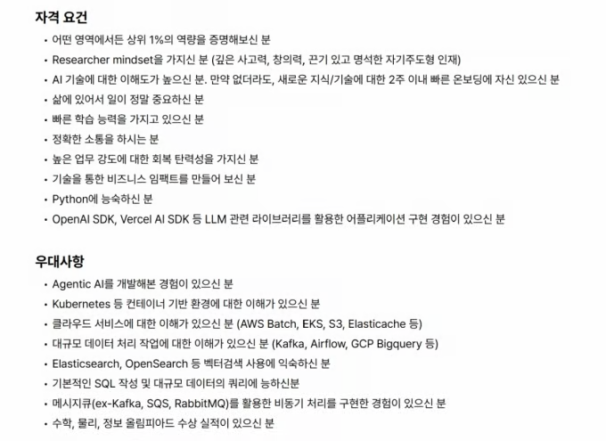
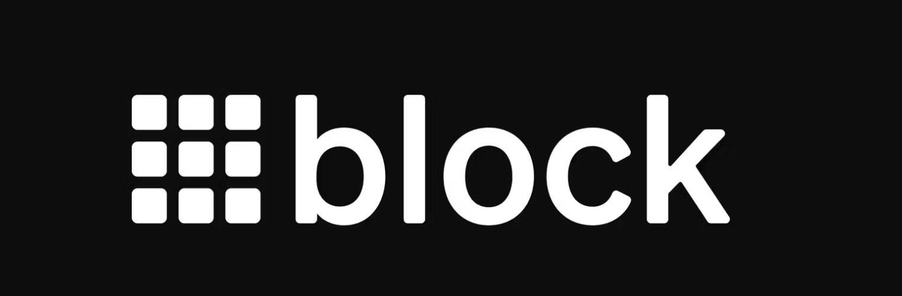

# AI 시대에 대학생으로 살아남는 법 - Re:Builder (ai-junior)

Source: https://www.re-builder.xyz/ai-junior/
Saved: 2026-04-28

Source: https://www.re-builder.xyz/ai-junior/

Author: 장원준

Published: 2026-04-27T10:25:12.000Z

Tag: 오리지널 콘텐츠

Description: AI 시대 신입-대학생은 가장 버려진 계층입니다.
그런데 동시에 가장 희소한 자원이기도 합니다



_AI 시대 신입은 이미 다른 게임입니다._

## 신입이 사라진 게 아니라, 지워지고 있습니다

탑티어 기업들인 Anthropic은 2026년 기준 일반 인턴십을 한 개도 운영하지 않습니다. Google DeepMind의 가장 낮은 PM 공고는 7년 경력을 요구합니다. xAI의 공개 인턴 포지션은 데이터센터 시설직뿐입니다.

한국은 대기업 공채가 약해지고, 신입이 되기 어려워진 지 벌써 10년이 되어갑니다. AI 탓을 하기엔 애매하지만, 이미 그렇게 흘러가던 차에 AI가 마지막 선고를 내리고 있는 셈입니다.

신입의 자리가 조용히 지워지고 있습니다.

결론은 간단합니다. 범용 신입 공채는 전 세계적으로 빠르게 줄고 있습니다.

## 주니어는 사라지지 않았습니다. 희소자원이 되었습니다

사라지는 것과 희소해지는 것은 같은 현상의 두 얼굴입니다. 좋은 인재와 일하고 싶은 기업가들은 언제나 많았고 앞으로도 많을 겁니다. 다만 **누가 인재인지를 알아볼 필터**가 사라졌다는 게 진짜 문제일 뿐입니다.

Anthropic은 범용 인턴을 없앤 대신 Anthropic Fellows라는 소수정예 프로그램을 운영합니다. 2026년 1기의 40% 이상이 Anthropic 정규직으로 전환됐습니다. OpenAI는 6개월짜리 $220K Residency를 운영하고, 제안을 받은 100%가 수락했다고 공개합니다. 대표적인 AI스타트업 Sierra는 Bret Taylor가 Google APM 모델을 AI 시대에 맞게 번화시킨 18개월 APX 로테이션을 만들었습니다.







_대학 졸업생을 채용하고자 별도 트랙을 운영하는 회사들_

이 프로그램들은 한 가지 공통점이 있습니다. 엔트리 레벨이 더 이상 **완전 신입을 뽑아 부서에 배치하는 방식**이 아니라는 겁니다. 회사가 풀고 싶은 문제에 맞춰 밀도 높은 "압축된 pre-FTE(정규직 직전 단계)"로 운영합니다.. 교육생이 아니라 즉시 전력입니다.

역사적 원류는 Palantir가 20년 전부터 운영해온 Forward Deployed Engineer입니다. 신입도 고객사에 바로 투입시켜서 문제를 분해하고, 현장에서 재구성하는 역할입니다. 이 템플릿이 오늘 Sierra, Decagon, 채널톡 AX팀의 신입 직무 원형이 됐습니다. 20년 된 방법이 AI 시대의 표준이 되어가고 있습니다.

회사 차원에서는 시행착오가 필요하면서 무슨 직무역량을 명확하게 필요로 하는지 모르겠는 영역에 신입들을 보내고 트레이닝 시키면서 회사-인재 win-win 플레이를 구성해나가는거죠.



_뤼튼이 너무 높은 허들로 뽑아버리면서 이슈가 되었던 인턴 포지션_

[인턴 포지션](https://www.unicornfactory.co.kr/article/2026031908523711003?ref=re-builder.xyz)

이 역설을 한 문장으로 요약하면 이렇습니다. 범용 신입은 지워지고 있지만, 선별된 주니어는 기업의 가장 귀한 자원이 되었습니다.

> 주니어는 사라지지 않았습니다. 희소자원이 된 겁니다.

## 그럼 어떤 사람이 희소자원입니까?

결국 풀리지 않고 있는 문제입니다. AI 시대 주니어에게 요구되는 것은 AI 활용 능력입니까? 이미 오답입니다. 현장을 경험하지 않은 채 AI를 활용한다는 말 자체가 모순이고, 더 이상 차별점이 되지도 않습니다. 이미 거의 모든 인재가 AI를 자기 방식으로 다루고 있는 시기니까요.

2025년 4월 Shopify의 Tobi Lütke는 내부 메모에서 이렇게 말했습니다. "Reflexive AI usage is now a baseline expectation." AI 사용은 더 이상 차별점이 아니라 기본 인프라라는 뜻입니다. 1년이 지난 지금도 Shopify의 공식 채용 정책입니다.

그럼 진짜 차이는 어디서 날까요. 힌트는 *미래 기업 구조*에 있습니다. 트위터의 창업자이자 현재 Block을 운영 중인 Jack Dorsey의 글에서 그 미래를 엿볼 수 있습니다.



_회사의 직원을 40%로 줄이기 위한 명분을 쌓는, 솔직한 글입니다_

[https://block.xyz/inside/from-hierarchy-to-intelligence?ref=re-builder.xyz](https://block.xyz/inside/from-hierarchy-to-intelligence?ref=re-builder.xyz)

[회사의 직원을 40%로 줄이기 위한 명분을 쌓는, 솔직한 글입니다](https://block.xyz/inside/from-hierarchy-to-intelligence?ref=re-builder.xyz)

중간관리자가 사라지면서, 인재들은 각자의 역량과 환경에 따라 세 가지 역할로 표준화됩니다.

1. **개인 기여자(Individual Contributor)**- 시스템의 특정 계층에 대한 깊이 있는 전문가, AI 시스템(월드 모델) 덕에 업무 진행을 독립적으로 수행합니다.
2. **직접 책임자(Directly Responsible Individuals)**- 문제, 성과, 고객에 대한 직접적인 책임을 지는 역할
3. **플레이어** **겸 코치(Player-coaches)** - 시스템 구축과 인재 개발을 겸비한 새로운 계층입니다. 본인의 일도 완벽하게 수행하며 주변의 성장도 돕다 보니, 회사 차원에서는 새로운 경영진-중간관리자의 포지션입니다.

직접 책임자와 개인 기여자는 도메인 전문성과 과거의 경험을 높게 평가하는 역할입니다. 신입에게 새로 열리는 영역은 ***플레이어 겸 코치***입니다. 회사 입장에선 이 역할군에서 신입을 실험해 새로운 업사이드를 만들어볼 여지가 큽니다.

### 어떤 능력이 필요할까요

저는 이게 그냥 추상적인 미래 조직론으로 들리지 않게 하고 싶었습니다.
그래서 49개 글로벌 AI 네이티브 회사·프로그램의 인턴/신입 채용 공고를 직접(Claude code를 이용하여) 뜯어봤습니다.
미국 29개(Anthropic, OpenAI, xAI, Palantir, Sierra, Vercel, Linear...),
한국 20개(채널톡, 당근, 토스, 카카오, 크래프톤, 뤼튼 ...).

```
"AI 활용 능력 우대" 같은 추상 표현 말고,
실제로 어떤 항목이 몇 곳에서, 어떤 문장으로 등장하는지만 셌습니다.
```

### 글쓰기 — 49곳 중 23곳이 명시

가장 자주 등장한 요구는 의외로 "글을 쓴 흔적"이었습니다. 코딩이 아니라.

Anthropic은 채용 가이드에 이렇게 적습니다.
"흥미로운 독립 연구를 했거나, 통찰 있는 블로그 글을 썼거나,
오픈소스에 의미 있는 기여를 했다면 — 그것을 이력서 *맨 위*에 올려라."

Perplexity 리서치 레지던시는 "1페이지 statement"를 요구합니다.
연구 질문 하나, 그게 왜 중요한지, 어떻게 접근할지를 1장에 담는 글.

xAI는 이력서 옆에 _별도로_ "statement of exceptional work"를 받습니다.
지금까지 한 일 중 가장 뛰어났다고 생각하는 걸 자기 언어로 설명하는 문서.

코드를 쓰는 회사들이 코드보다 *글*을 먼저 본다, 이게 첫 번째 패턴이었습니다.

### 공개된 산출물 - 15곳

블로그 다음으로 자주 나온 항목은 "이미 공개된 산출물이 있는가"였습니다.
GitHub 레포, 오픈소스 기여, 자기 도메인의 글, 출시한 사이드 프로젝트.

Mistral은 "open-source contributions"를 직접 명시합니다.
Notion은 "GitHub/portfolio preferred", Vercel은 "public shipping signal" — _공개적으로_ 무언가를 출시한 흔적이 있는가.
Anthropic Fellows는 한 발 더 나갑니다. _블로그·OSS·연구를 이력서 맨 위에 두라._

수치만 비교해도 격차가 보입니다. 미국 29개 중 11곳이 명시, 한국 20개 중 4곳.
한국 신입에게 가장 손에 잡히는 액션 아이템이 여기 있습니다. GitHub에 무언가가 있는가, 블로그에 무언가가 있는가.

### 출시 경험 — 21곳

가장 자주 등장한 동사는 "ship"이었습니다. 만든 게 아니라 출시한 것. Sierra APX는 지원자 자격에 이렇게 적습니다. "half dozen or more launches."
6번 이상 무언가를 런칭한 적이 있어야 한다는 겁니다. 신입 트랙인데도요.

Linear의 방식은 더 노골적입니다. "portfolio of prior shipped work"를 보고, 그 다음 *2~5일짜리 paid work trial*로 검증​합니다. OpenAI는 "move quickly from idea to prototype", Vercel InternX는 "Demo Day portfolio project"가 졸업 요건입니다.

학교 과제 하나가 아니라, 사람이 실제로 쓴 무언가.
아무리 작더라도 "내가 출시했다"고 말할 수 있는 게 있어야 합니다.

### 고객 옆에 있어 본 경험 — 16곳

신입 직무인데도 "고객"이 자주 등장했습니다.

Palantir의 FDE 채용 공고는 신입을 이렇게 비유합니다. "responsibilities look similar to those of a startup CTO." 신입을 startup CTO에 비유하는 건 어색한데도 써놓습니다. 그리고 실제로 그렇게 일합니다. 고객사 현장에 박혀서, 문제를 같이 정의하고, 코드를 짜고, 배포까지.

채널톡 AX Consultant는 한국판입니다 ─ 고객사 파견, 72시간 안에 결과.
Palantir FDE의 한국화 버전이라고 봐도 무방합니다.

이게 우리가 알던 "과거 신입 개발자의 그림"과 가장 멉니다.
방에 앉아 코드만 쓰는 게 아니라, 회의실에 앉아 있는 그림.

### AI를 어떻게 쓰는지가 면접에 명시됨 — 약 8곳

이게 가장 새로운 항목입니다. 작년까지만 해도 거의 없던 항목이거든요.

Cursor는 첫 기술 스크리닝에서 **AI 사용을 금지**합니다 (autocomplete만 허용).
Anthropic은 채용 가이드에서 이렇게 안내합니다 ─
"please create your first draft yourself, then use Claude to refine it."
지원서조차 본인이 먼저 쓰고 그 다음에 Claude로 다듬으라는 겁니다.

OpenAI는 반대 방향입니다 ─ "AI를 쓰되, 그 결과물에 대해 비판적으로 토론하라."
Glean은 한 발 더 나가서 "AI 활용 능력을 평가하는 별도 단계"를 둡니다.

상반된 두 정책이 같은 시기에 등장합니다.
AI를 막는 회사와 AI를 쓰게 하고 평가하는 회사.

> 공통점은 단 하나 현 시대의 신입은 결국 AI에 대한 입장과 포지션이 명확해야만 합니다.

**학위 명시는 49곳 중 17곳 뿐**입니다. 절반이 안 됩니다.
재미있는 건, 학위를 명시한 17곳이 회사 본체보다 프로그램형 트랙에 더 몰려 있다는 겁니다. 학위는 점점 회사에 들어가는 티켓이 아니라, 프로그램에 들어가는 티켓이 되어가고 있습니다.

## 이 요구사항을 어떻게 채울 수 있을까요?

여기서 가장 큰 문제가 나옵니다.

한국 대학은 구조적으로 못 합니다. AI 리서치는 있지만 AI 시대의 업무 역량은 커리큘럼 설계 속도보다 시장 변화가 빠릅니다.

대기업은 공채 자체를 줄이고 있습니다. 카카오는 "AI Native 인재"를 공식 채용 언어로 쓰기 시작했지만, 규모 자체가 작아졌습니다. 국내 채용의 43% 감소는 결국 대기업 채용 축소가 상당 부분입니다.

결국 스타트업은 오히려 허들을 올립니다. 뤼튼의 인턴 공고에서 볼 수 있다 시피, "국내외 유수 대학" "어떤 영역에서든 상위 1%" "OpenAI SDK, Vercel AI SDK"를 동시에 요구합니다. 신입에게 3~5년차 수준의 AI 활용 능력을 요구하는 현상이 확산 중입니다.

그런데 구조적 흐름을 예측해보자면 미래의 신입은 채용공고가 아니라 파이프라인에서 선발됩니다. 그런데 그 파이프라인은 대부분 기업이 만든 교육 프로그램입니다. 저희가 관찰한 공백은 바로 여기입니다.

## 그래서 델타 소사이어티가 한 번 모여봅니다

저희는 VC이자 AI 네이티브 운영 회사입니다. AI 시대 비즈니스를 해석하고, AI로 회사 자체를 경영 도구화하고, AI Native Camp로 실제 일 잘하는 사람들의 워크플로를 재설계해 왔습니다. 시장에서 AI 시대 주니어 인재를 분석하거나 모아봐야 한다고 하면 저희가 해봐야하지 않을까 싶습니다.

이 관점으로 한 번 시도해보려 합니다.

2026년 4월 29일 저녁부터 밤까지, 반나절을 같이 보낼 분들을 찾습니다.

세 파트로 나뉩니다.

1. 관점 공유 대담입니다. [Anthropic 앰버서더 최훈민](https://www.linkedin.com/in/xavierchoi/?ref=re-builder.xyz) 님과 함께, AI 프론티어에서는 무슨 일이 일어나고 있고 우리는 어떻게 대처해야하는지 논의합니다.

2. AI 교육 세션입니다. Claude Code, 에이전트 워크플로, 검증 프레임이 실제로 회사에서 어느정도 깊이로 다뤄지는지를 풀어드리고 이해를 도와드립니다.

3. 네트워킹입니다. 서로를 만납니다.

이후에는 코어 프로그램을 준비하고 있습니다. 다만 그건 이번 밋업에서 진짜 페르소나를 찾은 다음의 이야기입니다. 이번 한 번의 밋업은 저희에게도 필터를 확정하는 실험입니다.

답이 있다고 말하려는 게 아닙니다. 같이 찾아보려는 겁니다.

이 글에 공감하시는 분이라면, 한 번 신청해주세요.
