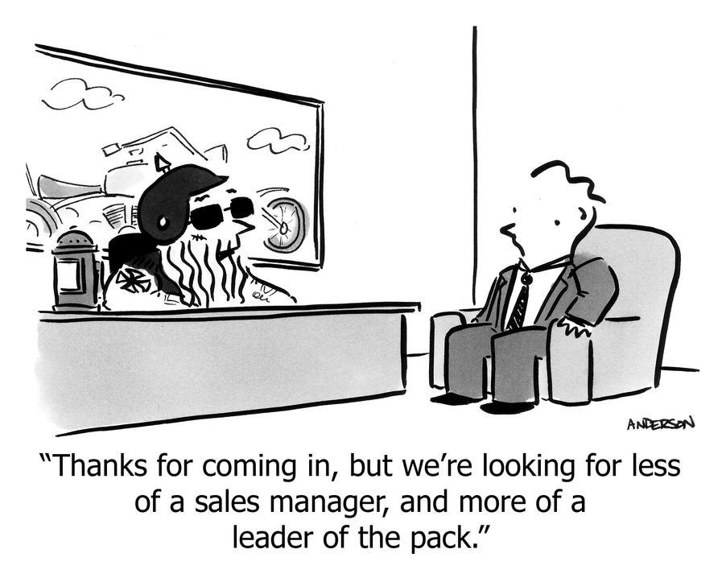

# How to hire people who are better than you

Source: https://longform.asmartbear.com/hire-better-than-you/
Saved: 2026-04-30

Source: https://longform.asmartbear.com/hire-better-than-you/
Shared URL: https://share.google/z06BvRWnAOmR5e2bJ
Saved: 2026-04-30
Published: April 19, 2026
Author/site: Jason Cohen / A Smart Bear
Reading time: 10 min

## Deck

If you don’t hire people better than you, the organization gets bigger, not better. But how do you hire for something you don’t understand?

## Article text

Probably this VP of Marketing you’re interviewing is full of shit. I mean, they’re in marketing, that’s what they’re good at, right? Except, if that’s what they’re supposed to be good at, maybe it’s good that they’re doing that? But also, maybe they’re not full of shit. You have no idea, because you have no idea how to hire a VP of Marketing.

Because you’re an engineer whose entire marketing experience is some half-assed AdWords campaigns that taught you nothing except how fast money disappears when you don’t know what you’re doing. But you’re the CEO, and you (correctly) decided it’s time to hire someone who can actually build a marketing department and then hold them accountable for a job you don’t understand. You need this hire precisely because you can’t do what they do. But that also means you can’t tell whether they can do it.

It’s like evaluating a pancreatic surgeon. What do you ask? What do you do with the answer?

But you have no choice: you must hire people who are better than you at every position—that’s the only way the organization grows stronger and smarter and better rather than just growing larger. Without it, organizations get worse with size—more overhead, more meetings, more communication cost, without commensurate improvement in individual capability. And a great person isn’t 10x better than an average one—they’re infinitely better, because they come up with ideas and implementations that a hundred average people never would.

Early on, the CEO is the best person at the company at some things—maybe sales from passion, maybe product from vision. But by a hundred people, if the CEO is still better than everyone at anything, the CEO has hired poorly, and the company is suffering. I’ve already written about why you must hire up—why delegation alone produces a team that’s never better than the founder. This is the companion piece: how you evaluate candidates who know more than you, in areas you don’t understand.

Since you can’t assess their domain expertise, here’s what you’re looking for instead.

## You leave wanting to implement their ideas

After the conversation, do you find yourself thinking: “Even if we don’t hire them, we’ve got to do half of the things they said.” Maybe you’re so excited you start working on it right away.

You can’t verify whether their advice is actually wise. But this feeling means their ideas connected with you on a deep level; this means that at minimum it’s a culture-fit, which is already a substantial finding. The ideas make sense in your situation, with your constraints, so at least they are plausible. Your excitement is more meaningful than you give it credit for.

Genuine expertise produces specific, actionable ideas that feel tailor-made to your context. People who just talk a good game will say things that sound impressive—and might even be true in a broad sense—but will leave you thinking “is that really what grown-up Marketing is?” and not “Hell yes that’s what I want this company to be like.”

If they change how you think about your own company in an hour, imagine what they could do in a year.

The inverse is just as telling. A candidate who speaks fluently about marketing frameworks but never connects them to the specific challenges you described five minutes ago is just parroting stuff they’ve seen and heard. ChatGPT can do that too, and you have just as little confidence that it’s right for you. You’re looking for someone who was born for this job, not someone performing the generic version of it. The difference is unmistakable once you’ve felt it, and you don’t need domain knowledge to feel it.

Ask yourself this: If they instead went to work for your competitor, would that worry you? Do you think: Uh oh, now we’re dead? Or do you think: I’m not sure what they would do for that competitor?

## You’re already learning from them—and so would everyone else

Zuckerberg is famous for his hiring rule for executives:

“I always tell people that you should only hire people to be on your team if you would work for them.”

It sounds great but it’s not true literally—Zuckerberg would never, and has never, worked for anyone else. But if we take the spirit of his idea and apply it to things that actually happen—things you can look for—it becomes an excellent test.

The weakest version is: If you wouldn’t be comfortable working for this person, you’re hiring out of expediency, not quality.

Much better is: Would you learn from this person? Would others at the company learn? In my experience this is not only true of every great executive, but it’s so clearly true that you can tell from the interview. You can tell, because it’s already happened. They’ve already said something you didn’t know, that piqued your interest. You checked it afterwards, and you feel down rabbit holes you never new existed. But they did, and this candidate already knew about them. That’s the signal.

The real test—and an actual executive job duty, even if the job description doesn’t say so—if you took a six-month sabbatical and never checked in, when you returned would the department be measurably better under their leadership? That means: processes improved, team stronger, output higher?

That’s what “lift” looks like: Hiring someone who takes work away from you, who creates a better department than you were creating, where the company is improving all around you because you hired people who know how to do that. That’s the job. Your job isn’t to also know all those things; it’s to hire people who do, which means hiring people who you’re already learning from.

## They will elevate the whole organization

Great leaders don’t improve their silo only—they’re better at people issues, communication, decision-making, goal-setting, annual planning, org structure—things that are useful everywhere in the company, not just in their department. A great VP Marketing will never be able to contribute to your Typescript-specific CLAUDE.md, but they will have theories about how to grow from three to thirty teams, or how to set annual goals but keep people focused on what’s happening now, or how to communicate difficult news to the entire company, or how to know when it’s finally time to implement certain “big company” policies, or how to structure an two-day strategic retreat, or how to handle a difficult situation between two employees, or how to run human performance management as objectively and humanely as possible.

These are all things you can test for during the interview, by asking how they handle these situations. Which situations exactly? Use some that you’re facing today, or just faced, or heard about on a forum that you’re scared will happen to you soon. Not as their domain of expertise, but as a leader in a company.

## Ask them to solve a real problem you face

Give them an actual challenge from your company. If you’re struggling with goal-setting, ask how they’d implement that in a culture that’s never had goals; if you have high churn, ask how they’d diagnose the cause; if employee turnover is high, ask how they’d figure out what’s going on when people are reluctant to explain themselves.

You’re not evaluating the details of the answer—you don’t know how—you’re watching how they think, and what direct experience they have. Do they ask incisive, clarifying questions that make you feel like they deeply understand what you’re going through? Do they acknowledge what they don’t yet know? Do they not only name a framework but explain how they applied it? Is there any indication they actually did any of that themselves, or are they just parroting blog posts?

## Use reference checks to evaluate culture fit, not expertise

Standard reference checks are useless for evaluating expertise—candidates hand you friendlies primed to say nice things, and there’s no value in sanitized endorsements. But reference checks are powerful for evaluating whether this person will thrive here, in this company, at this stage—which is what matters for a leadership hire where you can’t evaluate domain expertise anyway.

Instead of the usual questions, I ask this:

What is the ideal scenario under which this person thrives?

That is: Construct the absolutely perfect set of circumstances—subject matter, goal, team (or lack thereof), direction (or lack thereof), incentives, etc.—where this person absolutely kills it, is efficient, is productive, is happy, and makes everyone around them happy.

If they say “Oh yeah, that person needs a goal because they want to know what ‘success’ looks like, but then get out of their way because they’re creative and they explore quickly,” then you extract personal attributes like “goal-oriented” and “craves exploration.” In that case, working on a mature product might be a bad fit, but an early-stage startup might be ideal.

Then ask the opposite:

Construct the scenario where they die inside, mess everything up, and piss everyone off.

It’s funny to ask and easy for the other person to answer, but it doesn’t feel like negativity—after all, we all have a personal hell.

One more:

What are their strengths that they’re unaware of because they come so naturally to them? Where they don’t realize other people aren’t like that too?

These are a person’s most natural, powerful abilities—they can’t help but be great at them, yet they’re special. The person can’t see them, by definition, because they don’t realize how unusual they are. Others know. They are some of their most annoying and endearing qualities. And for your purposes, these answers tell you whether this person will thrive in your specific environment—your pace, your chaos, your culture—better than any credential or case study ever could.

Why this focus on strengths? Because everyone has weaknesses; you’re not looking for someone without weaknesses. Rather, you need someone who has a few special strengths that your company needs right now. Not just competence, but superpowers. That’s what’s going to make the difference between “filling the seat” and making an impact.

## You’ll still get it wrong sometimes

Like everyone else, I’ve hired people who were great in interviews and couldn’t really do the job, and people who were unimpressive in interviews and crushed it for ten years. Only one of those errors is costly. A false negative costs you a continued search. A false positive hurts the team, delays getting the right person in, and is terrible for the person you hired—they might have quit a job; how long will their next search take? If this happens a lot, you have to fix yourself.

Still, what choice do you have? You have to take a bet.

What you do control is what happens after a mis-hire. You decide whether you let that linger for a year, pissing off your best people—who are most capable of finding another job—delaying the development of that department, not solving whatever it is you hired them to solve.

If you feel like it’s easier to just do it yourself, you hired incorrectly. If your best people are complaining all the time instead of being inspired, you hired incorrectly. If things don’t start improving immediately, you hired incorrectly.

Everyone else on the team knows it—sooner than you, because they are experiencing it more acutely than you—and yet you are the only one who can fix it. Make the break cleanly. Act immediately; you’re already three months late.

## The interview is about the person, not the details

You went into the interview with the VP of Marketing trying to figure out whether they’re good at marketing. But you can’t evaluate that.

Even a year from now, you still won’t know if their demand-gen strategy was optimal or if a different hire would have grown revenue faster. You will never have the counterfactual.

What you will know is whether they changed how you see your own company—whether they found problems you didn’t know were there, built things you didn’t think to build, and made the people around them, including you, sharper than before.

Those clues were available to you during the interview. The culture fit was available to you in the reference checks.

It’s not perfect, but that’s what you do.

## Preserved source references

- source: https://andertoons.com/interview/cartoon/5940/thanks-for-coming-in-but-were-looking-for-less-of-sales-manager-and-more-of-leader-of-pack?utm_source=longform.asmartbear.com&utm_campaign=longform.asmartbear.com&utm_medium=post
- infinitely better: https://longform.asmartbear.com/imbalanced-people/
- why you must hire up: https://longform.asmartbear.com/delegation/
- is famous for: https://www.cnbc.com/2018/08/06/mark-zuckerbergs-top-rule-for-hiring-great-employees-at-facebook.html?utm_source=longform.asmartbear.com&utm_campaign=longform.asmartbear.com&utm_medium=post
- you still won’t know: https://longform.asmartbear.com/unmeasurable-metrics/
- https://longform.asmartbear.com/hire-better-than-you/: https://longform.asmartbear.com/hire-better-than-you/
- @asmartbear: https://twitter.com/intent/user?screen_name=asmartbear
- subscribe: https://longform.asmartbear.com/subscribe/
- Subscribe: https://longform.asmartbear.com/subscribe
