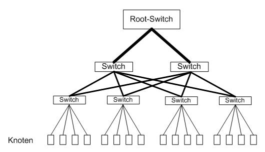
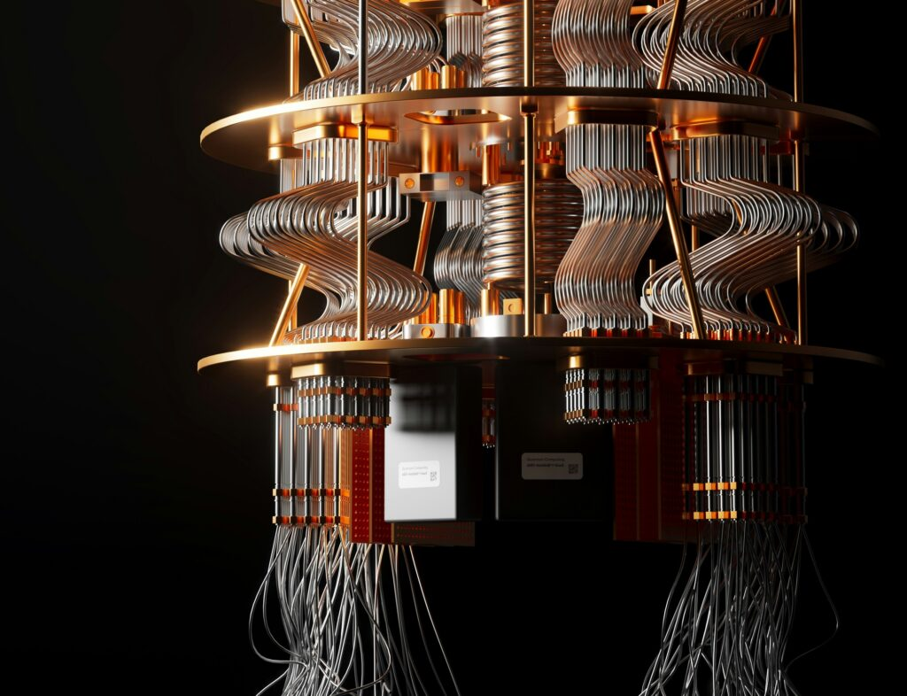
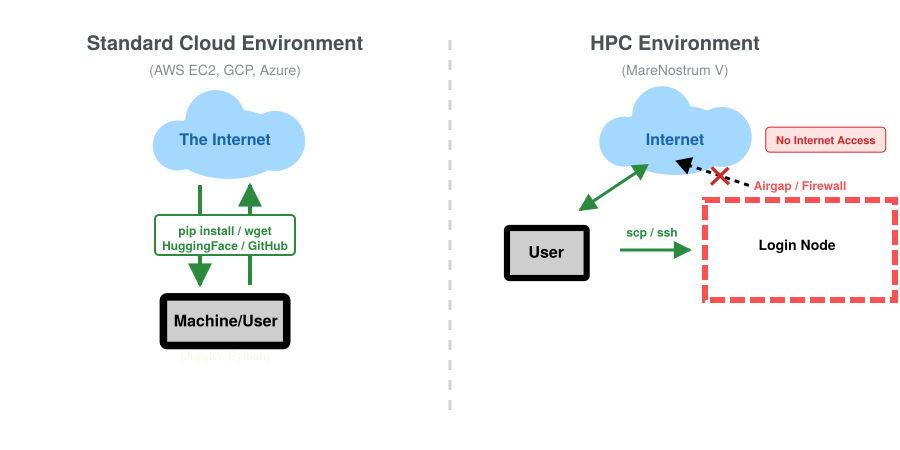
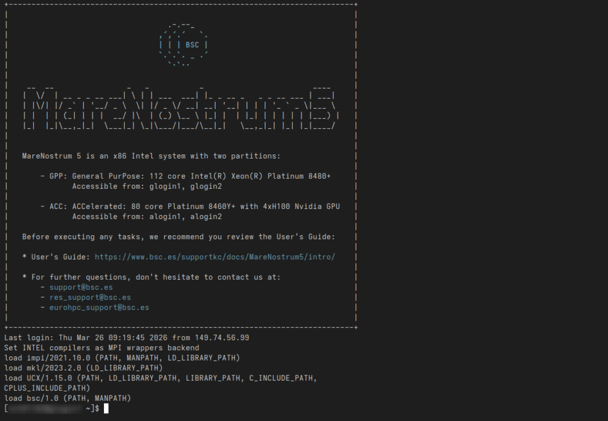
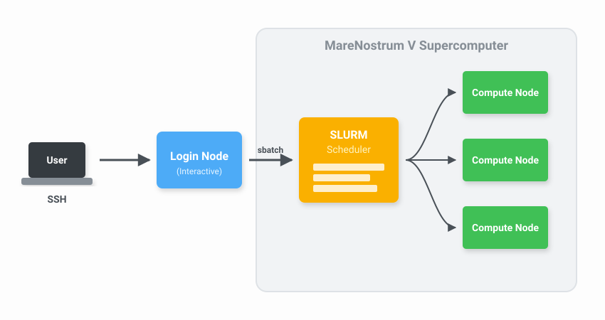

# What It Actually Takes to Run Code on 200M€ Supercomputer (HPC & SLURM)

Source: https://towardsdatascience.com/what-it-actually-takes-to-run-code-on-200me-supercomputer/
Saved: 2026-05-08

## Source Metadata
- Source URL: https://towardsdatascience.com/what-it-actually-takes-to-run-code-on-200me-supercomputer/
- Shared URL: https://share.google/SHmosP4XMZFVvgm62
- GeekNews URL: https://news.hada.io/topic?id=29175
- Category: Distributed Computing
- Subtitle: Inside MareNostrum V: SLURM schedulers, distributed computing, and scaling HPC pipelines across 8,000 nodes in a 19th-century chapel
- Author: Ferran Alia (https://towardsdatascience.com/author/ferran-alia/)
- Published: 2026-04-16T18:30:00+00:00
- Modified: 2026-04-27T06:49:20+00:00
- Description: Inside MareNostrum V: SLURM schedulers, fat-tree topologies, and scaling pipelines across 8,000 nodes in a 19th-century chapel
- Featured image: https://towardsdatascience.com/wp-content/uploads/2026/04/2017_BSC_Superordenador_MareNostrum-4_Barcelona-Supercomputing-Center.jpg
- Featured image caption: Image by Martidaniel via Wikimedia Commons (CC BY-SA 4.0)
- Extraction scope: original article body from Towards Data Science WordPress `entry-content`; related articles, newsletter/CTA, footer, and site chrome excluded.

## Original Article Body
If you walk across the campus of the Polytechnic University of Catalonia in Barcelona, you might stumble upon the Torre Girona chapel on a beautiful park. Built in the 19th century, it features a massive cross, high arches, and stained glass. But inside the main hall, encased in an enormous illuminated glass box, sits a different kind of architecture.

This is the historic home of MareNostrum. While the original 2004 racks remain on display in the chapel as a museum piece, the newest iteration, MareNostrum V, one of the fifteen most powerful supercomputers in the world, spans a dedicated, heavily cooled facility right next door.

Most data scientists are used to spinning up a heavy EC2 instance on AWS or utilizing distributed frameworks like Spark or Ray. High-Performance Computing (HPC) at the supercomputer level is a different beast entirely. It operates on different architectural rules, different schedulers, and a scale that is difficult to fathom until you use it.

I recently had the chance to use MareNostrum V to generate massive amounts of synthetic data for a machine learning surrogate model. What follows is a look under the hood of a 200M€ machine: what it is, why its architecture looks the way it does, and how you actually interact with it.

## The Architecture: Why You Should Care About the Wiring

The mental model that causes the most confusion when approaching HPC is this: you are not renting time on a single, impossibly powerful computer. You are submitting work to be distributed across thousands of independent computers that happen to share an extremely fast network.

Why should a data scientist care about the physical networking? Because if you’ve ever tried to train a massive neural network across multiple AWS instances and watched your expensive GPUs idle while waiting for a data batch to transfer, you know that in distributed computing, **the network is the computer.**

To prevent bottlenecks, MareNostrum V uses an *InfiniBand NDR200* fabric arranged in a **fat-tree topology**. In a standard office network, as multiple computers try to talk across the same main switch, bandwidth gets congested. A fat-tree topology solves this by increasing the bandwidth of the links as you move up the network hierarchy, literally making the “branches” thicker near the “trunk.” This guarantees non-blocking bandwidth: any of the 8,000 nodes can talk to any other node at exactly the same minimal latency.


*Figure caption: Fat-Tree architecture, by HoriZZon~commonswiki via Wikimedia Commons (CC BY-SA 4.0)*

The machine itself represents a joint investment from the EuroHPC Joint Undertaking, Spain, Portugal, and Turkey, split into two main computational partitions:

### General Purpose Partition (GPP):

It’s designed for highly parallel CPU tasks. It contains 6,408 nodes, each packing 112 Intel Sapphire Rapids cores, with a combined peak performance of 45.9 PFlops. This is the one you are going to be using most often for the “general” computing tasks.

### Accelerated Partition (ACC):

This one is more specialized, designed with AI training, molecular dynamics and such in mind. It contains 1,120 nodes, each with four NVIDIA H100 SXM GPUs. Considering a single H100 retails for roughly $25,000, the GPU cost alone exceeds $110 million. The GPUs give it a much higher peak performance than that of the GPP, reaching up to 260 PFlops.

There are also a special type of nodes called the **Login Nodes**. These act as the front door to the supercomputer. When you SSH into Mare Nostrum, this is where you land. Login nodes are strictly for lightweight tasks: moving files, compiling code, and submitting job scripts to the scheduler. They are not for computing.


*Figure caption: Photo by Planet Volumes on Unsplash*

**Quantum Infrastructure:** Classical nodes are no longer the only hardware inside the glass box. As of recently, Mare Nostrum 5 has been physically and logically integrated with Spain’s first quantum computers. This includes a digital gate-based quantum system and the newly acquired *MareNostrum-Ona*, a state-of-the-art quantum annealer based on superconducting qubits. Rather than replacing the classical supercomputer, these quantum processing units (QPUs) act as highly specialized accelerators.

When the supercomputer encounters fiercely complex optimization problems or quantum chemistry simulations that would choke even the H100 GPUs, it can offload those specific calculations to the quantum hardware, creating a massive hybrid classical-quantum computing powerhouse.

## Airgaps, Quotas, and the Reality of HPC

Understanding the hardware is only half the battle. The operational rules of a supercomputer are entirely different from a commercial cloud provider. Mare Nostrum V is a shared public resource, which means the environment is heavily restricted to ensure security and fair play.


*Figure caption: The airgap on MN-V, by author using Inkscape*

**The Airgap:** One of the biggest shocks for data scientists transitioning to HPC is the network restriction. You can access the supercomputer from the outside world via SSH, but the compute nodes absolutely cannot access the outside world. There is no outbound internet connection. You cannot `pip install` a missing library, `wget` a dataset, or connect to an external HuggingFace repository as you see fit. Everything your script needs must be pre-downloaded, compiled, and sitting in your storage directory before you submit your job.

In reality, it’s less of an issue than it appears, since the Marenostrum administrators provide most of the libraries and software you may need via a `module` system.

**Moving Data:** Because of this strict boundary, data ingress and egress happen via `scp` or `rsync` through the login nodes. You push your raw datasets in over SSH, wait for the compute nodes to chew through the simulations, and pull the processed tensors back out to your local machine. One surprising aspect of this restriction is that, since the actual computation can be so incredibly fast, the bottleneck becomes extracting the finished results to your local machine for postprocessing and visualization.

**Limits and Quotas:** You cannot simply launch a thousand jobs and monopolize the machine. Your project is assigned a specific CPU-hour budget. Furthermore, there are hard limits on how many concurrent jobs a single user can have running or queuing at any given time.

You must also specify a strict wall-time limit for every single job you submit. Supercomputers do not tolerate loitering, if you request two hours of compute time and your script needs two hours and one second, the scheduler will ruthlessly kill your process mid-calculation to make room for the next researcher.

**Logging in the Dark:** Because you submit these jobs to a scheduler and walk away, there is no live terminal output to stare at. Instead, all standard output (`stdout`) and standard error (`stderr`) are automatically redirected into log files (e.g., `sim_12345.out` and `sim_12345.err`). When your job completes, or if it crashes overnight, you have to comb through these generated text files to verify the results or debug your code. You do, however, have tools to monitor the status of your submitted jobs, such as `squeue` or doing the classic `tail -f` on the log files.

## Understanding SLURM Workload Manager

When you finally get your research allocation approved and log into MareNostrum V via SSH, your reward is… a completely standard Linux terminal prompt.

After months of writing proposals for access to a 200M€ machine, it is, frankly, a bit underwhelming. There are no flashing lights, no holographic progress bars, nothing to signal just how powerful the engine behind the wheel is.


*Figure caption: Initial terminal view after login, by author*

Because thousands of researchers are using the machine simultaneously, you cannot just execute a heavy python or C++ script directly in the terminal. If you do, it will run on the “login node,” quickly grinding it to a halt for everyone else and earning you an incredibly polite but rather firm and angry email from the system administrators.


*Figure caption: Slurm Schema on MN-V, by author using inkscape*

Instead, HPC relies on a workload manager called **SLURM**. You write a bash script detailing exactly what hardware you need, what software environments to load, and what code to execute. SLURM puts your job in a queue, finds the hardware when it becomes available, executes your code, and releases the nodes.

**SLURM** stands for **S**imple **L**inux **U**tility for **R**esource **M**anagement, and it’s a free and open source software that handles job-scheduling in many computer clusters and supercomputers.

Before looking at a complex pipeline, you need to understand how to communicate with the scheduler. This is done using `#SBATCH` directives placed at the top of your submission script. These directives act as your shopping list for resources:

- `--nodes`: The number of distinct physical machines you need.
- `--ntasks`: The total number of separate MPI processes (tasks) you want to spawn. SLURM handles distributing these tasks across your requested nodes.
- `--time`: The strict wall-clock time limit for your job. Supercomputers do not tolerate loitering; if your script runs even one second over this limit, SLURM ruthlessly kills the job.
- `--account`: The specific project ID that will be billed for your CPU-hours.
- `--qos`: The “Quality of Service” or specific queue you are targeting. For instance, using a debug queue grants faster access but limits you to short runtimes for testing.

## A Practical Example: Orchestrating an OpenFOAM Sweep

To ground this in reality, here is how I actually used the machine. I was building an ML surrogate model to predict aerodynamic downforce, which required ground-truth data from 50 high-fidelity computational fluid dynamics (CFD) simulations across 50 different 3D meshes.

[Image: Example flow around one of the 3D meshes, by author using ParaView](https://contributor.insightmediagroup.io/wp-content/uploads/2026/03/stream_trace_frontview-edited.png)
*Figure caption: Example flow around one of the 3D meshes, by author using ParaView*

Here is the actual SLURM job script for a single OpenFOAM CFD case on the General Purpose Partition:

```bash
#!/bin/bash
#SBATCH --job-name=cfd_sweep
#SBATCH --output=logs/sim_%j.out
#SBATCH --error=logs/sim_%j.err
#SBATCH --qos=gp_debug
#SBATCH --time=00:30:00
#SBATCH --nodes=1
#SBATCH --ntasks=6
#SBATCH --account=nct_293

module purge
module load OpenFOAM/11-foss-2023a
source $FOAM_BASH

# MPI launchers handle core mapping automatically
srun --mpi=pmix surfaceFeatureExtract
srun --mpi=pmix blockMesh
srun --mpi=pmix decomposePar -force
srun --mpi=pmix snappyHexMesh -parallel -overwrite
srun --mpi=pmix potentialFoam -parallel
srun --mpi=pmix simpleFoam -parallel
srun --mpi=pmix reconstructPar
```

Rather than manually submitting this 50 times and flooding the scheduler, I used SLURM dependencies to chain each job behind the previous one. This creates a clean, automated data pipeline:

```bash
#!/bin/bash
PREV_JOB_ID=""

for CASE_DIR in cases/case_*; do
  cd $CASE_DIR

  if [ -z "$PREV_JOB_ID" ]; then
    OUT=$(sbatch run_all.sh)
  else
    OUT=$(sbatch --dependency=afterany:$PREV_JOB_ID run_all.sh)
  fi

  PREV_JOB_ID=$(echo $OUT | awk '{print $4}')
  cd ../..
done
```

This orchestrator drops a chain of 50 jobs into the queue in seconds. I walked away, and by the next morning, my 50 aerodynamic evaluations were processed, logged, and ready to be formatted into tensors for ML training.

[Image: Example underside pressure on one of the 3D meshes, by author using ParaView](https://contributor.insightmediagroup.io/wp-content/uploads/2026/03/P_underside-1024x708.png)
*Figure caption: Example underside pressure on one of the 3D meshes, by author using ParaView*

## Parallelism Limits: Amdahl’s Law

A common question from newcomers is: *If you have 112 cores per node, why did you only request 6 tasks*(ntasks=6) *for your CFD simulation?*

The answer is Amdahl’s Law. Every program has a serial fraction that cannot be parallelized. It explicitly states that the theoretical speedup of executing a program across multiple processors is strictly limited by the fraction of the code that must be executed serially. It’s a very intuitive law and, mathematically, it is expressed as:

\[ S=\frac{1}{(1-p)+\frac{p}{N}} \]

[Embedded video: amdahls law animation](https://www.youtube.com/embed/1eYhRaH-7l4?feature=oembed)

Where S is the overall speedup, p is the proportion of the code that can be parallelized, 1−p is the strictly serial fraction, and N is the number of processing cores.

Because of that (1−p) term in the denominator, you face an insurmountable ceiling. If just 5% of your program is fundamentally sequential, the maximum theoretical speedup you can achieve, even if you use every single core in MareNostrum V, is 20x.

Furthermore, dividing a task across too many cores increases the communication overhead over that InfiniBand network we discussed earlier. If the cores spend more time passing boundary conditions to each other than doing actual math, adding more hardware slows the program down.

[Image: Time as resources increase for different N, by author using matplotlib](https://contributor.insightmediagroup.io/wp-content/uploads/2026/03/plot_phases_parallel_nbodies_galaxy-1024x255.png)
*Figure caption: Time as resources increase for different N, by author using matplotlib*

As shown in this figure, when simulating a small system (N=100), runtime increases after 16 threads. Only at massive scales (N=10k+) does the hardware become fully productive. Writing code for a supercomputer is an exercise in managing this compute-to-communication ratio.

## The Access to the Prompt

Despite the staggering cost of the hardware, access to MareNostrum V is free for researchers, as compute time is treated as a publicly funded scientific resource.

If you are affiliated with a Spanish institution, you can apply through the Spanish Supercomputing Network (RES). For researchers across the rest of Europe, the EuroHPC Joint Undertaking runs regular access calls. Their “Development Access” track is specifically designed for projects porting code or benchmarking ML models, making it highly accessible for data scientists.

When you sit at your desk staring at that completely unremarkable SSH prompt, it is easy to forget what you are actually looking at. What that blinking cursor does not show is the 8,000 nodes it connects to, the fat-tree fabric routing messages between them at 200 Gb/s, or the scheduler coordinating hundreds of concurrent jobs from researchers across six countries.

The “single powerful computer” picture persists in our heads because it is simpler. But the distributed reality is what makes modern computing possible, and it is much more accessible than most people realize.

## References

[1] Barcelona Supercomputing Center, MareNostrum 5 Technical Specifications (2024), BSC Press Room. [[link]](https://www.bsc.es/supportkc/docs/intro)

[2] EuroHPC Joint Undertaking, MareNostrum 5 Inauguration Details (2023), EuroHPC JU. [[link](https://www.eurohpc-ju.europa.eu/inauguration-marenostrum-5-europe-welcomes-new-world-class-supercomputer-2023-12-21_en)]
