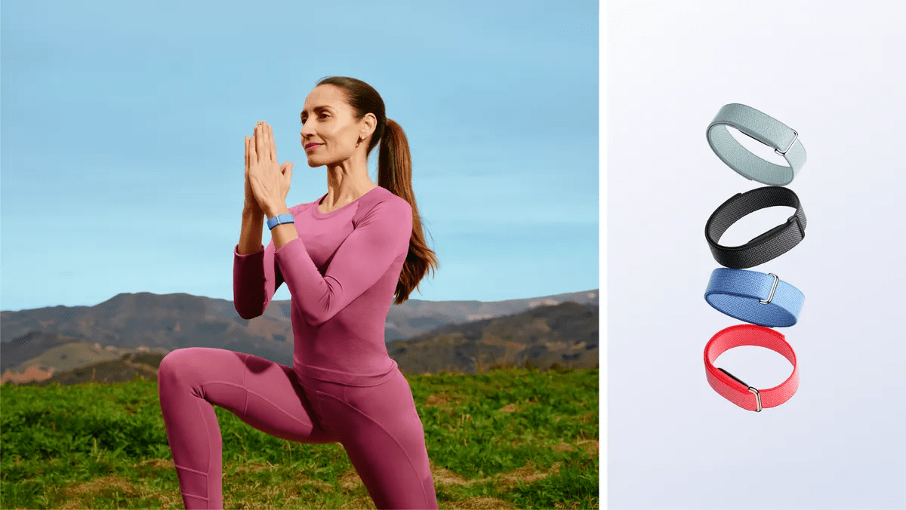

# 구글, 14만원짜리 '핏빗 에어' 출시...AI 건강 웨어러블에 집중 - AI타임스 (210277)

Source: https://www.aitimes.com/news/articleView.html?idxno=210277
Shared URL: https://share.google/PYxjs6FkOwFIb7MY8
Resolved URL: https://www.aitimes.com/news/articleView.html?idxno=210277
Saved: 2026-05-09

Original title: 구글, 14만원짜리 '핏빗 에어' 출시...AI 건강 웨어러블에 집중 - AI타임스

Canonical URL: https://www.aitimes.com/news/articleView.html?idxno=210277

Source site: AI타임스
Section: AI산업 / 산업일반
Author: 박찬 기자
Published: 2026-05-08T18:33:41+09:00
Visible published text: 입력 2026.05.08 18:33
Description: 구글이 화면을 없앤 초경량 웨어러블 ‘핏빗 에어(Fitbit Air)’를 공개하며 AI 기반 헬스케어 플랫폼 경쟁에 본격 가세했다. 구글은 7일(현지시간) 새로운

## Article Body

*(사진=구글)*

구글이 화면을 없앤 초경량 웨어러블 ‘핏빗 에어(Fitbit Air)’를 공개하며 AI 기반 헬스케어 플랫폼 경쟁에 본격 가세했다.

구글은 7일(현지시간) 새로운 건강 플랫폼 ‘구글 헬스(Google Health)’와 함께 초소형 웨어러블 기기 '핏빗 에어'를 발표했다.

제품 가격은 99.99달러(약 14만6600원)로 책정됐으며, 화면이 없는 스크린리스(screenless) 디자인을 채택한 것이 특징이다.

핏빗 에어는 최근 급성장 중인 '후프(Whoop)' 스타일 웨어러블 시장을 정조준한 제품으로 평가된다. 기존 스마트워치처럼 알림과 앱 기능을 제공하기보다는, 건강 데이터 측정과 AI 기반 분석에 집중했다.

구글은 “많은 사람들이 웨어러블 기기를 너무 크고 복잡하며 비싸다고 느낀다”라며 “핏빗 에어는 단순하고 저렴하면서도 하루 24시간 착용 가능한 제품”이라고 설명했다.

핏빗 에어는 역대 가장 작은 핏빗 트래커로, 핏빗 럭스(Fitbit Luxe)보다 25%, 핏빗 인스파이어(Fitbit Inspire) 3보다 50% 작아졌다. 무게는 밴드 포함 12g 수준이다.

작은 크기에도 건강 추적 기능은 대폭 강화됐다. 기기는 24시간 심박수 측정, 심방세동(Afib) 알림, 혈중 산소포화도(SpO2), 안정 시 심박수, 심박 변이도(HRV), 수면 단계 및 수면 시간 등을 측정할 수 있다.

특히 화면이 완전히 제거된 디자인이 눈길을 끈다. 사용자는 손목에서 알림이나 메시지에 방해받지 않고 생활할 수 있으며, 건강 데이터는 스마트폰의 새로운 ‘구글 헬스’ 앱에서 확인한다. 기기에는 버튼도 없고, 배터리 상태나 알람은 작은 LED와 햅틱 진동으로 전달된다.

배터리 성능도 강조됐다. 한번 충전으로 최대 1주일 사용 가능하며, 5분 급속 충전만으로 하루 사용이 가능하다. 50m 방수 기능도 지원한다.

[Image: 구글 헬스 앱 (사진=구글)](https://cdn.aitimes.com/news/photo/202605/210277_212892_4118.png)

*구글 헬스 앱 (사진=구글)*

구글은 이번 제품과 함께 기존 핏빗 앱을 전면 개편한 ‘구글 헬스 앱’을 공개했다. 새 앱은 웨어러블 데이터뿐 아니라 헬스 커넥트(Health Connect), 애플 헬스(Apple Health) 데이터, 의료 기록 등을 통합 관리하는 플랫폼으로 진화한다.

앱은 ▲오늘(Today) ▲피트니스(Fitness) ▲수면(Sleep) ▲건강(Health) 등 4개 탭으로 구성되며, 운동·식사·생리 주기 등을 기록할 수 있다. 앞으로 가족, 친구, 의료진과 건강 데이터를 안전하게 공유하는 기능도 추가될 예정이다.

구글이 특히 강조하는 부분은 AI 기반 ‘구글 헬스 코치(Google Health Coach)’다. 이 서비스는 '제미나이' 기반으로 동작하며, 운동 코치·수면 코치·건강 상담사 역할을 통합 수행한다.

사용자의 운동 목표와 보유 장비를 기반으로 맞춤형 운동 루틴을 생성하고, 수면 습관을 분석하며, 식사 사진을 업로드하면 칼로리와 영양소까지 분석해 준다.

리시 찬드라 구글 웨어러블·헬스 책임자는 “프로 운동선수들은 영양사, 수면 코치, 트레이너 등 전문가 팀의 도움을 받는다”라며 “헬스 코치는 이를 일반 사용자에게 제공하려는 시도”라고 설명했다.

구글은 헬스 코치를 월 9.99달러의 ‘구글 헬스 프리미엄’ 구독 서비스로 제공한다. 이는 기존 ‘핏빗 프리미엄’을 개편한 형태이며, 구글 AI 프로 및 울트라 요금제에는 기본 포함된다.

핏빗 에어는 안드로이드와 iOS 모두 지원한다. 또 픽셀 워치(Pixel Watch) 4와 연동해 낮에는 스마트워치로 사용하고, 밤에는 가벼운 핏빗 에어로 수면 추적을 하는 방식도 가능하다.

밴드 종류도 다양화했다. NBA 스타 스테픈 커리와 공동 디자인한 스페셜 에디션도 출시된다.

애플과 삼성도 건강 웨어러블을 강화하는 가운데, 구글은 AI를 중심으로 한 통합 헬스 플랫폼 전략으로 차별화에 나선 모습이다.

시장조사 전문 IDC에 따르면, 2025년 글로벌 손목형 웨어러블 시장에서 핏빗 점유율은 약 6% 수준이다. 중국 샤오미가 절반의 시장을 차지하고 있으며, 화웨이와 삼성전자가 뒤를 잇고 있다.

구글은 이번 핏빗 에어와 AI 헬스 전략을 통해 웨어러블 시장 반등을 노리고 있다.

박찬 기자 cpark@aitimes.com
