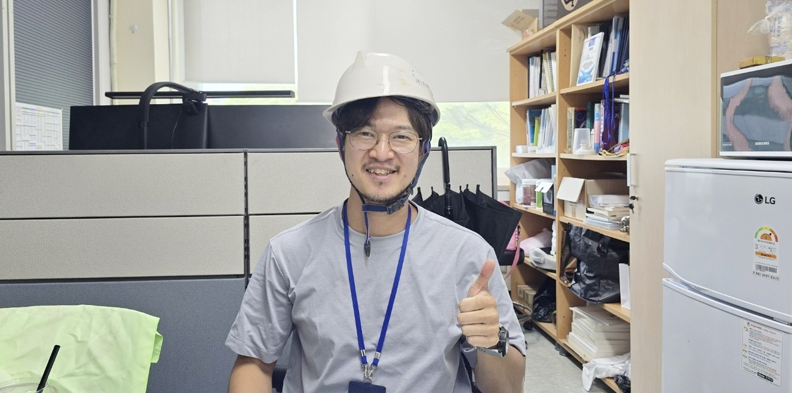

# [과학청년]하수처리장이 실험실···탄소 제로 '도전' '현장맨' 이진희 화학연 박사, "국민 삶의 질 향상 '목표'"

## Metadata

- Source URL: https://www.hellodd.com/news/articleView.html?idxno=111590
- Canonical URL: http://www.hellodd.com/news/articleView.html?idxno=111590
- Shared URL: https://share.google/1H7yO5WQIb6itMZQH
- Site: 헬로디디
- Section: 뉴스 > 기획
- Author: 홍재화 기자 (h951009@hellodd.com)
- Published: 2026.05.10 17:20
- Modified: 2026.05.10 17:40
- Article ID: 111590
- Archived: 2026-05-11
- Source language: ko
- Extraction method: direct_html_bs4_hellodd_article_body
- Quality status: good
- Visible comment count on source page: 2

## Description

지난 17일 한국화학연구원 CO에너지연구센터 연구실에 들어서자 다소 투박한 헬멧을 옆에 둔 한 남자가 반갑게 인사를 건넸다. 1985년생 패기 넘치는 신진을 지나 이제는 연구의 깊이를 더해가는 중견의 길목에 들어선 이진희 책임연구원이다.그는 실험실의 성과들이 산업 현장에 적용되기까지의 과정을 몸소 겪어낸 현장가이기도 하다. 연구자로서 가장 큰 소망이 무엇이냐는 질문에 그는 한 치의 망설임도 없이 "제 기술로 만든 공장이 실제로 돌아가는 걸 보고 싶다. 연구자로서 그 광경을 보는 것만큼 보람찬 일은 없을 것 같다"고 답하며 눈을 반짝

## Deck

- [과학청년 부탁해①] 이진희 화학연 CO에너지연구센터 책임연구원
- 가스 대신 전기···화학 공정 바꾸는 전기 가열 기술 개발
- 하수처리장·공장 누비며 실증 데이터로 상용화 도전
- "연구는 공장에서 완성"···현장 중심 연구 철학
- "국민 삶에 닿는 기술로"···미래 세대 위한 연구 이어갈 포부

## Article Body

> 젊은 과학기술인은 대덕의 어제를 이어받아 내일을 여는 주역입니다. 대덕넷은 그간 '2030이 간다', '뉴 2030' 등을 통해 젊은 연구자들의 꿈을 기록해 왔습니다. 당시의 주인공들은 이제 각 기관과 산업계의 든든한 중추로 성장했습니다. 대덕넷은 다시 한번 미래를 이끌 새로운 엔진들을 조명하고자 합니다. 이번 기획은 정부출연연구기관·대학·기업 현장에서 묵묵히 미래를 설계하는 젊은 연구자와 엔지니어들을 발굴해 정기 연재로 보도합니다. 연구실에서 마주하는 성취의 보람부터 현장의 남모를 고민까지, 우리 과학기술계의 내일을 책임질 주인공들의 진솔한 목소리를 조명하고자 합니다.<편집자주>

지난 17일 한국화학연구원 CO에너지연구센터 연구실에 들어서자 다소 투박한 헬멧을 옆에 둔 한 남자가 반갑게 인사를 건넸다. 1985년생 패기 넘치는 신진을 지나 이제는 연구의 깊이를 더해가는 중견의 길목에 들어선 이진희 책임연구원이다.

그는 실험실의 성과들이 산업 현장에 적용되기까지의 과정을 몸소 겪어낸 현장가이기도 하다. 연구자로서 가장 큰 소망이 무엇이냐는 질문에 그는 한 치의 망설임도 없이 "제 기술로 만든 공장이 실제로 돌아가는 걸 보고 싶다. 연구자로서 그 광경을 보는 것만큼 보람찬 일은 없을 것 같다"고 답하며 눈을 반짝였다.

## '어쩌다' 시작해 '숙명'이 된 과학의 길

*캡션: 지난달 만난 이진희 박사는 실험실의 가설을 산업 현장의 공정으로 바꾸기 위해, 전기 기반 친환경 화학 기술을 들고 현장을 뛰고 있었다. 그는 과학을 '삶'처럼 밀어붙이며 탄소중립 시대의 뿌리 기술을 다지고 있었다. [사진=홍재화 기자]*

이 박사는 자신의 시작을 두고 "사실 어쩌다 보니 된 것도 크다"며 의외의 고백으로 이야기를 시작했다.

울산에서 나고 자란 그는 어릴 적부터 과학에 유별난 호기심을 보이거나 영재 소리를 듣던 아이는 아니었다고 한다. 그는 "어릴 때 희망 직업에 과학자를 적긴 했지만, 사실 왜 그랬는지 기억은 잘 안 난다"며 "사실 과학에 흥미가 있거나 호기심이 많았던 것 같지도 않았다"며 웃어 보였다. 하지만 그 평범한 흐름이 운명으로 바뀐 것은 중학교 3학년 당시 부모님의 권유로 지원했던 경남과학고등학교에 합격하면서부터였다.

그는 기숙사 생활을 하며 뒤늦게 공부의 즐거움을 깨달았다고 회상했다. 이 책임연구원은 "밤에 불이 꺼진 뒤에도 몰래 숨어서 대학교 전공 서적인 '일반화학'을 독학했다"며 "제 인생에서 유일하게 공부가 재미있던 시절이었다. 학교에서 시키는 고교 과정 공부보다 대학교 책을 보는 것이 마치 '딴짓'을 하는 것처럼 엄청 재밌었다"고 말했다.

자신이 흥미를 느끼는 세계를 스스로 파고드는 경험은 그를 완전히 매료시켰고, 당시 화학 올림피아드에서 동상을 거머쥐며 그는 화학을 평생의 업으로 선택하게 되었다.

그의 학업 열정은 포항공과대학교(POSTECH) 진학 이후 더욱 구체화됐다. 대학원에 진학하며 그는 유기화학, 그중에서도 촉매 연구에 발을 들였다. 이 박사는 "화학 안에서도 분야가 많은데, 유기화학 안에서 무언가를 설계하고 실제로 만들어내는 과정이 참 매력적이었다"고 전공 선택의 배경을 밝혔다.

박사 학위를 마친 그는 한국과학기술연구원(KIST)에서 3년간 연구 역량을 쌓으며 사회에 첫발을 내디뎠다. 하지만 한국화학연구원의 문턱은 생각보다 높았다. KIST 포닥 생활 중 화학연에 도전했으나 첫 고배를 마신 것이다. 당시 면접관들은 그에게 "아직 젊으니 조금 더 넓은 세상을 보고 경험을 쌓고 오라"는 조언을 남겼다.

이 책임연구원은 "처음엔 탈락이 쓰라렸지만 지금 생각해보면 그때 떨어진 게 제 인생에는 더 잘한 선택이었다"라고 담담히 말했다.

실패의 경험은 그를 더 넓은 세상으로 이끌었다. 그는 이후 스위스 PSI(Paul Scherrer Institute) 연구소에서 2년간 박사후연구원 생활을 이어가며 시야를 넓혔다. 이후 '재수' 끝에 입성한 화학연은 그에게 단순한 직장이 아니라 오랜 기다림 끝에 얻은 귀중한 연구의 터전이 됐다.

이러한 개인적 성장의 시간은 그를 단순한 연구자에서 현장의 목소리를 듣는 실천가로 탈바꿈시키는 중요한 전기가 되었고, 이는 곧 그의 주력 연구 분야인 전기 가열 기술로 연결되었다.

## 인덕션처럼 바뀌는 산업 현장···화학 공정 전기화

![이진희 박사는 전기 기반 가열 기술을 연구하고 있다. 이 기술은 전기에너지를 열에너지로 변환하는 방법이다. [사진=이진희 박사]](figures/figure-02-lee-jinhee-krict-lab-interview.png)
*캡션: 이진희 박사는 전기 기반 가열 기술을 연구하고 있다. 이 기술은 전기에너지를 열에너지로 변환하는 방법이다. [사진=이진희 박사]*

이 책임연구원이 주력하는 '전기 기반 가열 기술'은 탄소 중립 시대의 게임 체인저로 주목받고 있다. 그는 복잡한 공정 원리를 설명하며 "우리 집에서 가스레인지 대신 인덕션을 쓰는 것과 똑같다. 가스레인지는 불을 직접 쓰지만 인덕션은 전자기 유도로 가열하듯, 전기 가열 방식은 연소 과정이 없으니 오염 물질이 나오지 않고 제어가 정밀하며 안전하다는 압도적인 장점이 있다"라고 명쾌하게 설명했다.

이미 도로 위를 달리는 자동차들이 내연기관에서 전기차로 바뀌었듯, 화학 공정 역시 열원을 전기로 바꿔야 하는 거대한 시류에 직면해 있다. 그는 이를 전기로 가열하는 기술을 개발함으로써 탄소 배출을 획기적으로 줄이는 길을 닦고 있다.

이 책임연구원은 단순히 온도를 높이는 것을 넘어 '방식'의 혁신을 강조했다. 그는 "전자레인지(마이크로파)가 음식물을 빠르게 데우듯이 전기를 이용해 화학 반응에 필요한 촉매와 반응물만 정밀하게 가열하는 것이다. 필요한 부분만 초고속으로 데우기 때문에 장치를 소형화할 수 있고 효율도 극대화된다"고 설명했다.

이 기술은 최근 이산화탄소를 활용해 플라스틱 원료를 만들거나 수소를 저장하고 만드는 기술, 그리고 악취나 유해 가스를 제거하는 대기 환경 연구까지 폭넓게 확장되고 있다. 이 책임연구원은 "화학 반응은 항상 열이 필요한데, 그 열을 주는 방식을 친환경적으로 해보자는 것이 핵심이다. 가스를 태우는 기존 방식보다 전기가 훨씬 안전하고 관리하기 편하며, 궁극적으로는 이산화탄소 배출을 제로로 만들 수 있다"고 연구의 가치를 강조했다.

이처럼 혁신적인 공정 기술이 실험실에 머물지 않도록, 그는 산업 현장을 뛰어다닌다. 악취 문제를 해결하기 위해 직접 대전하수종말처리장 지하 깊숙한 곳까지 들어가 실험을 이어갔던 일화가 대표적이다. 이 책임연구원은 "신탄진이나 관평동 공장 단지, 그리고 하수 처리장 지하실은 냄새가 정말 심하다. 한 번 들어갔다 나오면 온몸에 냄새가 다 배어버려 옷을 따로 세탁을 해도 냄새가 남아 있기 일쑤였다 그래도 실제 현장에서 어떤 데이터가 나오는지 직접 보는 게 무엇보다 중요하다"고 힘주어 말했다.

자동차 매연 저감 촉매 실험 때도 그의 발로 뛰는 연구 철학은 여지없이 발휘되었다. 실제 차 밑에 자신이 개발한 촉매를 직접 담아 설치한 뒤 몇 개월 동안 대전 시내를 무한 반복 운전하며 데이터를 모았다. 이러한 현장 중심의 연구는 상용화라는 벽을 넘기 위한 전략이다.

이 책임연구원은 "화학 공장은 한 번 투자하면 바꾸기가 정말 힘들다. 테스트 한 번 하는 데도 수억원이 들고, 실패하면 회사가 입는 리스크가 크다"며 현장 실증의 어려움을 토로했다. 그는 이어 "연구원 내부에 실제 공장과 비슷한 '파일럿 플랜트'를 만들어 실증 데이터를 뽑아내는 것이 중요하다. 눈앞에서 데이터가 바뀌는 걸 보여줘야 보수적인 기업들도 움직이기 때문"이라고 덧붙였다.

그 시간들이 고되지는 않았느냐는 기자의 질문에 그는 "실험실에서 잘되던 것도 현장에서는 99% 실패한다. 하지만 그 문제들을 단계별로 해결해 나가는 과정이 마치 게임 레벨을 올리는 것 같아서 재미있다"고 답했다. 그러면서 "연구라는 게 결국 내가 하고 싶은 것만 하는 게 아니라, 국가와 사회가 부여한 임무를 수행하는 과정"이라고 덧붙였다.

실제로 장치를 설치하고 돌릴 때 눈앞에서 데이터가 바뀌는 그 찰나의 희열을 쫓다 보니, 어느새 그는 깨끗한 실험복보다 현장의 먼지가 묻은 투박한 헬멧이 더 잘 어울리는 연구자가 되어 있었다.

## '전략 기술'보다 중요한 '뿌리 기술' 가치

현장에서 얻은 데이터는 거짓말을 하지 않는다는 믿음이 그를 오늘도 산업의 최전선으로 이끌고 있지만 현장에서의 고군분투는 때때로 국가 정책이라는 거대한 벽에 부딪히며 연구자의 깊은 고민으로 이어진다.

그는 특히 예산과 정책의 흐름에 따라 연구의 맥이 끊길 수 있는 현실을 가장 안타까운 지점으로 꼽았다. 이 책임연구원은 "1990년대 초반부터 선배 연구자들이 이어왔던 이산화탄소 연구가 2000년대 초반 예산 문제로 약 10년가량 중단된 적이 있다. 이후 파리 기후 협약 등으로 이 분야가 다시 주목받았을 때는 이미 상당한 기술 공백과 인력 부족을 감내해야 했다"며 연구 지속 중요성을 설명했다.

만약 그 단절의 시간이 없었다면 우리나라가 탄소 포집 및 전환 분야에서 훨씬 앞선 상용화 기술을 보유했을 것이라는 그는 "연구는 마치 농사처럼 꾸준한 보살핌이 필요하며, 성과가 당장 보이지 않는다고 지원을 멈추면 결국 기술의 흉년으로 이어질 수밖에 없다"는 비유를 들어 정책적 인내심을 당부했다.

그는 또 '요소수 사태' 당시를 떠올리며 현장의 목소리가 정책에 반영되는 일관성의 중요성을 강조했다. 그는 "요소수 없이 질소산화물을 저감하는 원천 기술을 연구했지만, 과제 종료로 연구가 멈춘 상태였다. 이후 사태가 터지고 나서야 기술 활용 가능성에 대한 문의가 왔다"며 "유행하는 기술에 집중하는 것도 필요하지만, 어떤 위기에서도 국가 기술 생태계를 지탱할 '뿌리 기술'들이 긴 호흡으로 이어질 수 있는 환경이 조성돼야 한다"고 강조했다.

과학 기술은 일시적인 유행이 아니라 국가의 생존이 걸린 장기 전략이기에, 단기적 지표보다는 미래를 바라보는 긴 안목이 필요하다는 제언이다.

이 책임연구원은 또한 연구비 지원을 넘어 연구자가 한 우물을 깊이 팔 수 있는 '시간'을 보장해주는 것이 국가의 소중한 역할이라고 덧붙였다. 그는 "정책이나 예산 환경에 따라 연구 주제가 조금씩 바뀌어야 하는 현실이 안타까울 때가 있다. 연구의 맥이 안정적으로 이어질 때 비로소 노벨상과 같은 세계적인 성과도 기대할 수 있을 것"이라고 분석했다.

우리나라는 산업화 과정을 거치며 실용을 강조해온 만큼 '이 기술을 어디에 쓸 것인가'라는 질문에 능숙하지만 한 분야를 20년, 30년 묵묵히 파고드는 문화가 더 정착된다면 우리만의 독보적인 원천 기술이 탄생할 것이라는 확신이다. 이러한 정책적 안정성이 담보될 때 비로소 연구자들은 다음 세대를 위한 진정한 고민을 시작할 수 있으며, 이는 이 책임연구원이 꿈꾸는 건강한 연구 생태계의 밑바탕이 된다.

## 성과에서 책임으로···중견 과학자의 시간

그는 마흔을 넘기며 인생의 새로운 분기점에 서 있다. 20대와 30대를 실험실에서 연구에 매진하며 보내왔다면, 이제는 후배 연구자들을 이끌고 과제를 관리하며 국가 정책 수립에도 참여하는 중견 과학자로서의 비중이 커지고 있기 때문이다.

이 책임연구원은 "45세를 기점으로 연구자로서 또 다른 전환점을 맞이할 것 같다. 관리자의 역할을 수행하다 보면 예전처럼 실험에만 몰두하기는 어렵겠지만, 제가 길을 열어줌으로써 후배들이 더 큰 역량을 발휘할 수 있다면 그것 또한 의미 있는 변화라고 생각한다"라고 말했다. 역할의 변화가 생소하게 느껴질 때도 있지만, 자신이 쌓아온 경험이 후배들에게 건강한 토양이 될 수 있다면 연구의 가치를 확장하는 또 다른 길이 될 것이라는 믿음이다.

## 관련 영상

- YouTube: https://www.youtube.com/watch?v=B8p9gjFS_bo
- 설명: 이진희 박사는 연구원의 성과를 국민에게 투명하게 알리는 것도 연구원으로서의 사명이라고 생각한다며 과학대중화 활동에도 힘을 쏟고 있다. [영상=대덕넷 유튜브]

이러한 책임감은 연구실 내부를 넘어 대중과 호흡하는 '과학 대중화' 활동으로도 이어진다. 실험실과 현장을 오가는 바쁜 일정 속에서도 그는 과학의 가치를 대중과 나누는 활동에 누구보다 열정적으로 참여하고 있다.

이 책임연구원은 "우리 팀과 연구원의 성과를 국민에게 투명하게 알리는 것도 연구원으로서의 사명이라고 생각한다. 일반인들을 만나 대화하다 보면 연구의 의미를 새삼 되새기게 되어 저 스스로가 더 발전하는 느낌을 받기도 한다"며 웃어 보였다. 커피 한 잔을 마실 때도 추출 구조를 생각하고 미술 작품을 보며 안료의 화학 성분을 궁금해하는 그의 일상은 그 자체로 대중과 소통하는 훌륭한 도구가 된다.

그는 이처럼 세상을 보는 자신만의 재미를 찾는 것이 연구자의 생명력을 유지하는 핵심이라고 강조한다. 후배들에게 유행을 쫓기보다 진심으로 즐거움을 느끼는 분야를 찾으라고 조언하는 이유도 여기에 있다.

이 책임연구원은 "과거 특정 분야에 지원이 몰렸다가 산업 지형이 바뀌면서 어려움을 겪는 사례들을 보면 미래 가치를 정확히 예측하는 것은 쉽지 않기에 외부 시선에 흔들리지 않고 스스로가 꿋꿋하게 즐길 수 있는 분야를 찾는 것이 가장 확실한 생존 전략"이라고 말했다.

이는 UST 교수로서 학생들을 대하는 그의 철학과도 맞닿아 있다. 학생들이 연구실에서 실질적으로 필요한 지식을 스스로 체득할 수 있도록 돕는 조력자가 되는 것, 결국 독립적인 연구자로 성장할 수 있게 바탕을 만들어주는 것이 선배 과학자의 역할이라는 소신이다.

인터뷰를 마치며 바라본 그의 책상 한편에는 현장에서 쓰던 때 묻은 헬멧이 놓여 있었다. 그 헬멧은 가설이 산업의 실체가 되기까지 그가 흘린 땀방울과 치열한 고민의 흔적이었다.

이 책임연구원에게 과학이 무엇인지 묻자 그는 "그냥 삶인 것 같다"고 담백하게 답했다.

그는 "퇴직 전까지 제 기술이 핵심이 된 공정 하나가 산업 현장에서 성공적으로 가동되는 것을 보는 것이 연구자로서의 마지막 바람"이라며 "그 공장에서 연기 대신 깨끗한 수증기가 나오고, 우리 아이들이 더 맑은 공기를 마시며 살 수 있는 세상을 만드는 데 기여할 수 있다면 더할 나위 없을 것 같다"고 말했다.
