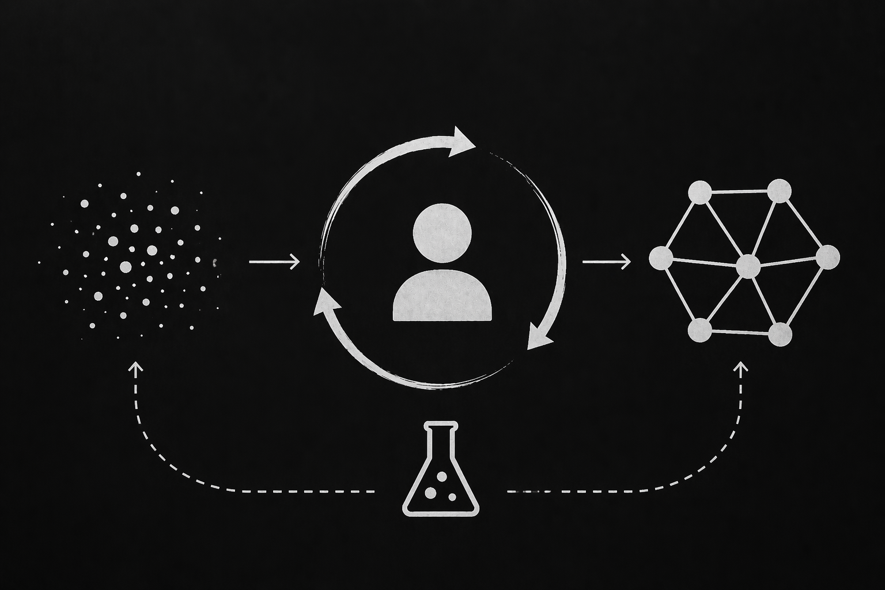

# The Rise of the Probabilistic Founder

Source: https://dannguyenhuu.substack.com/p/the-rise-of-the-probabilistic-founder
Saved: 2026-05-11
Author: Dan Nguyen-Huu
Published: Apr 23, 2026
Description: Over the last few months, I’ve been having versions of the same conversation with a bunch of seed and early-stage investors.
GeekNews topic: https://news.hada.io/topic?id=29176
Shared URL: https://share.google/saXVwRRTKSF2Dz6F0

Over the last few months, I’ve been having versions of the same conversation with a bunch of seed and early-stage investors. The specifics differ, but the shape is always similar: the world we underwrite against has changed, and the founders who are building in it look different from the ones we backed in the past.

For most of the history of software, we built deterministic systems. You wrote the code, you tested it, you shipped it, and within well-understood bounds you knew what it did. Given the same input, you got the same output. And because that was the nature of the systems, it was also, whether we said it out loud or not, the nature of the founders we backed to build them. Structured. Methodological. Thoughtful. The kind of operator you could hand a plan to and trust would execute it quarter after quarter. We pattern-matched on rigor, on clarity, on the ability to write a roadmap you could live inside for two years. Backing founders at the seed stage, we evaluated “clarity of vision”.

The systems we’re all building now are not deterministic anymore. And the founders who are winning are changing too.

## The era of probabilistic engineering

Tim Davis, the co-founder of Modular, published an essay called *[Probabilistic Engineering and the 24-7 Employee](https://www.timdavis.com/blog/probabilistic-engineering-and-the-24-7-employee)* that, in my view, is a clear articulation of this shift. His central claim is that software is becoming a probabilistic system. Inside the most AI-native teams, large portions of the codebase are generated by stochastic models, reviewed under time pressure against contexts too large to fully hold, and integrated into wholes no single human ever designed end-to-end. The code still runs. It still ships. But the confidence interval around “this works as intended” has widened. Generation has become cheap. Validation has not. The codebase stops being a thing you know works and becomes a thing you believe works, with a probability you can no longer precisely state.

Senior engineers have always lived with some version of this, every large production system is, to some degree, a thing you believe works. But the degree has changed enough to matter. When most of the code you’re shipping wasn’t written by the humans reviewing it, belief-based correctness stops being an edge condition and starts being the default.

If that’s what the systems are becoming, it stands to reason the people building them would start to look the same way. And in some of the most important categories forming right now, the deterministic archetype we used to underwrite against, the operator with the two-year roadmap and the crisp milestone plan, is no longer sufficient. In a few of them, it’s actively a mismatch.

## The probabilistic founder

The founders building the best AI-native companies are a lot like the systems they’re building.

They are experimental by default. They are willing to abandon their priors. They’d rather run ten cheap experiments than commit to one expensive plan. Their iteration cycles are measured in days, not quarters. And (this is the part that would have been a red flag two years ago and is now a tell that they’ve read the environment correctly), their roadmaps are deliberately, almost defiantly, light.

More than one founder has told me some version of the same line: “Here’s our long-term vision of the platform, but honestly, this could all change in two or three months.” A model ships, a capability jumps, and the plan they wrote a quarter ago is no longer the plan you’d write today. The best ones aren’t embarrassed by that. They’ve priced it in.

You can see the same shift inside their engineering orgs. For decades, the benchmark for “how much time should engineers spend on exploratory work” was something like Google’s famous 80/20, roadmap-heavy, with a slice carved out for experimentation. In the AI-native teams I spend time with, that ratio has flipped. Something closer to 70% experimental and 30% roadmap is now what I hear from the most forward-leaning shops, not as a formal policy but as the lived reality of how the week actually breaks down. The roadmap bends around the models, not the other way around.

And there’s a philosophical tell I keep hearing that I think matters more than any of the tactical ones. The probabilistic founder operates with what I’d call an agent-default posture: the assumption that anything can be done with an agent in mind, and if the agent doesn’t work, the operator - the human - has failed, not the agent system. That’s a fundamentally different locus of accountability than the one most of us grew up with, where a tool that didn’t work was, well, a bad tool. The probabilistic founder doesn’t blame the tool. They assume the tool is getting better every week and ask whether their own specification, review, and orchestration kept up.

## What this means for how we invest

If you’re still pattern-matching founders against the deterministic archetype, you might miss the best ones in this cycle. Some of the signals that would have read as “unstructured” or “not rigorous enough” five years ago are, in this environment, exactly the traits that match the shape of the work - a willingness to kill a feature the day after a model release, to live inside uncertainty without flinching, to treat the roadmap as a hypothesis rather than a promise.

I don’t think rigor is dead. I think it has moved. The rigor that matters now lives in experimentation quality, in selection discipline, in the ability to direct a fleet of agents toward the right problem and tell the brilliant output from the plausible-looking-but-wrong output. That’s a different muscle than five-quarter roadmap adherence, and we’re still learning how to evaluate it.

And it’s worth saying plainly what doesn’t change. Probabilistic doesn’t mean casual. The probabilistic founder still has to be a relentless executor - arguably more so, because an environment that rewards running ten experiments instead of one is unforgiving to anyone who can’t actually finish things. Velocity is the price of admission; the ability to ship, close loops, and compound week over week is as non-negotiable as it ever was.

Likewise the probabilistic founder still has to be an absolute talent magnet. If anything, that bar has gone up. In a world where a small team of the right people plus a fleet of agents can out-ship a team of fifty, the premium on pulling in the top one percent of operators is higher, not lower. The best probabilistic founders are, without exception, the kind of people other great people rearrange their careers to work with. Experimentation without execution is noise and speed without talent is churn.

## The bet

Tim Davis ends his essay with a line I keep turning over: the bet of this era is whether the human in the loop stays sharp enough, honest enough, and trained well enough to be worth having in the loop at all.

The founder version of that same bet is whether the operator pointing the fleet has the taste, the speed, and the comfort with uncertainty to compound faster than a competitor still trying to plan their way through.

The probabilistic founder is that bet, in a person. And it’s the one I’m convinced is worth making.
