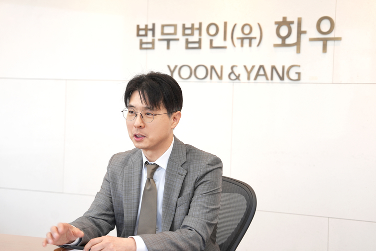
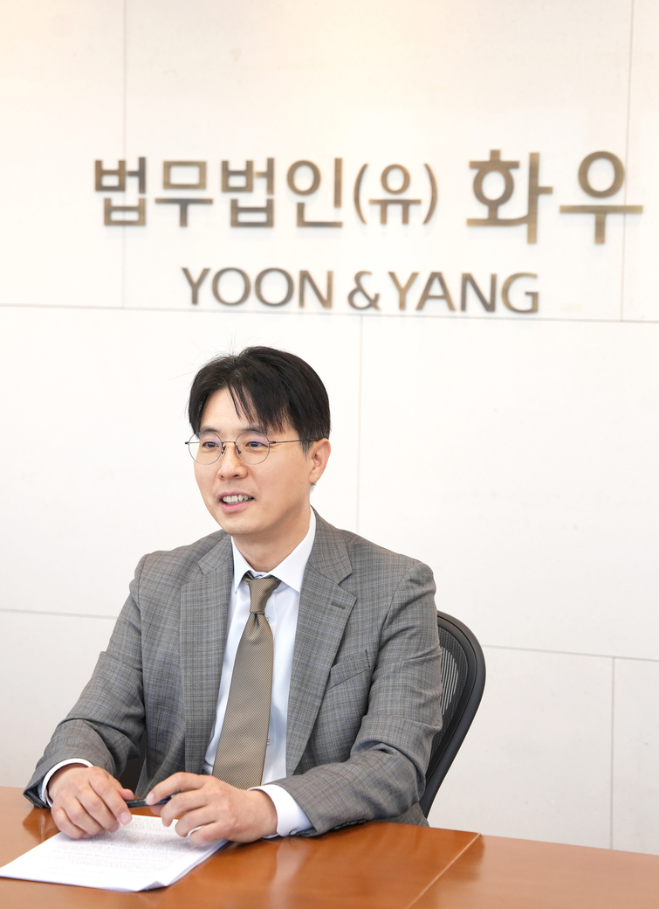

# [딜메이커] [법무법인 화우] "자문은 답변이 아니라 창의적 영역"

## Metadata

- Source: 딜사이트(DealSite)
- Source URL: https://dealsite.co.kr/articles/161290
- Shared URL: https://share.google/Qmk6MG9v1w8K2sMeM
- Author: 이슬이 기자
- Section: 대체투자 > PEF > 딜메이커
- Published: 2026-05-11T08:00:17+09:00
- Plus first published: 2026-05-08T06:40:00+09:00
- Archived: 2026-05-12
- Description: 김상만 M&A 변호사 "법적 위험 낮다면 과감히 양보…자문은 주장과 갈등의 해결"
- Keywords: 화우, 법률자문, 크로스보더

## Article

*그림 1. 김상만 변호사(제공=법무법인 화우). 원문 이미지 URL: https://dtd31o1ybbmk8.cloudfront.net/photos/28b971fb1deb74cd6ce47851095cd2ad/thumb.jpeg*

> 김상만 M&A 변호사 "법적 위험 낮다면 과감히 양보…자문은 주장과 갈등의 해결"

> 이 기사는 2026-05-08T06:40:00+09:00 유료콘텐츠서비스 딜사이트 플러스에 표출된 기사라고 원문에 표시되어 있다.

[딜사이트 이슬이 기자] "자문사가 갖춰야 할 덕목은 절제와 인내다. 간혹 자문사가 고객의 이익을 전부 수호하려고 과도하게 협상에 임했다가 거래 상대방과 감정 대립을 시작해 거래가 무산되는 경우도 종종 생긴다. 자문사는 자신의 감정을 노출하기 보다는 상대방이 보기에도 합리적인 대안을 제시하는 데 공을 들여야 한다."

법무법인 화우에서만 18년 동안 근무한 김상만 파트너 변호사는 오랜 근속의 비결을 자문사의 기본 원칙에서 찾았다. 차분한 성정처럼 얘기를 풀어간 김 변호사는 협상의 원칙에 대해 "법적 위험이 낮다고 판단되는 부분은 과감하게 양보하고, 반대로 위험이 높은 부분에 대해서는 고객 주장을 관철시키기 위한 구체적인 방안을 제시해 갈등을 풀고자 한다"고 설명했다.

2008년 하우스에 합류한 김상만 변호사는 M&A팀 역량을 상위권으로 올려세운 화우의 기둥 같은 존재다. 화우는 이른바 김-광-태-세(김앤장, 광장, 태평양, 세종)로 불리는 로펌업계의 빅4 구도를 깨뜨리고 지난 1분기 딜사이트가 집계한 인수합병 법률자문 리그테이블에서 4위에 이름을 올려 존재감을 나타냈다.

화우는 그간 안정적이라고 평가받던 기업자문과 송무 분야를 넘어 최근 M&A팀 조직 확대와 전략적 인재 영입을 앞세워 주목도 높은 딜에 잇달아 참여하고 있다. 화우의 성장기를 이끈 김상만 변호사는 굵직한 기업 구조조정형 거래부터 분쟁이 얽힌 복잡한 거래까지 가리지 않고 참여해 하우스의 트렉레코드를 만들어가는 중이다.

김상만 변호사는 "M&A 자문 변호사의 역할은 단순한 법률 검토라는 좁은 정의에 갇혀선 안 된다"며 "고객사가 요구하는 사안이 수용되기 어렵더라도 불가능하다고 답하는 데 그치지 않고 법적 테두리 내에서 같은 목적을 달성할 수 있는 다른 거래 구조를 고안해내야 한다"고 말했다. 자문사는 고객 니즈를 읽는 동시에 그만큼 창의적이어야 한다는 설명이다.

김 변호사는 "거래 과정에서 예상되는 규제 변화나 계약 구조상의 취약점을 고객이 인지하기 전에 먼저 짚어내고 사전에 대비책을 마련해두는 것 역시 같은 맥락"이라며 "자문사가 단순히 질문에 답하는 시대는 AI에 밀린 지 오래됐고, 고객이 보지 못하는 부분까지 선제적으로 파악해 방향을 제시하는 것이 지금 M&A 자문 변호사에게 요구되는 역할"이라고 시류를 짚었다.

## "NO는 없다, HOW 찾아야"

김상만 변호사는 지난해 나우IB캐피탈이 썬프로로시스템(Sun Fluoro System)을 인수할 당시 거래 구조 설정부터 외국환거래 신고 등 전 과정을 자문해 성공적인 거래 종결을 이끌어냈다. 썬프로시스템은 미국, 중국 등에 해외 각지에 자회사를 두고 있는 일본 반도체 소부장 분야 강소 기업이다. 화우는 인수 측 리드 카운슬(Lead Counsel)로서 해외 로펌들과도 긴밀하게 협업해 법률 실사와 승인 절차를 주도했다.

특히 해당 기업이 일본 외국환 및 외국무역법상 국가 안보와 직결된 '지정 업종'으로 분류되었던 만큼 법률 자문사로서 경제산업성(METI) 등 일본 정부의 사전 승인을 얻는 것이 핵심 관건이었다. 인수자 측은 한국 기업이 단독으로 인수에 나설 경우 일본 정부의 승인을 받기가 쉽지 않다고 판단해 거래 구조 설계 단계에서부터 대상 기업의 오랜 거래처 중 한 곳을 전략적투자자(SI)로 확보해 한·일 합작 글로벌펀드를 조성했다.

화우는 이 과정에서 규제 당국의 기술 유출 우려를 불식시키기 위한 법률적 대응에 집중하며 경제산업성의 승인을 받아낼 수 있었다. 김상만 변호사는 "당시만 하더라도 양국 간 정치, 기업 문화의 차이 등으로 한국 기업이 일본의 반도체 분야 기업을 인수한 사례는 흔지 않았다"며 "한일 파트너십 기반의 공동 투자라는 구조를 내세워 외국 정부 승인 하에 성공적으로 인수했다는 점에서 의미가 있다"고 덧붙였다.

대외적인 규제 허들을 넘는 것만큼 기업 구조조정 차원의 거래에서도 복잡한 설계가 필요하다. 워크아웃 신청 기업의 경우 채권단 관리 하에 권리 관계를 정리해야 하는 만큼 다수의 이해관계자들 간 법적 쟁점을 검토하고 조율하는 게 중요하다. 김상만 변호사는 케이조선(옛 STX조선해양) 인수 건부터 동부건설-에코프라임PE 컨소시엄의 HJ중공업(옛 한진중공업) 인수와 한투·SG PE-KHI의 대한조선인수, 포스코플랜텍의 투자유치 자문 등 굵직한 구조조정 딜들도 맡았다.

클로징까지 무려 1년이 넘게 소요된 효성화학 네오켐사업부 매각 건 역시 자문을 맡은 대표적인 딜이다. 당시 효성화학의 네오켐사업부는 다른 사업부들과 공장을 함께 사용하고 있었기에 공장 자산과 인허가 분할, 전산 시스템 분리, 고용 관계 이전, 거래처 계약 양도 등 풀어야 할 난제가 겹겹이 얽혀 있었다. 김 변호사는 "사업부의 규모가 크고 공장을 공유하는 구조다 보니 단순한 지분 거래보다 검토해야 하는 이슈가 많았다"며 "장기간 이해관계자 조율에 상당한 공을 들였다"고 말했다.

## 하나의 화우, 빅딜 시너지

*그림 2. 김상만 변호사(제공=법무법인 화우). 원문 이미지 URL: https://dtd31o1ybbmk8.cloudfront.net/photos/b070d8c3c66c32ae7bb486d0ef33267a/thumb.jpeg*

화우는 이른바 원펌 중심의 협업 문화가 정착돼 있다. 딜이 들어오면 사안에 따라 노동(인력 승계), 공정거래(기업결합심사), 조세(세무 구조) 등 각 분야 전문가들이 즉각 통합 TF를 구성한다. 여러 법적 쟁점이 복잡하게 얽힌 거래에선 유기적인 대응을 해야 고객에 최적화된 솔루션을 빠르게 제공할 수 있다. 김상만 변호사는 "경영권 분쟁과 금융 규제 대응 노하우가 경쟁력"이라며 "인허가 당국에 대한 미묘한 판단이 요구되는 M&A 거래에서 화우만의 실무 대응력이 있다"고 말했다.

2014년 출범한 화우 M&A팀은 지난해부터 대형 로펌 출신의 인재들을 잇달아 영입하며 체급을 키웠다. 윤희웅 대표변호사 겸 미래전략기획단장을 비롯해 이진국 변호사, 류명현 외국변호사 등이 합류해 대형 딜 수행 역량을 강화했다. PEF·VC 등 투자형 M&A 분야에서는 김영주, 김민주 변호사를 영입해 전문성을 보강했다. 여기에 임석진, 제갈민정 외국변호사와 채연정 변호사를 영입해 크로스보더 M&A 딜 대응력도 한층 높아졌다.

가상자산 업계 빅딜인 네이버와 두나무의 기업결합부터 교보생명의 SBI저축은행 인수 그리고 최근 하림그룹의 홈플러스 익스프레스 인수까지 업계의 이목이 집중된 딜들을 화우가 성사한 것도 이런 때문이다.

최근에는 자본시장 제도 변화에 대한 실무 대응력을 강화하고 있다. 자사주 소각 의무화나 중복상장 규제 등이 개별 딜에 미칠 영향을 분석해 최적화 솔루션을 제공하려는 목표다. 그룹 간 구성원들이 프랙티스그룹(PG)을 만들어 정기적인 회의를 통해 각 프랙티스 별 최신 판례와 시장 및 규제 동향을 스터디하고 있다. 고객사 가운데선 이 내용들을 선제적으로 받아 발 빠르게 대응 전략을 수립하는 곳들도 있다.

대형 로펌 특유의 보수적인 분위기에서 벗어나 젊은 변호사들의 의견을 실무에 적극적으로 반영하는 수평적인 의사소통 구조가 화우의 강정이다. 이러한 업무 환경은 구성원들의 유기적인 협업과 높은 근속률로 이어진다. 김상만 변호사는 "젊은 의견이 실무에 바로 반영되는 환경이 오래 함께할 수 있는 이유"라며 "결국 좋은 거래는 조직력에서 나온다"고 강조했다.

이슬이 기자 seuli1024@dealsite.co.kr

ⓒ새로운 눈으로 시장을 바라봅니다. 딜사이트 무단전재 배포금지
