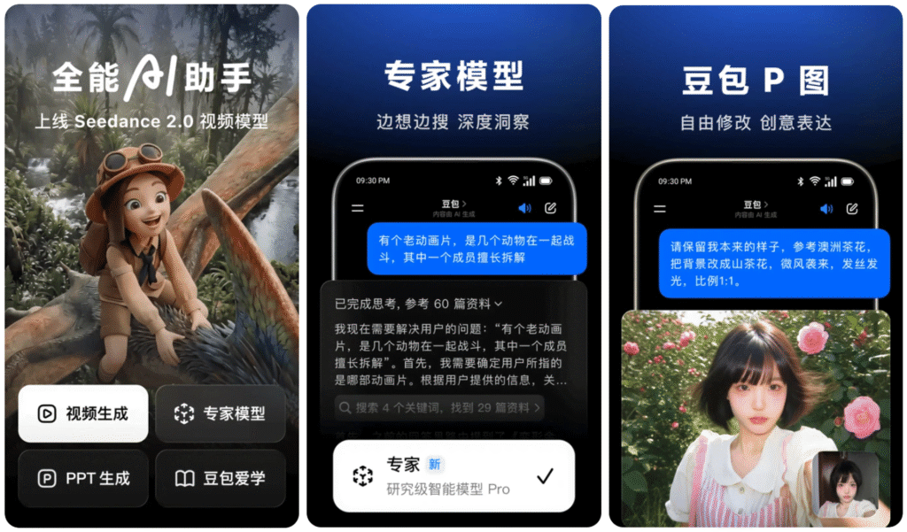
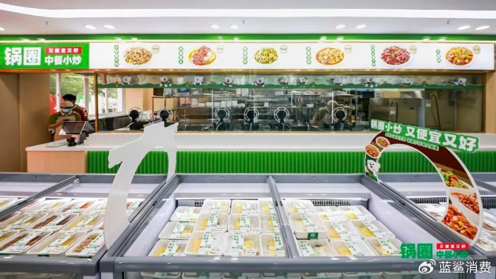
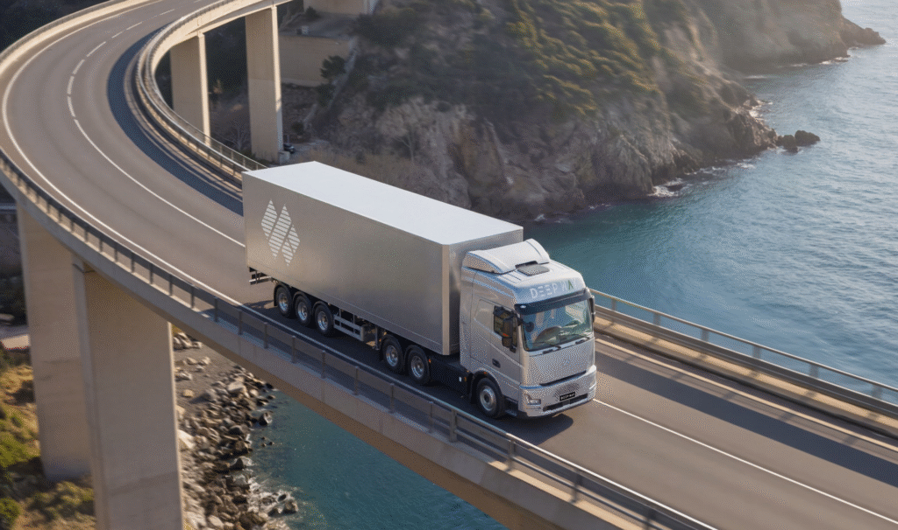

# [중국 비즈니스 트렌드&동향] 계산서가 도착했다

## Metadata

- Source: 플래텀(Platum)
- Source URL: https://platum.kr/archives/286581
- Shared URL: https://share.google/L5wWgn7D8OgCQ6gpo
- Author: 허민혜
- Section: 글로벌
- Published: 2026-05-12T08:01:00+09:00
- Archived: 2026-05-12
- Description: 3억 5천만의 짐
- Tags: AI, China, Doubao, 궈취엔, 더우바오, 딥웨이, 또우바오, 로봇식당, 바이두, 바이트댄스, 볶음 로봇, 자율주행 트럭

## Article

*그림 1. 더우바오(Doubao) AI 기능 홍보 화면. 원문 이미지 URL: https://cdn.platum.kr/wp-content/uploads/2026/05/doubao-1024x601.png*

## 3억 5천만의 짐

중국 인터넷의 황금기는 ‘무료’라는 신화 위에 세워졌다. 검색도 무료, 음악도 무료, 동영상도 무료. 사용자는 곧 자산이었고, 트래픽은 곧 가치였다. 그러나 AI 시대가 도래하면서 그 공식이 흔들리기 시작했다.

지난 4일, 바이트댄스(ByteDance, 字节跳动) 산하 AI 제품 또우바오(豆包)가 유료화를 선언했다. 스탠다드 버전 월 68위안(약 1만 4,734원), 플러스 버전 월 200위안(약 4만 3,352원), 프로페셔널 버전 월 500위안(약 10만 8,380원)의 3단계 구조다. 유료 기능은 프레젠테이션 생성, 데이터 분석, 영상 제작 등 복잡 생산력 시나리오에 집중되며, 기초 서비스는 무료를 유지한다고 밝혔다.

웨이보(微博) 실시간 검색어 1위에 오른 이 소식을 두고 여론은 갈렸다. “유료화하면 즉시 삭제”라는 강경론과, “해외 AI 제품들은 이미 등급별 서비스를 시행 중이며 고강도 AI 서비스 이면에는 고액 자원 소모가 존재하고, 합리적 가격 체계가 업계 건전 발전에 유리하다”는 냉정론이 맞섰다.

숫자가 그 배경을 설명한다. 또우바오의 월간 활성 사용자(MAU)는 3억 5천만 명, 2026년 3월 기준 일일 토큰 사용량은 120조 개로 출시 대비 1,000배 폭증했다. 바이트댄스는 2026년 한 해에만 1,600억 위안의 AI 자본 지출을 계획하고 있으며, 이 중 약 850억 위안이 AI 칩 구매에 투입된다. 이 막대한 지출은 2025년 순이익을 전년 대비 70% 이상 급감시키는 직접적 원인이 됐다.

막대한 지출보다 더 치명적인 것은 효율의 문제다. 화산엔진(火山引擎)에 따르면 현재 AI 추론 과제의 절반 이상이 무의미한 시행착오와 중복에 소모되고 있다. 머스크의 xAI 역시 GPU 활용률이 11%에 불과해 내부적으로 당혹스러운 수준이라는 자조가 나온다. AI 서버의 물리적 수명은 5~6년으로 잡지만, 기술 격변으로 인한 실질 수명은 2~3년에 불과해 연간 수백억 위안의 감가상각비가 이익 구조를 짓누른다.

비용 구조는 또 다른 방식으로도 악화되고 있다. 토큰당 단가는 떨어졌지만 기업이 지불하는 총비용은 오히려 상승하는 ‘AI 인플레이션’ 현상이 나타나고 있기 때문이다. 과거 일문일답 식 대화는 적은 토큰을 썼지만, 스스로 계획하고 검증하는 지능형 에이전트 방식은 한 번의 작업에 수십~수백 배의 토큰을 소모한다. H200 등 고성능 GPU 렌탈 비용 상승과 고대역폭 메모리(HBM)의 수급난이 원가 압박을 가중시키는 가운데, 2026년 5월 들어 알리바바(Alibaba, 阿里巴巴)와 텐센트(Tencent, 腾讯)가 AI 산력 제품 가격을 최대 34%까지 인상하면서 인프라 비용 부담이 고스란히 서비스 단가로 전이됐다.

현재 중국 AI 시장은 빅테크와 스타트업이 뚜렷한 격차를 보이며 공존하는 구도다. 알리바바의 치엔원(千问, Qwen)이 기업향(B2B) 점유율 32.6%로 선두를 달리고, 또우바오는 소비자향(B2C) 트래픽 왕좌를 지킨다. 바이두(百度)의 어니(ERNIE, 文心)와 텐센트의 위엔바오(元宝)는 각각 검색과 소셜 인프라를 무기로 뒤를 쫓는다. 딥시크(DeepSeek), 문샷AI(Moonshot AI, 月之暗面), 즈푸AI(智谱), 미니맥스(MiniMax, 稀宇科技) 등 스타트업들은 더 큰 수익 압박에 직면한 만큼, 일찍이 유료 의지가 높은 개발자·크리에이터 군으로 타깃을 압축했다. 즈푸AI는 기업향 로컬 구축 매출(ARR)이 60배 급증했고, 미니맥스는 일일 토큰 소모량이 전년 대비 6배 증가하며 폭발적인 활동성을 보여주고 있다. 반면 또우바오, 치엔원, 위엔바오는 지속적 사용자 폭 확대를 추구해 올해 춘제 기간 AI 진입구 쟁탈을 위한 ‘춘제 AI 대전’이 펼쳐지기도 했다.

3억 5천만 명의 사용자는 한때 자산이었다. 일일 120조 개의 토큰을 소모하는 지금, 그 숫자는 막대한 부채에 가깝다. 이번 유료화는 바이트댄스의 자신감이자 절박함의 교차점이다. 3억 5천만 명 중 과연 얼마나 많은 이들이 연간 5,088위안(약 110만원)의 청구서를 기꺼이 받아들일지가, 중국 AI 소비자 시장의 지속 가능성을 가늠할 첫 번째 시험대가 될 것이다.

*그림 2. 궈취엔(锅圈) 중식/간편식 매장 전경. 원문 이미지 URL: https://cdn.platum.kr/wp-content/uploads/2026/05/guoquan-1024x577.jpg*

## 웍을 든 로봇

중국 외식업의 고질적 과제는 두 가지였다. 매출의 약 22%를 차지하는 인건비, 그리고 조리사마다 다른 맛의 편차. 이 두 문제를 동시에 겨누는 해법이 빠른 속도로 주방을 점령하고 있다.

최근 중국 식자재 유통기업 궈취엔식품(锅圈食品)이 허난성(河南) 정저우(郑州)에 첫 로봇 볶음 요리점 궈취엔중찬샤오차오(锅圈中餐小炒)를 정식 오픈했다. 대형 주거단지에 인접한 이 매장에는 6대의 지능형 볶음 로봇이 배치되어 있으며, 직원 1명이 4대를 동시에 조작한다. 메뉴 하나의 완성 시간은 1~3분, 가격은 8.9위안(약 1,928원)에서 39.9위안(약 8,645원)으로 일반 식당의 절반 수준이다. ‘퇴근길에 요리 두 개, 온 가족이 즐겁게’라는 슬로건에 걸맞은 가격 경쟁력이다. 볶음 요리부터 생선찜, 수육 등 메인 요리는 물론이고 가정식 볶음, 조림, 튀김 등 총 175개 메뉴를 갖추되, 매장 내 취식 공간을 없애고 배달과 포장에만 집중해 임대료와 인건비를 낮췄다.

궈취엔이 처음은 아니다. 중국의 주요 프랜차이즈들은 이미 AI 요리 로봇 도입을 통해 수익성 개선에 성공하고 있다. 안훼이(安徽) 요리 전문 브랜드 샤오차이위엔(小菜园)은 2023년부터 볶음 로봇을 도입해 올해 4월 기준 전국 660개 매장에 약 3,000대를 배치했으며, 2025년 순이익 7억 1,500만 위안(약 1,549억원) 달성의 일등 공신으로 로봇이 꼽힌다. 후난(湖南)식 볶음 덮밥 프랜차이즈 빠완까이마판(霸碗盖码饭)은 창업 초기부터 자체 개발 볶음 로봇을 핵심으로 내세워 세 차례 이상의 기술 개선을 거쳤다. 현재 불 세기와 양념 투입량을 정밀 제어하고 자동 세척 기능까지 갖춰 단일 메뉴 출고 시간은 2~4분이다. 베이징의 가성비 외식 프랜차이즈 난청샹(南城香)은 2024년부터 스마트 볶음 조리기를 도입해 3분 교육, 2~5분 출고를 실현하고 “10분 초과 시 무료 제공”을 소비자에게 약속하고 있다. 지난해 말 기준 전 매장의 20%에 지능형 조리기를 도입했으며, 올해 전 매장 확대를 계획 중이다.

시장 규모도 가파르다. 홍찬산업연구원(红餐产业研究院)이 발표한 <2026 외식 AI 볶음 로봇 연구 보고서>에 따르면, 중국 볶음 로봇 시장은 2024년 31억 7천만 위안(약 6,869억원)에서 2025년 37억 위안(약 8,017억원)으로 성장했으며, 2030년에는 110억 위안(약 2조 3,834억원)을 돌파할 것으로 전망된다.

로봇은 인력 효율을 2~3배 높이면서도 알고리즘으로 기름 온도, 볶음 정도, 조리 시간 등 핵심 파라미터를 정밀 제어해 즉석 조리의 고유한 풍미를 유지하면서 메뉴 표준화를 실현한다. 한때 “맛이 없다”는 편견에 시달렸던 AI 요리 로봇은, 정교한 알고리즘과 표준화된 소스 패키지의 결합으로 이제 전문 조리사의 80~90% 수준까지 품질을 끌어올렸다는 평가를 받는다.

강력한 식자재 공급망을 가진 궈취엔이 이 시장에 뛰어들었다는 것은, 이제 소비자가 집에서 요리하는 비용보다 밖에서 ‘로봇이 볶아준 요리’를 사 먹는 비용이 더 저렴해지는 시대가 머지않았음을 의미한다. 미래의 중국 외식업은 ‘손맛’을 파는 장인형 식당과 ‘효율’을 파는 AI 시스템 식당으로 선명하게 갈릴 것이다.

*그림 3. DeepWay 대형 트럭 홍보 이미지. 원문 이미지 URL: https://cdn.platum.kr/wp-content/uploads/2026/05/deepway-1024x606.png*

## 느리게, 그러나 멀리

자율주행의 전쟁터는 늘 승용차였다. 그러나 정작 돈이 되는 싸움은 다른 곳에서 조용히 진행되고 있었다.

지난 7일, 중국 자율주행 스타트업 딥웨이(DeepWay, 深向科技)가 홍콩 증권거래소(HKEX)에 상장 신청서를 갱신했다. 지난해 11월 첫 도전 이후 두 번째 시도로, 공동 주관사는 CICC(中金公司)와 CMBI(招银国际)가 맡았다. 올해 들어 두 차례 대규모 투자를 유치했다. 자율주행 분야 올해 최대 규모인 11억 7,700만 위안(약 2,550억원)에 이어, 2주 전에는 3억 1천만 달러(약 4,562억원) 규모의 프리-IPO 라운드를 마무리해 대형 트럭 자율주행 업계 최근 5년간 단일 라운드 최대 기록을 세웠다.

2020년 설립된 딥웨이의 성장 배경에는 두 거대 기업이 있다. 바이두(百度)의 자율주행 플랫폼 ‘아폴로(Apollo) X 프로젝트’의 첫 번째 수혜자로, 10년 이상 축적된 자율주행 기술 소스코드를 독점 이전받아 상용화에 곧바로 활용했다. 이사회 의장 겸 최고경영자(CEO) 완쥔(万钧)은 물류 대기업 스차오그룹(狮桥集团)의 창업자로, 상용차 물류 업계에서 수십 년간 활동해온 베테랑이다. 그는 화려한 기술 시연보다 돈을 벌어다 주는 트럭을 만드는 데 집중했다.

완쥔의 전략은 동시대 자율주행 업계와 결을 달리했다. L4 완전 자율주행을 처음부터 추구하는 급진파와 달리, ‘전동화→L2 보조 주행→스마트 편대 주행→단차 무인 주행’의 단계적 경로를 택했다. L3 시스템은 차량 하드웨어 비용을 수십만 위안 높이는 데다 운전자의 상시 개입이 여전히 필요해 인건비 절감 효과가 없어 투입 대비 효율이 맞지 않는다는 판단이었다. 이에 따라 핵심 문제 해결에 집중한 L2를 우선 공략했다.

하드웨어 설계에서도 경쟁사의 연료차 전동화 개조 대신, 전기 구동 원리에 따라 차량을 처음부터 새롭게 설계하는 방식을 고집했다. 배터리와 섀시 일체화 설계로 화물칸 용적률이 전통 개조 차량 대비 9.6% 향상됐다. 부피 단위로 요금을 받는 물류 업계에서 이 9.6%는 순이익 증가로 직결된다. 전 생명주기 비용 기준으로는 전통 연료 대형 트럭 대비 18.7%, 연료차 개조 전동 트럭 대비 4.9% 절감된다.

수치가 이 판단의 옳음을 증명한다. 신에너지 대형 트럭 출하량은 2023년 509대에서 2024년 3,002대, 2025년 8,020대로 3년 만에 약 15배 증가했다. 매출은 2023년 4억 위안(약 866억원)에서 2025년 40억 위안(약 8,667억원)으로 2년 만에 10배 뛰었다. 매출의 90% 이상이 신에너지 대형 트럭 및 부품 판매에서 발생한다. 신규 고객 수는 2023년 34개사, 2024년 186개사, 2025년 319개사로 빠르게 확대됐으며, 누적 고객은 539개사에 달한다. 선통(申通), CATL(宁德时代), 멍니우(蒙牛), SF익스프레스(顺丰, 순펑), 이케아 등이 주요 고객이다.

매출총이익률은 2023년 0.4%에서 2024년 0.5%, 2025년 4.9%로 향상됐다. 아직 흑자 전환은 이루지 못해 2023~2025년 누적 손실은 약 17억 1,300만 위안(약 3,711억원)이지만, 조정 순손실률은 2023년 101.9%에서 2024년 30.9%, 2025년 14.3%로 연속 50%포인트 이상씩 개선됐다.

소프트웨어 수익화도 궤도에 올랐다. 톈지•쉐이싱(天玑•随行)과 톈지•옌싱(天玑•雁行) 두 가지 스마트 도로 화물 운송 기술 솔루션을 연간·평생 구독 방식으로 출시한 결과, 2025년 말 기준 L2 기능 유료 구독률은 30%를 넘어섰다. 업계 최초의 구독 매출 사례다.

L2 상업화를 이룬 딥웨이는 이제 L4 무인 편대 주행을 향해 박차를 가하고 있다. 유인 리딩카가 무인 후속 차량들을 이끄는 군집 주행(Platooning) 기술을 통해 중국 내 단 두 곳뿐인 L4 상용화 성공 기업 반열에 올랐으며, 신장(新疆), 내몽골(内蒙古), 스촨(四川) 등의 고객 현장에서 편대 테스트 검증과 화물 운송을 실시하고 첫 번째 고객 납품도 완료했다.

무인화를 위해 여전히 자본을 소진 중인 로보택시와 달리, 대형 트럭 자율주행의 상업적 가치는 이미 숫자로 증명되고 있다. 딥웨이의 IPO는 그 증명의 다음 장이다.
