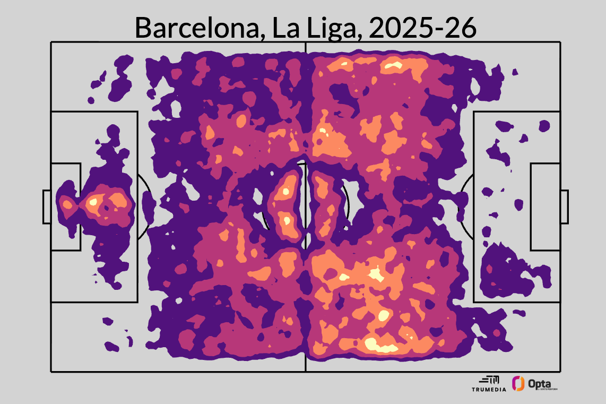
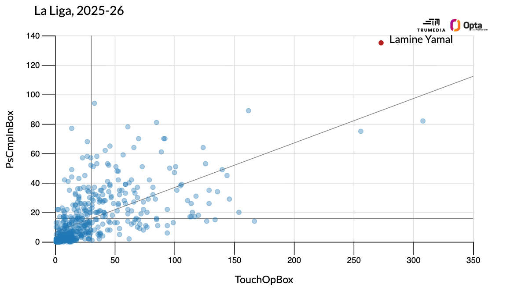
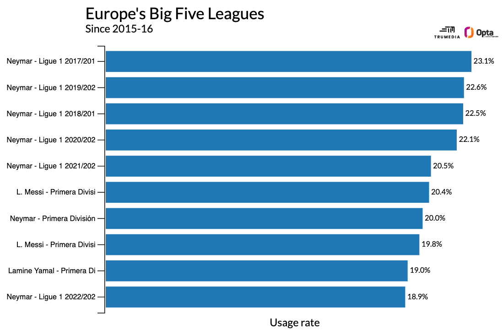
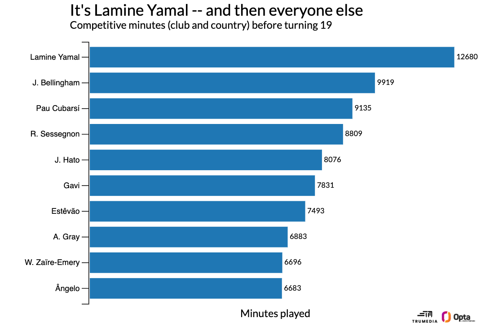

# Lamine Yamal is the best player in Spain, and Barcelona face a dilemma because of it

Source: https://www.espn.com/soccer/story/_/id/48705257/lamine-yamal-best-player-spain-barcelona-face-conundrum-it
Saved: 2026-05-13

## ESPN article metadata

- Canonical source URL: https://www.espn.com/soccer/story/_/id/48705257/lamine-yamal-best-player-spain-barcelona-face-conundrum-it
- Reader source URL: http://www.espn.com/soccer/story/_/id/48705257/lamine-yamal-best-player-spain-barcelona-face-conundrum-it
- Published time from reader metadata: 2026-05-08T09:26:00Z
- Visible byline: Ryan O'Hanlon, May 8, 2026, 05:26 AM ET
- Author note: Ryan O'Hanlon is a staff writer for ESPN.com and author of *Net Gains: Inside the Beautiful Game's Analytics Revolution*.
- Extraction method note: direct ESPN HTTPS fetch returned an AWS WAF/JavaScript verification challenge in this environment. The main article body was recovered from Jina Reader using the `http://www.espn.com/...` form, then manually cleaned to remove ESPN navigation, scoreboards, related-story sidebars, footer/legal text, and share controls.
- Figure preservation: four argument-bearing ESPN chart images were downloaded and rewritten to local `figures/` paths.

## Article body

Will Barcelona win back-to-back LaLiga titles in El Clásico? (2:23)
Luis Garcia and Craig Burley preview the upcoming El Clásico with Barcelona on the brink of winning another LaLiga title. (2:23)

These two things might both be true -- even if they really shouldn't be:

1) [Lamine Yamal](http://espn.com/soccer/player/_/id/362150/lamine-yamal) is the best player in [LaLiga](http://www.espn.com/soccer/league/_/name/esp.1).

2) Lamine Yamal is 18 years old.

This isn't news to anyone, given that Yamal finished second in Ballon d'Or voting just last year. And as [his father told us](http://www.espn.com/soccer/story/_/id/46353018/missing-ballon-dor-biggest-moral-damage), his son not _winning_ the award was "the biggest moral damage done to a human being."

This was wrong because, uh, _[frantically waves arms in a way that signifies the entire multi-millennium sweep of humanity's transgressions against one another]_. But it was also wrong because Yamal just wasn't the best player in the world last year. He registered fewer goals+assists than the likes of [Ollie Watkins](http://espn.com/soccer/player/_/id/198825/ollie-watkins), [Yoane Wissa](http://espn.com/soccer/player/_/id/224077/yoane-wissa), and [Tim Kleindienst](http://espn.com/soccer/player/_/id/185906/tim-kleindienst). [Mohamed Salah](http://espn.com/soccer/player/_/id/173896/mohamed-salah) put up 47 goals+assists; Yamal had 22.

Just as a general rule of thumb: If you're an attacker, and someone else who plays the same position as you more than doubles your amount of goals+assists, then you're not the best player in the world.

This season, though, Yamal reached a new level. It won't be a moral atrocity if he doesn't win a popularity contest like the Ballon d'Or, but he certainly has a case for it. He has put up 27 goals+assists, and on a per-90 basis, he is averaging 0.95 non-penalty goals+assists -- the best rate in LaLiga.

But then, of course, [he got hurt](http://www.espn.com/soccer/story/_/id/48569662/barcelona-lamine-yamal-season-expected-fit-world-cup). He tore his hamstring on April 22, and now it's a race against time for his body to be back for [Spain](http://www.espn.com/soccer/team?id=164)'s opening match at the [World Cup](http://www.espn.com/soccer/league/_/name/FIFA.WORLD).

All of which brings us to the conundrum that comes with a player so good, so early in his career. Lamine Yamal really is one of the best players in the world. And [Barcelona](http://www.espn.com/soccer/team?id=83) harbor annual aspirations of being the best soccer team in the world -- the more they play Lamine Yamal, the better they will be.

Being 18 and being one of the best players in the world makes you one-of-one -- we've never seen someone do this before. But with the number of games on the professional schedule seemingly increasing every year, being 18 and being one of the best players in the world also means you're more likely than anyone else to eventually get hurt.

* * *

**- [Barcelona vs. Real Madrid, LIVE Sunday, 3 p.m. ET on ESPN networks](https://www.espn.com/watch/player/_/id/d946564a-9aa2-4730-a77e-5c858d528f96)

 - [How Barça can make Clásico history and cap off Madrid's nightmare week](http://www.espn.com/soccer/story/_/id/48701641/barcelona-clasico-history-la-liga-title-real-madrid-nightmare-week-tchouameni-valverde)

 - [Get ready for _El Clásico_! Title race, head-to-head, key clashes, predictions](https://www.espn.com/soccer/story/_/id/48683678/barcelona-real-madrid-clasico-preview-title-race-all-head-head-key-clashes-predictions-odds)**

* * *

## Why Yamal is the next Messi or Neymar

Let's forget about his age for a minute -- or just hold it in the back of our minds as we compare Yamal to everyone else who has played professional soccer at the highest level over the past decade.

If you've watched a Barcelona game over the past two years, then you know how it goes. There's all the pressing and the high line and [Pedri'](https://www.espn.com/soccer/player/_/id/250465/pedri)s passing and [Robert Lewandowski](http://espn.com/soccer/player/_/id/125824/robert-lewandowski)'s movement and whatever -- but everything goes through Yamal. He's not a teenager benefitting from playing with a bunch of other superstars who create space for him. Nope, he's the one creating the space and the opportunities for everyone else.

Just take a look at this heatmap for all of Barcelona's touches in LaLiga so far this season:

You'll see way more yellow and orange on the right side, and then you'll see that cluster of touches inside the attacking box that don't exist over on the left. Yamal gets on the ball deep, and he gets on the ball inside the box.

He leads all players in LaLiga, by a wide margin, for passes completed into the penalty area, but then he's also second, between [Real Madrid](http://www.espn.com/soccer/team?id=86)'s [Vinícius Júnior](http://espn.com/soccer/player/_/id/252107/vinicius-junior) and [Kylian Mbappé](http://espn.com/soccer/player/_/id/231388/kylian-mbappe), for the number of touches he's taken inside the box.

This is the kind of player who has dominated modern soccer: the high-usage winger. They're able to get on the ball way more often than center forwards because they're deeper on the field. And they're able to find space more easily than attacking midfielders because they're out wide.

But the best ones still manage to score as often as the best strikers and create as many chances as the best No. 10s. So, you have players that decide games in the most dangerous area of the field but who are also the ones who get the ball into those areas in the first place.

The primary examples of this kind of player are two of Yamal's predecessors at Barcelona, [Neymar](http://espn.com/soccer/player/_/id/132948/neymar) and [Lionel Messi](http://espn.com/soccer/player/_/id/45843/lionel-messi). And, well, we haven't seen a player do what Yamal is doing since that duo was still playing in Europe.

One way we can think of what's asked of a given player on the attacking end is by looking at how often he is the last player in a given possession. They're essentially deciding that whatever they chose to do -- attempt a risky pass or take-on, line up a shot -- is more valuable than anything else that might come down the line were the possession allowed to continue. And Yamal has finished off a possession 427 times this season -- way more than anyone else in Spain, in a long time.

Here's a list of the 10 individual seasons from the past 10 years across Europe's top five leagues with the highest individual "usage rates," or share of possessions where you were the last player:

The two Messi seasons are 2019-20 and 2020-21, while the one Neymar season with Barcelona was 2016-17. Oh, and the Yamal season is _this current year_.

The main difference: the youngest either Messi or Neymar were in any of those seasons was 24, Neymar's final year with Barcelona. Yamal has another six years before he's the same age.

* * *

## The concerning history of high-workload teenagers in Europe

When he's on the field, Yamal is playing an incredibly demanding role. The ball goes to him -- over and over and over again -- and he's then tasked with making the high-leverage plays that decide the outcome of a given possession.

The minutes are high intensity, and man: there are just so many minutes.

Take a look at this chart, which shows the minutes leaders among 18-and-under outfield players across the Stats Perform database. The games go back to around 2009, and this includes all competitive minutes, for both club and country:

If we only look at domestic minutes in Europe's Big Five top leagues, then everything bunches together a bit more, but it allows us to look at a longer stretch of time since [FBref's database](https://www.sports-reference.com/stathead/fbref/player-season-finder.cgi?request=1&match=player_season_combined&order_by=minutes&comp_gender=m&comp_type=b5&age_max=18) goes back to the early 1990s. Here's what that top 10 looks like:

**1)** Lamine Yamal, Barcelona: 7,327 minutes

**2)** Pau Cubarsí, Barcelona: 6,728

**3)** Eduardo Camavinga, Rennes and Real Madrid: 6,252

**4)** Wayne Rooney, Everton and Manchester United: 6,226

**5)** Iker Muniain, Athletic Bilbao: 6,101

**6)** César Azpilicueta, Osasuna: 5,800

**7)**Gavi, Barcelona: 5,791

**8)** Michael Owen, Liverpool: 5,645

**9)**Javi Martinez, Athletic Bilbao: 5,547

**10)**Michael Ball, Everton: 5,341

In terms of how things went from there for all of these guys? It's not great.

Camavinga has missed 50 games due to injury, according to the site Transfermarkt, since joining Madrid in 2021. Muniain was the youngest player to score a goal in LaLiga, but then tore his ACL at 23 and was never quite the same after that. Gavi was a first-choice player for Barcelona at 16 and 17, but he, too, tore his ACL and still hasn't bounced back in the three seasons since it happened. Owen's career high for goals and assists came in his age-17 season. He ruptured his hamstring at 19 and tore his ACL at 26. Martinez tore his ACL at 25 and only broke the 2,000-minute mark after moving to [Bayern Munich](http://www.espn.com/soccer/team?id=132) once. And Ball got his first [England](http://www.espn.com/soccer/team?id=448) cap at age 20 in February of 2001, tore his MCL in December of that same year, and never played for England again.

On the sunnier side of projections, Rooney was a stalwart who played at least 2,000 minutes in 13 straight [Premier League](http://www.espn.com/soccer/league/_/name/ENG.1) seasons for teams that were always competing in multiple competitions -- on top of always starting for England. Azpilicueta, meanwhile, made his LaLiga debut in 2007 -- he spent most of his career playing in the Champions League and Premier League; and he's started 15 games for [Sevilla](http://www.espn.com/soccer/team?id=243)_this season_.

If we exclude Cubarsi, who is Yamal's contemporary, that's seven players who were derailed by injury and two who were able to keep on keeping on. Add in the fact that there are more games today than ever before, and it certainly doesn't look great for Yamal's future.

* * *

## What should Barcelona do?

So much of injury analysis quickly devolves into pseudoscience, chasing random fluctuations in the human body and trying to glean meaning from it.

Take Liverpool, for example. They enjoyed a relatively healthy season in Arne Slot's first year at the club, and it was easy to find causation: they stopped playing Jurgen Klopp's heavy-metal style, players stopped running so much, and players stopped getting hurt. Then, in Slot's second season, with the team playing in an even more laid-back way, everyone started getting hurt again.

We know that two things, essentially, increase injury likelihood: past injury and workload. A paper from the [Sloan Sports Analytics Conference](https://www.sloansportsconference.com/research-papers/the-strain-of-success-a-predictive-model-for-injury-risk-mitigation-and-team-success-in-soccer) a few years ago essentially used these factors to predict the likelihood of player injury, and then proposed a theory I hadn't really thought of before: that injury prevention and workload management requires long-term planning.

The researchers created a complex model that looked at the season schedule in advance -- identifying factors like days between matches and opponent difficulty -- and came up with a squad rotation plan. Such a plan, they argued, may not optimize short-term results, but by increasing the likelihood that your players stay healthy over the whole season, you're often increasing the likelihood that you win more points at the end of the season. And if you're not, you're definitely increasing the likelihood that you win more points over the next few seasons.

This, intuitively, checks out. We know that most managers are short-term decision-makers with little-to-no job security. For the most part, they plan for the match in front of them and then deal with whatever fallout may occur as they plan for the next match, and on and on. While every match is worth three points, most coaches treat the next game as though it's more valuable than the game in three months.

The study essentially confirmed this, as analysis of two Premier League seasons found that most managers opted for what they called a "greedy" selection. They frequently opted for players who were available, but had played lots of minutes recently and had recent injuries or long injury histories.

Given the number of current Barcelona players who have shown up on these "minutes played by teenagers" lists, it would seem that the club is guilty of this, too.

We've mentioned Yamal, Cubarsi, and Gavi, but there's also Pedri, who played 2,500 minutes in his debut season with Barca at 17 and has struggled with non-contact injuries ever since. On top of that, pretty much every key player for Barcelona has suffered a hamstring injury this season -- typically considered a symptom of overuse. It's easy to attribute that to the incredibly aggressive style Barcelona play under Hansi Flick, but we can't know that for sure.

What we do know, though, is that the number of games being played at the highest level has reached a point where nearly every prominent manager and player [has spoken out](http://www.espn.com/soccer/story/_/id/40746374/soccer-burnout-longest-ever-season-2024-25) about the absurd demands being put on their bodies.

On top of that, even beyond Barcelona, we're seeing an increasing reliance on younger players at the highest level. Before they'd turned 18, Brazilian legends Ronaldo and Ronaldinho had played fewer combined minutes than either Vinicius Junior, [Endrick](http://espn.com/soccer/player/_/id/252535/endrick), or [Estêvão](http://espn.com/soccer/player/_/id/376481/estevao) played by themselves alone. [Benjamin Sesko](http://espn.com/soccer/player/_/id/289155/benjamin-sesko) had played around 16,000 professional minutes before his 22nd birthday -- neither Zlatan Ibrahimovic or Thierry Henry had even reached 11,000 minutes at the same point in their careers.

"Physically, exposing teenagers to repeated match and training loads designed for fully mature players increases the risk of overuse injuries," Darren Burgess, director of performance with [Juventus](http://www.espn.com/soccer/team?id=111), wrote for [FIFPro's annual player-workload report](https://www.fifpro.org/en/articles/2025/09/without-minimum-protection-for-player-health-and-performance-football-remains-global-outlier-among-elite-sports-fifpro-report-shows). "Growth plates, tendons, and ligaments remain vulnerable during these years, and excessive high-speed running or short recovery windows can lead to long-term structural damage. What might begin as a minor issue -- a recurring hamstring strain, a stress fracture -- can quickly become a pattern that follows a player throughout their career."

In an ideal world, the powers-that-be wouldn't be driving the sport toward a breaking point in order to make even more money than they already do. But, well, welcome to being alive in the year 2026.

Instead, the coaches and players are left to navigate the minefield that is winning games without getting injured -- despite incentives pushing them to go as hard as they can. Yamal himself wants to play every minute of every game -- professional athletes are wired differently. And soccer isn't like the NBA with its playoff structure -- every regular-season draw or loss decreases your chances of winning the title. And managers at the clubs who play the most games seem to have less job security than ever before.

Every player's body is different, of course. And Yamal could end up being able to play thousands of minutes every year until his 30s without anything more than the handful of injuries every player picks up over the course of an average career. But the reality is that more games and prior injuries would increase anyone's chances of getting injured again. Yamal already had a ton of games under his belt, and now he's got his first serious injury, too.

So, in some form, this is the choice Barcelona will be left with next season: Do you want to get the most out of your 19-year-old superstar? Or do you want to do what you can to make sure he's still dominating when he turns 29?
