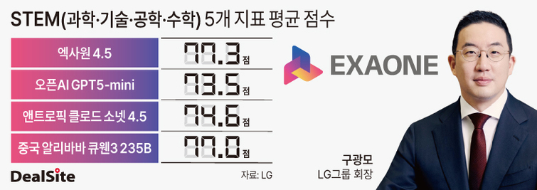
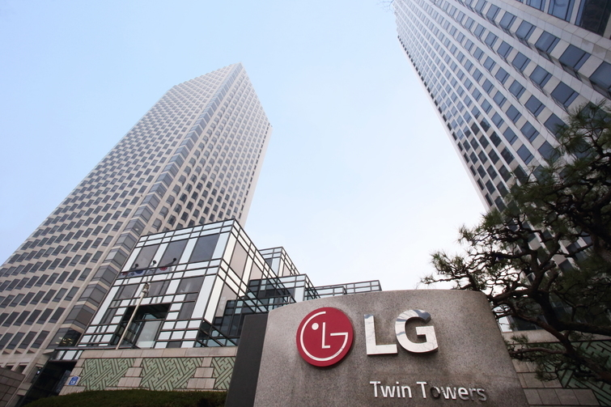

# [밸류업 시동 LG] '엑사원', 글로벌 무대서 두각…구광모 '선구안' 통했다

## Metadata

- Source: 딜사이트(DealSite)
- Source URL: https://dealsite.co.kr/articles/161709
- Shared URL: https://share.google/cCsJLK7WxRddFyATt
- Author: 신지하 기자
- Issue/series: 밸류업 시동 LG
- Section: 뉴스
- Published: 2026-05-13T08:00:18+09:00
- Plus first published: 2026-05-12T18:24:00+09:00
- Archived: 2026-05-14
- Description: ①'엑사원 4.5', 글로벌 벤치마크 선두…구광모 회장 'AX 전략'에 탄력
- Keywords: LG, 엑사원, 구광모, AI, 독파모, AX

## Article

> ①'엑사원 4.5', 글로벌 벤치마크 선두…구광모 회장 'AX 전략'에 탄력

> 이 기사는 2026년 05월 12일 18시 24분 유료콘텐츠서비스 딜사이트 플러스 에 표출된 기사입니다.

*그림 1. STEM 5개 지표 평균 점수 비교 그래픽. (그래픽=오현영기자). 원문 이미지 URL: https://dtd31o1ybbmk8.cloudfront.net/photos/5ae8c80b4c593d7bf79922d38ede0b20/thumb.jpg*

[딜사이트 신지하 기자] LG AI연구원의 인공지능(AI) 모델 '엑사원'이 글로벌 빅테크 모델과의 성능 경쟁에서 두각을 나타내며 'LG=AI 기업'으로 각인시키는 동시에 그룹 AI 전환(AX) 전략의 무게를 더하고 있다. 이는 구광모 LG그룹 회장이 취임 직후부터 AI를 그룹의 미래 핵심으로 삼고 일찌감치 기반을 다져온 결실이라는 평가가 나온다.

업계에 따르면 LG AI연구원이 지난달 9일 공개한 멀티모달 AI 모델 '엑사원 4.5'는 계약서와 기술 도면, 재무제표 등 산업 현장의 복합 문서를 정확히 읽고 추론하는 데 강점을 지닌다. 2021년 12월 국내 최초 멀티모달 AI 모델 '엑사원 1.0' 개발로 쌓은 기술력을 바탕으로, 자체 개발한 비전 인코더와 거대언어모델(LLM)을 하나의 구조로 통합한 '비전-언어 모델(VLM)'이다.

특히 엑사원 4.5 성능 지표가 주목을 받았다. STEM(과학·기술·공학·수학) 성능을 측정하는 5개 지표 평균 77.3점을 기록해 미국 오픈AI의 GPT5-미니(73.5점), 앤트로픽 클로드 소넷 4.5(74.6점), 중국 알리바바 큐웬3 235B(77.0점)를 모두 앞질렀다. 일반 시각 이해·문서 이해 및 추론을 포함한 13개 지표 평균에서도 이들 세 모델 점수를 상회했다. 코딩 성능 지표인 라이브코드벤치 v6에서는 81.4점으로 구글 젬마4(80.0점)도 넘어섰다.

효율성 측면도 눈길을 끌었다. 엑사원 4.5는 330억개 파라미터 규모(33B)로 지난해 말 공개한 'K-엑사원'의 약 7분의 1 크기이지만 텍스트 이해와 추론 영역에서 동등한 수준의 성능을 달성했다. 이는 LG AI연구원이 자체 개발한 하이브리드 어텐션 구조와 멀티 토큰 예측 기반의 고속 추론 기술을 적용한 결과다. LG AI연구원은 한국어와 영어 외에 스페인어, 독일어, 일본어, 베트남어까지 공식 지원 언어를 확장했다.

엑사원 4.5는 정부가 추진 중인 '독자 AI 파운데이션 모델(독파모)' 프로젝트 로드맵과도 맞닿아 있다. LG AI연구원은 오는 8월 2차 평가 이후 3차 진출이 확정되면 'K-엑사원'을 이미지와 음성, 영상까지 아우르는 멀티모달로 확장할 계획인데, 엑사원 4.5는 그 전 단계 기술력을 외부에 먼저 검증한 모델이다. K-엑사원은 지난 1월 독파모 1차 평가에서 벤치마크·전문가·사용자 평가 전 부문 최고점(90.2점)으로 종합 1위를 차지한 바 있다.

이 같은 성과가 쌓이면서 LG를 바라보는 시선도 달라지는 모습이다. 과학기술정보통신부에 따르면 미국 스탠퍼드대 사람중심AI연구소(HAI)가 발표한 'AI 인덱스 2026'에서 한국은 주목할 만한 AI 모델 수 기준으로 미국·중국에 이어 3위를 기록했는데, 한국 모델 8개 중 4개가 엑사원 시리즈(K-엑사원, 엑사원 4.0, 엑사원 패스 2.0, 엑사원 딥)다. LG그룹이 AI 기업으로 재평가받는 분위기다.

지난달 21일 엔비디아의 응용연구 총괄인 브라이언 카탄자로 부사장 등 주요 경영진이 서울 마곡 LG AI연구원 본사를 방문하기도 했다. 엑사원과 네모트론 오픈 에코시스템을 결합한 전문 특화 모델을 공동 개발하는 등 협력 범위를 넓히기 위해서다. 이미 양사는 엑사원 3.0부터 K-엑사원, 엑사원 4.5에 이르는 개발 과정에서 기술 협력을 이어왔다.

*그림 2. 여의도 LG 트윈타워 사진. (사진=LG). 원문 이미지 URL: https://dtd31o1ybbmk8.cloudfront.net/photos/b9e978c8b92a165d614f46d4883035bb/thumb.jpg*

AI는 구 회장이 2018년 6월 회장직에 오른 이후 줄곧 공을 들여온 분야다. 그는 취임 직후 LG사이언스파크에 AI추진단을 꾸렸고, 2020년 12월 이를 모태로 LG AI연구원을 출범시켰다. 당시 그는 "LG AI연구원이 최고의 인재와 파트너들이 모여 세상의 난제에 마음껏 도전하면서 글로벌 AI 생태계의 중심으로 발전하도록 응원하고 힘을 보태겠다"고 밝혔다.

이후 LG AI연구원은 2021년 엑사원을 처음 세상에 내놓은 후 수차례 버전 업그레이드를 거듭하며 글로벌 AI 모델 경쟁을 본격화했다. 업계 한 관계자는 "파운데이션 AI 모델을 직접 개발하는 것은 쉽지 않은 과제로, 고품질 데이터 확보에만 해도 상당한 비용이 든다"며 "구 회장의 꾸준한 의지와 결단이 없었다면 지금의 엑사원은 나오기 어려웠을 것"이라고 말했다.

구 회장은 엑사원 생태계 확장을 위해 직접 발로 뛰고 있다. 지난달 초 미국 실리콘밸리를 찾아 AX 글로벌 선도 기업 팔란티어의 알렉스 카프 최고경영자(CEO)와 피지컬 AI 분야 권위자인 스킬드AI의 디팍 파탁, 아비나브 굽타 공동 창업자를 차례로 만나 AX 가속화를 위한 논의를 이어갔다. 그는 그룹 내 AX 전환에도 속도를 주문했다. 지난 3월 사장단 회의에서 "AX 시대에 가장 중요한 것은 속도"라며 "완벽한 계획보다 빠른 실행이 필요하기에 사업의 임팩트가 있는 곳에서 작은 것이라도 빠르게 실행해 성과를 축적하고 확산해야 한다"고 강조했다.

AI 인재 육성에도 공을 들이고 있다. 구 회장은 '세상을 바꾸는 기술과 혁신은 인재에서 시작되고, 이들이 곧 국가 경쟁력의 원천'이라는 철학을 바탕으로 청소년·청년부터 AI 전문가까지 모든 세대를 아우르는 맞춤형 AI 교육 체계를 갖추는 데 힘을 쏟아왔다. 지난 3월4일 개원식을 연 'LG AI대학원'은 국내 최초 교육부 공식 인가 사내 대학원으로 주목을 받았다. 이날 구 회장은 입학생들에게 "여기서 만들어질 기술이 세상과 만날 수 있도록 가장 든든한 조력자가 되겠다"며 AI 인재 육성 의지를 드러냈다.

신지하 기자 aabb@dealsite.co.kr
ⓒ새로운 눈으로 시장을 바라봅니다. 딜사이트 무단전재 배포금지
