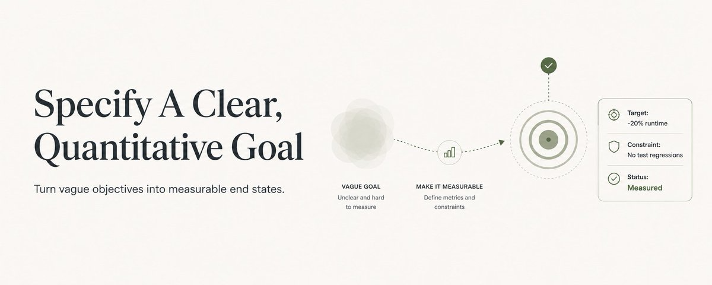
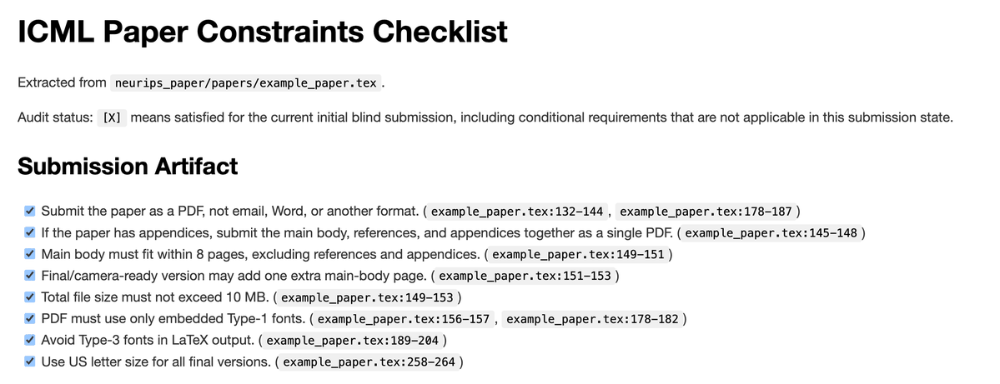
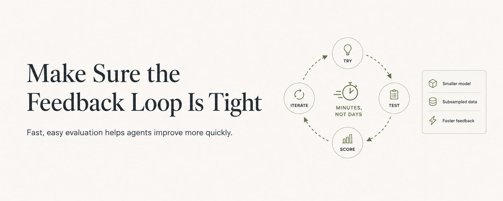
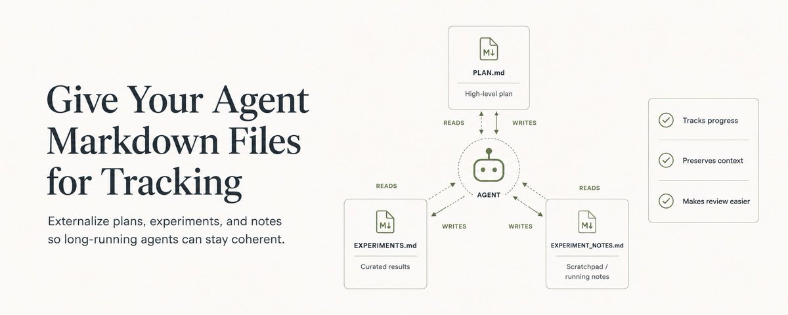
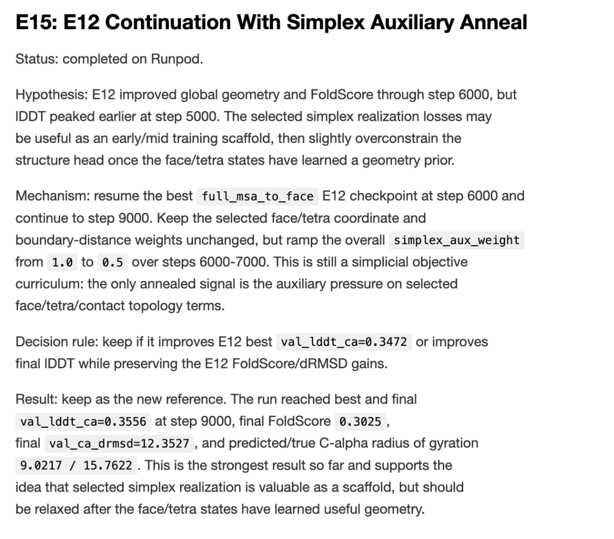

# Using Codex Goals Effectively

Source: https://www.linkedin.com/pulse/using-codex-goals-effectively-chris-hayduk-np7re
Saved: 2026-05-15

## Metadata

- Source URL: https://www.linkedin.com/pulse/using-codex-goals-effectively-chris-hayduk-np7re
- Original shared URL: https://www.linkedin.com/pulse/using-codex-goals-effectively-chris-hayduk-np7re?[REDACTED_QUERY]
- Author: Chris Hayduk
- Author URL: https://www.linkedin.com/in/chrishayduk
- Source published date: May 11, 2026
- Source language: en
- Extraction method: linkedin_pulse_ssr_manual
- Extraction note: LinkedIn Pulse SSR HTML exposed the main article body through `article-content-blocks`; navigation, recommendations, sign-in/join prompts, and unrelated cards were excluded.
- Source description: Perceptive Codex users have noticed that the /goal command is now available in the Codex app - just start your prompt with /goal, and specify what you want your agent to do. This will trigger Codex to loop continuously until it achieves your goal.
- Cover image: `figures/figure-01-linkedin-pulse-cover.png`
- Cover image URL: https://media.licdn.com/dms/image/v2/D4E12AQFcOBkhsu001w/article-cover_image-shrink_720_1280/B4EZ4ZKCd5JsAI-/0/1778538528768?[REDACTED_QUERY]

## Original Article

Perceptive Codex users have noticed that the /goal command is now available in the Codex app - just start your prompt with /goal, and specify what you want your agent to do.

This will trigger Codex to loop continuously until it achieves your goal. But in order for the agent to do this effectively, we need to think about prompting the model in slightly different ways than you may be used to.

In this article, I'll lay out some tips I've picked up from using goal mode both internally at OpenAI and in my side projects to get the most out of Codex.

## Specify A Clear, Quantitative Goal

Models have gotten so good over the past ~6 months that many of us have gotten lazy as prompters in our everyday workflows. We can vaguely gesture at what we want GPT-5.5 to build, and it's pretty good at figuring out what it should be doing and how to get there.

This prompting style, however, is a major failure mode I've seen when using goal mode.

Goal mode is at its core a loop - the agent executes some actions, scores those actions, checks if the score satisfies the goal, and then continues if it has not (or terminates if it has).

The core piece is step 3 - checking if the score satisfies the goal. With a vague, qualitative goal (e.g., "make my code better"), the loop's end state is underspecified. How can the agent know when it has achieved its goal and execute the loop? What state of the code is "better", and when is it "better enough" to stop?

I've noticed that with these underspecified goals, the model has two distinct failure modes. In some cases, the model will give up early, working for only a few minutes before giving up. In other cases, the model will never stop working, making changes that flail about blindly as it tries to satisfy an unsatisfiable target.

A better goal than "make my code better" would be something like "reduce the runtime of the code contained in *specific_file* by 20% without causing any regressions in existing unit tests and integration tests."

The agent now has a clear and quantitative goal (20% runtime reduction on code in a specific file) as well as clear constraints (no unit or integration test regressions).

Note that the model itself can sometimes do scoring if it is still clear and quantitative! For example, I set up goal mode to convert a NeurIPS paper preprint to an ICML workshop paper. ICML has a huge list of formatting constraints saved in a LaTeX file, making them not very accessible to grade against. To resolve this, I had Codex extract these rules into a markdown file that includes a checklist of over 200 formatting and stylistic rules. Here's an excerpt of what this checklist looked like.

Codex's goal was then to "change the NeurIPS paper to ICML format based on the provided checklist.md without changing any of the technical content of the paper."

By providing a checklist, we turn a qualitative goal into a quantitative one. Codex just needs to think "I have completed the goal when I have checked off all 200 out of 200 rules". Even though each rule itself might be vague, Codex is able to reason about when each rule is complete better than it is able to reason about the goal itself being vague.

I also provided the instruction to check off items in the checklist as they were completed so that the model could persist its status to the filesystem (and so that I could keep tabs on its progress visually).

## Make Sure the Feedback Loop Is Tight

In order for your agent to evaluate its actions against your goal, it will need some mechanism by which to test its changes.

The faster you can run this test (and the easier you make it for the model to execute), the faster your model will get feedback on its progress towards the goal.

For example, if you set up your agent to improve the architecture of a machine learning algorithm, it can be helpful to have it operate on a smaller model size and a subsampled dataset than would be used for a full training run. This will allow the model to test out ideas much more rapidly than if it needed to use the production training setup.

Find any way you can to speed up this feedback loop without compromising the quality of the score that the model receives.

In my case of searching for improved protein structure model architectures, I used [NanoFold](https://huggingface.co/datasets/ChrisHayduk/nanofold-public), a small but well-sampled dataset to run my experiments. This reduced the scoring runtime from days for a full training set run to just minutes.

## Give Your Agent Markdown Files for Tracking

With goal mode, you can get GPT-5.5 to run continuously for multiple days at a time. Even with the great compaction capabilities built into Codex, it is really hard for the model to maintain a coherent thread over such a long timescale.

Rather than force the model to maintain all of this relevant context in memory, it can be helpful to expose markdown files for it write to in order to keep track of what it's doing.

I generally give my agent access to three markdown files within goal mode:

- **PLAN.md** - captures the high-level plan that the agent intends to follow as it moves towards the goal. You can seed this with initial ideas you have as to the direction it should follow.
- **EXPERIMENTS.md** - where the agent tracks the details around each experiment it runs (this is specific to machine learning, but you can repurpose this type of file for many different tasks). This typically looks a clean, curated list of experiments with a title, brief description of what was tried, and the result of that attempt.
- **EXPERIMENT_NOTES.md** - this is the agent's scratchpad. It's a chronologically-ordered list of its real-time thoughts as it executes different actions. This file is great to have so that you can audit the agent's thought process and see if you need to nudge it back in another direction.

I tend to think EXPERIMENTS.md is the most important of the three, as it lets both you and the agent review its previous attempts at achieving the goal and why they did/didn't work. Here's an excerpt from my agent's EXPERIMENTS.md to get an idea of what this looks like in practice:

And that's it! That's the whole playbook.

Set up a clear, measurable goal, keep the feedback loop tight, and give the agent markdown files to think in. With those three pieces in place, Codex will happily grind for hours (or even days) on your hardest problems.

Now go run some loops!

## Capture notes

- The public SSR page appears to expose the complete Pulse article body.
- LinkedIn reactions/comments were not treated as part of the article body.
- LinkedIn media URL query tokens are redacted in human-readable archive files as `[REDACTED_QUERY]`.
- Inline article images were downloaded because they carry examples/screenshots supporting the workflow advice.
