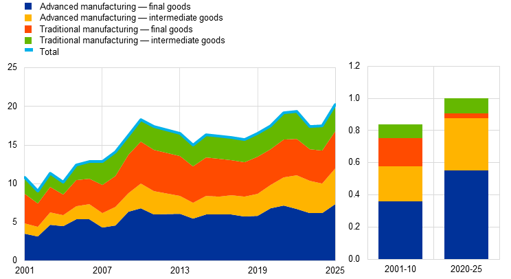
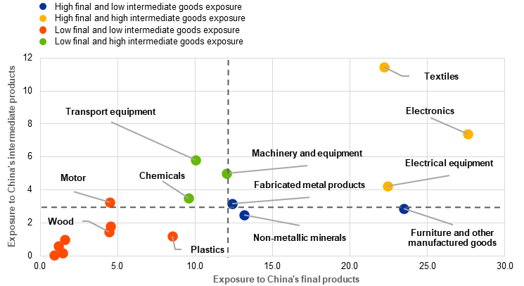
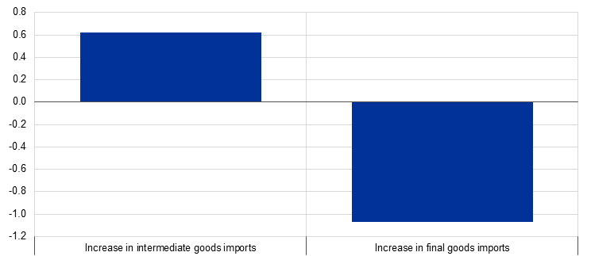
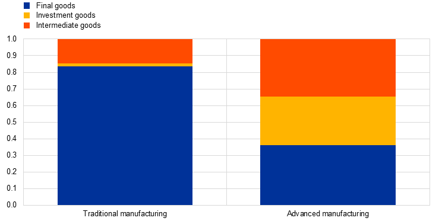
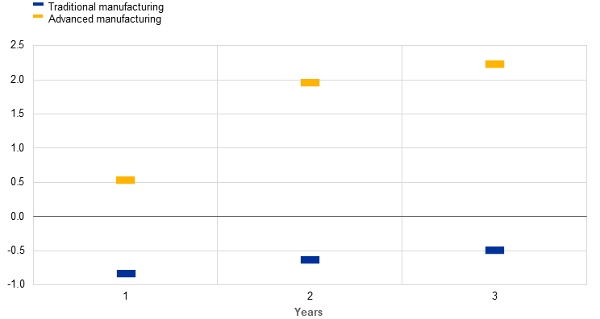
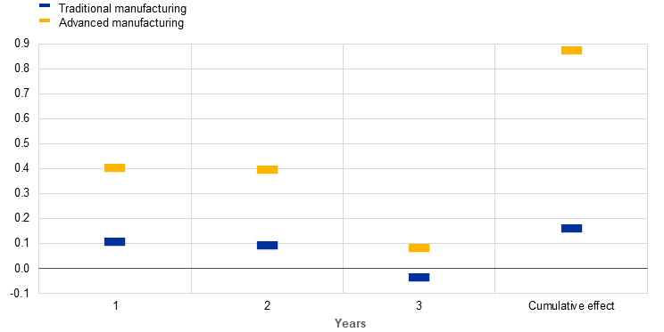
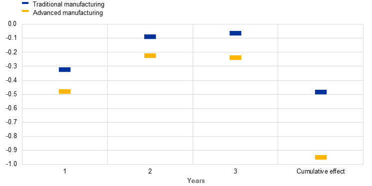

# The impact of China’s industrial rise on the euro area

## Source metadata

- Source: European Central Bank - Economic Bulletin Focus
- Source URL: https://www.ecb.europa.eu/press/economic-bulletin/focus/2026/html/ecb.ebbox202603_02~7df7facd9a.en.html
- Canonical URL: https://www.ecb.europa.eu/press/economic-bulletin/focus/2026/html/ecb.ebbox202603_02~7df7facd9a.en.html
- Authors: Alessandra Amicucci, Nicolò Gnocato, Vanessa Gunnella, Clara Lindemann, Alfonso Merendino and Carlos Montes-Galdón
- Published: 2026-05-12
- Bulletin issue: ECB Economic Bulletin, Issue 3/2026
- Archived: 2026-05-16
- Source language: en
- Extraction method: `direct_html_lxml_ecb_economic_bulletin_main_section`
- Quality status: `good`
- Notes: Direct HTML fetch exposed the complete article in the main Economic Bulletin section. Navigation, language selector, cookie prompts, feedback widgets, and unrelated ECB site chrome were excluded. ECB chart images were downloaded locally under `figures/` and captions/source notes were preserved.

## Article body

Prepared by Alessandra Amicucci, Nicolò Gnocato, Vanessa Gunnella, Clara Lindemann, Alfonso Merendino and Carlos Montes-Galdón

Published as part of the [ECB Economic Bulletin, Issue 3/2026](https://www.ecb.europa.eu/press/economic-bulletin/html/eb202603.en.html).

**China’s industrial rise is a key external force influencing euro area trade, production and prices by reducing costs and increasing competitive pressures for euro area producers.** The recent expansion of exports from China reflects productivity gains and technological advances that are strengthening the role of China in higher-value manufacturing, although other factors, such as lower Chinese demand for imports, are also at play.[1] For euro area producers, import penetration by Chinese competitors can exert expansionary effects through lower input costs and prices, but can also displace production through stronger competition.

**The expanding presence of Chinese firms poses significant competitiveness challenges for the euro area that are increasingly visible in its economic performance, both domestically and abroad.** Euro area producers have been losing market shares where they face competition from China, particularly since 2020. China’s import penetration has increased considerably in the European market – especially in medium and high-tech industries – putting pressure on European producers.

**The current challenges differ somewhat from those experienced during the first “China shock” in the early 2000s.**[2] Compared with the early 2000s, euro area imports from China have recently recorded stronger growth in advanced manufacturing sectors (such as the electronics and automotive sectors) than in traditional manufacturing sectors (such as the textile and furniture sectors). Additionally, the composition of imports from China has shifted towards intermediate products (Chart A). Furthermore, unlike in the 2000s, the recent increase in Chinese exports to the euro area has not been matched by an increase in euro area exports to China, as Chinese imports from the euro area have declined since 2021.

### Chart A

Caption/source/notes: Chart A - China’s shares of euro area imports in terms of technological content and use. Left-hand scale: percentages; right-hand scale: average annual growth rates in the respective time period. Sources: Trade Data Monitor and ECB staff calculations. Notes: Import market shares are expressed in value terms for goods only. Trade Data Monitor data are used to calculate sector weights. The latest observations are for November 2025.

**In recent years changes in the import penetration of intermediate and final goods from China have differed substantially across sectors, suggesting that the impact on production will vary across sectors.** While sectors such as furniture and metal products are mainly affected through final goods competition (Chart B, blue dots), other sectors such as electronics face both large cost reductions and intense product market competition (yellow dots).

### Chart B

Caption/source/notes: Chart B - Sectoral exposures to China. Percentages. Sources: Trade Data Monitor and ECB staff calculations. Note: Exposures are expressed as yearly average changes in China’s import shares in each sector of the euro area economy in the period 2001-22.

**Econometric analysis highlights a clear asymmetry between an input cost channel and a competition channel for import penetration from China.** Using a country-sector panel for 2000-22, we relate changes in China’s sectoral import shares to industrial production growth in the EU, distinguishing between imports of final goods and imports of intermediate goods.[3] Chart C translates the estimation coefficients into effects on production. The results show that, for sectors that recorded an average annual increase in imports, increased exposure to imports of intermediate goods from China was linked to a 0.6 percentage point boost in industrial production growth. In contrast, an average annual increase in imports of final goods was associated with a drag on production of about 1 percentage point.

### Chart C

Caption/source/notes: Chart C - The impact of exposure to Chinese imports on EU sectoral industrial production growth. Percentage point change. Sources: Trade Data Monitor, TiVA (2025 release) and ECB staff calculations. Note: The chart shows production growth in response to the average annual increase in China’s import share in 2000-22.

**To understand the aggregate impact of productivity gains in China on the EU, we employ a multi-country, multi-sector dynamic stochastic general equilibrium (DSGE) model that includes trade linkages and global production networks.**[4] Model-based simulations capture the rise in competitive pressure from China via separate sector-specific productivity shocks – in China’s traditional and advanced manufacturing sectors – that endogenously reduce Chinese marginal costs and export prices. A salient difference between the two sectors is that traditional manufacturing products imported from China are mostly final goods, while imports of advanced manufacturing products are used more intensively as intermediate inputs (Chart D, panel a).

### Chart D

Caption/source/notes: Chart D - Simulated effects of a persistent increase in Chinese productivity on EU sectoral production. Panel a: composition of EU imports from China, steady-state percentages. Panel b: EU sectoral production, percentage deviations from steady state. Source: ECB staff calculations using a multi-country DSGE model that includes global production networks and trade linkages, based on Gnocato et al. (2025). Notes: In panel a, bars show calibrated steady-state shares. In panel b, shocks are scaled to cause the same increase in imports of Chinese traditional and advanced manufacturing products by year two, an increase of 10 percentage points relative to total imports from China in the steady state.

**Positive productivity shocks in China support EU GDP through income effects and cheaper imported inputs – although the impact differs across sectors.** From the EU perspective, the primary effect of shocks in China’s traditional manufacturing sector or in its advanced manufacturing sector is a relative reduction in the prices of imports from the affected sector and a rise in imports from China. The impact on EU production differs across sectors, depending on how imported goods are used. When imports are mainly intermediate goods (as in the advanced manufacturing sector), these help to reduce costs and support domestic production. When imports are mainly final goods (as in the traditional manufacturing sector), European consumers easily switch their consumption to relatively cheaper Chinese imports and, hence, EU producers face heightened competition and a drop in demand for their goods that dampens EU sectoral production (Chart D, panel b). However, the availability of cheaper imported goods allows households to spend more, thereby raising aggregate demand, which ultimately benefits EU GDP (Chart E, panel b).

### Chart E

Caption/source/notes: Chart E - Simulated effects of a persistent increase in Chinese productivity on EU GDP and inflation. Panel a: EU GDP, year-on-year percentage changes. Panel b: EU inflation, year-on-year percentage point changes. Source: ECB staff calculations using a multi-country DSGE model that includes global production networks and trade linkages, based on Gnocato et al. (2025). Note: Shocks are scaled to cause the same increase in imports of Chinese traditional manufacturing products and advanced manufacturing products by year two, an increase of 10 percentage points relative to total imports from China in the steady state.

**Cheaper Chinese goods exert disinflationary pressure in the EU through different channels across sectors.** Following shocks in China’s traditional manufacturing sector or in its advanced manufacturing sector, imports of relatively cheaper Chinese goods exert substantial disinflationary pressure on the EU (Chart E, panel b). The disinflationary pressure is larger when the shock affects the Chinese advanced manufacturing sector, and the impact is mainly indirect, owing to cost-pull effects via production linkages. In the case of a shock affecting China’s traditional manufacturing sector, imports enter more directly into the consumption basket of European households, and the disinflationary impact stems relatively more from the direct impact of lower Chinese import prices.

**An improvement in China’s competitiveness in global markets stemming from production subsidies would result in similar effects on the EU economy.** We consider an alternative scenario in which production subsidies in China are the underlying driver of increased competitiveness of Chinese firms in global markets, rather than productivity shocks. We introduce sectoral production subsidies that reduce mark-ups and lower producer prices. While the driver of China’s competitiveness is different, the implications for Europe’s economy are broadly similar. Once again, cheaper imports of advanced manufacturing products are beneficial for advanced manufacturing production in the EU and for EU GDP overall. In the EU’s traditional manufacturing sector, production still declines while GDP gains are somewhat muted, as income effects do not fully offset production losses.

**Looking beyond the model-based analysis, the broader assessment of the effects of China’s industrial rise on the euro area is more nuanced.** While China’s recent industrial rise may induce favourable short-term aggregate effects on the EU economy, it has coincided with weak import demand in China and a loss of market shares for EU exporters. Moreover, the positive effects on EU GDP reflect short-run channels but do not take account of longer-run risks, such as potential scarring effects from production displacement, or structural risks and strategic vulnerabilities.

## References

Al-Haschimi, A., Dvořáková, N., Le Roux, J. and Spital, T. (2025), “[China’s growing trade surplus: why exports are surging as imports stall](https://www.ecb.europa.eu/press/economic-bulletin/focus/2025/html/ecb.ebbox202507_01~83b0e7edd4.en.html)”, *Economic Bulletin*, Issue 7, ECB.

Autor, D., Dorn, D. and Hanson, G. (2013), “The China Syndrome: Local Labor Market Effects of Import Competition in the United States”, *American Economic Review*, Vol. 103(6), pp. 2121-2168.

Autor, D., Dorn, D. and Hanson, G. (2021), “On the persistence of the China shock”, *National Bureau of Economic Research*, No w29401.

Friesenbichler, K.S., Kügler, A. and Reinstaller, A. (2023), “The impact of import competition from China on firm-level productivity growth in the European Union”, *Oxford Bulletin of Economics and Statistics*, Vol. 86(2), pp.236-256.

Gnocato, N., Montes-Galdón, C. and Stamato, G. (2025), “[Tariffs across the supply chain](https://www.ecb.europa.eu/pub/pdf/scpwps/ecb.wp3081~184b13924e.en.pdf)”, *Working Paper Series*, No 3081, ECB.

## Footnotes

1. See Al-Haschimi et al. (2025), “[China’s growing trade surplus: why exports are surging as imports stall](https://www.ecb.europa.eu/press/economic-bulletin/focus/2025/html/ecb.ebbox202507_01~83b0e7edd4.en.html)”.
2. We define the first China shock as the period 2001-10, in line with the literature which links this decade with rapid Chinese import growth (Autor et al., 2021).
3. The dependent variable is annual industrial production growth at the country-sector level. Exposures are shown as year-on-year changes in China’s import share for intermediate and final goods. To address endogeneity, we use a Bartik-style shift-share instrument based on sectoral baseline import weights and changes in China’s exports to other advanced economies, following Friesenbichler et al. (2023) and Autor et al. (2013). Regressions include country-sector and country-time fixed effects, as well as sector-specific trends, with identification based on differences in sectoral exposure to China within a specific country and year.
4. The model is a four-region extension (in which the regions comprise the EU, United States, China and the rest of the world) of Gnocato et al. (2025).
