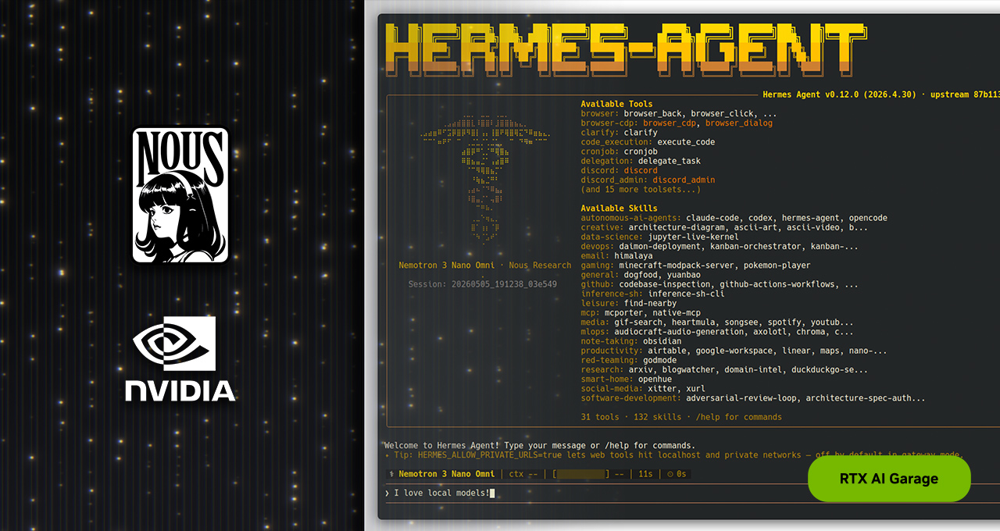

# 헤르메스, NVIDIA RTX PC와 DGX Spark 기반 자체 개선형 AI 에이전트 지원

> 신뢰성과 자체 개선 기능을 갖춘 최신 에이전틱 거대 언어 모델(LLM)로 구동되는 헤르메스는 NVIDIA RTX PC와 워크스테이션에 새로운 유형의 에이전트를 제공합니다.

## Source metadata

- Source: NVIDIA Blog Korea
- Source URL: https://blogs.nvidia.co.kr/blog/rtx-ai-garage-hermes-agent-dgx-spark/
- Shared URL: https://share.google/iwBPa5DcSHXIW434W
- Author: NVIDIA Korea
- Published: 2026-05-15T07:37:48+00:00
- Modified: 2026-05-15T07:45:14+00:00
- Captured: 2026-05-16
- Source language: ko
- Extraction method: `direct_html_lxml_nvidia_blog_entry_content`
- Quality status: `good`
- Notes: Direct HTML fetch exposed the complete article body in `.entry-content`. Navigation, related posts, category/tag footer, scripts, and unrelated thumbnails were excluded. Inline article links were preserved.

## Lead image

Remote original: https://blogs.nvidia.co.kr/wp-content/uploads/sites/16/2026/05/rtx-ai-garage-hermes.jpeg

## Article body

에이전틱 AI는 사용자의 업무 수행 방식을 변화시키고 있습니다. [오픈클로(OpenClaw)](https://www.nvidia.com/en-us/ai/build-a-claw/)의 성공 이후, 커뮤니티는 새로운 오픈소스 에이전틱 프레임워크를 적극적으로 수용하고 있는데요. 그 최신 사례인 [헤르메스 에이전트(Hermes Agent)](https://github.com/nousresearch/hermes-agent)는 3개월도 채 되지 않아 [깃허브(GitHub) 스타 14만 개](https://github.com/nousresearch/hermes-agent)를 돌파했고, [오픈라우터(OpenRouter)](https://openrouter.ai/apps)에 따르면 지난주 기준 전 세계에서 가장 많이 사용되는 에이전트로 꼽혔습니다.

누스 리서치가 개발한 헤르메스는 신뢰성과 자체 개선 기능을 중점으로 설계됐습니다. 이는 기존 에이전트에서 구현하기 어려웠던 두 가지 특성인데요. 헤르메스는 특정 공급업체나 모델에 종속되지 않도록 설계됐으며, 상시 가동되는 로컬 환경에서의 사용에 최적화돼 있습니다. 이에 따라 [NVIDIA RTX PC](https://www.nvidia.com/ko-kr/ai-on-rtx/), [NVIDIA RTX PRO 워크스테이션](https://www.nvidia.com/ko-kr/products/workstations/), [NVIDIA DGX Spark](https://www.nvidia.com/ko-kr/products/workstations/dgx-spark/)는 헤르메스를 24시간 최대 속도로 구동하기에 이상적인 하드웨어입니다.

알리바바(Alibaba)의 새로운 고성능 오픈 웨이트 거대 언어 모델(large language models, LLM) 시리즈인 큐웬 3.6(Qwen 3.6)은 헤르메스와 같은 로컬 에이전트 구동에 최적화돼 있는데요. 큐웬 3.6의 27B와 35B 파라미터 모델은 이전 세대의 120B, 400B 파라미터 모델보다 뛰어난 성능을 제공하며, NVIDIA RTX와 DGX Spark에서 실행돼 에이전틱 AI를 가속화합니다.

## 헤르메스: 가속화된 로컬 AI 에이전트 기능

헤르메스는 다른 인기 있는 에이전트와 마찬가지로 메시징 앱과 연동되고, 로컬 파일과 애플리케이션에 접근할 수 있으며, 24시간 상시 실행됩니다. 그러나 헤르메스는 다음 네 가지 뛰어난 기능으로 차별화됩니다.

- **자체 진화 기술:** 헤르메스는 자체적으로 스킬을 작성하고 개선합니다. 에이전트가 복잡한 작업을 수행하거나 피드백을 받을 때마다, 학습한 내용을 스킬 형태로 저장해 시간이 지날수록 스스로 적응하고 개선할 수 있습니다.
- **독립형 서브 에이전트:** 헤르메스는 서브 에이전트를 특정 하위 작업에 전념하는 단기 격리 작업자로 다룹니다. 각 서브 에이전트는 집중된 컨텍스트와 도구 세트를 갖추고 있어 작업 구성을 체계적으로 유지하고 에이전트의 혼란을 최소화합니다. 또한 헤르메스가 더 작은 컨텍스트 윈도우에서도 실행될 수 있도록 해 로컬 모델에 이상적입니다.
- **설계 단계부터 고려된 안정성:** 누스 리서치는 헤르메스에 포함된 모든 기술, 도구, 플러그인을 검증하고 스트레스 테스트를 실시합니다. 그 결과 헤르메스는 대부분의 다른 에이전트 프레임워크에서 요구되는 지속적인 디버깅 없이도 300억 파라미터급 로컬 모델 환경에서도 안정적으로 작동합니다.
- **동일 모델, 더 뛰어난 성능:** 여러 프레임워크에서 동일한 모델을 사용한 개발자 비교 테스트 결과, 헤르메스에서 일관적으로 더 우수한 성능을 보이는 것으로 나타났습니다. 이러한 차별점은 프레임워크에 있는데요. 헤르메스는 단순한 얇은 래퍼(wrapper)가 아닌 능동형 오케스트레이션 계층으로, 작업 단위의 실행 대신 지속적인 온디바이스 에이전트를 구현합니다.

헤르메스 에이전트와 이를 구동하는 LLM은 모두 로컬에서 실행되도록 설계됐습니다. 이는 하드웨어의 품질이 사용자 경험의 품질을 직접 결정한다는 의미입니다. NVIDIA RTX GPU는 이러한 워크로드에 최적화되도록 설계됐습니다.

## 큐웬 3.6: 로컬 환경에서 구현하는 데이터센터급 인텔리전스

최신 큐웬 3.6 모델은 호평을 받은 큐웬 3.5 시리즈를 기반으로 개발됐으며, 로컬 AI 에이전트의 성능을 한 단계 더 끌어올렸습니다. 새롭게 공개된 큐웬 3.6 35B 모델은 약 20GB의 메모리만으로 실행되면서도 70GB 이상의 메모리가 필요한 1,200억 파라미터 모델을 능가합니다.

또한 큐웬 3.6 27B는 더 많은 활성 파라미터(active parameters)를 갖춘 새로운 고밀도 모델입니다. 큐웬 3.5 397B와 같은 4,000억 파라미터 모델급의 정확도를 제공하면서도 크기는 16분의 1 수준에 불과하죠. 고성능 RTX GPU에서 실행하면 모델이 빠른 사용 경험에 필요한 컴퓨팅 성능을 확보할 수 있습니다.

이러한 모델은 헤르메스와 같은 로컬 에이전트에 최적화돼 있으며, NVIDIA GPU와 DGX Spark는 이를 가장 빠르게 실행할 수 있는 방법입니다. [NVIDIA Tensor 코어](https://www.nvidia.com/ko-kr/data-center/tensor-cores/)는 AI 추론 성능을 가속화해 더 높은 처리량과 낮은 지연 시간을 제공합니다. 이를 통해 헤르메스는 다단계 작업을 수행하거나 자체 스킬 중 하나를 개선하는 작업을 몇 분이 아닌 단 몇 초 만에 완료할 수 있죠.

## DGX Spark: 상시 실행되는 에이전틱 컴퓨터

헤르메스와 같은 에이전트는 요청 응답, 다단계 작업 계획, 자율 실행, 자체 개선 등을 지속적으로 수행하도록 설계됐습니다. NVIDIA DGX Spark는 하루 종일 지속되는 에이전틱 워크플로우를 위해 설계된 콤팩트하고 효율적인 독립형 시스템으로, 이러한 에이전트에 이상적인 솔루션입니다.

NVIDIA DGX Spark는 128GB 통합 메모리와 1페타플롭급 AI 성능을 갖춰 1,200억 파라미터 규모의 전문가형 혼합(Mixture-of-Experts, MoE) 모델을 상시 실행할 수 있는데요. 또한 새로운 큐웬 3.6 35B 모델은 더 작은 공간에서 동등한 수준의 인텔리전스를 제공하며, 더 빠른 실행 속도와 함께 사용자가 동시 워크로드를 처리할 수 있도록 지원합니다.

사용자는 최적의 성능과 사용 편의성을 위해 [헤르메스 DGX Spark 플레이북](https://www.build.nvidia.com/spark)을 참고할 수 있습니다. 또한 NVIDIA Build It Yourself 에이전틱 AI 시리즈에서 진행되는 [실습 세션에 등록](https://www.nvidia.com/en-us/events/build-it-yourself-agentic-ai/)해 NemoClaw와 OpenShell 기반 자율형 AI 에이전트 구축 방법을 확인할 수 있다.

NVIDIA DGX Spark는 NVIDIA 제조 파트너사를 통해 구입할 수 있습니다. [Marketplace](https://marketplace.nvidia.com/en-us/enterprise/personal-ai-supercomputers/?superchip=GB10&page=1&limit=15)에서 자세한 내용을 확인해 보세요.

## NVIDIA 하드웨어에서 헤르메스 시작하기

NVIDIA 하드웨어에서 헤르메스를 로컬로 실행하는 방법은 매우 간단합니다.

시작하려면 [헤르메스 깃허브 저장소(repository)](https://github.com/nousresearch/hermes-agent)에 접속한 뒤, 원하는 로컬 모델, 런타임과 연동하면 되죠. [라마.cpp(llama.cpp)](https://github.com/ggml-org/llama.cpp), [LM 스튜디오(LM Studio)](https://lmstudio.ai/), [올라마(Ollama)](https://ollama.com/)를 통해 큐웬 3.6과 함께 헤르메스를 실행할 수 있습니다. 헤르메스 에이전트는 [LM 스튜디오](https://lmstudio.ai/docs/integrations/hermes)와 [올라마](https://ollama.com/)를 기본으로 지원해 로컬 에이전트를 가장 손쉽게 구축할 수 있는 환경을 제공합니다.

개인용 에이전트의 가능성을 탐색하는 로컬 AI 애호가부터, 워크플로우를 위한 로컬 툴링을 개발하는 개발자까지, NVIDIA 하드웨어 기반 헤르메스는 독보적인 성능과 신뢰성을 갖춘 기반을 제공합니다.

NVIDIA RTX 하드웨어에 최적화된 최신 오픈 모델과 에이전트 관련 업데이트는 RTX AI Garage를 통해 계속 확인해 보세요.

## #ICYMI: RTX AI PC 최신 업데이트

✨ **NVIDIA RTX PRO GPU**는 라마.cpp에서 큐웬 3.6 모델 실행 시 최대 3배 빠른 토큰 생성 속도를 제공합니다. 이를 통해 로컬 AI에 필요한 실시간 응답성을 구현하며, 에이전트가 다단계 작업을 처리하고 자체 스킬을 개선해 끊김 없는 워크플로우를 유지할 수 있도록 지원합니다.

**구글(Google)의 젬마 4(Gemma 4) 26B와 31B 모델이 이제 NVFP4 체크포인트로 제공**돼 NVIDIA Blackwell GPU에서 더 빠른 성능을 발휘합니다. NVFP4 체크포인트를 구글의 새로운 멀티 토큰 프리딕션(Multi-Token Prediction) 드래프터와 결합해 동일한 출력 품질에서 최대 3배 더 빠른 추론 속도를 제공합니다. 이를 통해 NVIDIA GPU에서 최첨단 수준의 추론 작업을 로컬로 실행할 수 있습니다.

4월에 출시된 **미스트랄 미디엄(Mistral Medium) 버전 3.5**는 라마.cpp와 올라마의 호환성 업데이트가 포함돼, 사용자가 NVIDIA RTX PRO와 DGX Spark 시스템에서 실행할 수 있습니다.

🦞 **최근 공개된 NVIDIA NemoClaw**는 보안성을 강화하고 로컬 모델을 지원함으로써 NVIDIA 장치에서 오픈클로 환경을 최적화하는 오픈소스 스택입니다. NemoClaw는 WSL2(Windows Subsystem for Linux)를 지원해 마이크로소프트(Microsoft) 플랫폼의 애호가와 개발자들에게도 혜택을 제공하죠. [단계별 플레이북](https://build.nvidia.com/spark/nemoclaw)으로 DGX Spark에서 NemoClaw를 실행하는 방법을 확인할 수 있습니다.

[페이스북(Facebook)](https://www.facebook.com/NVIDIA.AI.PC/), [인스타그램(Instagram)](https://www.instagram.com/nvidia.ai.pc/), [틱톡(TikTok)](https://www.tiktok.com/@nvidia_ai_pc), [X](https://x.com/NVIDIA_AI_PC)에서 NVIDIA AI PC를 만나보고, [RTX AI Garage 뉴스레터](https://www.nvidia.com/ko-kr/ai-on-rtx/?modal=subscribe-ai)를 구독해 최신 소식을 받아보세요.

[링크드인(LinkedIn)](https://www.linkedin.com/showcase/3761136/)과 [X](https://x.com/NVIDIAworkstatn)에서 NVIDIA Workstation을 팔로우하세요.

소프트웨어 제품 정보 [약관](https://www.nvidia.com/ko-kr/about-nvidia/terms-of-service/)을 확인하세요.
