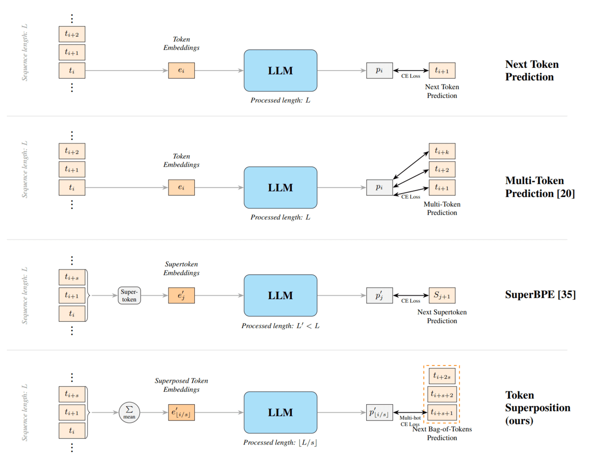
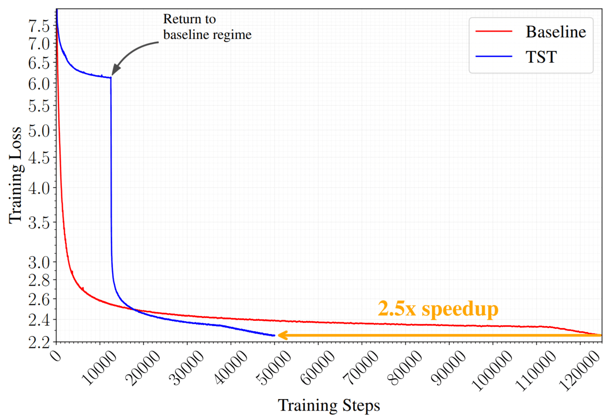
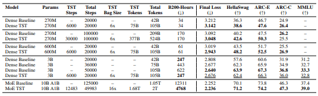

# 누스 리서치, ‘토큰 중첩 학습’으로 사전훈련 시간 2.5배 단축

## Source metadata
- Source: AI타임스
- Source URL: https://www.aitimes.com/news/articleView.html?idxno=210584
- Shared URL: https://share.google/uz8HGwBB1bn3W6LUr
- Author: 박찬 기자
- Published: 2026-05-17T16:55:00+09:00
- Section: AI산업
- Archived: 2026-05-18
- Source language: ko
- Extraction method: direct_html_lxml_aitimes_article_view_content
- Quality status: good

## Preservation notes
- `share.google` 링크를 직접 해석해 AI타임스 canonical 기사로 이동했다.
- 본문은 `#article-view-content-div`에서 추출했고, 내비게이션, 공유 버튼, 오디오 TTS 위젯, 광고, 추천 기사, 스크립트, 푸터는 제외했다.
- 기사 이미지 3개를 `figures/`에 로컬 복구했다. 원 출처는 arXiv 논문 그림으로 표시되어 있다.
- 원 논문 확인용 arXiv abstract, PDF, 추출 텍스트는 `source/arxiv-2605.06546.*`에 보존했다.

## Original article body

> figure-01. 토큰 중첩(Token Superposition)과 유사 기법과의 비교 (사진=arXiv)

대형언어모델(LLM) 개발 비용이 급증하는 가운데, 미국 AI 연구조직 누스 리서치가 모델 구조를 바꾸지 않고도 사전학습(pre-training) 시간을 대폭 줄일 수 있는 새로운 학습 기법을 공개했다. 동일한 연산 자원에서 더 빠르게 데이터를 처리해 학습 효율을 극대화하는 방식으로, 최신 AI 업계의 핵심 과제인 '학습 비용 절감'에 새로운 해법이 될 수 있다는 평가가 나온다.

누스 리서치는 최근 동일한 연산 자원에서 더 빠르게 데이터를 처리해 학습 효율을 극대화하는 ‘[토큰 중첩 학습(TST·Token Superposition Training)](https://arxiv.org/pdf/2605.06546)’ 기법을 온라인 아카이브를 통해 공개했다.

TST는 기존 AI 모델 구조나 학습 방식은 그대로 유지하면서, 학습 효율만 높일 수 있는 기술이다. 즉 모델 아키텍처, 옵티마이저, 토크나이저, 병렬 처리 방식, 학습 데이터 등을 바꾸지 않고 바로 적용할 수 있는 ‘드롭인(drop-in)’ 방식이라는 점이 특징이다.

핵심은 여러 토큰을 한꺼번에 묶어서 처리하는 방식이다. 기존 AI 모델은 토큰을 하나씩 차례대로 학습했지만, TST는 초기 학습 단계에서 여러 토큰을 하나의 큰 묶음처럼 압축해 학습한다. 덕분에 같은 컴퓨팅 자원으로도 더 많은 텍스트를 더 빠르게 학습할 수 있다.

TST는 2단계로 학습이 진행된다. 먼저 ‘중첩 단계(superposition phase)’에서는 여러 토큰을 하나로 묶어 압축한 뒤 학습시켜, AI가 더 많은 문장을 빠르게 읽도록 만든다. 이후 ‘복구 단계(recovery phase)’에서는 다시 기존 방식처럼 다음 단어를 하나씩 예측하며 학습해, 모델 성능을 세밀하게 다듬는다.

연구진은 여러 토큰을 묶어 처리하더라도 전체 연산량(FLOPs)은 기존과 같도록 입력 길이를 조정했다고 설명했다. 또 출력 단계에서는 토큰 하나가 아니라 다음 토큰 묶음을 한꺼번에 예측하는 방식을 사용했다.

이를 위해 ‘멀티핫 크로스엔트로피(MCE)’라는 학습 방식을 적용했는데, 기존 AI 학습 시스템을 그대로 활용할 수 있어 별도의 모델 구조 변경이나 특수 하드웨어가 필요 없다는 점도 특징이다.

> figure-02. 동일한 연산량(FLOPs) 조건에서 진행된 두 개의 큐원3 기반 10B-A1B MoE 모델의 사전학습 손실(loss) 곡선 (사진=arXiv)

누스 리서치는 2억7000만(270M), 6억(600M), 30억(3B) 파라미터 모델과 100억(10B)-A1B 전문가 혼합(MoE) 모델까지 다양한 규모에서 TST를 검증했다.

특히 10B-A1B 모델 실험에서는 기존 대비 약 2.5배 빠른 사전학습 속도를 기록했다.

> figure-03. 표준 학습 방식(베이스라인)과 비교했을 때, 다양한 설정 환경에서 나타난 TST의 성능 및 효율 개선 효과 (사진=arXiv)

연구 결과에 따르면 기존 방식은 1만2311 B200 GPU-시간이 필요했지만, TST는 4768 GPU-시간만으로 더 낮은 최종 손실(loss)을 달성했다. 동일 연산량 기준으로도 성능이 더 우수했으며, HellaSwag이나 ARC, MMLU 같은 주요 벤치마크 점수에서도 기존 모델을 앞섰다.

예를 들어 10B-A1B 실험에서 TST 모델은 최종 손실값 2.236을 기록해 기존 기준 모델(2.252)보다 낮은 값을 달성했고, ARC-Challenge와 MMLU 평가에서도 더 높은 성능을 보였다. 연구진은 “동일 FLOPs 또는 동일 손실 조건에서는 TST가 일관되게 우위를 보였다”고 설명했다.

이번 연구는 최근 AI 업계가 직면한 ‘학습 비용 폭증’ 문제와 맞닿아 있다. 최신 LLM은 수조개 토큰을 학습해야 하며, GPU 사용 비용만 수억달러에 달하는 경우도 많다. 특히 최근 업계가 컴퓨팅 최적화보다 데이터 처리량 자체를 높이는 방향으로 이동하면서, 얼마나 많은 텍스트를 FLOPs당 처리할 수 있는지가 핵심 경쟁력으로 떠오르고 있다.

연구진은 TST가 여러 토큰을 묶어 학습하는 과정에서 AI의 단어 표현 공간(임베딩)을 더 안정적으로 만들어주는 효과가 있을 수 있다고 설명했다. 또 모델이 처음에는 압축된 형태의 거친 데이터를 먼저 익힌 뒤, 이후 세밀한 언어 학습으로 넘어가기 때문에 일종의 ‘예비 사전학습(pre-pretraining)’ 역할도 할 수 있다고 분석했다.

연구진은 TST의 출력 방식이 최근 주목받는 ‘멀티 토큰 예측(MTP)’과 비슷한 개념이라고 설명했다. 다만 TST는 별도의 예측 장치를 추가하지 않아 구조가 훨씬 단순하고 비용도 적게 든다는 점이 차별점이다. 특히 기존 MTP는 작은 AI 모델에서는 오히려 성능이 떨어지는 경우가 있었지만, TST는 소형 모델에서도 안정적으로 성능 향상 효과를 보였다고 강조했다.

다만 TST는 모든 조건에서 무조건 유리한 것은 아니다. 동일 데이터 소비량(equal-data) 기준에서는 기존 방식이 더 높은 성능을 기록했다. TST는 같은 연산량으로 더 많은 데이터를 처리하는 대신 데이터당 연산 자원이 줄어드는 구조이기 때문이다. 연구진 역시 이를 “적용 범위를 결정하는 중요한 경계 조건”이라고 설명했다.

그럼에도 업계에서는 TST가 앞으로 LLM 개발 비용 구조를 바꿀 가능성이 있다는 평가가 나온다. 현재 AI 기업들은 더 큰 모델 경쟁 속에서 GPU 확보와 학습 비용 부담이 급격히 커지고 있으며, 단 몇 퍼센트의 효율 향상만으로도 막대한 비용 절감 효과를 얻을 수 있기 때문이다.

박찬 기자 cpark@aitimes.com
