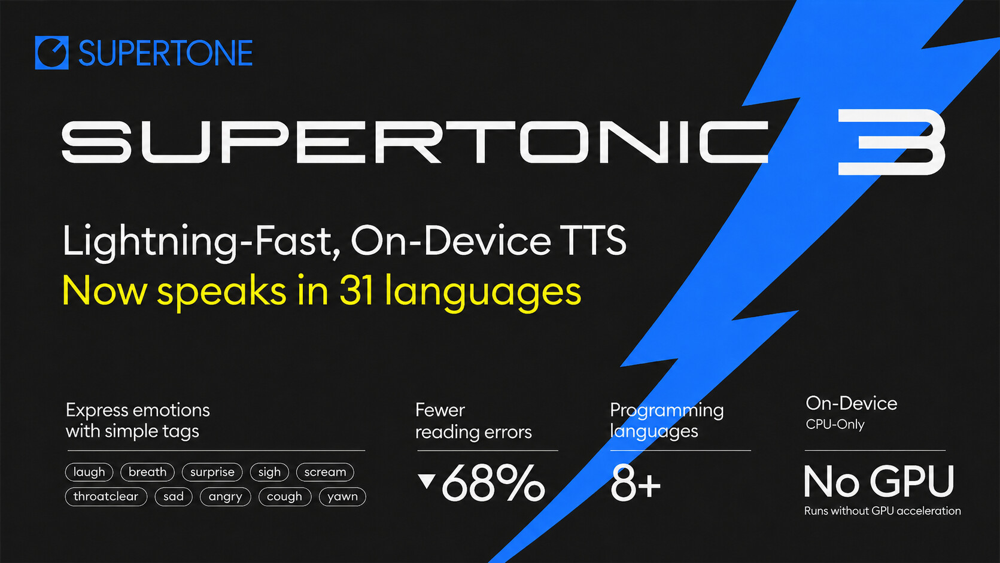
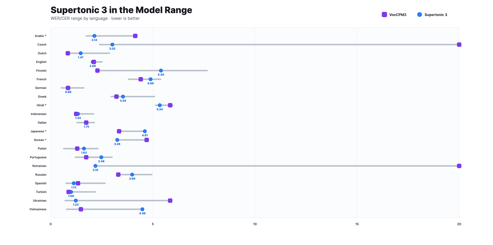
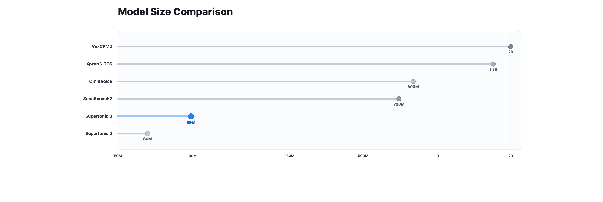
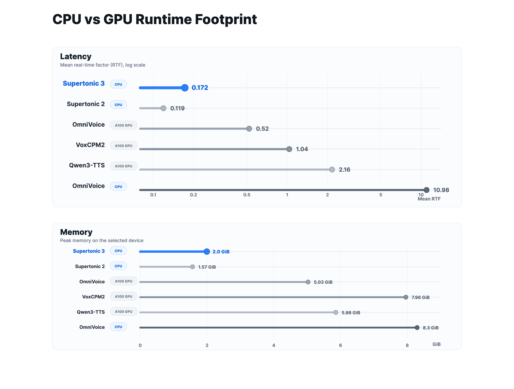

# Supertonic: ONNX 런타임 기반의 초경량 온디바이스 다국어 TTS 시스템 (feat. Supertone AI)

## Source metadata
- Source URL: https://discuss.pytorch.kr/t/supertonic-onnx-tts-feat-supertone-ai/10247
- Shared URL: https://share.google/tg6eiQC3QmmzQbSWa
- Resolved URL: https://discuss.pytorch.kr/t/supertonic-onnx-tts-feat-supertone-ai/10247
- Source platform: PyTorchKR Discourse
- Category: 읽을거리&정보공유
- Author: 9bow
- Published: 2026-05-18T00:30:56.428Z
- Topic ID: 10247
- Post count at capture: 1
- View count at capture: 103
- Tags: on-device, text-to-speech, flow-matching, supertone, multilingual-tts, onnx-runtime, supertonic
- Source language: ko
- Extraction method: discourse_json_cooked_html_manual
- Quality status: good
- Raw HTML snapshot: `source/original.html`
- Discourse topic JSON: `source/pytorchkr-topic.json`
- Cooked post HTML: `source/post-cooked.html`

## Figure assets
- `figures/figure-01-hero.jpeg` - Supertonic 3, ONNX 런타임 기반의 초경량 온디바이스 다국어 TTS 시스템
- `figures/figure-02-wer-cer-comparison.png` - Supertonic 3와 VoxCPM2의 다국어 WER/CER 비교 차트
- `figures/figure-03-parameter-comparison.png` - 다양한 오픈 TTS 모델과 Supertonic 3의 파라미터 규모 비교
- `figures/figure-04-cpu-runtime-memory.png` - Supertonic의 CPU 런타임 및 메모리 풋프린트와 GPU 베이스라인 비교

## Original post

Supertonic 3, ONNX 런타임 기반의 초경량 온디바이스 다국어 TTS 시스템1671×941 227 KB

## Supertonic 소개

**Supertonic**은 대한민국의 AI 스타트업 [Supertone AI](https://www.supertone.ai/)에서 공개한 **온디바이스(On-Device) 텍스트 음성 합성(Text-to-Speech, TTS) 시스템**으로, 외부 API나 클라우드 호출 없이 로컬 장비에서 직접 음성을 생성하도록 설계된 프로젝트입니다. 모든 추론을 ONNX Runtime을 통해 처리하기 때문에 데스크톱, 브라우저, 모바일, 임베디드 기기 등 ONNX가 동작하는 환경이라면 어디서든 동일한 방식으로 음성을 합성할 수 있습니다. 클라우드 TTS 서비스가 일반적으로 가지고 있는 네트워크 지연, 호출 비용, 데이터 외부 전송에 따른 개인정보 우려를 한 번에 줄일 수 있다는 점이 Supertonic의 가장 큰 출발점입니다. 2026년 4월에 공개된 최신 버전인 **Supertonic 3는 31개 언어를 지원**하며, 한국어(`ko`)와 일본어(`ja`)를 포함해 영어, 독일어, 스페인어, 프랑스어, 중국어 계열을 제외한 다양한 유럽·아시아 언어를 함께 다룰 수 있도록 확장되었습니다.

**Supertonic**의 차별점은 단순히 "로컬에서 실행되는 TTS"라는 점에 그치지 않고, 그 작은 크기에 비해 대형 오픈 TTS 시스템과 견줄 만한 **읽기 정확도(WER/CER)와 실용적인 추론 지연을 함께 달성**한다는 데 있습니다. 공개된 ONNX 자산 기준으로 모델 파라미터는 약 99M 규모이며, 동급 카테고리의 0.7B~2B 모델 대비 다운로드 용량과 시작 시간, 메모리 사용량에서 모두 가벼운 편입니다. 또한 v2와 v3가 동일한 공개 ONNX 인터페이스를 유지하기 때문에, 기존 v2 기반 통합을 거의 그대로 두고 모델 자산만 v3로 교체해도 동일한 추론 계약(Inference Contract)이 유지된다는 점이 운영 측면에서 큰 장점입니다.

이 프로젝트의 기술적 토대는 세 편의 논문 시리즈로 정리되어 있습니다:

[**메인 아키텍처를 다룬 SupertonicTTS 논문(arXiv:2503.23108)**](https://arxiv.org/abs/2503.23108)은 음성 오토인코더(Speech Autoencoder), 흐름 정합(Flow-Matching) 기반의 텍스트-잠재 변수 모듈, 그리고 효율 중심의 설계 결정을 설명합니다.

[**텍스트-음성 정렬을 다룬 LARoPE 논문(arXiv:2509.11084)**](https://arxiv.org/abs/2509.11084)은 크로스 어텐션에서 길이 인지(Length-Aware) 위치 임베딩으로 정렬 안정성을 끌어올린 방법을,

마지막으로 [**Self-Purifying Flow Matching 논문(arXiv:2509.19091)**](https://arxiv.org/abs/2509.19091)은 노이즈가 섞인 레이블로 흐름 정합 모델을 안정적으로 학습하는 자기 정화(Self-Purification) 기법을 다룹니다.

동시에 PyPI 패키지 `supertonic`, Python·Node.js·Browser·Java·C++·C#·Go·Swift·iOS·Rust·Flutter까지 11종 이상의 런타임 예제를 [하나의 GitHub 저장소](https://github.com/supertone-inc/supertonic)에서 제공하기 때문에, 연구 결과를 실제 제품 코드로 옮기기까지의 거리가 매우 짧다는 점도 함께 살펴볼 만합니다.

## Supertonic의 성능 위치

Supertonic 3는 측정된 다국어 환경에서 자신보다 훨씬 큰 오픈 TTS 시스템(예: VoxCPM2)과 비교했을 때 WER/CER 범위 내에서 충분히 경쟁력 있는 위치를 차지합니다. 즉, 단순히 "가벼우니까 빠르다"는 수준이 아니라, 가벼우면서도 읽기 정확도가 일정 수준 이상으로 유지된다는 점이 Supertonic이 강조하는 가치입니다. 별표(*)가 표시된 언어는 CER로, 나머지는 WER로 측정되었습니다.

Supertonic 3와 VoxCPM2의 다국어 WER/CER 비교 차트4400×2188 193 KB

또한 모델 크기 측면에서 Supertonic 3는 0.7B~2B 클래스 오픈 TTS와 비교하면 약 99M 파라미터 규모로 상당히 작은 편에 속합니다. 작은 모델은 다운로드 시간, 콜드 스타트 지연, 디바이스 메모리 사용량 모두에서 유리하며, 특히 브라우저(WebGPU/WASM)나 임베디드 환경에서 실용성에 큰 차이를 만듭니다.

다양한 오픈 TTS 모델과 Supertonic 3의 파라미터 규모 비교4400×1478 92.3 KB

CPU에서의 런타임 풋프린트(Footprint) 역시 흥미롭습니다. 동일 조건에서 A100 GPU 위에서 측정된 더 큰 베이스라인과 비교했을 때, Supertonic 3는 CPU 만으로도 충분히 빠른 합성 성능을 유지하면서 메모리 사용량은 훨씬 적게 가져갑니다. 공개된 고정 화자(Open-Weight Fixed-Voice) 설정에서는 GPU 가속이 필수가 아니기 때문에, 로컬·브라우저·엣지 환경 어디에 두더라도 배포 비용 부담이 적습니다.

Supertonic의 CPU 런타임 및 메모리 풋프린트와 GPU 베이스라인 비교3600×2728 256 KB

## Supertonic의 핵심 기능과 자연 텍스트 처리

Supertonic은 단순히 평문을 읽어주는 데서 그치지 않고, 실제 콘텐츠에 자주 등장하는 표현을 정확하게 발음하도록 설계되어 있습니다. 다음은 README가 강조하는 자연 텍스트 처리 사례입니다.

**금융 표현**: `$5.2M`, `$450K` 처럼 통화 기호와 약어, 소수점이 섞인 표현도 별도의 전처리 없이 합리적으로 발음합니다.

**전화번호**: `(212) 555-0142 ext. 402` 같은 미국식 전화번호에서 지역 번호, 하이픈, 내선번호 표기를 구분해 읽어줍니다.

**기술 단위**: `2.3h`, `30kph` 같이 숫자에 단위 약어가 붙은 표현도 음성으로 자연스럽게 변환합니다.

**표현 태그(Expressive Tags)**: 본문 안에 `<laugh>`, `<breath>`, `<sigh>` 같은 간단한 표현 태그를 삽입하면 웃음·숨·한숨 같은 비언어적 요소를 함께 표현할 수 있습니다.

이러한 동작 특성은 ElevenLabs Flash v2.5, OpenAI TTS-1, Gemini 2.5 Flash TTS, VibeVoice Realtime 0.5B 등과의 비교 표에서도 강조되어 있으며, 별도의 음성 표기(Phonetic Annotation)나 사전 정규화 없이도 위 표현들을 그대로 합성할 수 있다는 점이 Supertonic의 실용적 강점입니다.

또한 Voice Builder([supertonic.supertone.ai/voice_builder](https://supertonic.supertone.ai/voice_builder))를 통해 사용자가 직접 자신의 목소리를 엣지 네이티브 TTS로 변환하고, 그 자산을 영구적으로 소유할 수 있도록 만든 점, Raspberry Pi와 Onyx Boox Go 6 이리더(E-Reader) 같은 저전력 기기에서도 비행기 모드로 실시간 합성이 가능하다는 점은 "정말로 디바이스 위에서 동작하는 TTS"라는 메시지를 뒷받침합니다.

## Supertonic 설치 및 사용법

가장 빠르게 사용해 보려면 Python SDK를 설치합니다. 첫 실행 시 모델 자산은 Hugging Face에서 자동으로 다운로드됩니다.

```
# Python SDK 설치
pip install supertonic
```

```
from supertonic import TTS

# 첫 실행 시 Hugging Face에서 모델을 자동으로 다운로드합니다.
tts = TTS(auto_download=True)

# 사전 정의된 보이스 스타일 사용 (예: M1)
style = tts.get_voice_style(voice_name="M1")

text = "A gentle breeze moved through the open window while everyone listened to the story."

# 합성 (영어 기준, lang 인자를 변경하면 다른 언어로 합성 가능)
wav, duration = tts.synthesize(text, voice_style=style, lang="en")

# 16-bit WAV 파일로 저장
tts.save_audio(wav, "output.wav")
print(f"Generated {duration:.2f}s of audio")
```

다른 런타임에서 직접 ONNX 모델을 사용하고 싶다면 저장소를 클론하고 Git LFS로 Hugging Face의 ONNX 자산을 받은 뒤, 언어별 디렉토리에 들어가 예제를 실행하면 됩니다.

```
git clone https://github.com/supertone-inc/supertonic.git
cd supertonic

# Git LFS로 ONNX 모델/프리셋 다운로드
git lfs install
git clone https://huggingface.co/Supertone/supertonic-3 assets

# Python 예제 실행
cd py
uv sync
uv run example_onnx.py
```

위 절차를 따르면 `outputs/output.wav` 가 생성되며, 동일한 ONNX 자산을 그대로 Node.js, Browser(WebGPU/WASM), Java, C++, C#, Go, Swift/iOS, Rust, Flutter 예제에서도 재사용할 수 있습니다. 각 디렉토리에는 별도의 README가 포함되어 있어 플랫폼별 빌드 과정을 따로 안내합니다.

## Supertonic 라이선스

Supertonic 프로젝트는 [MIT 라이선스](https://github.com/supertone-inc/supertonic/blob/main/LICENSE)로 공개되어 있어 개인 및 상업적 목적으로 자유롭게 사용·수정·배포할 수 있습니다. Hugging Face에 공개된 ONNX 모델 자산도 함께 활용하여 온디바이스 제품에 통합할 수 있도록 설계되어 있습니다.

## Supertonic 데모 (Hugging Face Space)

### Supertonic 3 (TTS) - a Hugging Face Space by Supertone

Link: https://huggingface.co/spaces/Supertone/supertonic-3

## Supertonic 공식 홈페이지

[https://supertonic.supertone.ai/voice_builder](https://supertonic.supertone.ai/voice_builder)

## Supertonic Python SDK 문서

### supertonic-py

Link: https://supertone-inc.github.io/supertonic-py/

## Supertonic 관련 주요 논문들

### Supertonic 메인 아키텍처 논문 (SupertonicTTS)

### SupertonicTTS: Towards Highly Efficient and Streamlined Text-to-Speech System

Link: https://arxiv.org/abs/2503.23108

### Supertonic LARoPE 정렬 논문

### Length-Aware Rotary Position Embedding for Text-Speech Alignment

Link: https://arxiv.org/abs/2509.11084

### Supertonic Self-Purifying Flow Matching 논문

### Training Flow Matching Models with Reliable Labels via Self-Purification

Link: https://arxiv.org/abs/2509.19091

## Supertonic 프로젝트 GitHub 저장소

### GitHub - supertone-inc/supertonic: Lightning-Fast, On-Device, Multilingual TTS —...

Lightning-Fast, On-Device, Multilingual TTS — running natively via ONNX.

Link: https://github.com/supertone-inc/supertonic

## Supertonic 3 모델 다운로드

### Supertone/supertonic-3 · Hugging Face

Link: https://huggingface.co/Supertone/supertonic-3

## 더 읽어보기

- [NeuTTS Air: 3초 분량의 음성만으로 음성 복제가 가능한, On-Device TTS(Text-to-Speech) 모델](https://discuss.pytorch.kr/t/neutts-air-3-on-device-tts-text-to-speech/7928)
- [Parlor: 클라우드 없이 온디바이스로 실행되는 실시간 멀티모달 AI 대화 앱](https://discuss.pytorch.kr/t/parlor-ai/9599)
- [Dia2: Nari Labs가 공개한, 사람처럼 대화하는 초저지연의 오픈소스 TTS 모델 (1B/2B)](https://discuss.pytorch.kr/t/dia2-nari-labs-tts-1b-2b/8349)
- [Chatterbox: Resemble AI가 공개한 상용 품질의 오픈소스 TTS 모델](https://discuss.pytorch.kr/t/chatterbox-resemble-ai-tts/7025)
- [Fish Speech, 한국어를 비롯한 8개 언어를 지원하는 오픈소스 다국어 TTS 모델](https://discuss.pytorch.kr/t/fish-speech-8-tts/5213)
- [VibeVoice: 60분 장시간 음성 인식(ASR)과 실시간 TTS를 통합한 Microsoft의 오픈소스 음성 AI 모델 패밀리](https://discuss.pytorch.kr/t/vibevoice-60-asr-tts-microsoft-ai/9536)
- [PersonaPlex: NVIDIA가 공개한, 텍스트 프롬프트와 음성 컨디셔닝으로 페르소나를 제어하는 실시간 양방향 음성 대화 모델](https://discuss.pytorch.kr/t/personaplex-nvidia/9613)

*이 글은 GPT 모델로 정리한 글을 바탕으로 한 것으로, 원문의 내용 또는 의도와 다르게 정리된 내용이 있을 수 있습니다. 관심있는 내용이시라면 원문도 함께 참고해주세요! 읽으시면서 어색하거나 잘못된 내용을 발견하시면 덧글로 알려주시기를 부탁드립니다.*

[파이토치 한국 사용자 모임](https://pytorch.kr/)이 정리한 이 글이 유용하셨나요? [회원으로 가입](https://discuss.pytorch.kr/signup)하시면 주요 글들을 이메일로 보내드립니다! (기본은 Weekly지만 [Daily로 변경도 가능](https://discuss.pytorch.kr/my/preferences/emails)합니다.)

아래쪽에 좋아요를 눌러주시면 새로운 소식들을 정리하고 공유하는데 힘이 됩니다~
