# CJ올리브영의 AI 협업 개발 프로세스 구축, AI-DLC 실전 도입 사례

- Source: https://aws.amazon.com/ko/blogs/tech/cj-oliveyoung-aidlc-tech-blog/
- Shared URL: https://share.google/Fu2pTYvt9MOl8bdRd
- Saved: 2026-05-20
- Published: 2026-05-19T11:16:30+09:00
- Modified: 2026-05-19T11:22:40+09:00
- AWS byline: by Jaeyoung Ha, Hyunsoo Cho, Sewoong Kim, Sangho Lee, and Yejin Kim on 19 5월 2026 in Amazon Bedrock, Amazon Elastic Container Service, Amazon OpenSearch Service, AWS Step Functions, Kiro Permalink Share
- Description: “우리 팀 전체가 AI로 일하는 방식을 바꿀 수는 없을까?” 요즘 주변을 보면, AI 코딩 도구를 활용해 놀라운 생산성을 보여주는 개발자들이 눈에 띄게 늘고 있습니다. 프롬프트 몇 줄이면 동작하는 코드가 나오고, 컨텍스트 문서로 복잡한 시스템의 뼈대를 세우는 사람도 있습니다. 문제는 이런 능력이 특정 개인에게 집중된다는 점입니다. 한두 명이 빠르게 만들어낸 결과물은 인상적이지만, 그 사람이 빠지면 팀에는 […]
- OpenGraph image: https://d2908q01vomqb2.cloudfront.net/2a459380709e2fe4ac2dae5733c73225ff6cfee1/2026/05/19/Screenshot-2026-05-19-at-11.21.51 AM-1178x630.png

## “우리 팀 전체가 AI로 일하는 방식을 바꿀 수는 없을까?”

요즘 주변을 보면, AI 코딩 도구를 활용해 놀라운 생산성을 보여주는 개발자들이 눈에 띄게 늘고 있습니다. 프롬프트 몇 줄이면 동작하는 코드가 나오고, 컨텍스트 문서로 복잡한 시스템의 뼈대를 세우는 사람도 있습니다. 문제는 이런 능력이 특정 개인에게 집중된다는 점입니다. 한두 명이 빠르게 만들어낸 결과물은 인상적이지만, 그 사람이 빠지면 팀에는 맥락도, 프로세스도 남지 않습니다. “결국 리더들의 진짜 고민은 ‘누가 만드느냐’가 아닙니다. ‘어떻게 하면 팀 전체가 같은 수준과 맥락으로 AI와 협업할 수 있는가’, 그리고 ‘그 방식이 일회성이 아닌 반복 가능한 구조로 정착될 수 있는가’입니다.”

이를 위해 CJ올리브영은 2026년 3월, AWS의 [AI-DLC(AI-Driven Development Life Cycle)](https://prod.d13rzhkk8cj2z0.amplifyapp.com/) 방법론을 도입했습니다. AI-DLC는 요구사항 정의부터 설계, 구현, 품질 검증까지 소프트웨어 개발 전 주기에 AI를 체계적으로 통합하는 AWS의 개발 방법론입니다. 총 24개의 후보 과제 중 Greenfield(신규 개발) 4개, Brownfield(기존 시스템 개선) 1개로 구성된 5개 과제를 엄선했습니다. 각 팀은 AWS의 AI 개발 도구인 [Kiro](https://kiro.dev/)를 활용해 요구사항 분석부터 설계, 구현, 품질 검증까지 전 개발 주기를 AI와 체계적으로 협업했습니다. 이 글에서는 올리브영이 AI-DLC를 실전에 적용하며 얻은 인사이트와, 5개 과제가 어떤 문제를 어떻게 풀어갔는지를 공유합니다. 3일간의 워크숍에서 팀 전체가 경험한 변화와, 반복 가능한 AI 협업 구조를 만들기까지의 과정을 담았습니다.

## CJ올리브영 소개

[CJ올리브영](https://corp.oliveyoung.com/ko/company/main)은 1999년 국내 최초 헬스&뷰티 스토어로 출발해, 25년 만에 전 세계 150여 개국 고객과 만나는 K-뷰티 글로벌 플랫폼으로 진화했습니다. 비전은 “글로벌 뷰티&헬스 트렌드 리딩 컴퍼니”로, K-뷰티 세계화를 선도하며 글로벌 기업의 위상을 갖춰가고 있습니다.

올리브영 성장의 핵심에는 옴니채널 전략이 있습니다. 2019년 당일배송 서비스 ‘오늘드림’을 도입하고 온라인몰과 오프라인 매장을 연계한 옴니채널 전략을 본격화한 이후, 전국 1,380여 개 오프라인 매장은 단순한 판매 공간을 넘어 즉시배송의 풀필먼트 거점이자 고객이 K-뷰티를 직접 체험하는 공간으로 기능하고 있습니다. 셀프 피부 진단 서비스 ‘스킨스캔’ 등 체험 요소를 적극 확대하며, 1,740만 멤버십 회원을 기반으로 한 데이터 기반 개인화 추천까지 더해져 올리브영만의 차별화된 쇼핑 경험을 만들어내고 있습니다.

이 옴니채널 인프라는 이제 글로벌 확장의 발판이 되고 있습니다. 올리브영 글로벌몰을 통해 전 세계 고객에게 K-뷰티의 건강한 아름다움을 전파하고 있으며, 오프라인 방문객의 약 28%가 외국인 고객일 만큼 국내 매장 자체도 글로벌 접점이 되었습니다. 2026년 미국 LA 첫 오프라인 매장 오픈으로 온·오프라인을 잇는 옴니채널 전략을 글로벌 무대로 확장하고 있습니다.

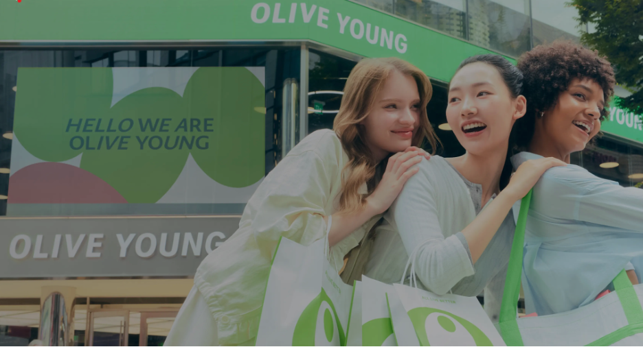

## 왜 AI-DLC였는가: 바이브 코딩을 넘어 조직적 AI 협업으로

### 바이브 코딩의 한계

AI 코딩 도구의 발전으로 개발자 개인의 생산성은 크게 향상되었습니다. 그러나 조직 관점에서 보면 여전히 과제가 있습니다. 바이브 코딩(Vibe Coding)은 AI 연구자 Andrej Karpathy가 명명한 개념으로, 개발자가 세부 구현을 AI에 완전히 위임하고 직관적인 프롬프트로 결과물을 얻는 방식입니다. 개인 생산성 측면에서는 강력하지만, 팀 단위로는 접근 방식과 결과물 품질이 팀원마다 달라지는 문제가 발생합니다. 명세 없이 생성된 코드는 의도와 설계 결정이 문서화되지 않아 코드 리뷰가 어렵고, 온보딩 비용이 증가하며 유지보수 병목으로 이어집니다.

### AI-DLC: 구조화된 AI 협업 워크플로우

AWS는 이러한 조직 단위의 AI 협업 한계를 해결하기 위해 AI-DLC 방법론을 설계했습니다. AI-DLC(AI-Driven Development Life Cycle)는 전통적인 소프트웨어 개발 생명주기(SDLC)의 각 단계에 AI를 구조적 협업 파트너로 통합한 방법론입니다.

핵심은 AI에게 단순히 ‘이런 거 만들어줘’가 아니라, ‘이런 요구사항이 있고, 이렇게 설계했으니, 이 부분을 구현해줘’라는 구조화된 컨텍스트를 전달하는 것입니다. 각 단계의 산출물이 다음 단계의 AI 입력값으로 연결되는 연속적 워크플로우가 AI-DLC의 핵심 구조입니다. AI-DLC는 크게 두 개의 실행 단계로 구성됩니다. 무엇을, 왜 만들지를 정의하는 요구사항 정의 단계(Inception Phase)와, 실제로 어떻게 만들지를 반복 실행하는 구현 단계(Construction Phase)입니다.

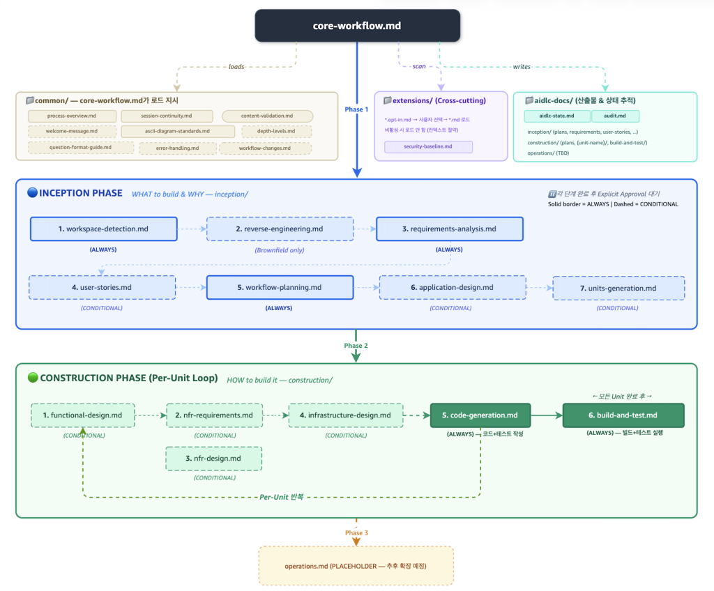

*<AI-DLC 전체 워크플로우 – 단계별 Rules 파일 실행 구조>*

모든 단계는 [core-workflow.md](https://github.com/awslabs/aidlc-workflows/blob/main/aidlc-rules/aws-aidlc-rules/core-workflow.md)를 기반으로 동작하며, 공통 표준(common/)과 산출물 추적(aidlc-docs/)이 전 단계에 걸쳐 적용됩니다. Inception Phase에서는 시스템 요구사항 분석(requirements-analysis.md)과 워크플로우 계획(workflow-planning.md)이 항상(ALWAYS) 실행됩니다. Brownfield 과제의 경우 기존 시스템 분석을 위한 리버스 엔지니어링(reverse-engineering.md)이 조건부(CONDITIONAL)로 추가되며, 사용자 스토리(user-stories.md), 애플리케이션 설계(application-design.md), 개발 단위 확정(units-generation.md)은 과제 성격에 따라 조건부(CONDITIONAL)로 수행됩니다.

Construction Phase는 확정된 개발 단위(Unit)를 기준으로 반복되는 루프 구조입니다. 비즈니스 로직 모델링(functional-design.md), 비기능 요구사항 정의(nfr-requirements.md), 인프라 아키텍처 설계(infrastructure-design.md)를 거쳐, 코드 생성(code-generation.md)에서 앞선 모든 설계 산출물이 AI의 코드 생성 컨텍스트로 직접 연결됩니다. 마지막으로 빌드 및 테스트(build-and-test.md)를 통해 품질 검증까지 동일한 워크플로우 안에서 수행됩니다.

각 주요 단계는 팀 리뷰(Explicit Approval)를 거쳐 다음 단계로 진행됩니다. 이를 통해 개인 역량에 의존하지 않는 품질 게이트가 구조적으로 만들어지며, 경험이 적은 멤버도 프로세스를 따라가는 것만으로 일관된 수준의 산출물을 만들어낼 수 있습니다.

## 워크숍 설계: 3일간의 집중 몰입

- 일시/장소: 2026년 3월, AWS Korea 오피스 (서울 센터필드)

- 참가 규모: CTO 포함 올리브영 테크 조직 30여명

- 과제 수: 총 24개 후보 중 5개 엄선

Day 1 — Inception Phase: 요구사항 정의와 설계

첫째 날 오전은 AI-DLC 방법론 소개, AWS의 AI 코딩 에이전트인 Kiro의 핵심 기능 및 AI-DLC 워크플로우와의 연동 방법 학습, 그리고 팀별 [Kiro Steering](https://kiro.dev/docs/steering/) 문서 초기 설정으로 구성했습니다. 이 Steering 문서 설정이 이후 3일의 생산성을 좌우하는 만큼, 오전 시간을 충분히 할애했습니다. 오후부터는 5개 팀으로 나뉘어 곧바로 Inception Phase에 돌입했습니다. 각 팀은 AI와 함께 시스템 요구사항을 정의하고, 사용자 관점의 기능을 구체화한 뒤, 시스템 아키텍처를 설계하고 개발 단위(Unit)를 구성했습니다. Steering 문서에 정의된 단계별 규칙에 따라 AI가 요구사항을 구조화된 명세로 정제하고 설계 문서를 생성합니다. 개발자는 이를 검토하고 승인하는 오케스트레이터 역할에 집중하는 방식으로, AI와 사람의 역할이 명확하게 분리됩니다.

첫째 날 마무리 시점에는 Construction Phase 초입 단계인 비즈니스 로직 모델링(functional-design.md)과 비기능 요구사항 정의(nfr-requirements.md)까지 진행하여, 둘째 날 구현에 바로 착수할 수 있는 상태를 만들었습니다.

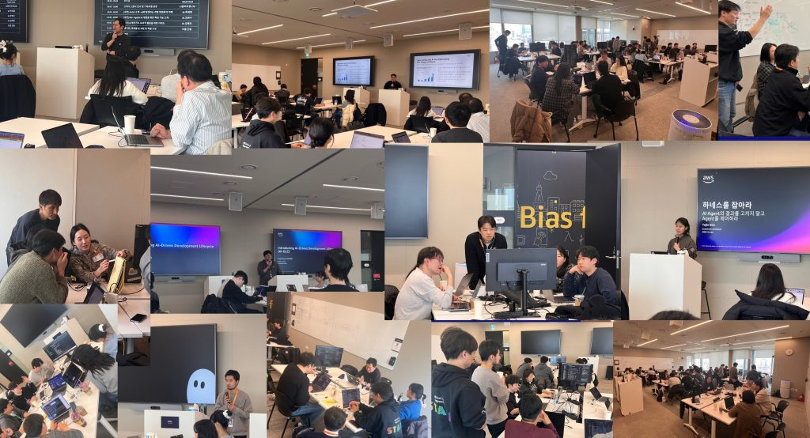

*<AI-DLC Unicorn Gym 세션 및 요구사항 분석 단계>*

Day 2 — Construction Phase: 구현과 품질 검증

둘째 날은 온전히 Construction Phase에 집중했습니다. 매일 아침 전날의 회고로 시작하여 방향을 재정렬한 뒤, 종일 코드 생성과 품질 검증에 몰입했습니다.

Construction Phase는 크게 세 흐름으로 진행됐습니다. 먼저 기능 요구사항과 비기능 요구사항을 정의하고, AWS 인프라 아키텍처 설계까지 마친 뒤 Unit 단위 구현 코드 생성에 돌입했습니다. 각 Unit은 실제 구현 코드 생성부터 테스트 코드 검증까지 한 사이클로 처리했고, 모든 Unit이 완료되면 빌드 통합 단계로 넘어가 Inception에서 정의한 요구사항이 올바르게 구현 및 통합되었는지를 확인했습니다. 5개 프로젝트 팀이 각기 다른 도메인의 시스템을 구축하는 만큼, 검증의 범위와 수준도 프로젝트마다 상이했습니다.

통합 과정에서 이슈가 발생했을 때는 두 가지 방식을 활용했습니다. UI 화면을 캡처해 Kiro 채팅창에 직접 전달하거나, 현재 테스트 진행 상태를 마크다운 파일로 정리해 컨텍스트로 제공함으로써 이슈를 단계적이고 정확하게 해결할 수 있었습니다. 또한 Inception 단계에서 API Contract를 OpenAPI 기반으로 작성해두는 것이 Unit이 많아질수록 통합 품질을 높이는 실질적인 노하우였습니다.

Brownfield 프로젝트에서는 Kiro의 [Subagents](https://kiro.dev/docs/chat/subagents/)를 핵심 도구로 활용했습니다. 기존 코드베이스와 화면 분석을 담당하는 Subagent와 리팩토링을 수행하는 Subagent를 각각 구성해 역할을 분리하고, AI-DLC 설계 단계에서 도출한 구현 태스크를 해당 Subagent에게 위임하는 방식으로 진행했습니다. 각 프로젝트 팀은 AWS 멘토와 AI-DLC 단계별 리뷰와 아키텍처 피드백을 주고받으며 구현을 이어갔고, 개발자는 각 단계에에서 AI가 제안한 산출물을 검토하고 승인하는 역할에 집중했습니다.

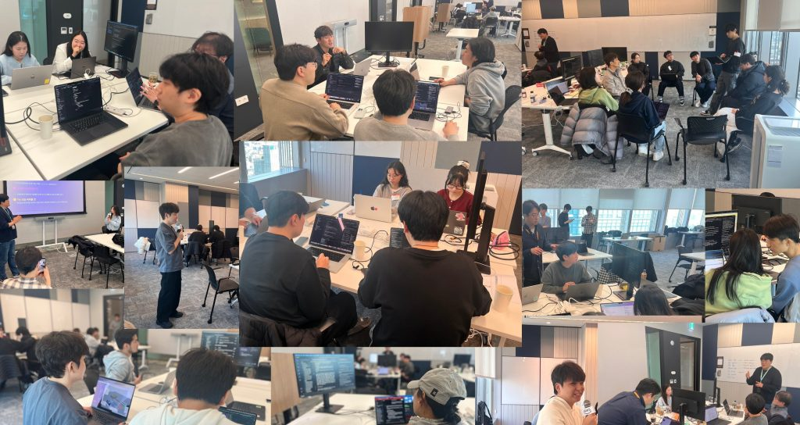

*<AI-DLC Unicorn Gym 과제별 토의 및 구축 단계>*

Day 3와 이후 — 통합, 배포 그리고 데모 데이

셋째 날은 코드 통합과 인프라 배포에 집중하고, 3일간 진행한 내용을 팀 간 공유하며 회고하는 시간을 가졌습니다. 워크숍 이후에는 각 팀이 개발한 결과물을 발표하고 피드백을 나누는 데모데이를 별도 일정으로 진행했습니다. 올리브영 본사로 돌아간 뒤 각 팀이 과제를 추가로 발전시키고, 워크숍에 참석하지 못했던 다른 조직에도 결과를 공유하는 자리로 마련했습니다. 이를 통해 워크숍의 성과가 참석자에 머물지 않고, 올리브영 전체 기술 조직으로 AI-DLC 경험이 확산되는 계기가 되었습니다.

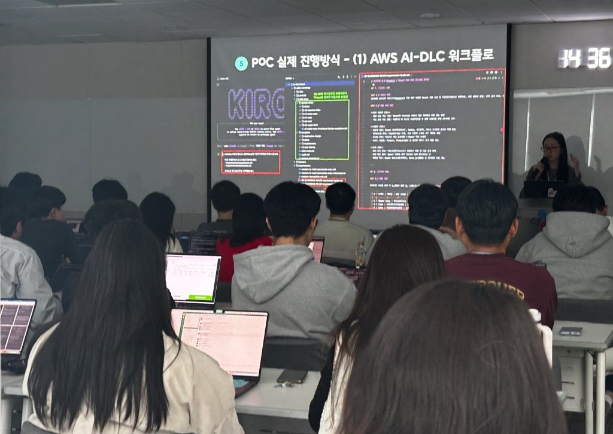

*<올리브영 데모데이틀 통한 AI-DLC 경험 공유회>*

## AI-DLC 프로젝트 소개

총 24개의 과제 중 비즈니스 임팩트, 기술적 도전 수준, Greenfield(신규 개발)/Brownfield(기존 시스템 기반 개발, 레거시 개선) 균형을 고려하여 5개를 엄선했습니다.

### 과제 1. 대화형 커머스 경험을 위한 AI 검색 엔진 고도화

유형: Greenfield | 핵심 기술: [Amazon Bedrock](https://aws.amazon.com/ko/bedrock), [Amazon OpenSearch Service](https://aws.amazon.com/ko/opensearch-service/), [RAG(Retrieval-Augmented Generation)](https://aws.amazon.com/ko/what-is/retrieval-augmented-generation/)

해결하려는 문제

기존 이커머스 검색은 사용자가 키워드 입력과 필터 조합을 반복하며 직접 조건을 좁혀가는 구조입니다. 이 과정에서 세 가지 핵심 문제가 있었습니다. 첫째, 원하는 상품에 도달하기까지 탐색 과정이 반복되어 비효율적입니다. 둘째, 노출된 상품이 자신의 상황에 적합한지 판단하기 어렵습니다. 셋째, “건조한 피부에 좋은 선물용 스킨케어”처럼 상황·라이프스타일 기반의 구매 의도를 키워드 검색으로는 표현하기 어렵습니다. 특히 모바일 환경에서 복잡한 필터 탐색이 어렵거나, 정확한 상품명·카테고리를 모른 채 상황·용도 중심으로 탐색하는 고객에게 이 한계는 더욱 두드러집니다.

핵심 기능 및 기술 구현

키워드 입력 중심의 탐색을 자연어 질의 기반의 의도 중심 대화형 탐색으로 전환하는 것이 핵심입니다. 사용자가 문장 형태로 상품을 요청하면, AI가 구매 의도와 조건을 자동으로 추출하고, 조건 기반 상품 탐색 및 후보 추천을 수행하며, 추천 이유와 리뷰 요약을 함께 제공합니다. 이를 위해 올리브영의 상품·카테고리·브랜드 색인 데이터를 활용하여 AI가 사용자의 의도를 올리브영의 상품 체계에 정확하게 매핑할 수 있도록 구성했습니다. 기술 구현 관점에서는 Amazon Bedrock의 Claude 모델을 중심으로 구매 의도 파악(Intent Extraction) 로직을 구성하고, Amazon OpenSearch Service의 하이브리드 검색(키워드 + 벡터 유사도)을 결합하여 의미 기반 상품 탐색의 정확도를 높였습니다. 또한 상품 리뷰 데이터를 색인하여, 사용자 질의와 관련성이 높은 리뷰를 검색한 뒤 Claude가 실시간으로 요약·생성하는 RAG(Retrieval Augmented Generation) 파이프라인을 구성했습니다. 이 구조 덕분에 “건조한 피부에 여름에 쓸 수 있는 선물용 선크림”처럼 복합 조건이 포함된 질의도 올리브영의 상품 체계 내에서 정확하게 매핑하여 추천 결과를 도출할 수 있었습니다.

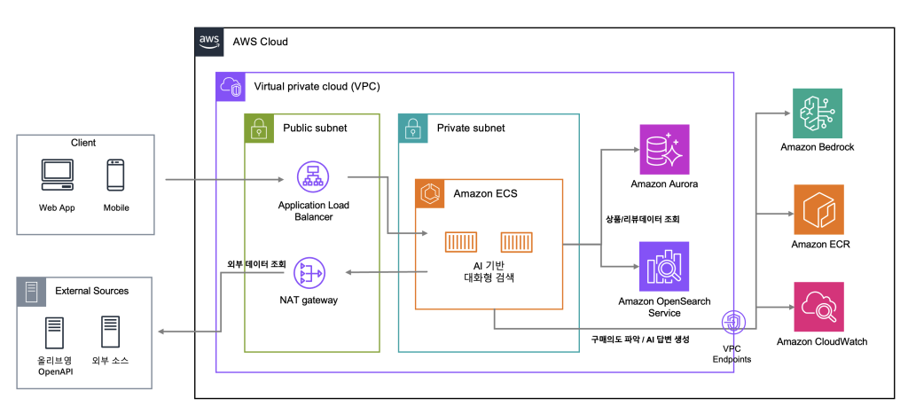

*<AI 기반 대화형 검색 아키텍처>*

### 과제 2. 멀티모달 AI 기반 파트너 채널 자동 검증 시스템

유형: Greenfield | 핵심 기술: Amazon Bedrock (멀티모달), [AWS Step Functions](https://aws.amazon.com/ko/step-functions/), [AWS Lambda](https://aws.amazon.com/ko/lambda/)

해결하려는 문제

올리브영은 2025년부터 어필리에이트(Affiliate) 마케팅을 시행하고 있습니다. 파트너가 블로그, SNS 등의 채널에서 제품을 홍보하고, 소비자가 해당 링크를 통해 구매하면 성과 기반 수수료를 지급하는 방식입니다. 현재 파트너 채널 검수는 담당자가 전부 수동으로 처리하고 있었습니다. 향후 숏폼 영상 등 새로운 콘텐츠 형식이 추가되면 검수 난이도와 소요 시간이 급격히 증가할 것으로 예상되어, 현재 구조로는 확장이 불가능한 상황이었습니다.

핵심 기능 및 기술 구현

MVP 범위로 스크린샷 자동 분석과 SNS 자동 검증을 선정했습니다. Amazon Bedrock의 멀티모달 모델을 활용하여 제출된 스크린샷에서 텍스트, 플랫폼 정보를 인식 및 분석하고, SNS 메타데이터와 교차 검증합니다. 관리자 백오피스(BO)에는 AI 판정 결과와 신뢰도 점수가 함께 표시됩니다.

Inception Phase에서 데이터 등록, 이미지 분석, AI 검증, 파이프라인 관리, 관리자 화면 등 5개 Unit으로 분해했으며, Construction 단계에서는 AWS Lambda와 AWS Step Functions를 결합한 서버리스 아키텍처로 구현하여 빠른 검증과 운영 부담 절감을 동시에 달성했습니다.

검수 이력의 감사(Audit) 추적과 정확히 한 번(Exactly-once) 실행 보장이 필요한 검수 워크플로우 특성상, [Express Workflow 대신 Standard Workflow](https://docs.aws.amazon.com/wellarchitected/latest/serverless-applications-lens/step-functions-workflows.html)를 선택했습니다. 구체적으로 Step Functions Standard Workflow를 활용해 (1) 데이터 수집 및 S3 업로드 → (2) Bedrock 멀티모달 호출을 통한 플랫폼 식별 및 콘텐츠 분석 → (3) 파트너가 제출한 메타데이터(게시일, 플랫폼 정보 등)와 비교 분석 및 결과 교차 검증 → (4) 신뢰도 점수 산출 및 BO 결과 전달의 순차 State Machine을 구성했습니다. Lambda 함수별로 역할을 분리하고 Step Functions의 오류 처리(Catch/Retry)를 활용함으로써, 개별 API 호출 실패가 전체 검수 파이프라인을 중단시키지 않도록 설계했습니다.

이 서버리스 기반의 순차 처리 아키텍처는 AI가 Inception Phase에서 직접 제안한 설계입니다. 팀이 처음부터 독자적으로 고민했다면 상당한 시간이 걸렸을 아키텍처 의사결정을, AI와의 구조화된 협업을 통해 빠르게 도출한 사례입니다.

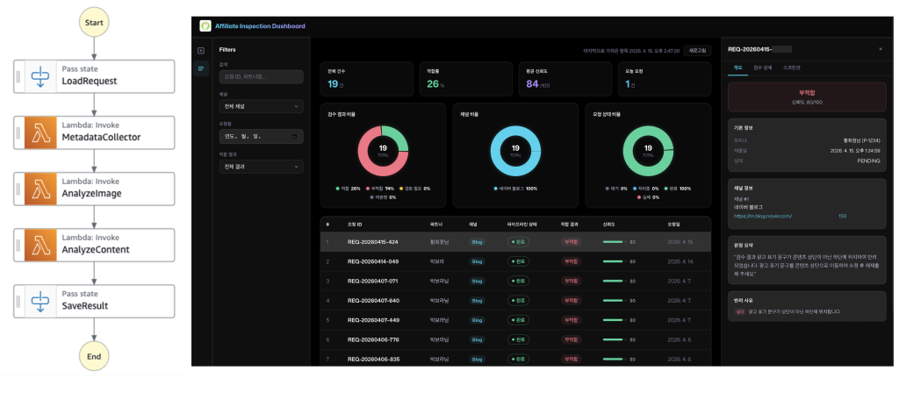

*<AI기반 채널 검수 시스템 – 서버리스 아키텍처 및 대시보드>*

### 과제 3. 차세대 물류센터 시스템을 위한 지능형 시뮬레이션 플랫폼

유형: Greenfield | 핵심 기술: [몬테카를로(Monte Carlo) 시뮬레이션](https://aws.amazon.com/ko/what-is/monte-carlo-simulation/), 경로 탐색 알고리즘

해결하려는 문제

올리브영의 물류센터는 물동량, 인력, 기상 조건 등 매일 변하는 복잡한 변수 속에서 운영됩니다. 그러나 기존 관행 기반 운영에는 세 가지 핵심 한계가 있었습니다. 첫째, 변수를 실시간으로 분석하고 즉각 대응할 수 있는 데이터 기반 운영 체계가 부재했습니다. 둘째, 인력 운영 최적화가 미흡했습니다. 프로모션에 따른 물동량 변동이 크지만, 이에 맞춰 작업자 배치를 동적으로 최적화하는 체계가 없었습니다. 셋째, 실시간 파악이 어려운 병목 구간을 시각화하여 사후 조치 중심에서 사전 예방 체계로 전환해야 했습니다.

핵심 기능 및 기술 구현

- 운영 불확실성 제거(Simulation): 사전 시뮬레이션을 통해 변수를 테스트하고 예측 가능한 리드타임을 확보합니다.

- 글로벌센터 최적화(Optimization): 물류센터 맞춤형 피킹 및 인력 전략을 수립하여 투입 비용 대비 물동량 처리율을 극대화합니다.

- 리스크 조기 차단(Risk Management): 물류 지연 구간을 사전 포착하여 병목 현상에 따른 유무형 손실을 방지합니다.

프로젝트 범위는 시뮬레이터를 자사 물류센터 시스템(GMS)에 적용하는 것으로 설정했습니다. AI-DLC의 Inception Phase에서 물류 도메인 전문가와 함께 시뮬레이터의 입출력 모델, 최적화 알고리즘의 제약 조건, 리스크 지표 정의를 구조화된 설계 문서로 정리한 것이 3일이라는 짧은 기간 내 작동하는 시뮬레이터를 구축할 수 있었던 핵심 요인이었습니다. 최적화 알고리즘은 시간대별 물동량 예측값과 인력 가용성을 입력으로 받아 작업자 배치를 시뮬레이션합니다. 피킹 구역별 처리 속도와 이동 동선을 변수로 반복 계산하여 병목 구간을 사전에 식별하는 구조입니다. 이 설계 문서를 기반으로 AI가 시뮬레이션 루프의 핵심 로직과 데이터 집계 모듈을 생성했고, 도메인 전문가가 실제 운영 수치로 파라미터를 보정하며 정확도를 높였습니다.

운영자가 물류 흐름을 직관적으로 파악할 수 있도록, AI를 활용해 물류센터 3D 모델링과 구역별 처리 현황 시각화를 구현했습니다. 이를 통해 운영자는 병목 구간을 한눈에 식별하고 즉각적인 의사결정을 내릴 수 있습니다.

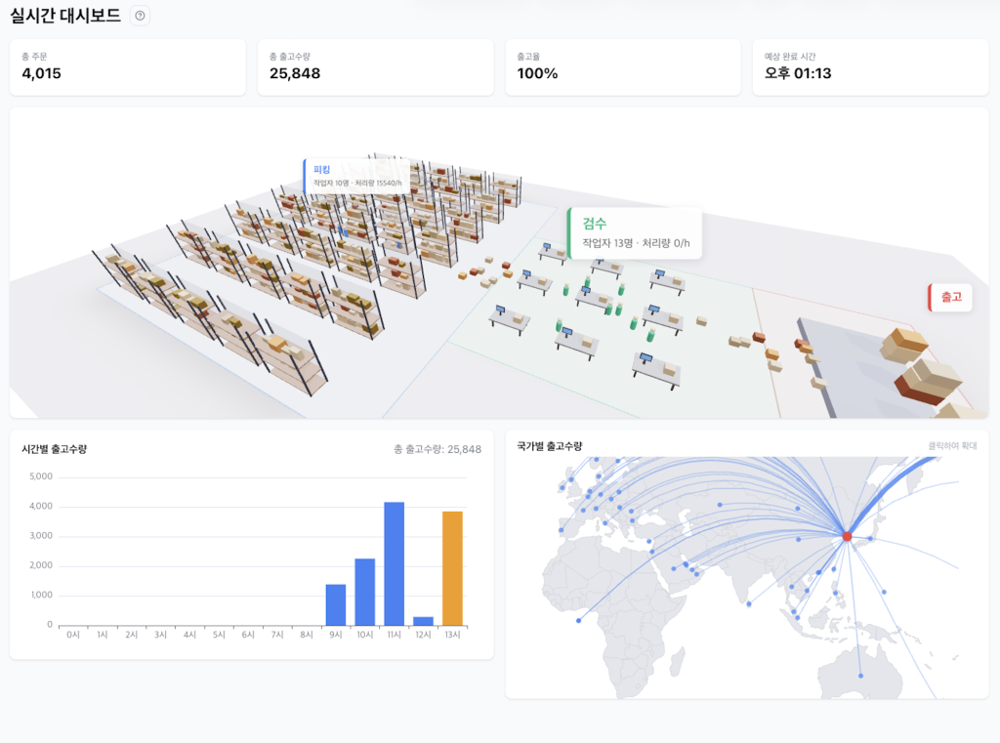

*<차세대 물류센터 시스템 대시보드 일부>*

### 과제 4. 장애 대응 및 보상 프로세스 자동화를 위한 AI 오케스트레이션

유형: Greenfield | 핵심 기술: Amazon Bedrock, [Strands Agents SDK](https://strandsagents.com/)

해결하려는 문제

시스템 장애 발생 시 피해 고객을 식별하고 보상을 처리하는 과정 중 일부가 수동으로 이루어지고 있었습니다. 결제 실패, 쿠폰 미적용 등의 피해 고객을 수작업으로 추출하고 보상 기준을 적용하는 데 상당한 시간이 소요되었고, 이로 인한 처리 지연은 고객 신뢰 손실과 이탈로 직결되었습니다.

핵심 기능 및 기술 구현

네 단계의 자동화 파이프라인으로 설계했습니다.

- 피해 고객 식별: 장애 시간대의 결제 실패 및 쿠폰 미적용 고객을 자동 추출하고 피해 등급을 분류합니다.

- 자동 보상 산정: 피해 유형과 규모별 보상 기준을 적용하고 총 비용을 시뮬레이션합니다. 담당자는 총 보상액, 평균 보상액, 보상 방법별(할인, 반품, 포인트) 비용 분포를 시뮬레이션 화면에서 비교한 뒤 최적안을 선택하고 실행할 수 있습니다.

- 일괄 발급 및 알림: 보상 쿠폰을 자동 생성하고 SMS, 푸시, 이메일 등 멀티채널로 발송합니다.

- 보상 이력 관리: 중복 보상 차단, 어뷰징 탐지, 보상 효과 추적 기능을 포함합니다.

에이전트 오케스트레이션에는 AWS의 오픈소스 AI 에이전트 프레임워크인 Strands Agents SDK를 활용했습니다. Strands Agents는 Amazon Bedrock의 Claude 모델을 기반으로 장애 현황 요약, 피해 고객 분류 기준 제안, 보상 시뮬레이션 결과 해석 등 각 단계의 AI 판단 로직을 tool calling으로 연결하는 구조로 구현했습니다. 담당자는 AI의 분석 결과를 검토한 뒤 최종 실행 여부를 결정하는 Human-in-the-loop 구조로 설계하여, 자동화의 속도와 사람의 판단이 균형을 이루도록 했습니다. 전체 기능은 재난 복구 Agent 인터페이스로 통합되어, 담당자가 장애 현황·피해 분석·보상 시뮬레이션·실행까지를 단일 화면에서 처리할 수 있도록 구성했습니다. 기존 장애 대응 프로세스와의 연동 지점이 많은 과제였던 만큼, Inception Phase에서 현행 프로세스(AS-IS)를 먼저 구조화된 문서로 정리하고 자동화 범위(TO-BE)를 명확히 구분한 것이 핵심이었습니다. 자동화 대상과 사람이 판단해야 할 영역을 사전에 분리해두지 않았다면, 3일 안에 작동하는 파이프라인을 완성하기 어려웠을 것입니다.

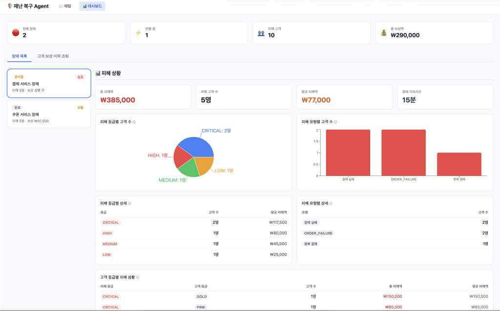

*<장애/대응 에이전트 모니터링화면 일부>*

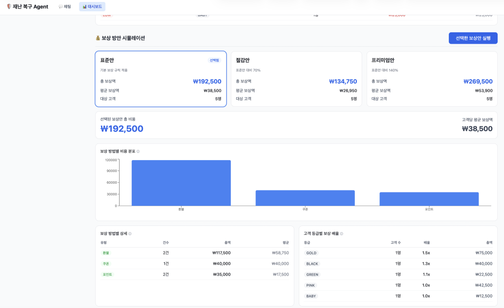

*<보상 방안 시뮬레이션 예시>*

### 과제 5. Modern Stack 기반의 엔터프라이즈 관리 시스템 현대화 PoC

유형: Brownfield | 핵심 기술: Kiro, 프론트엔드 마이그레이션, AI 기반 코드 변환

해결하려는 문제

올리브영의 백오피스 시스템은 국내 엔터프라이즈 환경에서 오랫동안 사용되어 온 레거시 UI 개발 솔루션 기반으로 구축되어 있었습니다. 이 솔루션은 컴포넌트 재사용이 어렵고 오픈소스 라이브러리와의 연동이 제한적이었며, 해당 기술에 익숙한 개발자 풀 자체가 좁아 신규 인력 확보도 쉽지 않았습니다. 무엇보다 AI 코딩 도구가 이 솔루션의 전용 문법과 구조를 학습 데이터로 거의 보유하지 않아, AI 기반 개발 가속화의 혜택을 받기 어려운 구조였습니다. 즉, 개발 생산성과 유지보수성이 낮아 React 기반 모던 웹 스택으로 전환이 필요한 상황이었습니다.

핵심 기능 및 기술 구현

먼저 전환 대상 화면들을 UI 컴포넌트 수, 데이터 테이블 수, 서버 API 호출 수를 복잡도 지표로 삼아 간단한 화면부터 복잡한 화면구성까지 4단계 난이도로 분류했습니다. 각 난이도의 대표 화면을 선정한 뒤, 낮은 난이도부터 단계적으로 AI 기반 전환 가능 여부를 검증했습니다. 전환된 화면이 원본과 동일한 UI 구성 요소를 갖추고, 동일한 데이터 입출력 결과를 재현하면 성공으로 판정했습니다.

이 과제에서 특히 빛을 발한 것은 Kiro의 Custom Agent기능을 활용해 구성한 5단계 멀티 에이전트 파이프라인입니다. 전체 파이프라인은 migration-orchestrator가 총괄하며, 전환 대상 레거시 화면을 입력받아 분석부터 검증 리포트까지 전 과정을 자동으로 실행합니다. 각 Custom Agent는 이전 단계의 산출 파일을 입력으로 받아 순차적으로 동작하는 구조입니다. Phase 1의 legacy-analyzer는 레거시 화면을 분석하여 UI 컴포넌트 구성, API 호출 패턴, 데이터 바인딩 구조를 문서화합니다. 이 분석 문서가 Phase 2의 spec-writer로 전달되면, 전환 후 화면이 충족해야 할 수용 기준(Acceptance Criteria)과 테스트 스켈레톤을 작성합니다. Phase 3의 react-codegen은 이 명세를 기반으로 실제 React 컴포넌트 코드를 생성하고, Phase 4의 test-runner가 생성된 코드에 대해 테스트를 실행합니다. 테스트가 실패하면 실패 원인이 담긴 리포트가 Phase 3으로 피드백되어 코드를 자동으로 보완하며, 이 재시도 루프는 최대 3회까지 반복됩니다.

실제 워크숍에서 이 자동 재시도 루프가 작동하여, 사람의 개입 없이 테스트 실패를 스스로 감지하고 코드를 보완해 최종 통과한 사례가 나왔습니다. AI가 단순 코드 생성을 넘어 자체 검증과 수정까지 수행한 것입니다. 마지막으로 Phase 5의 phase-reporter가 각 단계의 실행 결과를 종합한 검증 리포트를 생성하여, 개발자가 최종적으로 전환 품질을 확인하고 승인할 수 있도록 합니다.

각 에이전트가 명확한 책임 범위를 갖고 파일 기반으로 컨텍스트를 이어받는 구조 덕분에, 에이전트 단위의 교체나 재실행이 용이했고 전체 파이프라인의 예측 가능성도 높아졌습니다. 이를 통해 레거시 UI 화면을 React 기반 모던 웹 스택으로 높은 품질을 유지하며 자동 전환할 수 있는 기반을 마련했습니다.

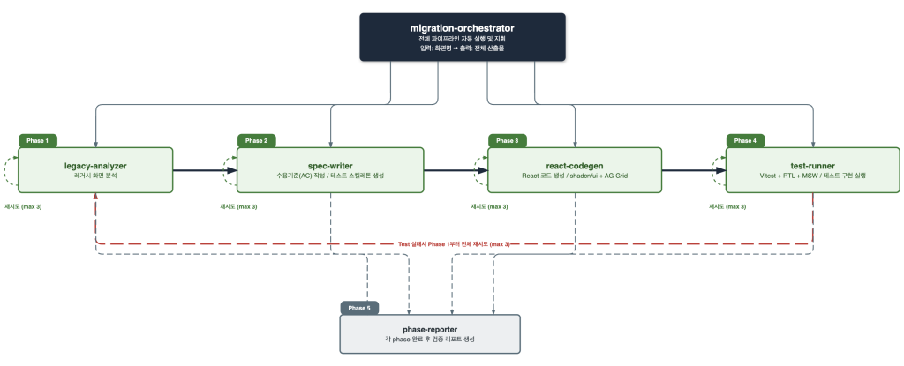

*<멀티 에이전트 파이프라인 구축>*

## AI-DLC Steering과 하네스 엔지니어링

이번 워크숍에서는 Kiro를 AI-DLC 워크플로우의 핵심 실행 도구로 활용했습니다. Kiro는 AWS가 제공하는 Agentic AI IDE로, Steering 파일, Agent Hooks, MCP 연동 등을 통해 AI 코딩 에이전트의 동작을 체계적으로 제어할 수 있습니다.

### AI-DLC Steering: AI 코딩 에이전트를 조직의 워크플로우에 맞추기

Kiro의 Steering은 프로젝트의 코드 컨벤션, 기술 스택, 아키텍처 패턴, 작업 규칙을 마크다운 파일로 정의하면 AI가 코드 생성 시 이를 일관되게 반영하는 기능입니다. 이번 워크숍의 기술적 핵심은 Kiro의 Spec-Driven 기능이 아니라, AI-DLC 워크플로우 저장소에 이미 준비된 Steering 파일이었습니다. 이 저장소에는 Inception, Construction, Operation(추후 제공) 각 단계에서 AI가 따라야 할 규칙과 단계별 프롬프트가 Steering 파일 형태로 정의되어 있습니다.

AI-DLC 워크플로우의 Steering 파일을 Kiro에 등록하면, AI-DLC 방법론의 각 단계(요구사항 분석 → 유저 스토리 작성 → 시스템 설계 → 유닛 분해 → 코드 생성 → 테스트)를 AI가 구조화된 프로세스로 순서대로 따라갈 수 있습니다. 이번 워크숍에서는 Day 1 오전에 팀별 Steering 파일 세팅 시간을 별도로 배정했으며, 이 초기 세팅이 이후 3일간의 생산성을 결정짓는 핵심 요인이었습니다.

### AI-DLC + Kiro로 AI 에이전트 구축하기

이번 워크숍에서 다룬 5개 과제 중 2개는 AI 에이전트 기반 시스템을 포함하고 있었습니다. 대화형 검색 엔진(과제 1), 장애 대응 자동화(과제 4) 모두 AI 에이전트가 내, 외부 도구와 연동하며 일정 수준의 자율적인 판단을 수행하는 구조입니다.

이러한 Agentic AI 시스템을 AI-DLC와 Kiro로 구축할 때의 핵심은, Inception 단계에서 에이전트의 행동 명세를 설계 문서로 정의하고, Construction 단계에서 이를 코드로 구현하는 흐름을 명확히 가져가는 것입니다. 에이전트가 어떤 도구(Tool)를 사용하고, 어떤 조건에서 어떤 판단을 내리며, 어떤 방식으로 사용자에게 응답할지를 Inception에서 구조화한 뒤, Construction에서 Kiro를 활용하여 [Strands Agents](https://strandsagents.com/latest/) 기반 코드, [MCP 연동](https://modelcontextprotocol.io/), [Amazon Bedrock](https://aws.amazon.com/ko/bedrock/) 호출 로직으로 구현합니다.

### Kiro Custom Agent: 역할별 AI 에이전트를 팀과 공유하기

이번 워크숍에서 주목할 만한 또 하나의 활용 포인트는 Kiro의 Custom Agent 기능입니다. Custom Agent는 Instruction(지시사항)과 도구(MCP 서버 등)를 조합하여 특정 역할에 특화된 AI 에이전트를 정의하고, 이를 팀원들과 공유하여 일관된 방식으로 업무를 수행할 수 있게 하는 기능입니다. 개발 에이전트, 문서 조회 에이전트, 사내 툴 연동 에이전트, DevOps 에이전트, 배포 에이전트 등 역할별 Kiro Custom Agent를 만들어 함께 활용할 수 있습니다. 각 에이전트에는 역할에 맞는 Steering과 MCP 서버가 설정되어 있어, 누가 사용하더라도 팀 전체가 균일한 품질의 결과물을 얻을 수 있습니다. Kiro CLI를 활용하면 Custom Agent 정의, Steering 설정, Knowledge Base 연동을 코드 기반으로 관리할 수 있어, 프로젝트별로 서로 다른 도메인과 기술 스택에 맞게 AI 동작을 일관되게 조정할 수 있었습니다.

이번 올리브영 워크숍에서도 팀별로 AI-DLC 단계에 맞는 Custom Agent를 구성하여 활용했습니다. 특히 과제 5에서는 역할별 Custom Agent를 순차적으로 오케스트레이션하는 멀티 에이전트 파이프라인을 구현했습니다.

### AI를 사전에 설계하고 통제하는 것: 하네스 엔지니어링

이번 워크숍의 접근 방식은 최근 주목받고 있는 하네스 엔지니어링(Harness Engineering) 개념과도 맞닿아 있습니다. 하네스 엔지니어링이란 AI가 자유롭게 판단하도록 내버려 두는 대신, 사람이 먼저 구조와 방향을 설계하고 AI는 그 안에서 실행하도록 통제하는 개발 방식입니다. 마치 말에 마구(harness)를 채워 힘을 원하는 방향으로 이끌듯, AI의 역량을 무분별하게 사용하는 것이 아니라 목적에 맞게 제어하는 것이 핵심입니다.

Steering 파일로 AI의 행동 범위를 정의하고, Custom Agent로 역할을 분리한 이번 워크숍의 접근 방식이 바로 하네스 엔지니어링의 하나의 사례입니다. 여기서 중요한 점은 이 구조가 고정된 템플릿이 아니라는 것입니다. AI-DLC는 각 기업의 도메인과 프로젝트 특성에 맞게 Steering 파일, Custom Agent를 커스터마이징할 수 있는 유연한 프레임워크입니다.

## 주요 성과

이번 Unicorn Gym 워크숍을 통해 AI-DLC 방법론의 실효성을 다음과 같이 검증했습니다.

- 개발 속도: 일반적인 개발 방식 대비 5배 이상 빠른 속도로 5개 비즈니스 과제를 3일 만에 프로토타입 수준으로 구현했습니다.

- 설계 품질: AI-DLC의 Inception Phase에서 요구사항과 설계를 충분히 정제함으로써, Construction Phase에서 구현과 검증에만 집중할 수 있었고, 전체 구현 시간을 획기적으로 단축했습니다.

- 업무 자동화: 수동으로 처리하던 반복 업무를 AI 기반으로 전환하여 처리 시간을 최대 30배 단축(건당 평균 5분 → 10초 이내)하고, 연간 수백 시간의 업무 절감 효과를 기대할 수 있습니다.

- 리스크 예방: AI가 제안한 최적화 알고리즘을 통해 운영 지연 요인의 40%를 사전에 차단할 수 있는 가능성을 확인했습니다.

- 현대화 가속: AI 기반 멀티 에이전트 파이프라인으로 레거시 시스템 자동 전환 가능성을 검증하여, 향후 현대화 일정을 50% 단축할 수 있을 것으로 기대합니다.

### 핵심 인사이트

1. AI는 ‘사고의 파트너’로, 개발 생산성을 넘어 의사결정의 질을 높이다.

AI-DLC를 통해 AI는 단순 코드 생성기가 아니라 요구사항을 정제하고, 설계를 구체화하며, 누락된 관점을 짚어주는 사고의 파트너임이 확인되었습니다. 특히 모호한 비즈니스/비기능 요구사항을 구조화된 설계 문서로 빠르게 변환하며, 전체 방향을 조율하고 최종 판단을 내리는 오케스트레이터 역할은 여전히 개발자(메이커)의 몫임을 명확히 했습니다.

2. AI 활용 역량의 평준화를 통해 프로세스가 곧 품질의 하한선을 보장한다.

가장 중요한 성과 중 하나는 AI 활용 숙련도에 관계없이 팀 전체가 일관된 수준의 산출물을 만들어낼 수 있게 된 것입니다. 경험이 적은 멤버도 AI-DLC의 구조화된 단계별 프로세스를 따라가면 일정 수준 이상의 설계 산출물을 만들어낼 수 있었습니다. 이는 특정 개인의 역량이 아닌 프로세스 자체가 품질을 보장하는 구조로, 조직 전체의 AI 내재화를 가능하게 하는 핵심 기반입니다.

3. Inception 단계의 정제가 Construction 단계의 효율을 극대화한다.

3일이라는 짧은 시간에 작동하는 프로토타입을 만들 수 있었던 결정적인 이유는, Day 1 Inception에서 요구사항과 설계를 충분히 정제했기 때문이며, 이 과정을 통해 ‘잘 설계된 질문’의 힘을 다시 한번 실감했습니다. 설계 문서의 품질이 높을수록 AI가 생성하는 코드의 정확도가 높아졌고, 이는 수동 디버깅과 재작업 시간을 대폭 줄여 Construction 단계의 효율을 극대화했습니다.

## 마무리

### AI 내재화를 위한 올리브영의 다음 과제

올리브영은 이번 워크숍의 결과물을 실제 프로덕션에 적용하기 위한 논의를 이어가고 있습니다. 또한 별도의 AI 샌드박스를 구축하여 구성원들이 관련 스킬셋을 연마하고, 올리브영만의 AI 워크플로우와 재사용 가능한 산출물(Asset)을 자유롭게 발전시킬 수 있는 환경을 마련했습니다. 이 환경에서 실무에 즉시 적용 가능한 코드 스켈레톤(Skeleton)과 업무 플레이북(Playbook)이 축적되길 기대하고 있습니다.

AI 도구는 계속 진화할 것이고, AI-DLC와 같은 체계적인 워크플로우가 조직 내부에 뿌리내리기 시작하면, 개발자, 기획자가 동일한 언어와 프로세스로 협업할 수 있는 기반이 만들어집니다. 올리브영은 이번 워크숍을 통해 AI와 함께 일하는 방식을 조직 전체에 이식하는 의미 있는 첫걸음을 내딛었습니다.

또한 올리브영은 6월부터 전략 과제를 리딩하는 PM 조직 및 글로벌 개발 조직을 대상으로 AI-DLC를 확장 운영할 예정이며, AI 협업 기반을 지속적으로 강화해 나갈 계획입니다. 팀별 AI-DLC 경험과 프로젝트 사례 역시 [올리브영 테크블로그](https://oliveyoung.tech/2026-04-16/oliveyoung-tech-ai-dlc-workshop/)를 통해서도 공유될 예정입니다.

동시에 AI-DLC를 더욱 확장하고 고도화하기 위해 필요한 방향성도 확인할 수 있었습니다.

- AI 설계의 적정 깊이 판단: 과제의 복잡도와 성격에 따라 AI가 생성하는 설계의 깊이를 어느 수준에서 멈추고 사람이 개입해야 하는지를 판단하는 기준이 중요해졌습니다.

- 조직 간 인터페이스 계약의 선(先)정의: 여러 팀이 병렬적으로 개발하는 환경에서는 데이터 구조와 API 규격을 구현 전에 먼저 합의해야 통합 품질을 안정적으로 확보할 수 있었습니다. AI 기반 병렬 개발일수록 인터페이스 선정의의 중요성이 더욱 커졌습니다.

- 요구사항 구조화 역량: AI-DLC의 품질은 단순히 AI 활용 능력보다, 현업의 맥락과 요구사항을 AI가 이해 가능한 형태로 구체화하고 구조화하는 역량에 크게 좌우되었습니다. AI가 좋은 질문을 할수록, 사람의 문제 정의 능력 역시 더욱 중요해지고 있습니다.

- 현장 데이터 기반 검증 체계: 도메인 특화 과제에서는 실제 운영 데이터와 현장 맥락 없이 구현한 PoC가 실제 환경까지 이어지기 어렵다는 점도 확인할 수 있었습니다. AI 결과물의 품질은 결국 연결된 데이터와 도메인 지식의 수준에 영향을 크게 받았습니다.

이 방향성은 올리브영만의 고민이 아니라, AI 협업 개발을 조직에 내재화하는 모든 팀이 함께 풀어가야 할 영역입니다. 올리브영은 이번 워크숍의 경험을 바탕으로 이를 지속적으로 발전시켜 나갈 계획입니다.

## 참고 자료

AI-DLC 방법론에 대해 더 자세히 알고 싶으시다면, 아래 자료를 참고해 주세요.

- [Open-Sourcing Adaptive Workflows for AI-Driven Development Life Cycle (AI-DLC)](https://aws.amazon.com/ko/blogs/devops/open-sourcing-adaptive-workflows-for-ai-driven-development-life-cycle-ai-dlc/)

- [AI와 SDLC의 만남 — GenAI로 혁신하는 소프트웨어 개발](https://aws.amazon.com/ko/blogs/tech/ai-sdlc-with-genai-software-development/)

- [AI-DLC 백서](https://prod.d13rzhkk8cj2z0.amplifyapp.com/) — AI-DLC의 이론적 배경과 전체 프레임워크를 상세히 설명합니다.

- [AI-DLC 워크플로우 가이드 (GitHub)](https://github.com/awslabs/aidlc-workflows) — 단계별 프롬프트 템플릿과 Kiro Steering 설정 가이드를 제공합니다.

- [Kiro 공식 사이트](https://kiro.dev/) — Kiro IDE의 설치, 기능 소개, 문서를 확인할 수 있습니다.

## 저자 소개

### 최가인

최가인 DevRel 담당자는 소프트웨어 교육 기획자 및 개발자 관계 전문가로서의 경험을 바탕으로 CJ올리브영 테크 조직의 개발자 문화 활성화와 외부 커뮤니티 연결을 담당하며, 기술 브랜드를 구축하는 역할을 수행하고 있습니다.

### 정진영

정진영 SRE 엔지니어는 CJ올리브영 플랫폼엔지니어링팀에서 클라우드 인프라 안정화와 서비스 신뢰성 확보를 담당하고 있습니다. 축적된 운영 데이터를 기반으로 AI 에이전트를 직접 기획·개발해 조직의 운영 효율을 높여온 경험을 보유하고 있으며, 개발 현장의 문제를 정의·진단하고 솔루션을 도출·운영하는 스태프 엔지니어 역할도 병행하며 개발자 경험 개선에도 앞장서고 있습니다.

### 김형빈

김형빈 프론트엔드 개발자는 다양한 도메인의 서비스 구축과 운영 경험을 바탕으로, CJ올리브영 테크 조직에서 물류시스템의 Frontend 개발 및 테크 리드 역할을 수행하고 있습니다.

### 박보라

박보라 프론트엔드 개발자는 CJ올리브영의 콘텐츠 및 커머스 서비스 영역에서 프론트엔드 개발을 담당하며, 사용자 경험 개선과 서비스 품질 향상에 집중하고 있습니다.

### 황희정

황희정 프론트엔드 개발자는 CJ올리브영의 콘텐츠 및 커머스 서비스 영역에서 프론트엔드 개발을 담당하며, 단순히 화면을 구현하는 것에 그치지 않고 매끄러운 인터랙션과 최적화된 렌더링 성능을 확보하여 사용자가 콘텐츠에 온전히 집중할 수 있는 환경을 만드는 데 주력하고 있습니다.

### 임석호

임석호 백엔드 엔지니어는 레거시 시스템 개발 및 운영 경험을 바탕으로 CJ올리브영의 백오피스 시스템의 모던 웹 기술 전환을 담당하고 있습니다. 백오피스 시스템 현대화를 통해 개발 생산성과 운영 효율을 높이는 역할을 수행하고 있습니다.

### 손다미

손다미 소프트웨어 개발자는 CJ올리브영 테크 조직에서 쿠폰·프로모션·가격 서빙 시스템의 설계 및 개발을 담당하고 있으며, 대규모 트래픽 환경에서의 실시간 데이터 처리와 시스템 안정성 확보를 위한 아키텍처 고도화 역할을 수행하고 있습니다.

### 이재린

이재린 백엔드 엔지니어는 다양한 서비스 개발 및 대용량 트래픽 아키텍쳐 설계및 운영 경험을 바탕으로 CJ올리브영 검색 서비스를 담당하고 있으며, LLM을 통한 AI Agent 서비스 개발을 수행하고 있습니다.

### 안예지

안예지 백엔드 엔지니어는 CJ올리브영 리테일 서비스 영역에서 백엔드 개발을 담당하고 있습니다. 오프라인 매장에서의 안정적인 고객 경험을 위해 레거시 시스템을 모던화하는 프로젝트를 진행하고 있으며, AI 도구를 개발 환경에 활용하는 일에도 관심을 가지고 있습니다.

## AWS 작성자 소개

### Jaeyoung Ha

하재영 솔루션즈 아키텍트는 소프트웨어 개발자 및 소프트웨어 아키텍트의 경험을 바탕으로 엔터프라이즈 고객을 대상으로 클라우드 마이그레이션과 모더나이제이션을 담당하고 있으며 최적의 아키텍처 설계를 구성하는 역할을 수행하고 있습니다.

### Hyunsoo Cho

조현수 솔루션즈 아키텍트는 이커머스/금융/SaaS 산업군에서 소프트웨어 개발자 경험을 바탕으로 디지털 기업의 다양한 요구사항에 적합한 아키텍처를 설계하고, AWS 기반의 제품과 서비스 개발에 도움을 주는 역할을 수행하고 있습니다.

### Sewoong Kim

김세웅 AI/ML Specialist SA는 정보 검색 분야의 전문가로 분석 서비스와 컨테이너, 서버리스 중심으로 AWS 기반 서비스를 구성하는 고객들에게 최적화된 아키텍처를 제공하고, AI를 위한 데이터 분석 플랫폼을 보다 고도화 하기 위한 여러 기술적인 도움을 드리고 있습니다.

### Sangho Lee

이상호 Account Manager는 AWS Korea에서 RCG(Retail/CPG) 인더스트리의 Sr. Account Manager로 활동하고 있습니다. 고객의 비즈니스 목표를 이해하고, AWS를 통해 디지털 전환과 성장을 지원하는 전략적 파트너 역할을 수행합니다.

### Yejin Kim

김예진 Solutions Architect는 다년간의 개발 경험을 바탕으로 다양한 산업 분야의 고객들이 AWS 환경에서 워크로드를 안정적이고 효율적으로 구축할 수 있도록 기술적인 지원을 제공하고 있습니다. 특히 GenAI 관련 서비스를 활용하여 비즈니스 요구에 부합하는 아키텍처를 설계하고, 생성형 AI의 도입과 운영을 위한 전략 수립부터 실전 적용까지 전반적인 여정을 함께하고 있습니다.
