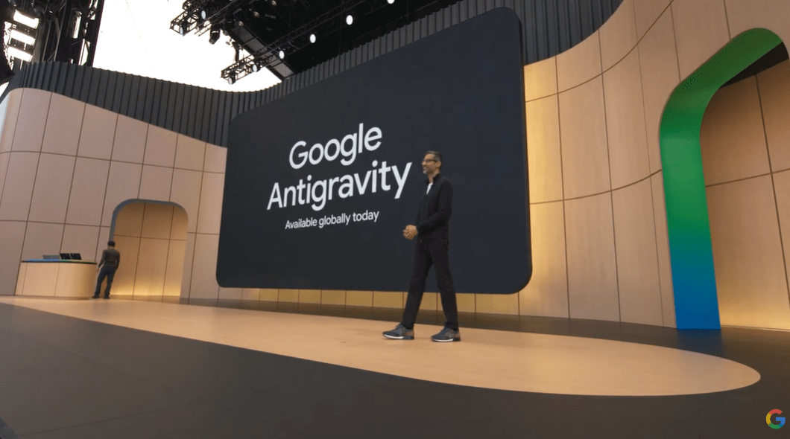
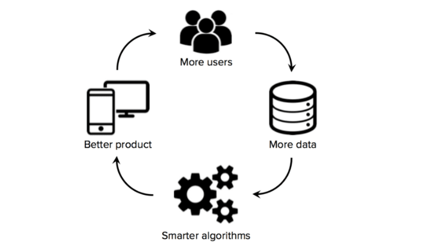

# [5월21일] 구글은 왜 ‘제미나이 3.5 프로’ 출시를 미뤘나…핵심은 ‘데이터 플라이휠’

Source: https://www.aitimes.com/news/articleView.html?idxno=210788
Submitted URL: https://share.google/9BTt9AKTZCAQsIaWf
Saved: 2026-05-22
Published: 2026-05-22T07:00:00+09:00
Author/source: AI타임스
Section: 포커스
Extraction method: direct_html_aitimes_manual
Quality status: good

## Preservation notes

- `share.google` URL resolved to the canonical AI타임스 URL with HTTP 200.
- Body was extracted from `#article-view-content-div`; audio widget, scripts, styles, and non-article chrome were excluded.
- Source HTML was saved under `source/original.html`; detected API/token-like JavaScript values were redacted when matched.
- Article images were downloaded to `figures/` and referenced below with original captions/alt text.
- Claims involving unreleased model names, launch timing, acquisition/IPO rumors, token volumes, and competitive performance remain source claims unless checked in `source-trace.ko.md`.

## Metadata

- Title: [5월21일] 구글은 왜 ‘제미나이 3.5 프로’ 출시를 미뤘나…핵심은 ‘데이터 플라이휠’
- Canonical URL: https://www.aitimes.com/news/articleView.html?idxno=210788
- Meta description: 19일(현지시간) 열린 구글의 'I/O'에서는 굵직한 소식이 여럿 등장했습니다. 일부는 이미 유출됐던 내용이었는데, 여기에는 '제미나이 3.5 플래시'와 '제미나
- Keywords:

## Linked sources preserved from article body

- [제미나이 3.5 플래시](https://www.aitimes.com/news/articleView.html?idxno=210725&page=2&total=33269)
- [제미나이 스파크](https://www.aitimes.com/news/articleView.html?idxno=210727)
- [제미나이 옴니](https://www.aitimes.com/news/articleView.html?idxno=210729)
- [비즈니스 인사이더](https://www.businessinsider.com/google-io-2026-5-biggest-takeaways-ai-advances-2026-5)
- [벤처비트](https://venturebeat.com/technology/google-says-gemini-3-5-flash-can-slash-enterprise-ai-costs-by-more-than-1-billion-a-year?utm_source=chatgpt.com)
- [스페이스X, 6월 상장 후 한달 안에 커서 인수 계획](https://www.aitimes.com/news/articleView.html?idxno=210744)
- [메타 'AI 안경' 25일 출시...불법 촬영·정보 문제 대응책은](https://www.aitimes.com/news/articleView.html?idxno=210748)
- ['바이브 코딩' 카르파시, 앤트로픽 합류...'클로드' 사전학습 이끈다](https://www.aitimes.com/news/articleView.html?idxno=210738&page=2&total=33269)

## Article body

> (사진=구글)

19일(현지시간) 열린 구글의 'I/O'에서는 굵직한 소식이 여럿 등장했습니다. 일부는 이미 유출됐던 내용이었는데, 여기에는 '[제미나이 3.5 플래시](https://www.aitimes.com/news/articleView.html?idxno=210725&page=2&total=33269)'와 '[제미나이 스파크](https://www.aitimes.com/news/articleView.html?idxno=210727)', '[제미나이 옴니](https://www.aitimes.com/news/articleView.html?idxno=210729)' 등이 포함됩니다.

이번 발표에서 드러난 구글의 전략은 크게 2가지입니다. 기업용 코딩 및 에이전트 시장과 소비자용 AI 에이전트 시장을 동시에 장악하려 한다는 점입니다. 이는 앤트로픽과 오픈AI를 모두 겨냥한 것으로 볼 수 있습니다.

실망을 안긴 점은 'GPT-5.5'나 '클로드 오퍼스 4.7'과 같은 플래그십 모델을 선보이지 않았다는 것입니다. 순다르 피차이 구글 CEO는 이에 해당하는 '제미나이 3.5 프로' 개발을 완료하고 내부 테스트 단계에 들어갔다고 밝혔습니다. 그런데도 한달 정도 기다려 달라고 했습니다.

이 때문에 전문가들과 커뮤니티에서는 곧바로 추측이 쏟아지기 시작했습니다. 왜 구글이 이미 완성된 모델을 내놓지 않았는지에 대한 이유를 분석한 것입니다.

현재 가장 우세한 것은 구글이 의도적으로 ‘실사용 데이터 수집 단계’를 거치고 있다는 추측입니다. 특히 코딩 AI 경쟁이 강화학습(RL) 중심으로 이동하면서, 실제 사용 데이터가 모델 성능 자체만큼 중요해졌기 때문입니다.

이번에 공개한 플래시 버전은 전반적으로 준수한 성능에도 불구하고, 코딩 분야에서는 아직 첨단 성능을 기록하지 못했습니다. 상위 버전인 3.5 프로도 타사 모델을 능가할지는 미지수입니다.

[비즈니스 인사이더](https://www.businessinsider.com/google-io-2026-5-biggest-takeaways-ai-advances-2026-5)에 따르면, I/O 현장에 참여한 개발자 3명 모두 제미나이의 코딩 능력이 아직 경쟁 모델 대비 부족하다고 평가했습니다.

그러나 이들은 구글을 절대 과소평가해서는 안 된다고 강조했습니다.

특히 이날 공개한 개발자 플랫폼 '안티그래비티 2.0'를 근거로 들었습니다. 코드를 생성하던 안티그래비티가 이제 다수의 에이전트를 관리하는 오케스트레이터로 확대된 것도 우연이 아니라는 분석입니다. 이는 실제 사용 데이터 규모의 폭발적 증가로 이어질 수 있습니다. 구글은 이미 수백만명의 개발자가 이를 활용하고 있다고 밝혔습니다.

여기에 구글은 오픈AI나 앤트로픽과는 비교가 안 될 정도로 많은 개발자를 보유하고 있습니다. 공개된 자료에 따르면, 구글 개발자들은 지난 3월 안티그래비티를 통해 하루에 약 5000억개의 토큰을 처리했으며 현재는 3조개를 넘어섰습니다. 10주 만에 6배 증가한 수치로, 피차이 CEO는 사용량이 "말 그대로 몇주마다 2배씩 증가한다"라고 말했습니다.

이에 대해 [벤처비트](https://venturebeat.com/technology/google-says-gemini-3-5-flash-can-slash-enterprise-ai-costs-by-more-than-1-billion-a-year?utm_source=chatgpt.com)는 구글이 경쟁사들은 쉽게 모방할 수 없는 데이터 선순환 구조를 만들어냈다고 평가했습니다.

즉, 구글은 '데이터 플라이휠(data flywheel)'을 만들어낼 수 있다는 것입니다. 구글 엔지니어들이 3.5 플래시를 사용해 안티그래비티에서 제품을 개발할수록, 모델의 강점과 약점에 대한 실제 데이터를 더 많이 수집하게 됩니다.

특히 코딩은 RL에 최적화된 분야로 꼽힙니다. 테스트 통과 여부, 컴파일 성공, 오류 수정, 코드 롤백 같은 결과가 확실하게 측정되기 때문입니다. 즉 모델이 잘했는지 못했는지를 자동으로 판별할 수 있어, 모델 개선으로 직결될 수 있습니다.

이를 통해 모델 성능이 향상해 더 많은 사용량을 유도하고, 다시 더 많은 데이터를 생성하는 선순환 구조를 형성할 수 있습니다. 이는 주로 외부 개발자 사용과 인위적인 벤치마크에 의존하는 경쟁사들이 쉽게 따라올 수 없는 부분으로 꼽힙니다.

> 데이터 플라이휠 (사진=Jason Liu)

피차이 CEO는 "이러한 규모는 강력한 피드백 루프를 만들어내고, 그것이 바로 우리가 3.5 시리즈 모델을 지속적으로 개선할 수 있게 해준 원동력"이라고 말했습니다.

AI 코딩 스타트업 윈드서프의 공동 창립자로 지난해 구글에 합류한 바룬 모한도 "구글의 모델은 계속 개선되고 있으며, 코딩 능력도 크게 향상하고 있다"라고 밝혔습니다.

실제로 고품질 코딩 데이터 확보 경쟁은 치열해지고 있습니다. 일론 머스크 CEO의 xAI는 '그록'의 성능 향상을 위해 600억달러를 들여 커서를 인수할 예정입니다. 그리고 곧 출시될 '그록 5'에는 커서의 코딩 데이터를 학습한다고 밝혔습니다.

그러나 구글은 자체 개발자들의 사용만으로 충분한 고품질 코딩 데이터를 확보할 수 있습니다. 결국 제미나이 3.5 플래시와 안티그래비티는 한달 뒤 출시될 제미나이 3.5 프로를 위한 데이터 생성 도구로 볼 수 있습니다.

레딧이나 X에서도 비슷한 의견이 올라오고 있습니다. 구글이 벤치마크 경쟁보다 '실사용 루프', 즉 데이터 플라이휠 경쟁에 돌입했다는 것입니다.

AI 경쟁의 축이 바뀌고 있다는 분석도 나옵니다. 과거에는 벤치마크 점수가 핵심이었다면, 이제는 실제 사용 데이터를 얼마나 빠르게 확보해 RL로 연결하느냐가 더 중요해지고 있다는 것입니다. 이는 '에이전틱 AI'라는 흐름을 잘 보여 줍니다.

그래서 레딧 등에서는 "플래시는 사실상 퍼블릭 베타 테스트"라는 말까지 나왔습니다. 결국 제미나이 3.5 프로의 출시 연기는 성능 격차를 줄이기 위해 데이터 플라이휠을 극대화하려는 의도라는 결론입니다.

만약 한달 뒤 공개될 제미나이 3.5 프로가 앤트로픽이나 오픈AI의 코딩 성능을 넘어선다면, 업계에는 지각 변동이 일어날 것으로 보입니다. 이는 단순한 알고리즘 경쟁이 아니라, 실사용 데이터 플라이휠을 구축한 기업이 주도권을 가져갈 수 있음을 보여 주는 사례가 될 수 있습니다.

이어 20일 주요 뉴스입니다.

## [**스페이스X, 6월 상장 후 한달 안에 커서 인수 계획**](https://www.aitimes.com/news/articleView.html?idxno=210744)

스페이스X가 12월까지 기다리지 않고, 상장 직후 커서를 인수하려고 서두른다는 소식입니다. 파트너십 발표 한달 만에 이런 결정을 내린 것은 그만큼 커서가 그록 5의 성능 향상에 큰 도움이 됐다는 뜻으로 보입니다.

> (사진=메타)

## [**메타 'AI 안경' 25일 출시...불법 촬영·정보 문제 대응책은**](https://www.aitimes.com/news/articleView.html?idxno=210748)

메타가 오는 25일 AI 안경을 국내에 정식 출시하고 삼성도 하반기 가세를 예고하며, 그동안 해외 사례로만 여겨졌던 도촬이나 개인정보 침해 문제가 본격적으로 도마 위에 오르게 됐습니다. 미국·유럽 환경에 맞춰진 보안 정책이 국내 규제와 정서 속에서 어떻게 평가될지 관심입니다.

## [**'바이브 코딩' 카르파시, 앤트로픽 합류...'클로드' 사전학습 이끈다**](https://www.aitimes.com/news/articleView.html?idxno=210738&page=2&total=33269)

유명 개발자 카르파시가 앤트로픽에 합류한 것은 의외의 일입니다. 그러나 그가 사전학습 팀을 이끌게 됐다는 것은, 단순 영입을 넘어 기술 방향성의 변화를 암시한다는 해석입니다. 새로운 아키텍처가 등장할지 주목됩니다.

AI타임스 news@aitimes.com
