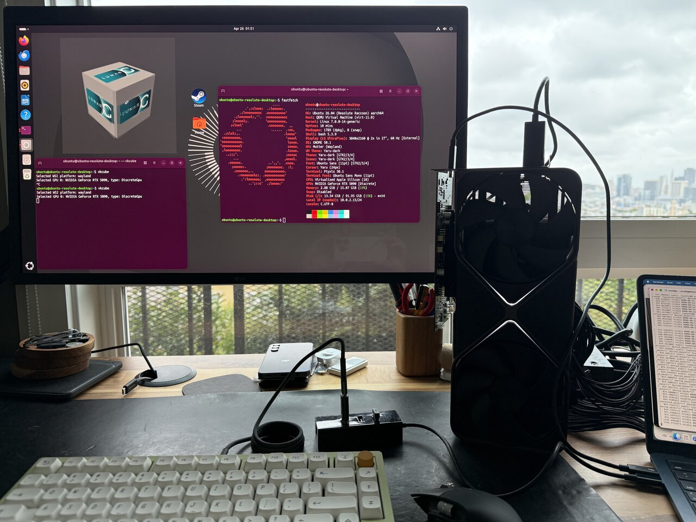
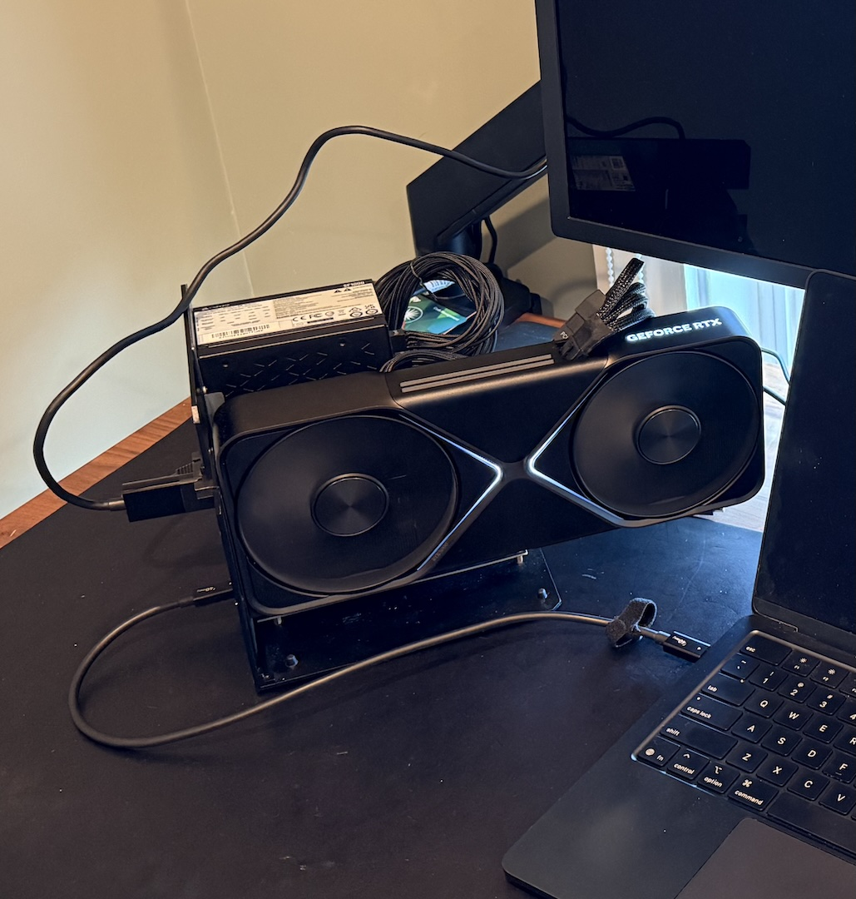

# RTX 5090 + M4 MacBook Air: Can it Game?
- Source URL: https://scottjg.com/posts/2026-05-05-egpu-mac-gaming/
- Submitted URL: https://share.google/o9Z1nS6Laq82pI8KB
- GeekNews URL: https://news.hada.io/topic?id=29527
- Published: 2026-05-05T10:17:25-08:00
- Description: What if you could strap a full desktop GPU to your MacBook Air? Turns out, you can.
## Source Preservation Note
This Markdown preserves the accessible public HTML article body. Figures were downloaded locally where possible and rewritten to `figures/` paths. GeekNews Korean summary/comments are preserved separately in `hada-summary.ko.md`.

*Figure caption: Strap a 600W GPU to your 22W CPU*

What if you could strap a full desktop GPU to your MacBook Air? Turns out, you can.
Just a quick FTC required note: When you buy through my links, I may earn a commission.
# Never tell me the odds
As much as I hate to admit it, step one in most of my projects now is to ask AI about it. Maybe it’ll tell me something I don’t know.
Fortunately, borderline-impractical is kind of my thing.
## What’s a Thunderbolt eGPU?
Ok, so the plan is to plug a big PC gaming GPU, an NVIDIA RTX 5090, into my M4 MacBook Air. To do that, we plug it into a Thunderbolt dock which adapts PCIe to Thunderbolt, and we plug that into a USB-C port.
Thunderbolt tunnels PCIe over a USB-C cable, so from the computer’s perspective a Thunderbolt device really is a PCIe device, not a USB one. You get 4 PCIe lanes at up to 40Gbps on Thunderbolt 4, with a small performance penalty for the tunneling. USB4 includes the same PCIe tunneling as an optional feature, so some non-Thunderbolt USB4 ports can do this too. You can use this to plug a GPU into a laptop with a compatible port.

*Figure caption: Thunderbolt from the laptop plugs into the GPU dock . The GPU plugs into the monitor via DisplayPort. Shortly after this was taken, I broke this dock.*
From the computer’s perspective, the device looks more or less like a slightly slower PCIe device, so you can usually use the same drivers you’d normally use for those devices. eGPUs work pretty much out of the box on Linux and Windows. [It’s even possible to use one on a Raspberry Pi](https://scottjg.com/posts/2026-01-08-crappy-computer-showdown/) (albeit with [Oculink](https://en.wikipedia.org/wiki/PCI_Express#PCI_Express_OCuLink), not Thunderbolt).
The first hurdle is that macOS does not ship with drivers for NVIDIA or AMD GPUs on Apple Silicon.
## What about tinygrad?
[tinygrad recently released their own macOS eGPU drivers](https://x.com/__tinygrad__/status/2039213719155310736). It’s a whole new AI stack with its own open source driver pipeline for NVIDIA and AMD hardware.
Sadly, if your main objective is to run AI inference or play games, tinygrad probably isn’t the solution you’re looking for. [This video by YouTuber Alex Ziskind](https://www.youtube.com/watch?v=C4KWsmezXm4) shows that using an eGPU via tinygrad for inference is about **10 times slower** than running native Metal inference directly on an M4 Pro without an eGPU. You can only use the tinygrad eGPU driver with the tinygrad stack, not for anything else. It also has very limited support for different AI models.
Getting NVIDIA PTX code running on the GPU is one thing. Writing a full general-purpose display driver that works with arbitrary software is a significantly harder problem. So for now, **what can you actually do with an eGPU and a Mac?**
## The existing Linux driver
[Linux can run on Apple Silicon Macs now](https://asahilinux.org). Regrettably, at this time, the Linux kernel does not support Thunderbolt on Apple Silicon (only internal devices and USB3). But…
You can run Linux in a 64-bit ARM VM on a macOS host. macOS supports Thunderbolt devices. Linux supports NVIDIA GPUs. Let’s put the pieces together and pass through the GPU into the Linux VM.
At a high level, we’re just going to put the GPU in the Linux VM. The VM is the same architecture as the Mac host (arm64), so performance should be comparable. Of course, the devil is in the details.
> There is no driver for NVIDIA cards on ARM64 Windows. That’s why we use Linux.
For a quick video demo of the result, take a look:
In the rest of the post, I’ll go through the long and winding road of getting this to actually work. If you just want to see screenshots and benchmarks, you can probably skip to the [benchmark section](https://scottjg.com/posts/2026-05-05-egpu-mac-gaming/#benchmarks).
# Engineering PCI Passthrough on macOS
## PCI device basics
Let’s look at two things we need working for the VM to talk to the PCI device:
1. **PCI BAR (Base Address Registers)** - Each PCI device communicates through chunks of memory that the computer can read and write to. There’s basically a reserved region of memory on your computer for each device. Those memory regions have to be mirrored into the VM for PCI passthrough to work.
2. **DMA (Direct Memory Access)** - This is how the device can read and write information directly in/out of your computer’s memory. Instead of having the CPU burn cycles copying data from the device, the device can copy the memory automatically. For a GPU, it might be used to copy textures directly from the computer’s memory into its own video memory.
## Mapping PCI BARs
When QEMU starts a VM, it sets up the guest’s memory layout. For normal RAM, this boils down to a call to [hvf_set_phys_mem()](https://github.com/qemu/qemu/blob/master/accel/hvf/hvf-all.c#L81) in QEMU, which uses the `Hypervisor.framework` method:
```
hv_vm_map
(mem, guest_physical_address, size, HV_MEMORY_READ
|
 HV_MEMORY_WRITE
|
 HV_MEMORY_EXEC);
```
Next, we connect to the host PCIDriverKit driver and ask to map the memory from the PCI device into our process. (I’m leaving the driver-side code out for now, but it’s very similar boilerplate.)
```
// map BAR0 into the current process and set `addr` to the location

// where it was mapped

mach_vm_address_t
 addr
=

0
;

mach_vm_size_t
 size
=

0
;

IOConnectMapMemory64
(driverConnection,
0
,
mach_task_self
(),
&
addr,
&
size, kIOMapAnywhere);
```
Ok, so then we have `addr`, which now points to the BAR0 memory that we can access directly in our process. At this point you can just read and write stuff to it, like any other piece of memory.
```
volatile

uint32_t

*
bar0
=
 (
volatile

uint32_t

*
)addr;

printf
(
"BAR0[0] = %x
\n
"
, bar0[
0
]);

// this would output: BAR0[0] = 0x1b2000a1

// which is a device-specific constant that describes my RTX 5090

//

// BAR0[0] is the BOOT_0 register. The fields break down as:

//   arch      = 0x1b  → GB200 GPU family

//   impl      = 0x2   → GB202 die (RTX 5090)

//   major_rev = 0xa   → stepping A

//   minor_rev = 0x1   → revision 1  (together: stepping A1)
```
Now we just make sure QEMU calls `hvf_set_phys_mem()` for our device memory, and we can map that into the guest. When guest code touches that mapping, it talks directly to the GPU with minimal host overhead. This is the best case for performance. At least, in theory.
In practice, as soon as the VM touched the PCI BAR memory, the host kernel crashed.
If you’ve never experienced this before, it’s disorienting. Your entire computer will hang, and because the trackpad feedback is controlled by software, suddenly the trackpad will no longer click. The dogs and cats in your neighborhood start howling. Pictures fall off the walls of your house. Eventually your computer will reboot, and you will be presented with this dialog.
Ok, so we can’t map device memory directly, but we have other tricks up our sleeve. We can trap every access to the memory, exit the guest back into QEMU, and have QEMU forward each read or write to the device. That keeps behavior correct, but it’s brutally slow. In many workloads the pain is elsewhere. Most of the performance-sensitive work is DMA, but some paths still care how fast you can push commands through the BAR.
I started preparing a bug report for Apple and wrote a small reproduction (well, AI-assisted) to demonstrate the issue:
```
#include

<Hypervisor/Hypervisor.h>


#include

<IOKit/IOMapTypes.h>


#include

<libkern/OSCacheControl.h>


#include

<stdlib.h>


#include

<string.h>


#include

<unistd.h>


#define FAIL(code) do { result->status = (code); goto cleanup; } while (0)


#define HV_CHECK(expr, code) do { \

    if ((expr) != HV_SUCCESS) FAIL(code); \

} while (0)


#define PREFETCHABLE_MASK 0x08

#define SELECTOR_GET_BAR_INFO 10

#define GUEST_CODE_IPA  0x4000ULL

#define GUEST_BAR_IPA   0x10000000ULL


static

const

uint32_t
 prog_read[]
=
 {


0xf9400001
,
/* ldr x1, [x0] */


0xd4000002
,
/* hvc #0       */


0xd4200000
,
/* brk #0       */


};


int


vfio_guest_bar_touch_run
(
io_connect_t
 connection,
uint8_t
 bar,

                         VFIOGuestBarTouchResult
*
result)

{


size_t
 page
=
 (
size_t
)
sysconf
(_SC_PAGESIZE);


void

*
code
=
 NULL;


bool
 vm_up
=
 false, vcpu_up
=
 false, bar_mapped
=
 false;


hv_vcpu_t
 vcpu
=

0
;


hv_vcpu_exit_t

*
exit_info
=
 NULL;


mach_vm_address_t
 bar_addr
=

0
;


mach_vm_size_t
 bar_size
=

0
;


memset
(result,
0
,
sizeof
(
*
result));


uint64_t
 bar_in[
1
]
=
 { bar };


uint64_t
 bar_out[
3
]
=
 {
0
};


uint32_t
 bar_cnt
=

3
;


if
 (
IOConnectCallMethod
(connection, SELECTOR_GET_BAR_INFO,

                            bar_in,
1
, NULL,
0
,

                            bar_out,
&
bar_cnt, NULL, NULL)
!=
 KERN_SUCCESS) {


FAIL
(VFIO_GUEST_BAR_TOUCH_MAP_BAR_FAILED);

    }

    result
->
barType
=
 (
uint8_t
)bar_out[
2
];


    IOOptionBits opts
=
 kIOMapAnywhere;


if
 (result
->
barType
&
 PREFETCHABLE_MASK)

        opts
|=
 kIOMapWriteCombineCache;


if
 (
IOConnectMapMemory64
(connection,
1u

+
 bar, mach_task_self_,


&
bar_addr,
&
bar_size, opts)
!=
 KERN_SUCCESS) {


FAIL
(VFIO_GUEST_BAR_TOUCH_MAP_BAR_FAILED);

    }

    bar_mapped
=
 true;

    result
->
hostBARAddress
=
 (
uint64_t
)bar_addr;

    result
->
mappedSize
=
 (
uint64_t
)bar_size;


if
 (page
==

0

||
 (bar_size
%
 page)
!=

0
)


FAIL
(VFIO_GUEST_BAR_TOUCH_MAP_BAR_FAILED);


if
 (
posix_memalign
(
&
code, page, page))


FAIL
(VFIO_GUEST_BAR_TOUCH_ALLOC_FAILED);


memset
(code,
0
, page);


memcpy
(code, prog_read,
sizeof
(prog_read));


sys_icache_invalidate
(code, page);


HV_CHECK
(
hv_vm_create
(NULL), VFIO_GUEST_BAR_TOUCH_HV_VM_CREATE_FAILED);

    vm_up
=
 true;


HV_CHECK
(
hv_vm_map
(code, GUEST_CODE_IPA, page,

                       HV_MEMORY_READ
|
 HV_MEMORY_WRITE),

             VFIO_GUEST_BAR_TOUCH_HV_MAP_CODE_FAILED);


HV_CHECK
(
hv_vm_map
((
void

*
)(
uintptr_t
)bar_addr, GUEST_BAR_IPA,

                       (
size_t
)bar_size,

                       HV_MEMORY_READ
|
 HV_MEMORY_WRITE),

             VFIO_GUEST_BAR_TOUCH_HV_MAP_BAR_FAILED);


HV_CHECK
(
hv_vcpu_create
(
&
vcpu,
&
exit_info, NULL),

             VFIO_GUEST_BAR_TOUCH_HV_VCPU_CREATE_FAILED);

    vcpu_up
=
 true;


hv_vcpu_set_reg
(vcpu, HV_REG_PC, GUEST_CODE_IPA);


hv_vcpu_set_reg
(vcpu, HV_REG_X0, GUEST_BAR_IPA);


hv_vcpu_set_reg
(vcpu, HV_REG_CPSR,
0x3c5
);


HV_CHECK
(
hv_vcpu_run
(vcpu), VFIO_GUEST_BAR_TOUCH_HV_VCPU_RUN_FAILED);


    result
->
exitReason
=
 exit_info
->
reason;

    result
->
syndrome
=
 exit_info
->
exception.syndrome;

    result
->
virtualAddress
=
 exit_info
->
exception.virtual_address;

    result
->
physicalAddress
=
 exit_info
->
exception.physical_address;


hv_vcpu_get_reg
(vcpu, HV_REG_PC,
&
result
->
programCounter);


hv_vcpu_get_reg
(vcpu, HV_REG_X0,
&
result
->
x0);


hv_vcpu_get_reg
(vcpu, HV_REG_X1,
&
result
->
x1);


cleanup:


if
 (vcpu_up)
hv_vcpu_destroy
(vcpu);


if
 (vm_up)
hv_vm_destroy
();


if
 (bar_mapped)
IOConnectUnmapMemory64
(connection,
1u

+
 bar,

                                           mach_task_self_, bar_addr);


free
(code);


return
 result
->
status;

}
```
In ~100 lines of C, you can spin up a VM, map the device BAR into the guest, and run code that touches it. I’m still not sure whether that was more frustrating or encouraging, but that version ran without crashing, while QEMU was still panicking the host. I was stumped for a while. Was it the guest page tables? Was the BAR colliding with guest RAM in some subtle way? Why were the dogs and cats still howling?
Eventually, in my desperation, I asked an AI coding assistant to compare my sample and QEMU. It immediately flagged that my mapping used `HV_MEMORY_READ | HV_MEMORY_WRITE` while QEMU used `HV_MEMORY_READ | HV_MEMORY_WRITE | HV_MEMORY_EXEC`. Alas, bested again by AI. Not even silly blog projects are safe anymore (mostly kidding).
The workaround in QEMU was a small change:
```
diff --git a/accel/hvf/hvf-all.c b/accel/hvf/hvf-all.c

index 5f357c6d19..76cec4655b 100644

--- a/accel/hvf/hvf-all.c

+++ b/accel/hvf/hvf-all.c

@@ -114,7 +114,15 @@ static void hvf_set_phys_mem(MemoryRegionSection *section, bool add)

         return;

     }


-    flags = HV_MEMORY_READ | HV_MEMORY_EXEC | (writable ? HV_MEMORY_WRITE : 0);

+    flags = HV_MEMORY_READ | (writable ? HV_MEMORY_WRITE : 0);

+    /*

+     * Leave RAM-device/MMIO mappings RW-only: on macOS, accessing them through

+     * executable HVF mappings can panic the host kernel. Ordinary guest RAM

+     * still needs EXEC.

+     */

+    if (!memory_region_is_ram_device(area)) {

+        flags |= HV_MEMORY_EXEC;

+    }

     mem = memory_region_get_ram_ptr(area) + section->offset_within_region;


     trace_hvf_vm_map(gpa, size, mem, flags,
```
It works, but it’s not perfect. ARM has several flavors of device memory (the [Device-nGnRnE/nGnRE/nGRE/GRE](https://developer.arm.com/documentation/102376/0200/Device-memory/Sub-types-of-Device) family), with different rules for whether writes can be gathered, reordered, or acknowledged early. It’s roughly analogous to x86 [write-combining](https://en.wikipedia.org/wiki/Write_combining) on the most permissive end.
On real hardware, the prefetchable BARs on my GPU are supposed to allow gathering, which makes them several times faster for bulk writes than BAR0. But `hv_vm_map()` has no flags to configure this, so every device mapping ends up as the strictest nGnRnE. There’s nothing we can do about it, and it’s still ~30x faster than trapping every access, but it makes writing the BAR ~10x slower than it would be normally.
## DMA
This was by far the sketchiest part of the project. To start, let’s go over how this works on a PC running Linux with VM PCI-passthrough, and then we’ll compare to our challenge on macOS.
When there’s just a computer talking to a device (no VM involved), they can talk together directly. The PC will tell the device “hey I got that DMA buffer ready at this memory address” and the device can access that memory directly (AKA DMA). Easy.
When a VM is involved, it’s more complicated. Guest physical addresses don’t correspond to host physical addresses. The VM’s RAM is just some chunk of host memory allocated wherever it was available. So if the guest tells the device “DMA into 0x00000000,” the device will happily scribble over whatever actually lives there on the host. The simplest fix is two things:
1. [Pin](https://en.wikipedia.org/wiki/Virtual_memory#Pinned_pages) all guest memory so it can’t be paged out while the device might touch it.
2. Put a hardware unit called the [IOMMU](https://en.wikipedia.org/wiki/Input%E2%80%93output_memory_management_unit) between the device and host memory. The hypervisor programs it with the guest → host translations, and every DMA request from the device gets remapped on the fly.
This is a blunt solution. The guest doesn’t have to do anything special, but the host has to keep all guest RAM pinned. There are more advanced approaches (like a virtual IOMMU), but they’re outside the scope of this post.
### DMA on Apple Silicon
On Apple Silicon, there’s a hardware unit called DART that’s more or less equivalent to an IOMMU. It’s not specific to VMs; it also acts as a security boundary, preventing devices from accessing arbitrary host memory. Ideally we’d just use DART the same way Linux uses the IOMMU in the simple case above.
Unfortunately, DART (at least via PCIDriverKit for Thunderbolt devices) has some hard constraints:
- **~1.5GB mapping limit.** A VM with 1.5GB of RAM can technically boot, but CUDA runs out of memory and any modern game needs 8–16GB.
- **~64k mapping cap.** With many small DMA buffers the mapping table fills up.
- **No address or alignment control.** PCIDriverKit assigns mapped addresses for you. You can’t pick them, or specify alignment constraints. This rules out a virtual IOMMU, which requires the guest to choose its own DMA addresses.
The 1.5GB ceiling was the biggest initial blocker. I tried a few workarounds: pre-mapping ranges where I guessed DMAs might land (obviously didn’t work), and using a [`restricted-dma-pool`](https://lwn.net/Articles/841916/) device tree attribute to force all DMA through a pre-allocated region. The restricted pool approach actually works for simpler devices, but GPU drivers are too weird to fit into that model. (If you’re curious about the specifics, there’s [a qemu-devel thread](https://lore.kernel.org/qemu-devel/DHNKXKNWFI3S.P78ERGSFU3RQ@gmail.com/) where I discuss it.)
### apple-dma-pci
I ended up designing a new virtual PCI device in QEMU called `apple-dma-pci`. It gets inserted into the VM alongside the passed-through GPU, and a companion kernel driver in the guest intercepts the NVIDIA driver’s DMA mapping calls. The solution is, frankly, a very upsetting hack, but it works.
Because mappings are created on demand per DMA request and torn down when the buffer is freed, we reduce the amount of mapped memory we need at any given time. Only the working set of *live* DMA buffers at any given moment has to fit in our 1.5GB limit, as opposed to the entirety of guest memory.
The guest driver is loaded early (via an `/etc/modules-load.d/` config), so it can find the GPU at probe time and swap in custom DMA ops before the NVIDIA driver touches it:
```
static

struct
 dma_map_ops apple_dma_ops
=
 {

    .map_page
=
 apple_dma_map_page,

    .unmap_page
=
 apple_dma_unmap_page,

    .map_sg
=
 apple_dma_map_sg,

    .unmap_sg
=
 apple_dma_unmap_sg,

    .alloc
=
 apple_dma_alloc,

    .free
=
 apple_dma_free,

};


static

int

apple_dma_pci_probe
(
struct
 pci_dev
*
pdev,


const

struct
 pci_device_id
*
id)

{


struct
 pci_dev
*
gpu
=

pci_get_device
(PCI_VENDOR_NVIDIA,

                                         PCI_ANY_ID, NULL);


if
 (
!
gpu)


return

-
ENODEV;


set_dma_ops
(
&
gpu
->
dev,
&
apple_dma_ops);


pci_dev_put
(gpu);


return

0
;

}
```
Each of the custom ops is a thin wrapper. It marshals its arguments into a small request, writes it into memory for the `apple-dma-pci` virtual BAR, kicks a doorbell register, and waits for a reply. On the host side, QEMU picks up the request, hands it off to the PCIDriverKit driver, which performs the actual DART mapping, and the resulting DMA address gets written back to guest memory. The NVIDIA driver shouldn’t know the difference.
### NVIDIA alignment quirk
It didn’t immediately work well, though. While the driver initially loaded and initialized the card, I was greeted with this fun kernel log message as soon as I attempted to run a CUDA workload:
```
[  456.194883] NVRM: nvAssertOkFailedNoLog: Assertion failed: The offset passed is not valid [NV_ERR_INVALID_OFFSET] (0x00000037) returned from pRmApi->Alloc(pRmApi, device->session->handle, isSystemMemory ? device->handle : device->subhandle, &physHandle, isSystemMemory ? NV01_MEMORY_SYSTEM : NV01_MEMORY_LOCAL_USER, &memAllocParams, sizeof(memAllocParams)) @ nv_gpu_ops.c:4972
[  456.371282] NVRM: GPU0 nvAssertFailedNoLog: Assertion failed: 0 == (physAddr & (RM_PAGE_SIZE_HUGE - 1)) @ mem_mgr_gm107.c:1312
[  456.372020] NVRM: nvAssertOkFailedNoLog: Assertion failed: The offset passed is not valid [NV_ERR_INVALID_OFFSET] (0x00000037) returned from pRmApi->Alloc(pRmApi, device->session->handle, isSystemMemory ? device->handle : device->subhandle, &physHandle, isSystemMemory ? NV01_MEMORY_SYSTEM : NV01_MEMORY_LOCAL_USER, &memAllocParams, sizeof(memAllocParams)) @ nv_gpu_ops.c:4972
```
If you recall the earlier DMA section, we noted that we can’t control the alignment of DMA-mapped buffers. Bummer. At this point, I dug into the driver to try to see if there was something simple we could patch.
Here’s the relevant segment:
```

if
 (type
==
 UVM_RM_MEM_TYPE_SYS) {


if
 (size
>=
 UVM_PAGE_SIZE_2M)

            alloc_info.pageSize
=
 UVM_PAGE_SIZE_2M;


else

if
 (size
>=
 UVM_PAGE_SIZE_64K)

            alloc_info.pageSize
=
 UVM_PAGE_SIZE_64K;


        status
=

uvm_rm_locked_call
(
nvUvmInterfaceMemoryAllocSys
(gpu
->
rm_address_space, size,
&
gpu_va,
&
alloc_info));


// TODO: Bug 5042223


if
 (status
==
 NV_ERR_NO_MEMORY
&&
 size
>=
 UVM_PAGE_SIZE_64K) {


UVM_ERR_PRINT
(
"nvUvmInterfaceMemoryAllocSys alloc failed with big page size, retry with default page size
\n
"
);

            alloc_info.pageSize
=
 UVM_PAGE_SIZE_DEFAULT;

            status
=

uvm_rm_locked_call
(
nvUvmInterfaceMemoryAllocSys
(gpu
->
rm_address_space, size,
&
gpu_va,
&
alloc_info));

        }

    }
```
By adding more debug logging in the module, I could see it was a 16MB allocation of type `UVM_RM_MEM_TYPE_SYS`. So, it uses the largest (2MB) page size. Ironically, there is already a workaround here when the allocation fails. It’ll just try again with a smaller page size. It just doesn’t take into account the different error code for alignment (`NV_ERR_INVALID_OFFSET`).
So… if we expand the status check to include this new error, it will fall back to reallocating the memory, and everything works!
Ok, but that’s really annoying to have to patch the driver. Whenever a new driver release comes out, you have to patch it again. I guess I could maintain a fork of the driver, and automatically generate a parallel set of packages that my system could run from, but I was wondering if there was a way to make the existing mainline driver work.
What if we could hot-patch the call to `nvUvmInterfaceMemoryAllocSys()`, and make it always use a smaller page size?
The Linux kernel’s [kprobes](https://www.kernel.org/doc/html/latest/trace/kprobes.html) feature lets you attach a handler to the entry of any kernel function. Inside the handler, you get the CPU registers at that point, which means you can inspect or *mutate* the function’s arguments before it runs. A simplified version of the patch looks like this:
```
/* Must match the driver's internal layout */


struct
 uvm_alloc_info {


/* ... other fields ... */


    u64 pageSize;


/* ... other fields ... */


};


/* nvUvmInterfaceMemoryAllocSys(address_space, size, gpu_va_out, alloc_info)

 * arm64 ABI: args are in x0, x1, x2, x3 — alloc_info is the 4th arg. */


static

int

pre_alloc_sys
(
struct
 kprobe
*
p,
struct
 pt_regs
*
regs)

{


struct
 uvm_alloc_info
*
info
=
 (
void

*
)regs
->
regs[
3
];


/* Force smaller pages so DART's 16KB mappings always satisfy alignment. */


    info
->
pageSize
=
 UVM_PAGE_SIZE_DEFAULT;


return

0
;

}


static

struct
 kprobe kp
=
 {

    .symbol_name
=

"nvUvmInterfaceMemoryAllocSys"
,

    .pre_handler
=
 pre_alloc_sys,

};


static

int
 __init
patch_init
(
void
)  {
return

register_kprobe
(
&
kp); }

static

void
 __exit
patch_exit
(
void
) {
unregister_kprobe
(
&
kp); }
```
Loading this kernel module would turn every call to `nvUvmInterfaceMemoryAllocSys()` into one that requests the default (small) page size, with no changes to the NVIDIA driver itself.
I suspect other drivers may need similar fixes for various types of “quirks,” and since we already load a driver for `apple-dma-pci`, I added a quirks section of code that applies patches like this one automatically.
At this point, the NVIDIA driver works for simple workloads.
### Coalescing mappings
Great! Now the driver works and basic workloads seem to run. Unfortunately, if you really crank up the settings in games, we start to create tons of tiny mappings that run over the total ~64k mapping count limit. Recall that we mentioned [earlier](https://scottjg.com/posts/2026-05-05-egpu-mac-gaming/#dma-on-apple-silicon) that this could be a problem. Initially I thought it might be exacerbated with the driver patch we were applying, but it turns out that’s not the case. We hit the limits either way.
I had gotten this far, and I wasn’t ready to just give up. After logging all the mappings and looking at the distribution, it seemed like 90%+ of the mappings were 4kB. They weren’t often contiguous, so it wasn’t obvious that we could join them to reduce overall map counts, but they did appear in clusters.
I came up with a scheme to look at memory in terms of larger clusters. We’d divide all guest memory into fixed-size regions (say, 256kB). When the driver asks to map a 4kB buffer, we map the whole 256kB cluster it falls inside, and any later allocations that land in the same cluster reuse that mapping.
There are a few edge cases worth mentioning. A buffer that straddles two clusters doesn’t fit neatly into this scheme, so in that case we just fall back to mapping it directly, outside the cluster allocator. In practice that only happens for a small fraction of allocations. Cluster lifetime is handled via reference counting. When the last live 4kB buffer inside a cluster is freed, the cluster is automatically unmapped, so we’re not holding on to DART mappings any longer than we need to.
The scheme does end up mapping slightly more total memory than strictly necessary. Each cluster has some “slop” bytes that aren’t actually backing any live buffer. Thankfully, in practice, we still stay under the ~1.5GB mapping ceiling for workloads I tested. What really mattered was cutting the mapping *count* back under 64k. In the workloads I tried, the number of live mappings dropped by roughly 4x, which was more than enough headroom to run demanding games at the highest settings.
This isn’t a performance-sensitive path. Mappings mostly happen while games are loading, not while they’re running, but the change does speed things up anyway. The clustering happens purely in the guest driver, so we now call into the host less often to create DART mappings.
## Other performance concerns
Now, with a relatively stable base for the PCI passthrough part of the project, I pivoted to looking at overall VM performance. Progress is not always a straight line, but for the sake of artistic license (yes, this blog is my art), I’m just going to include the things that weren’t dead ends.
### Scheduling
When testing things out, I noticed performance was very inconsistent, and often pretty slow. Benchmark scores were swinging wildly, often appearing 50% slower at random. I am a little embarrassed by how long it took me to figure this one out, but it turns out that QEMU doesn’t set any priority for the vCPU threads. I’m not sure if the scheduler was deprioritizing it because it’s kind of a background thread, or if it’s just bad luck, but it seemed like the scheduler was just not giving the VM a lot of time to run during a lot of my benchmark runs.
There are a bunch of different APIs for manipulating your process priority in macOS. I tried a few and settled on these, which seemed to meaningfully help. I patched them into QEMU so when the vCPU started, it would gain a much higher priority:
```
diff --git a/accel/hvf/hvf-accel-ops.c b/accel/hvf/hvf-accel-ops.c

index b74a5779c3..5b6337cd17 100644

--- a/accel/hvf/hvf-accel-ops.c

+++ b/accel/hvf/hvf-accel-ops.c

@@ -162,6 +162,18 @@ static void *hvf_cpu_thread_fn(void *arg)


     rcu_register_thread();


+    pthread_set_qos_class_self_np(QOS_CLASS_USER_INTERACTIVE, 0);

+

+    {

+        struct sched_param param;

+        param.sched_priority = sched_get_priority_max(SCHED_RR);

+        pthread_setschedparam(pthread_self(), SCHED_RR, &param);

+    }

+

     bql_lock();

     qemu_thread_get_self(cpu->thread);
```
### Total store ordering
The VM I’ve been describing is arm64 Linux, but almost no shipping games run on ARM natively. They’re x86-64 Windows binaries. To actually play them, you stack [Proton](https://en.wikipedia.org/wiki/Proton_(software)) (Valve’s WINE fork, to implement the Windows API) on top of [FEX-Emu](https://fex-emu.com) (JIT x86-64 to aarch64). That translation layer has one non-obvious concern: x86 and ARM have different [memory ordering](https://en.wikipedia.org/wiki/Memory_ordering) rules. x86 uses **Total Store Ordering** (TSO), where stores from one core become visible to others in program order. ARM’s model is much weaker and can reorder almost anything without explicit barriers. A lot of code relies on plain loads and stores between threads, so emulating x86 on ARM either needs expensive barriers everywhere, or things crash in subtle ways.
Apple Silicon has an escape hatch: a per-thread hardware **TSO mode**. Flip bit 1 of [`ACTLR_EL1`](https://developer.arm.com/documentation/111107/2026-03/AArch64-Registers/ACTLR-EL1--Auxiliary-Control-Register--EL1-) on a vCPU, and every load and store on that thread follows x86-style ordering, no barriers required. Apple exposes this through `Hypervisor.framework` on macOS 15+. On the Linux side, Hector Martin [posted a Linux kernel patch series](https://lore.kernel.org/lkml/20240411-tso-v1-0-754f11abfbff@marcan.st/) in 2024 that adds `PR_SET_MEM_MODEL` prctls to flip the bit per-thread. Upstream never merged it, but Asahi’s kernel carries it.
QEMU doesn’t expose TSO either, but [UTM](https://mac.getutm.app) (a fork of QEMU with a macOS GUI) carries a patch that enables it for the whole vCPU. I have cribbed it for my testing:
```
diff --cc target/arm/hvf/hvf.c

index f5d7221845,ebae2886d3..0000000000

--- a/target/arm/hvf/hvf.c

+++ b/target/arm/hvf/hvf.c

@@@ -1358,8 -1352,21 +1358,23 @@@ int hvf_arch_init_vcpu(CPUState *cpu

                                arm_cpu->isar.idregs[ID_AA64MMFR0_EL1_IDX]);

      assert_hvf_ok(ret);


+     if (__builtin_available(macOS 15, *)) {

+         uint64_t actlr;

+         ret = hv_vcpu_get_sys_reg(cpu->accel->fd,

+                                   HV_SYS_REG_ACTLR_EL1, &actlr);

+         assert_hvf_ok(ret);

+         actlr |= (1 << 1); /* Apple TSO enable bit */

+         ret = hv_vcpu_set_sys_reg(cpu->accel->fd,

+                                   HV_SYS_REG_ACTLR_EL1, actlr);

+         assert_hvf_ok(ret);

+     } else {

+         error_report("HVF TSO mode requires macOS 15 or later");

+         return -ENOTSUP;

+     }


      aarch64_add_sme_properties(OBJECT(cpu));

      return 0;
```
With that bit set, I can disable the FEX-Emu software TSO emulation. Toggling the software TSO emulation has clear side effects. If you turn it off without the hardware bit, Geekbench 6 crashes partway through.
I eventually realized FEX can detect the TSO flag automatically if you run a kernel with Hector’s patch (the default in Asahi Linux). His patch adds a `prctl()` that lets a process query the CPU’s TSO state and set the flag for itself. The kernel then saves and restores the bit on context switches, per-process.
I wanted to avoid requiring a custom kernel. Implementing this purely with kprobes would mean patching code that runs on every context switch, which felt risky. But detecting the TSO bit from inside the kernel is easy, so I added another “quirk” to the `apple-dma-pci` driver, similar to the one earlier. When it sees the TSO bit set (QEMU sets it before the VM boots), it installs a kprobe on `prctl()` that mimics the getter/setter from Hector’s patch. The setter is really a no-op, but FEX can still query the flag and switch itself to the faster mode that skips TSO emulation.
Below, you can see the performance implications of the different layers of virtualization/emulation:
For the sake of the rest of the post, we focus on:
- **Host performance** - This tells you the best performance you can expect from the CPU, without any emulation layers.
- **Guest performance under FEX with CPU TSO on** - This tells you the best performance you can expect from the CPU when we try to play x86 games. Trouble is, you can see this is around *50% less* than native host performance.
# Benchmarks
If you’re a software engineer, hopefully you enjoyed the story so far. If you’re not, then this is where you probably want to start.
We’re going to answer the question you probably never asked: If you hook an RTX 5090 to the MacBook Air, does it make games perform better? What about AI inference?
## CPU comparison
Gaming performance isn’t just about how fast your GPU can run, it’s also about your CPU. Let’s start with a CPU benchmark comparison, just to level-set what the machine is capable of.
If you look at the chart, you can see Apple Silicon Macs are extremely fast. They’re some of the fastest consumer CPUs you can buy, and they do it at a fraction of the power consumption of comparable Intel chips.
The catch is that emulating x86 through FEX costs us roughly 50% of that performance right off the bat. You can see the M4 MacBook Air is really affected by that. The performance becomes worse than a 2020 Intel-based MacBook Pro. The M5 Max MacBook Pro, on the other hand, is in decent shape. The performance is pretty close to my older gaming PC, which is no slouch.
## Cyberpunk 2077
Let’s run Cyberpunk 2077 across six setups:
- M4 Air running native macOS
- M4 Air with the eGPU through an ARM Linux VM, using FEX to emulate x86
- 2020 Intel MacBook Pro running Linux natively (no VM, no FEX) with the same eGPU
- M5 Max MacBook Pro running native macOS
- M5 Max with the eGPU through an ARM Linux VM
- Older gaming PC (i5-12600K) with the same RTX 5090 plugged in over native PCIe
> “+ Framegen” uses DLSS 4x for the eGPU/native PCIe configurations and FSR 2x for the native macOS configurations (DLSS is NVIDIA-only, and isn’t available on macOS).
### 720p Low
At 720p Low, the GPU barely breaks a sweat, so the CPU and emulation/virtualization overhead dominate.
- **M5 Max on native macOS wins with 200fps.** With such a powerful CPU, and unshackled from emulation/virtualization layers, perf is excellent.
- **The gaming PC follows at 180fps.** With this little load on the GPU, the desktop CPU isn’t able to pull as far ahead as you’d expect.
- **M4 Air native (61fps) actually beats M4 Air + eGPU (49fps).** At 720p Low the integrated GPU has enough headroom, and we save the cost of FEX + virtualization. This is the only resolution where going native pays off on the M4 Air.
- **M5 Max + eGPU (73fps) is far slower than M5 Max native.** Now hamstrung with emulation/virtualization overhead, you can see how much performance we lose (2.7x).
### 1080p
At 1080p the GPU starts to matter more, but the integrated GPUs can still hang on at the lighter settings.
- **The gaming PC is the clear winner across the board.** 161fps at High, 105fps at RT Ultra, and a wild 407fps with DLSS framegen.
- **M5 Max on native macOS crushes 1080p High at 131fps without any eGPU at all.** It also handles RT Ultra at 59fps, or 88fps with FSR framegen. If you’re OK playing at 1080p, you’re already set without any of this project.
- **At 1080p High, M5 Max native (131fps) is faster than M5 Max + eGPU (68fps).** Same story as 720p. The integrated GPU is plenty for this resolution, and the emulation/virtualization overhead hurts.
- **M4 Air on native macOS is still unplayable at RT Ultra (7fps).** FSR framegen only doubles it to 13fps, which is still unplayable.
- **M4 Air + eGPU brings the M4 Air to 30fps at RT Ultra and 119fps with framegen.** Big improvement over native.
- **The 2020 MBP + eGPU performs comparably to the M4 Air + eGPU.** Same GPU, similar effective CPU once you account for FEX.
### 4K
At 4K, the GPU becomes the bottleneck.
- **The gaming PC dominates again: 100fps at RT Ultra and 282fps with DLSS framegen.** It helps to have no overhead from Thunderbolt on the GPU, and no virtualization/emulation penalty.
- **M5 Max native manages 25fps at 4K RT Ultra, or 42fps with FSR framegen.** Borderline playable. Even without an eGPU, the integrated GPU on the M5 Max can almost get you there at 4K with ray tracing.
- **M5 Max + eGPU is solidly playable at 47fps on 4K RT Ultra, and 145fps with framegen.**
- **M4 Air native is hopeless at 4K.**
- **M4 Air + eGPU brings the same machine to 27fps at RT Ultra and 111fps with DLSS framegen.** This is the most dramatic example of what attaching the GPU does. From completely unplayable to totally playable at 4K.
- **2020 MBP + eGPU is again comparable to M4 Air + eGPU.**
### Takeaways
- **At 720p, native beats eGPU.** When the GPU isn’t the bottleneck, the FEX + virtualization overhead matters more than the GPU upgrade.
- **At higher resolutions, the eGPU is essential for the M4 Air.** It takes Cyberpunk from “completely unplayable” (~3fps at 4K RT Ultra) to “totally playable” (27fps, or 111fps with framegen).
- **The M5 Max with eGPU is roughly 30–70% faster than the M4 Air with the same eGPU.** This is purely the M5’s CPU advantage showing through.
- **The gaming PC with native PCIe is still ~2x faster than the M5 Max + eGPU.** Thunderbolt + virtualization + x86 emulation costs you a lot compared to a native PC. There’s just no way around it.
- **The M5 Max’s integrated GPU is genuinely impressive.** Without an eGPU at all, it can hit 131fps at 1080p High and 88fps at 1080p RT Ultra (with FSR framegen).
I even tested the game on an Apple XDR display, which enabled running it at 6K resolution. On the M5 Max + eGPU with framegen, even at 6K with Ultra Ray Tracing you can get an average of 128fps. I played the game in this setup and it didn’t feel laggy or stuttery. Without the eGPU, even with framegen you’re talking about ~20fps.
## GravityMark
This was the only GPU graphics benchmark I could find that didn’t use much CPU, which makes it useful for isolating the cost of the Thunderbolt link, along with any Apple-specific overhead we added with the GPU passthrough solution.
- **Going through Thunderbolt costs about 20% of GPU performance on this benchmark.** You can see this in the gaming PC results: the same machine and same GPU loses ~20% of its frames when you move it from a PCIe slot to a Thunderbolt connection. That’s the cost of the PCIe-over-USB tunnel.
- **Thunderbolt performance across devices isn’t fully predictable.** I was expecting the eGPU to be fastest on the gaming PC and slowest on the M4 MacBook Air. The MacBook Air is indeed the slowest, but the 2020 Intel MacBook Pro actually edges out the gaming PC over Thunderbolt by ~2% at 1080p and ~6% at 4K. Different hardware topologies can shake out in unexpected ways. I found even the Thunderbolt cable could move the number by a few percent.
- **The M4 MacBook Air comes out on the bottom.** There’s a long list of things that could be investigated to close the gap: interrupt latency, resizable BAR support, BAR access latency (the Apple `Hypervisor.framework` issue from earlier). For now, the M4 Air over the eGPU is about 13% slower than the same GPU running over Thunderbolt on the gaming PC, and ~31% slower than the GPU plugged in over native PCIe.
## Shadow of the Tomb Raider
Another game that has a native macOS port. Same three setups: M4 Air native, M4 Air with eGPU through a Linux VM, and the gaming PC with the GPU plugged in over native PCIe.
The eGPU takes the M4 Air from unplayable at 4K (8fps native) to actually playable (40fps), and from borderline at 1080p (26fps) to comfortably above 30 (42fps). Interestingly, 1080p and 4K with the eGPU come out almost identical (42 vs 40fps) — the bottleneck is the CPU under FEX, not the GPU, so dropping the resolution doesn’t help. The gaming PC, with no FEX in the way, is roughly 2.5x faster at both resolutions.
## Horizon Zero Dawn Remastered
This was the only game I tried where it bumped up into the total mappable DMA memory limit we discussed earlier. Even at 720p in the lowest settings, I couldn’t start the benchmark. It wanted more than 1.5GB of memory mapped at once.
This illustrates one of the major platform issues that prevent this setup from working well.
## Doom (2016)
Doom uses an older id Tech game engine that was very reliant on OpenGL. A decade ago, if you were willing to make your game run on OpenGL as opposed to just DirectX, it was easier to port your game to other platforms, since DirectX was proprietary (Microsoft) and OpenGL was the “open” standard.
Because OpenGL is not well-supported anymore on macOS, the game is completely unplayable there, even with [CrossOver](https://www.codeweavers.com/crossover). Ironically, it plays totally fine on a Windows PC, but this is a game you literally can’t play on Mac without this eGPU setup.
Sure enough, it works! There is no in-game benchmark, so I didn’t do an exhaustive test, but you can see the in-game performance metrics showing 49fps. The game felt pretty playable to me. The framerate varied, going as high as 60fps, but it always stayed above 30fps. As you can see on the performance overlay, CPU is the bottleneck, as usual.
## Can it run Crysis?
I’m glad you asked. I tested Crysis Remastered at 1080p with two profiles: the bundled `veryhigh.cfg` preset, and the famous “Can it run Crysis?” preset that ships in the remaster as `canitrunspec.cfg`.
Of course, the M4 Air doesn’t really stack up to the gaming PC. Crysis is very dependent on single-threaded CPU performance. In 2007, we didn’t have Threadrippers with 96 cores, so it wasn’t as big a deal. Now that we lose so much performance from the emulation layers, it really stings to know we have so much CPU capacity available, and most of it doesn’t even get used.
The gaming PC is ultimately able to get almost 4x the framerate, but the M4 MacBook Air can indeed run Crysis at playable framerates.
## AI Inference
Games aren’t the only thing you can do with a GPU. Let’s try using some local LLMs.
### Qwen 3.6
[Qwen](https://huggingface.co/Qwen) is one of the more popular “open weight” large language models. It’s developed by Alibaba Cloud.
We’re testing the 35B-parameter mixture-of-experts version, which uses 3B active parameters. If you’ve dug into the local LLM landscape at all, you probably know that there’s a zillion of these quantized model versions. The full-sized models will rarely fit on a normal consumer GPU, but if you round all the weights down, they can work with reduced accuracy.
We’re not trying to really measure how accurate the models are; we’re focusing on getting the fastest possible version running on each platform. So, we use 4-bit “quants” of the model. On NVIDIA GPUs, that means running the NVFP4 versions via vLLM, and on Apple Silicon, we use 4-bit MLX quants with vllm-mlx. The benchmark runs are orchestrated with [`llama-benchy`](https://github.com/johnwlambert/llama-benchy). So, it’s not exactly identical, but I think it’s the best apples-to-apples comparison that I could set up.
The two metrics worth comparing are **token generation speed** (how fast the model spits out new tokens once it’s started) and **time to first token** (how long you wait after pressing enter before anything appears).
Here you can see a few things:
1. **Size of the prompt does not meaningfully affect the speed.** It’s mostly constrained by memory bandwidth, streaming the entire model through the GPU for each new token generated, not compute speed.
2. **Thunderbolt eGPU performance is pretty similar to PCIe.** Most of the processing in this step will take place on the card, not on the computer. We do still lose about 9% performance in the eGPU configuration.
3. **NVIDIA RTX 5090 is 6.5x faster than the M4 Air, 2.1x faster than the M4 Max Mac Studio, and 1.2x faster than the M5 Max MacBook Pro.** The card uses considerably more power than all of the Macs combined, so it’s not a fair fight. That said, if you strap this GPU to your Mac, it really helps performance.
Here you can see the big issue with Macs: the prompt processing (aka “prefill”) speed. It just gets worse and worse, the longer the prompt gets. At a 4K-token prompt, which doesn’t seem very long, it takes **17 seconds** for the M4 MacBook Air to parse before we even start generating a response. Meanwhile, if you strap the eGPU to it, it’ll only take 150ms. It’s **120x faster**. If it’s a long-running chat, in a real system you would utilize KV cache to avoid re-processing stuff you’ve already talked about in a previous turn, but ultimately if you ever have to give a bunch of data to your LLM at once, it has to parse that, and it’s going to be slow on a Mac.
While Macs can have good memory bandwidth performance, the prefill stage is compute-bound. The 5090 just has way more processing power than any of the Macs. Hate to see it.
The other axis worth looking at is **concurrency**: how much extra total throughput do you get if you serve more than one request at a time? This is what matters if you’re hosting an LLM for a small team or running a batch job, rather than chatting with it solo.
With the 5090, in all the configurations here, you can see that they scale almost linearly. If you go from 1 concurrent request to 4 concurrent requests, you get ~3x more throughput. That’s because the 5090 has such a massive quantity of compute in the card. If you don’t batch multiple requests, most of it just sits idle. So when you do concurrent requests in this way, it just utilizes more of the card. Both Apple Silicon Macs scale more poorly: the M4 Max Mac Studio gets ~2x with 4 concurrent requests, and the M5 Max MacBook Pro only ~1.7x. The M4 Air’s integrated GPU is so bottlenecked on memory bandwidth that even the 2 concurrent request measurements are noisy enough to be barely distinguishable from a single request.
This is the other reason a discrete GPU is interesting beyond just raw speed. It unlocks much better batching headroom in these tests. The Apple Silicon MLX runs here look optimized for low-power single-user inference, not high-throughput serving.
### Gemma 4
Gemma 4 31B is a useful contrast to Qwen 3.6. It’s designed by Google, and it’s a *dense* 31B model rather than a sparse mixture-of-experts, so every token has to flow through all 31 billion parameters instead of just the 3B that Qwen activates per token. That makes it a much heavier workload, roughly 10x more compute per token. It’s a stress test for whether the platforms can keep up.
I left the M4 Air’s integrated GPU out of these charts because performance with Gemma 4 was way below the useful range in my testing. I couldn’t get more than 2 or 3 tokens per second with it.
All three vLLM-backed setups land within a few percent of each other at ~50 t/s. The performance is roughly at a 3x slowdown compared to Qwen 3.6, which makes sense because Gemma activates ~10x more parameters per token. Both Macs drop hard: the M4 Max Mac Studio to ~22 t/s and the M5 Max MacBook Pro to ~27 t/s — about a quarter of what they each managed on Qwen.
Same pattern here as with Qwen. The M4 Max just gets slower and slower, taking up to 21 seconds to parse a 4K-token prompt. The M5 Max cuts that to about 7.5 seconds, but the RTX 5090 is always under 400ms. The gap between native MLX and the eGPU is even wider here than it was for Qwen.
Concurrency scaling is even more dramatic for Gemma. The vLLM setups hit ~3.5x throughput with 4 concurrent requests (vs ~3x for Qwen). Both the M4 Max Studio and the M5 Max MacBook Pro scale to ~2x at 2 concurrent requests but barely budge from there to 4 requests, suggesting they’re already saturating whatever batching the MLX backend can do at that point.
# Can I run this?
I wish the answer were “download this thing, and you’re good to go” but, alas, it’s not that simple. This project requires a special entitlement from Apple. I’ve requested it, and heard they may be open to granting it, but I have not yet heard back, and I’m told that the wait time could be months.
In the meantime, you can build your own version of the driver (the signing cert account needs to have your Mac in it, but you don’t need to disable SIP or use the reduced security mode). Then you can load it. If you wanna try it, you can [grab the code here](https://github.com/scottjg/qemu-vfio-apple). The launcher that it comes with will automatically download a prebuilt Ubuntu image that has the special `apple_dma` driver installed. If you want to run your own Linux distro, you’ll have to manually install that into your VM for the passthrough part to work.
I would also warn that the stability of the whole thing is not the greatest. FEX has a bug right now that means [Steam often crashes in a loop](https://github.com/FEX-Emu/FEX/issues/5336). For whatever reason, it seems worse in this setup. Even when it’s working, it can take minutes to start certain games. The DMA mapping limits mean that sometimes the mappings fragment over time, and you can run out of space to run new games. You then have to halt the Linux VM, unplug/replug the GPU, just to clear all the DMA mappings and try again.
The most reliable thing you can do with this setup is AI, and I’d say that works really well. If you’re one of those weirdos who wants an OpenClaw setup with a local LLM, you could use the same Mac for your iMessage bot as the AI server.
I am also working with upstream QEMU to try and integrate my patches. TBD if that will work out, but ideally this would end up in the mainstream distributions of QEMU like [UTM](https://mac.getutm.app) so this can be something that just works out of the box.
## Get notified
I can keep you posted when this gets easier to install. Just subscribe below:
# Conclusion
So: can it game?
Yes, with enough elbow grease. A virtual DMA device, kprobes patching the NVIDIA driver, hardware TSO mode, a pretty big QEMU patch, a mapping coalescer to stay under DART’s 64k cap… and at the end of all that, a MacBook Air really does run Cyberpunk, Crysis, and Doom on an RTX 5090 in a Linux VM. Was it a ridiculous project? Also yes.
That said, a “real” PC with the same GPU in a normal PCIe slot is 2-4x faster, depending on the game. There’s just a lot of layers here that hurt performance: FEX translating x86 to ARM, Proton translating Windows to Linux, BAR writes paying for `hv_vm_map()`’s strict device-memory ordering. Not to mention the occasional game (Horizon Zero Dawn) that blows past DART’s mapping limits and refuses to start at all.
The more useful finding was how well AI inference worked. CUDA runs natively on arm64 Linux, and prefill on the M4 Air drops by ~100x, single-stream Qwen token generation goes from ~22 to ~155 tok/s, and concurrency actually scales. Strapping a 600W eGPU to a 22W laptop ends up beating the M4 Max Mac Studio at this workload. Is local inference actually interesting outside of the realm of hobbyist weirdos? Still unclear.
If Linux could gain support for Thunderbolt on Apple Silicon, it would collapse a lot of the issues: no more BAR latency penalty, no more DMA limits, no more VM overhead, etc. Maybe that’ll happen at some point.
For now, I’d say this is firmly a “look what’s possible” project, not a “look what you should buy” project. I wouldn’t be surprised if subsequent generations of Macs cross the threshold where the speed improvements outpace the cost of the emulation layers. I also think in the future we’re going to see more ARM64 native games. If the games were native, the Mac could probably outpace my gaming PC.
## Follow-on
A few things that might be interesting to follow up on:
- Release an easily-installable version if/when Apple grants the entitlements.
- Test a [Thunderbolt 5 eGPU dock](https://amzn.to/4cQTZ4v) (I only tested TB4). Gigabyte even sells [one with an integrated 5090](https://amzn.to/4uw2vfb) now. M5 supports TB5.
- Retest if Apple fixes the HVF API for the BAR mapping issue.
- Measure interrupt latency and see if there are any tricks that might help with that.
- Profile GravityMark to see specifically what it’s doing to try and figure out what makes it slower.
- Continue working with upstream QEMU to try and integrate this work.
# Credits
Just wanted to thank a few people who helped me out:
- [Anees Iqbal](https://aneesiqbal.ai) mentioned that he was able to get the entitlement from Apple, which inspired me to try the project. I went a different technical direction than he originally suggested, but it was a cool idea.
- [Connor Sears](https://connor.town) let me test out some things on his maxed-out M5 Max MacBook Pro.
- [Pat Nakajima](https://nakajima.github.io) ran some AI inference benchmarks on his M4 Max Mac Studio for me and also did some editing on the post. He insisted that I give him an “executive producer credit.” So I need to say that **this blog post was executive-produced by Pat Nakajima**.
- [Patrick Gibson](https://patrickbgibson.com) ran some benchmarks on his Mac Studio for me.
- Mohamed Mediouni did some initial review for me on the qemu-devel mailing list and provided some general feedback on the approach, which was very helpful. It’s such a weird niche project, getting any advice is tough.
