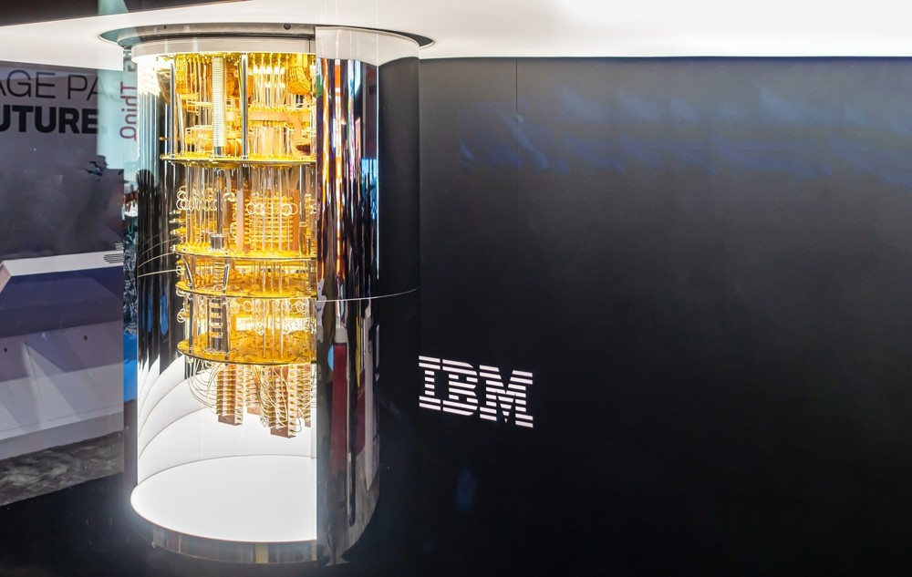

# 미국 정부, IBM 등 양자컴퓨팅 기업에 3조 투자 예정..."보조금 넘어 지분까지"

- Source URL: https://www.aitimes.com/news/articleView.html?idxno=210838
- Submitted URL: https://share.google/VjhiYby31o01QcFbN
- Author: 박찬 기자
- Published: 2026-05-22T14:16:39+09:00
- Section: AI산업
- Source language: Korean
- Extraction method: AI타임스 direct HTML manual extraction from `#article-view-content-div`
- Quality status: good

## 원문 보존

*캡션: (사진=셔터스톡)*

트럼프 행정부가 양자컴퓨팅 산업 육성을 위해 20억달러(약 3조원) 규모의 지원에 나선다. 정부가 직접 기업 지분까지 확보하는 방식으로 투자에 참여하면서 차세대 전략 산업 주도권 확보에 속도를 내는 모습이다.

미국 상무부는 21일(현지시간) 양자컴퓨팅 기업 9곳에 총 20억달러 규모 보조금과 지분 투자를 제공한다고 발표했다. 대상에는 IBM, 글로벌파운드리스, 디웨이브, 리게티, 인플렉션, 사이퀀텀 등이 포함됐다.

가장 큰 수혜 기업은 IBM이다. 10억달러(약 1조5000억원)를 지원받아 미국 최초의 전용 양자 칩 생산 시설을 구축할 예정이다. 새 시설은 뉴욕주 뉴올버니에 들어설 예정이며, IBM은 앞으로 외부 고객사에도 양자 칩 제조 기술을 제공할 계획이다.

IBM은 이를 위해 ‘앤더론(Anderon)’이라는 신규 회사를 설립하며, 자체적으로도 10억달러를 투자하기로 했다. 발표 직후 주가는 12% 이상 급등했다.

아르빈드 크리슈나 IBM CEO는 월스트리트저널과의 인터뷰에서 “양자컴퓨팅 산업이 몇년 안에 본격적으로 도래할 것이라는 강력한 신호”라며 “2030년대 중반에는 수십억달러 규모의 고수익 사업이 될 수 있다”라고 말했다. 또 단백질 시뮬레이션 등 신약 개발에 활용 가능한 양자컴퓨팅 연구 성과를 사례로 제시하며, 기술 상용화가 빨라지고 있다고 강조했다.

반도체 위탁생산 기업 글로벌파운드리스는 3억7500만달러(약 5600억원)를 지원받는다. 미국 정부는 약 1% 수준의 지분도 확보할 예정이다. 글로벌파운드리스는 ‘퀀텀 테크놀로지 솔루션스(Quantum Technology Solutions)’라는 신규 사업부를 설립해 양자컴퓨팅용 부품과 패키징 기술 생산에 나선다.

이 외에도 디웨이브, 리게티, 인플렉션은 각각 1억달러(약 1500억원)를 지원받으며, 호주계 스타트업 디라크은 핵심 기술 난제 해결을 위해 최대 3800만달러(약 570억원)를 받게 된다. 아톰 컴퓨팅과 퀀티넘도 지원 대상에 포함됐다.

이번 투자 재원은 2022년 제정된 ‘반도체 및 과학법(CHIPS and Science Act)’에서 나온다. 트럼프 행정부는 최근 전략 산업에 대한 정부 직접 투자 방식을 적극 활용하고 있다. 지난해에는 정부가 인텔 지분 약 10%를 확보했고, 희토류 기업 MP 머티어리얼스에도 대규모 투자를 단행한 바 있다.

하워드 러트닉 미 상무부 장관은 “미국은 양자 기술 혁신 시대를 선도하고 있다”라며 “이번 투자는 수천 개의 고임금 일자리를 창출하고 미국의 양자 역량을 강화할 것”이라고 밝혔다.

양자컴퓨팅은 양자역학 원리를 활용해 기존 슈퍼컴퓨터보다 훨씬 빠르게 복잡한 문제를 해결할 수 있는 차세대 기술이다. AI와 결합하면 신약 개발, 금융 모델링, 암호 해독, 군사 기술 등 다양한 분야에서 혁신적 성능 향상이 가능할 것으로 기대된다.

업계에서는 이번 조치를 미국 정부가 AI에 이어 양자컴퓨팅까지 국가 전략 산업으로 공식 격상했다는 신호로 해석하고 있다. 트럼프 행정부는 현재 양자산업 육성을 위한 별도 행정명령도 준비 중인 것으로 알려졌다.

박찬 기자 cpark@aitimes.com
