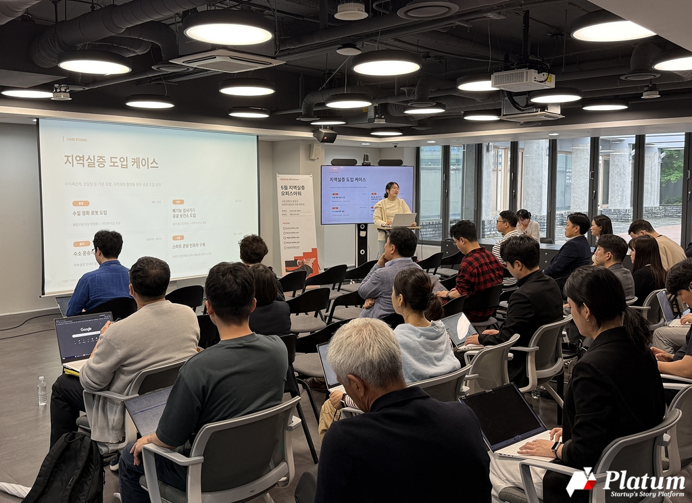
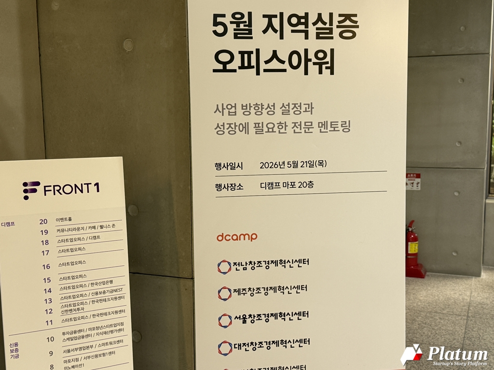
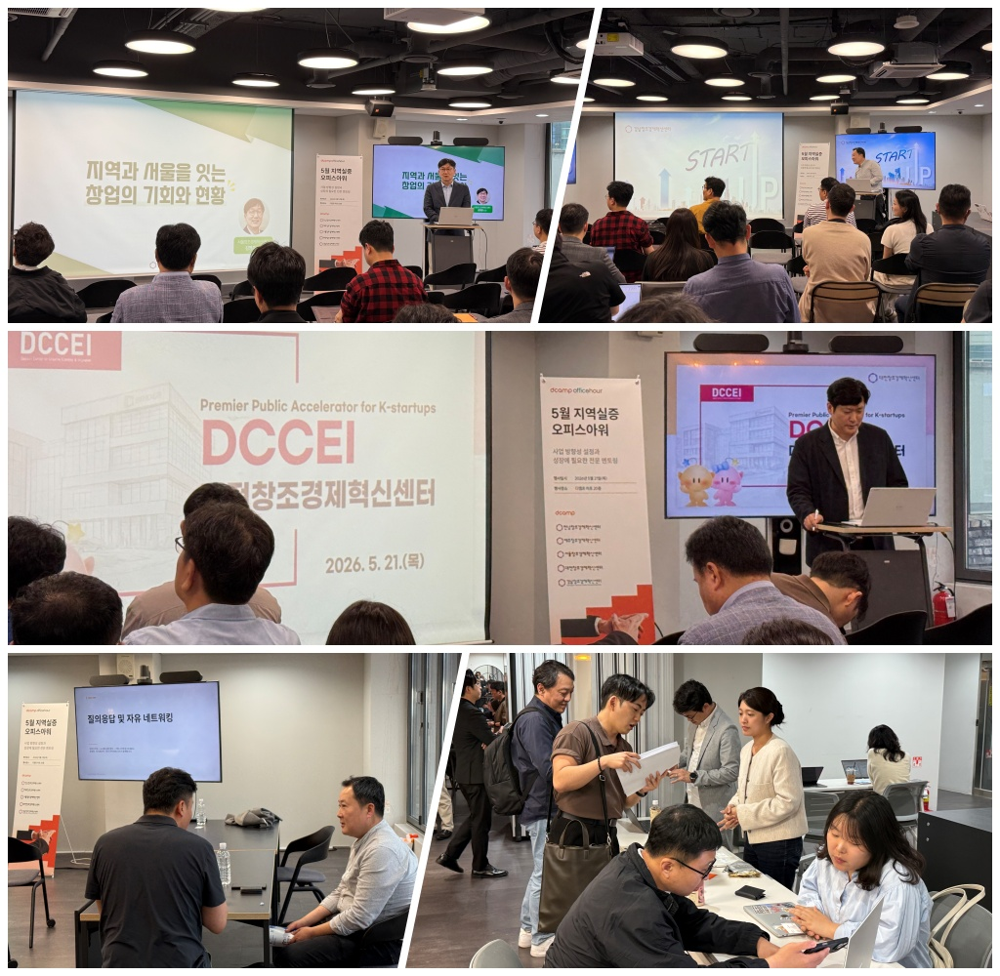

# 청년이 떠난 땅, 스타트업이 채운다

Source: https://platum.kr/archives/287435
Saved: 2026-05-23

## 원문 메타데이터
- 제출 URL: https://share.google/zpyfoThquLh7859tK
- 정규 URL: https://platum.kr/archives/287435
- 매체: 플래텀
- 작성자: 조상래
- 발행일: 2026-05-22T08:31:55+09:00
- 수정일: 2026-05-22T08:34:01+09:00
- 섹션: 이벤트
- 태그: 디캠프, 오피스아워, 은행권청년창업재단, 지역실증, 창조경제혁신센터
- 추출 방식: Platum 직접 HTML 수집 후 `.dynamic-entry-content` 수동 정제
- 품질 상태: good

## 본문

- 원본 이미지 URL: https://cdn.platum.kr/wp-content/uploads/2026/05/KakaoTalk_20260521_152722104_02.jpg

지난달 서울창조경제혁신센터 김영준 실장은 지역에서 열린 R&D 사업 심사에 참석했다. 8개 기업에 기업당 4~5억 원을 지급하는 사업인데 신청은 9개뿐이었다. “서울이라면 수백 개가 몰렸을 규모예요.” 청년이 빠져나간 자리는 곧 경쟁이 없는 자리이기도 했다.

21일 오후 2시 디캠프 마포 프론트원에서 열린 ‘5월 디캠프 오피스아워 #사업협력(지역실증)’에는 서울·경남·대전·전남·제주 5개 창조경제혁신센터 담당자가 직접 자리했다. 이번 행사는 기술·특허를 기반으로 공공 도입을 모색하거나 지역 실증 아이템을 보유한 스타트업을 대상으로, 지역별 공공실증 수요를 공유하고 실증·협력 가능한 스타트업과 지원사업을 매칭하는 자리였다. 오늘 행사는 9월 중 조달청·지식재산처·지역 파트너사가 공동으로 진행하는 ‘디캠프 스타트업 OI #B2G’로 이어지는 3단계 로드맵의 첫 번째 관문이다. 임새롬 디캠프 리소스 PO는 5년 넘게 지역 실증을 해오며 찾아낸 성공 조건으로 두 가지를 꼽았다. 정부 관계자가 스타트업 수요에 맞는 지원사업을 직접 개발해주는 것, 그리고 스타트업이 지역 수요를 알아보려는 적극적인 의지. “공공 실증은 온 마을이 같이 만드는 성과”라고 그는 정리했다.

디캠프는 이미 통영 수질 정화 로봇 지자체 도입, 전북 공공 보건소 폐기능 검사기기 채택, 서울 외국인 관광객용 다국어 스마트 관광 인프라, 울산 수소 운송차량 실증, 세종 아치형 태양광 발전 실증, 대전 AI 양방향 통번역기 도입 등의 성과를 냈다. 각 지역이 가진 자원과 현안이 다른 만큼 실증의 형태도 제각각이었다.

- 원본 이미지 URL: https://cdn.platum.kr/wp-content/uploads/2026/05/KakaoTalk_20260521_152722104.jpg

## “서울에서는 레드오션인 아이템이 지역에서는 1순위가 됩니다”

서울창조경제혁신센터 김영준 실장은 지역 청년 유출 데이터부터 꺼내 들었다. 2024년 기준 부산·대구·광주·대전 4개 광역시 합산 청년(20~30대) 순유출은 연 1만 7,500명 수준으로, 2020년 8,000명에서 2배 이상 불어났다. 경남·경북·전남·전북 등 도 지역도 사정은 비슷하다. 청년이 빠져나가는 사이 중장년은 오히려 유입되는 세대 불균형이 심화하고 있다.

발표 도중 그는 서울창경이 있는 용산 이야기를 잠깐 꺼냈다. “저희 사무실 근처 식당이 점심에 4팀 대기였는데 지금은 20팀, 25팀이에요. 외국인도 늘었지만 청년들도 더 몰리는 것 같고. 지역 맛집은 반대로 줄을 안 서는 경우가 늘고 있다고 하더라고요.” 통계가 일상에서 어떻게 체감되는지를 보여주는 장면이었다.

서울창경·디캠프·SBA가 공동으로 지역 정보를 모아 연결해주겠다는 게 이날 발표의 핵심이었다. “내 아이템이 경남이 맞는지 제주가 맞는지, 저희 쪽에 물어봐도 좋습니다. 어느 기관 누구와 말씀 나누면 확실히 할 수 있다는 정보도 계속 공급해 드리려고 합니다.” 지역이 먼저 스타트업에 손을 내밀고, 서울의 기관들이 그 사이를 메우는 구조를 만들겠다는 제안이었다.

## 조선소에서 용암해수까지

각 센터가 제시한 실증 과제는 지역의 맥락과 맞닿아 있었다.

경남의 무대는 거제 조선소다. 크레인·용접기·CNC 절단기 같은 핵심 설비가 갑자기 멈추면 공정 전체가 다운된다. 현장에는 하드웨어만 있고 유지보수를 위한 정보 체계가 없다. 진동·전류·온도 등 실시간 데이터를 기반으로 고장 징후를 미리 포착하는 AI 모델을 심는 것이 과제의 골자다. “내일도 두산에너빌리티랑 선정팀 네트워킹이 창원에서 있어요.” 경남창조경제혁신센터 공현수 팀장의 이 한마디가 경남의 온도를 가늠케 했다. 협업이 행사장 밖에서도 이미 이어지고 있었다.

대전은 말보다 실적을 내세웠다. 유성구청에서는 AI 다국어 번역 실증을 진행했고, 작년 한 해 혁신기술 실증 건수만 19건에 달했다. 중구청 실증은 더 구체적이었다. 한화 이글스 볼파크가 들어서면서 야구장에서 성심당으로 이어지는 관광 동선이 새로 생겼고, 중구청 팀장은 그 동선 위에서 안전·유동인구 분석 실증을 그리고 있었다.

전남은 숫자로 이야기했다. 전남창조경제혁신센터 정성하 선임은 대한조선과 진행한 PoC가 구매조건부 사업으로 연계돼 8억 원 지원 이후 HD현대삼호에서 40억 원 구매 약속으로 이어진 경과를 공개했다. 실증이 레퍼런스로 남는 데 그치지 않고 실제 매출로 연결됐다는 증거였다. GS칼텍스·GS리테일·GS홈쇼핑·HD현대삼호·한국전력공사 등 전남에 주요 거점을 둔 대기업 네트워크가 매개 역할을 했다.

제주는 섬의 고유함을 실증 자산으로 내밀었다. 제주창조경제혁신센터 이재원 본부장은 용암해수 기반 기능성 화장품 실증과 관광객 대상 AI 피부 데이터 디지털 헬스케어 실증 두 가지를 꺼냈다. “이니스프리도 제주 원물을 오래 써왔고, 뷰티 원물을 활용한 기업들이 많은데 마케팅 창구가 부족해서 그렇지 해외 수출로는 꽤 성과를 내고 있습니다.” 재생에너지 보급률 전국 1위라는 지위도 내세웠다. 분산에너지·풍력·V2G(전기차 배터리 전력망 역송)·VPP(가상발전소) 등 현 정부가 가장 관심을 두는 사업들의 테스트베드로 제주가 적합하다는 논리였다.

- 원본 이미지 URL: https://cdn.platum.kr/wp-content/uploads/2026/05/collage-5.jpg

## 한계를 인정한 자리

발표가 끝나고 참석자 한 명이 손을 들었다.

“대기업 중심 얘기만 나오는데, 창원에는 중소·중견기업이 훨씬 많잖아요. 대기업은 솔직히 저희가 아니어도 자체 소화가 가능한데, 정작 필요로 하는 건 중소 기계 제조업체 쪽이에요. 그런 수요를 정리해서 연결해주는 건 없나요?”

공현수 팀장은 한계를 솔직하게 인정했다. 대신 상시 밋업, 경남테크노파크 스마트 공장 사업 연계, 인공지능 혁신 본부 정보 공유 세 가지를 대안으로 제시했다.

이 질문은 행사 내내 흐르던 긴장의 핵심을 건드렸다. 스타트업이 지역 공공에 들어가는 길은 여러 단계의 장벽으로 막혀 있다. 참석자들이 사전에 제출한 여섯 가지 애로사항이 이를 고스란히 담았다. 레퍼런스 없이는 첫 문이 열리지 않고, 창구가 불명확해 시간이 낭비된다. “공공 도입 시 보안성 검토, 조달 등록, CC 인증 절차 일정과 비용 부담이 매우 크다. 실증 단계에서 어느 수준까지 요건이 완화될 수 있는지 알고 싶다”는 질문도 있었다. 실증이 일회성으로 끝나 본 사업 예산 편성으로 이어지지 않는다는 호소도 반복됐다. 여섯 가지 질문은 결국 하나로 수렴했다. 지역 실증은 왜 시작하기도 어렵고, 시작해도 이어지기 어려운가.

## 정보가 관계가 되는 자리

지역 실증의 진짜 장벽은 기술에 있지 않았다. 어느 창구를 두드려야 하는지, 담당자의 KPI가 무엇인지, 레퍼런스 없이 어떻게 첫발을 딛는지. 오늘 이 자리는 그 질문들을 회피하지 않고 꺼내놓은 시간이었다. 그 날것의 정보들이 6월부터 시작되는 지역별 실증 협의를 통해 실제 관계로 전환될 수 있는지가 이 프로젝트의 진짜 시험대다.
