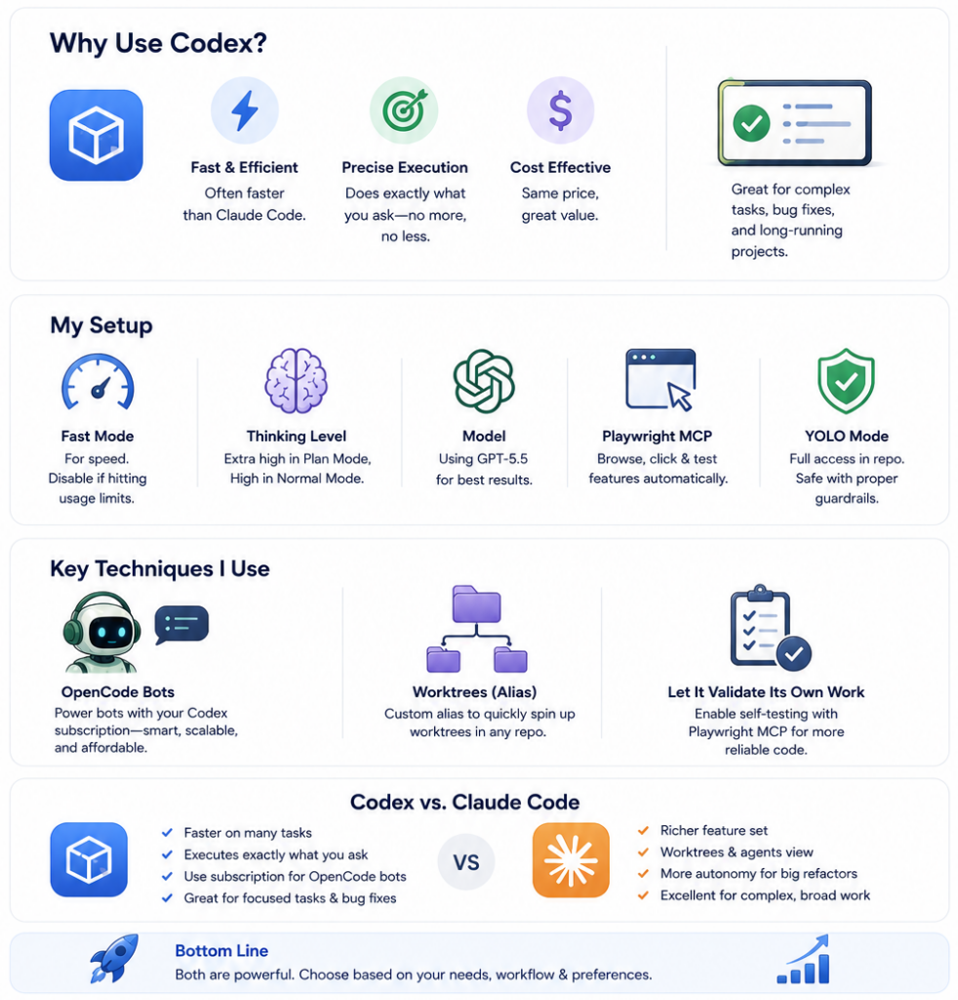

# How to Maximize OpenAI’s Codex

- Source: https://towardsdatascience.com/how-to-maximize-openais-codex/
- Submitted URL: https://share.google/sFVZSi7sGKaoosQJA
- Author: Eivind Kjosbakken
- Published: 2026-05-18T12:00:00+00:00
- Site: Towards Data Science
- Description: Learn how to get the most out of OpenAI's coding agent

I’ve written a lot of previous articles about Anthropic’s Claude Code, and how I use it for programming, and different techniques that I apply to make it more effective. However, the last two weeks I’ve been experimenting more and more with OpenAI’s Codex and seeing vastly improved results compared to Codex a few months ago.

In my opinion, Codex is equally good on a lot of tasks and has the advantage that it’s, in many cases, faster than Claude Code and that it’s better at doing exactly what it’s asked to do and not performing other tasks (which is the problem I’ve experienced with Claude Code).

In this article, I’ll be discussing my experience using OpenAI’s Codex for advanced coding tasks and other application areas, as well as some techniques that I use to enhance Codex’s performance.



*Caption: This infographic highlights the main contents of this article. I’ll discuss OpenAI’s Codex coding model: why you should use it, my current setup with the techniques that I use to get the most out of the model, and I’ll do a comparison of OpenAI’s Codex model versus Anthropic’s Claude Code model.*

## Why use OpenAI Codex?

First of all, I want to cover why you should be using OpenAI Codex. It’s worth mentioning that the pricing of Codex for the 20x Max subscription is the same as Claude Code. The only differentiator is the quality of the outputs produced by the model and how efficiently it can complete tasks.

Considering I program every single day, it’s important for me to stay up-to-date with the latest coding models and consistently try out new and upcoming models, such as GPT-5.5, to see if it works better than my current setup.

I just started using Codex with GPT-5.5 around two weeks ago and simply applied it to some real-world tasks I was working on. This is important, as I believe running coding models on test tasks does not truly test the model’s capabilities, and it’s not a valid and complete test.

When I used it on some of the more complex tasks I was working on, I was quite impressed by the results. In my opinion, Codex was extremely efficient at completing some tasks and completed them very quickly. Furthermore, I got the impression that Codex was better than Claude Code at performing exactly the tasks I was asking it to do and not changing other stuff in the code. Actually, a problem I’ve experienced with Claude Code a few times is that I ask it to complete a specific task, and it mostly completes that task, but it also changes some other things I didn’t want it to change.

It’s worth mentioning that this is very much a balance. On one hand, you have Claude Code’s approach, which is to give the model more freedom to make decisions on what should be changed, which can lead to the model changing parts of the code that you don’t intend to change. On the other hand, you have Codex’s approach, which is changing only exactly what the user is asking you to update. This can, on the other hand, have the downside that it leads to bugs all over the code because it’s not updated, simply because Codex just performs exactly what it’s asked to do and nothing else.

## Specific techniques I use to optimize Codex

In this section, I’ll cover some specific techniques I use to make Codex perform better than just out of the box. I’ll cover my setup and some techniques.

### My setup

First of all, let’s cover my setup. I do use fast mode on Codex currently because I’m not hitting my limits that often. However, if you are hitting your limits, you should consider turning off FastMode or getting another Codex account.

Furthermore, I use extra high thinking when I’m using plan mode and high thinking or reasoning when I’m using normal mode, and I’m using GPT-5.5, of course.

I’ve also given Codex access to Playwright MCP, which is a way that it can access my browser and perform actions there. This is extremely efficient, for example, for OpenClaw bots, which I’ll cover in the next section, and for actually going into the browser and testing features that Codex has implemented. As I’ve mentioned in multiple previous articles, allowing your coding agents to test their own work vastly improves the performance of these coding models.

You can read more on this in my article below:

[How to Make Claude Code Validate its own Work](https://towardsdatascience.com/how-to-make-claude-code-validate-its-own-work/)

---

Lastly, I’m also using YOLO mode with Codex, where I give it, or allow it to perform, any action within the folder it’s working in. In my experience, the frontier coding models, such as Claude Code and Codex, are not prone to making severe mistakes such as deleting production databases or similar, and they’ll typically warn you before taking irreversible actions.

Furthermore, I also believe that if you set up your codebase and infrastructure correctly, this will not really be an issue. An agent or you, for that matter, shouldn’t have access to permanently delete databases and perform irreversible damage on any infrastructure. That is typically more a sign of poor infrastructure design choices rather than an issue with a programmer or a coding agent.

### OpenClaw bots

Another use case I have for Codex is that I’m using it for my OpenClaw bots. One of the great advantages of using Codex over Claude Code currently is that you can power your OpenClaw bots with your Codex subscription, which you are not allowed to do with your Claude Code subscription anymore. This is important because, in my opinion, Codex is a frontier-level intelligent model you can use for your OpenClaw bots, which also has acceptable pricing.

With this, I mean that Claude Code API pricing simply isn’t applicable for almost all programmers out there, and thus isn’t an option for OpenClaw. Instead, you can buy a $100 or $200 subscription with Codex and have a very intelligent model power your OpenClaw bots, which I believe is a good investment you can make.

I also use fast mode on my OpenClaw bots since I have enough budget available for usage. However, you can again turn it off if you think it is necessary, and it, of course, depends on the use case. In some scenarios, you are more dependent on fast replies from your coding agent, and in other instances, you just perform a fire-and-forget task. The time it takes to perform the task is not really important.

### Worktrees

Unfortunately, OpenAI Codex hasn’t implemented a simple work tree setup yet, as Claude Code has. This is definitely a minus in my book, as work trees are a critical feature to have when I am working on multiple things in the same repo at the same time.

However, to combat this problem, I set up a simple alias where I create my own work tree when spinning up Codex. I did this simply by asking Codex to set up an alias for me so that if I write the command you see below, it will spin up a work tree with the name provided.

```
codex-wt <worktree-name>
```

This was super simple to set up and only took a few minutes with Codex.

## Codex vs Claude Code

In this last section, I want to cover Codex versus Claude Code and my opinion on comparing the two coding agents and frameworks. In my opinion, there’s no clear winner between the two models. They’re both extremely powerful, and in my opinion, I can complete even my most complex tasks with both models. However, I do have some preferences in certain scenarios.

When I have a very specific task I want to complete or am looking for specific bugs, in my opinion, Codex works better and is more efficient at completing the task. In many cases, Claude Code will also be able to complete the same task, but simply take longer, from my experience.

Furthermore, as I mentioned in the OpenClaw section, Codex allows you to use the subscription on OpenClaw bots, which Claude Code does not allow you to do. If you are dependent on running a lot of OpenClaw bots, I highly recommend you do it with Codex.

On the contrary, I think Claude Code is extremely powerful and can complete all my most complex tasks while still having a lot of features that I really enjoy. The work tree feature, for example, is a great inclusion from Claude Code, as well as the agents’ view, which they recently released. In my opinion, the feature stack of Claude Code is more powerful than Codex and could thus be a reason to choose Claude Code over Codex.

However, all in all, I believe the two models are neck and neck and both extremely powerful. We’ll just have to follow both models in the future, continue testing them, and see which one comes out on top in a few months’ time. For the time being, I believe they’re both great choices, and what works best for you is dependent on your situation and preferences.

## Conclusion

In this article, I discussed how to get the most out of OpenAI’s Codex. I discussed why I started using OpenAI Codex, highlighting how I need to stay on top of the latest coding models and want to compare it against Claude Code. I got a very positive first impression, noticing that the model was able to perform even the most complex tasks I’m working on. I then covered some specific techniques I use to make Codex better, such as:

- letting it validate its own work
- setting up an alias for work trees
- using it for my OpenClaw bots

Lastly, I also had a section comparing Codex vs. Claude Code, where I highlighted that it’s extremely close, and which one is the better model. Which model is better for you depends on your preferences. I recommend that you look into both models to see what works best for you, and also closely follow the models in the near future, because I believe a lot of new features and more powerful LLMs will become available.
