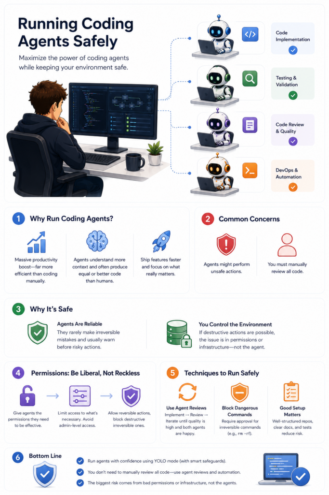

# How to Safely Run Coding Agents

Source: https://towardsdatascience.com/how-to-safely-run-coding-agents/
Submitted URL: https://share.google/HXYiQ1ZNJ6QL7X9lj
Saved: 2026-05-25
Published: 2026-05-20
Author: Eivind Kjosbakken

Coding agents such as Claude Code and Codex have provided me the biggest efficiency boost I’ve ever experienced while programming, way more of a boost compared to getting more powerful computers or learning new topics and techniques.

However, a common case when running coding agents on your computer is:

- How many permissions should you give your coding agents?

- How do you run them safely if you give them a lot of permissions?

In this article, I’ll cover how I run my coding agents safely on my computer, why running with YOLO mode is completely fine for most people, and why manually approving all permissions can actually be quite dangerous in itself because of false confidence.


Caption: This infographic highlights the main contents of this article. I’ll discuss how to run coding agents in a safe manner, why you don’t need to perform human review on all code, how to avoid running unsafe actions, how many permissions to give your coding agents, and how to run them safely. Image by ChatGPT.

## Why run coding agents

First of all, I need to cover why you should run coding agents on your computer. If you’re working with programming, it should be pretty self-explanatory. Using coding agents to program instead of manually programming is just way more efficient. It can’t even compare to writing the code yourself or even to tab completions. Having agents write all the code for you is now very much possible, given how powerful the latest LLMs have become, and it’s simply far more efficient at implementing code than humans can ever be.

However, typically, some dangers of running coding agents are pointed out, usually mentioning the two points below:

- It’s scary not to look and verify the code yourself or perform a human review.

- The agents can perform unsafe actions, and you need to make sure they don’t do anything they shouldn’t do.

In this article, I will cover why I strongly disagree with these two points and how you can ensure you run coding agents safely on your computer in your environment.

## Running coding agents safely

In this section, I’ll be answering the two points raised above, covering how many permissions to give your agents, and how to run them safely once you provide them with the permissions they need. I’ll cover each part in a separate section.

### Why you don’t need to manually review all code

First of all, I want to answer the first question about how many people think that all code should be manually reviewed. I strongly disagree with this argument because coding agents have become so powerful now that they write better code, or at least equally good code, than a lot of humans. Yes, the code might not be perfect, adhering to every formatting rule or best practices. However, the code that coding agents produce is typically very functional, and the agents are extremely good at discovering bugs.

I’d argue that coding agents in many cases can produce better code than humans because they’re able to take in much more of the context around the repository and thus avoid a lot of bugs.

If you have a decently organized code repository with a lot of details in your agents.md files and other markdown files, and you let other coding agents perform code reviews on the code you produce, I don’t think you need to manually review your code.

Of course, there are cases where you are touching very sensitive code that you know can lead to bugs. In these cases, you should naturally perform a human review, but for most of the code you produce, I don’t think a human review is necessary anymore.

### Ensuring agents don’t perform unsafe actions

The second point mentioned above was that agents can perform unsafe actions, and you need to make sure they don’t do something they shouldn’t do. It’s true that if you give your coding agent a lot of permissions, they can obviously perform unsafe actions. For example, if you give them wide AWS permissions, they can, of course, update your infrastructure.

However, in my experience, I have two counterarguments:

- The coding agents very, very rarely actually make these mistakes. I find that Claude Code and Codex almost always inform me before performing an irreversible decision, or at least a non-easily reversible decision. They don’t simply make serious mistakes that are very hard to reverse.

- If a coding agent is able to perform a destructive action, such as deleting a production database or equivalent, I’d argue the problem is not in the coding agent, but in the way you structure your code. An AI or a human should not be able to fully delete a production table, obviously. If so, you’ve first of all given them way too wide permissions. Technically, a human could make that mistake as well. And secondly, you’ve not structured your code well enough. For example, if a table is deleted, you should make sure you have a backup.

I don’t think the argument that agents perform unsafe actions is really true. The coding agents basically don’t make these irreversible mistakes, and if such a destructive irreversible mistake is possible, such as deleting a production database, then you need to update your code infrastructure to make sure that it’s not possible.

### How many permissions to give your agents

Now, let’s cover how many permissions you should be providing your coding agents. Whenever I run my agents, I run Claude with --dangerously-skip-permissions and Codex in YOLO mode. This means I ask it to basically never ask me for permission when performing an action. The only exception I have to this is when running the rm command, for example, deleting recursively like below:

```bash
rm -rf
```

When running this command, the agents have to ask me for permission because I know it’s a destructive action on my computer that is not reversible (i.e., I cannot recover files that are deleted with this command).

Otherwise, I’m very liberal with the permissions I give my agents. However, I try to limit it to only relevant permissions. For example, a coding agent doesn’t need admin access to AWS, but viewer or even power access can be valuable for the agent to complete its work.

In general, I think your rule should be:

> Be liberal with your permissions. Make sure the coding agent has all the tools it needs to effectively perform its work. However, also try to limit the permissions to what the agent actually needs, and be careful with admin-level permissions that can perform destructive actions.

I also want to highlight in this section that, of course, the amount of permissions you give your agents should depend on the domain you’re working in. If you’re working in a super high-security domain, such as healthcare or military applications, you should definitely be vastly more careful with the code you produce and the actions that your agents perform. However, most programmers don’t work in these domains, which is true for my points throughout this article. I urge you to think about your use case and how damaging or non-damaging mistakes can be from coding agents.

### Techniques to run coding agents safely

In this last section, I also want to cover how to run the coding agents safely, given that you gave them a lot of permissions, as I covered in the last section. There are many techniques you can use to run the coding agents safely.

One is, of course, not to give them admin-level permissions, such as I covered in the last section, because admin-level permissions typically involve being able to run irreversible commands, which, in general, is something you want to avoid. Simply put, a coding agent should be able to perform any action that is reversible, since this gives them the liberty to effectively perform tasks. With irreversible decisions, you should be really careful.

To ensure the code my coding agents produce is effective and to decrease the likelihood of the code containing bugs, I typically use another coding agent to perform a code review. I then have the agents iteratively work together:

- Create code

- Perform code reviews

- Iterate on the code, given the code review

- Perform another code review

and so on until both the reviewer and the implementer coding agents are happy.

Another technique worth mentioning is that you can implement blocks on specific commands you know are irreversible. This is, for example, the rm command I mentioned earlier, which can delete files on a computer. This deletion does not end up in a trash bin as if a human deleted it. It simply is irrecoverable, and it’s a command you should be careful with. You can put a block on such commands so that the coding agent explicitly has to ask you for permission before running such a command.

## Conclusion

In this article, I cover why you should run coding agents, highlighting how much more effective a programmer you can become. Continuing on that, I answered a few common objections to using coding agents, such as why you don’t need to manually review all code and how to avoid the agents performing unsafe actions. Furthermore, I gave some insights into how many permissions you should give your coding agents and how to run them safely once you give them liberal permissions, as I recommend for most programmers not working in super-sensitive domains. I urge you to continuously experiment with coding agents, as I believe they are the biggest productivity gain you can get as a programmer right now. You should continue working with them and figure out for yourself how you can make them both the most effective for your applications and how to run them safely. Throughout this article, I’ve given some tips and tricks on my use cases, which you can attempt to transfer to your application areas.
