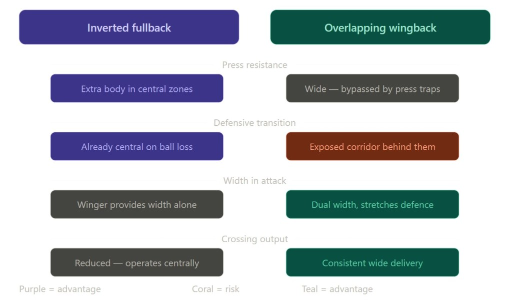

# Why Top Managers Are Killing Off the Overlapping Wingback |

Source: https://footballeffect.com/managers-are-killing-off-the-overlapping-wingback/
Author: Madelyn Hayes
Published: 2026-05-26T14:40:11+00:00
Saved: 2026-05-30

There was a time when the job description for a fullback could fit on a Post-it note. Defend the flank. Win the second ball. When the team has possession, get up the line, put in a cross, and get back.

That was it.

The fullback was the workhorse of the shape, the unsung engine, the player every manager trusted to be exactly where they were supposed to be at exactly the right moment. Reliable, predictable, peripheral.

That version of the fullback is almost extinct now.

Right now, the fullback position has arguably become the most intellectually demanding role in football. What managers are asking of their wide defenders today would have been considered absurd even a decade ago: read the spaces between the lines, function as a secondary playmaker, provide structural balance in both phases, and still get back in time to defend a three-on-two in transition.

The overlap, once the defining contribution of an attacking fullback, has been quietly demoted. In the most sophisticated systems at the top of the game, bombing down the touchline is almost considered a failure of positional discipline.

The [inverted fullback](https://www.360player.com/blog/what-are-inverted-fullbacks-tactical-breakdown) did that. Now, the modern game as it is now, it has completed a transformation so thorough that analysts now talk about its sub-variants the way wine critics talk about vintages.

## Where It Started

The honest answer is that Pep Guardiola did not invent the inverted fullback. Johan Cruyff had already used versions of the concept years before at Barcelona.

But what Guardiola did was systematise it, test it at the highest level repeatedly, and make it look so elegant that every manager watching from the opposite dugout began silently wondering how to replicate it.

At Bayern Munich, Philipp Lahm was one of the first players to be used as an inverted fullback in the modern sense, moving inside to create numerical superiority in midfield. This was not a natural footballer being asked to play out of position as a convenience. It was Guardiola identifying that Lahm’s intelligence and passing range made him more dangerous sitting between the lines in a pocket of space than galloping down the touchline.

**The logic was simple but revolutionary:** why use a technically excellent player to deliver crosses into a crowded box when he can sit in midfield, receive between the lines, and play the pass that unlocks three defensive layers at once?

With Lahm and David Alaba as technically gifted fullbacks, the pair tucked into midfield to not just assist in build-up but to pack out midfield in a 2-3-5 shape. This gave Bayern three excellent ball players who were natural defenders in the second line, supplying what was essentially a front five, like having three number sixes able to dictate play and suffocate the opposition.

Opposing managers were left with a choice that had no good answer: track the fullbacks into the middle and leave your wide areas completely exposed, or stay wide and let them receive in central pockets with acres of space and time on the ball.

That dilemma, which Guardiola first engineered in Munich around 2013 and refined relentlessly at Manchester City from 2016 onwards, is the seed from which everything that followed has grown.

## The Cancelo Effect: Inversion as Art Form

João Cancelo was the original artist of the modern inverted fullback era. He was the first to make this role look like jazz: **sharp turns, inside drifts, long balls from tight angles**. He was one of the first of Guardiola’s ideal inverted machines.

At Manchester City, Cancelo took what Lahm had established as a structural principle and turned it into something visually striking. He operated on both sides of the defence and brought a level of unpredictability to the role that defences genuinely struggled to handle.

He was not tucking into a pre-assigned zone.

He was reading each possession phase in real time, making decisions, staying wide and creating an overload, or inverting and receiving between the lines that previously only midfielders were expected to make.

What Cancelo confirmed was that the inverted fullback was not a role that worked only with ultra-specific technical profiles. It was a structural framework that could be adapted to different players with different qualities, as long as the player understood the core principle: central positioning in possession provides more control than wide positioning, and the team’s shape should morph around what the ball does, not around what position the shirt number suggests.

The system demands fullbacks with distinct characteristics: calm in high-pressure situations, intelligent decision-making, and the positional intelligence to recognise when to invert and when to preserve wide positioning.

This fundamentally reshapes recruitment strategies across elite clubs.

## Arsenal and the Zinchenko Template

When Mikel Arteta signed Oleksandr Zinchenko from Manchester City in the summer of 2022, it felt like a transfer designed to import not just a player but a concept. Zinchenko was a midfielder by training who had been repurposed as a left-back by Guardiola, making him the living embodiment of exactly what Arteta wanted to build at Arsenal: a team where positions are frameworks, not cages.

Zinchenko explained his approach simply:

> “You have to look at your opponent, which is obviously my right winger, and see where he stays and who he is marking. Then you need to find the space and try to play forward. The main thing when you’re in central midfield is to know what’s going on behind your back, and you need to know what you’re doing with the ball before you receive it.”

That description sounds straightforward. In practice, it requires a level of spatial awareness that most fullbacks in history were never asked to develop. Zinchenko made it look clean and natural. His positioning in central zones freed Odegaard to float into the right half-space, allowed Saka to pin defenders deep on the right, and gave Arsenal’s midfield a passing triangle that was incredibly difficult to press effectively.

In Arteta’s Arsenal during that period, the left side was inverted through Zinchenko, while the right side was more traditional through Ben White initially. The combination meant Arsenal’s left side was dense with central options: Ødegaard arriving from the right, Zinchenko in the left half-space, Saka providing width, while the right side provided overlapping depth.

The asymmetry was the point.

Arteta was not asking both fullbacks to do the same thing. He was using different tactical identities on each side to create unpredictability and overloads in specific zones. It was, effectively, a 4-3-3 out of possession that became a 3-2-4-1 the moment Arsenal had the ball, a shape-shifting structure that made pressing them a near-impossible task.

## Alexander-Arnold and the Halfback Frontier

If Zinchenko represented the mature form of the inverted fullback, Trent at Liverpool has pushed the role somewhere closer to a complete positional reinvention.

In the final 18 months of Klopp’s tenure, Trent was predominantly used as a right-back who inverts into midfield when the team was in safe possession. This was a clear change from when he used to bomb up and down the field, almost playing as a wingback supporting Mohamed Salah on the right-hand side of the Liverpool attack.

Under Arne Slot, the experiment deepened further. Alexander-Arnold himself explained how his role varies from game to game:

> “It depends on the game because if you think of Man United away, I played almost like a number ten. I was higher up the pitch because of the way they pressed. In certain games I’ll be inside because of the way they press, sometimes they press differently.”

Rather than occasionally tucking inward, Trent now operates almost exclusively in central areas during the possession phase;**receiving, distributing, and driving the tempo of play**like a genuine midfielder.

This halfback variant is different from the original inverted fullback concept. Cancelo and Zinchenko still performed defensive responsibilities as fullbacks when their team did not have the ball. Arnold’s role at times asks him to hold central positions even out of possession, which requires the right centre-back, Ibrahima Konaté, to cover wider defensive space.

This is a qualitatively different demand on the entire defensive structure.

What Liverpool discovered with Trent is that the most gifted playmaker in the squad was wearing the number 66 shirt and nominally playing right-back. Unlocking that creative potential by allowing him to function as a genuine central midfielder, one who could see a 60-yard switch into the path of a winger cutting across the penalty area, changed the architecture of the whole team.

Liverpool won the Premier League title playing with what was effectively a midfield four in possession, and one of those midfielders was listed in the defensive line on the team sheet.

## The Fragmentation: Four Roles Where There Was One

[Image: Why Top Managers Are Killing Off the Overlapping Wingback](https://i0.wp.com/footballeffect.com/wp-content/uploads/2026/05/4-SUB-ROLE.jpg?resize=1024%2C581&ssl=1)

The most significant development heading into 2026 is not the inverted fullback’s popularity. It is its fragmentation into different sub-roles that have become precise tactical instruments rather than a single catch-all concept.

Analysts in 2026 now identify four different variants of the original inverted fullback concept.

- The “**tucking fullback**” seen in Zinchenko when he was at Arsenal holds a half-space position without fully entering central midfield.

- The “**halfback**” seen in Alexander-Arnold, when he was at Liverpool, sits in a genuine midfielder role throughout.

- The “**eight-back**” operates higher up the pitch as an attacking midfielder would.

- And the [“ libero variant](https://learning.coachesvoice.com/cv/what-is-a-libero-explained-baresi-beckenbauer-maguire-stones/)” involves a defender who reads play and steps out from the back line to press rather than simply positioning centrally.

Now, variants of the inverted fullback appear in 14 of 20 Premier League squads as of 2025.26 season. That number would have been inconceivable in 2015, when the role barely had a name. What that growth tells you is that managers have absorbed the principle at every level and are now finding context-specific expressions of it rather than copying a single template.

This conceptual maturity is the clearest sign that the inverted fullback has completed its evolution from novelty to tactical infrastructure.

The spread of variants reflects the conceptual maturity of the role.

What started as “**the fullback who tucks in**” has become a rich vocabulary of positional flexibility that allows coaches to tailor the role precisely to their system requirements and the player’s individual strengths.

## Why the Overlapping Wingback Has Been Demoted

The overlapping wingback never disappeared entirely and likely never will. In a back three system, wingbacks who provide width and crosses retain obvious value.

But in the 4-3-3 systems that dominate elite European football in 2026, the old model of a fullback sprinting to the byline and whipping in a cross has measurably fallen out of favour among the managers who win things.

The reasoning is structural.

An overlapping fullback who bombs forward commits the team to width. Width is useful when you want to stretch defences, but it creates vulnerabilities. The fullback is high and wide, far from the goal. If possession is lost, the transition exposes an enormous corridor behind them.

The team needs their winger to track back, their wide midfielder to cover, and their entire defensive shape to shift. Against any team with pace in transition, that moment of disorganisation is a smooth threat.

When the ball is lost, inverted fullbacks are already in central areas, making it easier to regain possession quickly. They help compress space and prevent counter-attacks, adding a layer of defensive stability. The inverted fullback, by contrast, positions itself centrally.

When the ball turns over, they are already in the correct defensive shape. They do not need four seconds to sprint back into position. They are essentially already there.

Defensive transition is now considered one of the primary advantages of the inverted fullback system; the fullback is better positioned to stop counter-attacks than a player who has advanced to the byline.

The other factor is press resistance.

Modern football at the top level is defined by the quality of pressing systems, and central zones are where those pressing traps are laid. The fullback operating in an inverted role addresses the imbalance by delivering an extra body in crucial zones, enabling teams to maintain possession under pressure and control the tempo of matches.

An overlapping fullback provides no help with that problem; they are too wide to receive, and the team has to play through or over the press without them.

## Myles Lewis-Skelly and the Position’s Latest Chapter

The story of Myles Lewis-Skelly at Arsenal in the 2025-26 season is, in miniature, the story of where the inverted fullback is heading.

Lewis-Skelly is not a natural left-back. At school, he played as a centre-half. At Arsenal’s Hale End academy, he built his reputation as a ball-carrying midfielder with pace, grit, and an eye for driving runs. Yet Mikel Arteta had other plans.

Late in the 2023-24 season, Arsenal coaches trialled Lewis-Skelly as an inverted left-back for the under-18s and under-21s, laying the groundwork for a senior breakthrough. It was a gamble that paid off spectacularly. Last season, he made 39 appearances, showing maturity well beyond his years.

Lewis-Skelly played the inverted fullback role well, in the same vein as Zinchenko did two seasons ago. His composure on the ball in central zones, his spatial awareness, and his ability to play in tight spaces between opposition lines suggested Arteta had found a player who understood the position’s demands instinctively.

But then came the 2025-26 season.

Arsenal signed Piero Hincapié, Riccardo Calafiori remained a significant presence at left-back, and Lewis-Skelly found himself third in the pecking order, struggling for minutes. He played fewer minutes in the Premier League than in Europe, did not make a single appearance in the league for two months between mid-January and mid-March, and only two of his three league starts came in the final four games of the season.

Then something shifted. Arsenal used Lewis-Skelly in central midfield for the first time in his career during a 3-0 Premier League win over Fulham on Saturday, May 2. He impressed so much that Arteta kept the 19-year-old in the side for the Champions League semi-final second leg against Atlético Madrid five days later, a game with Arsenal’s first European final appearance in 20 years at stake.

He played 74 minutes as Arsenal booked their place in only their second-ever Champions League final. Arteta admitted afterwards that Lewis-Skelly had been “**exceptional**” and that it had been “**surprising**” to see the ease with which he slotted into the midfield position, given his lack of match rhythm during the campaign.

Thierry Henry, speaking on the situation, believes Lewis-Skelly’s long-term future is in midfield. His composure on the ball, alertness in reading play, and willingness to carry into the final third have pushed the youngster into serious contention for significant minutes in that role.

The Lewis-Skelly arc captures something important about how the inverted fullback is evolving in modern football. The best players in the role are not fullbacks learning to tuck into midfield. They are midfielders who were placed in a defensive starting position to provide coverage and then gradually moved back towards their natural habitat as their technical quality demanded it.

The fullback starting position is becoming, for a certain type of player, a staging post on the way to midfield, a role that develops them in the necessary defensive habits before the team realises they belong further forward.

## Scouting for a New Type of Player

The tactical evolution of the inverted fullback has silently rewritten what elite clubs look for when they recruit wide defenders.

This shift in approach has compelled opposition teams to reconsider their defensive organisation and pressing tactics, and has generated a ripple effect throughout competitive football as clubs reshape their scouting frameworks.

A traditional fullback recruitment checklist was majorly **physical and defensive. Pace to cover in behind. Strength to win aerial duels. Stamina to last 90 minutes up and down the flank. Crossing ability**. **Positional discipline**.

Those attributes have not become irrelevant. But the inverted fullback demands something different at the top of the list: **comfort with the ball under pressure in central zones, the ability to play quickly in tight spaces between lines, and the positional intelligence to read when to invert and when to stay wide without being explicitly told**.

Joshua Kimmich, originally a right-back, is now a midfielder, but his time as an inverted fullback made Bayern Munich’s build-up look completely effortless. He set the standard for what technical quality in that defensive position could produce when given the freedom to express it.

The Kimmich progression is now the template that clubs study. They are signing players who could function in midfield and deploying them defensively, knowing that in possession, those players will effectively be midfielders anyway.

The defensive starting position provides structural security out of possession. The midfield quality provides creative output in possession. For a manager running a high-possession system, that profile is worth significantly more than a traditional fullback who can cross because the traditional fullback’s crossing contribution, at the elite level, has become increasingly marginal.

## What the Inverted System Cannot Do

No tactical evolution exists without its trade-offs, and the movement away from overlapping wingbacks has created genuine vulnerabilities that smart opponents have found ways to exploit.

With fullbacks pushed up and in, a team can be vulnerable to speedy counterattacks down the flanks. Fullbacks need a high level of game awareness and preferably great pace for a team to succeed with this tactic. If they cannot anticipate potential threats and recover when needed, the risks are significant.

The width problem is real.

When a fullback inverts, the space behind them on the flank opens up. Teams that press high and win the ball quickly can find vast corridors to exploit. The solution, having the winger track back to cover, can undermine the attacking structure, because now the winger is running in the wrong direction at the moment the team needs to recover its shape.

By vacating their traditional wide positions, inverted fullbacks can leave space for opposition wingers to exploit on the wide flanks. Players need to be well-drilled in their positioning and decision-making, as mistakes in this system can leave the team vulnerable in ways that are difficult to recover from quickly.

There is also the question of **crossing output**.

For all the tactical sophistication of the inverted fullback era, crosses from wide areas remain one of the most reliable ways to create scoring chances in elite football. The traditional overlapping fullback delivered those crosses consistently. The inverted fullback, operating in central zones, does not, and the teams that have moved furthest from wide delivery have had to compensate with higher volumes of central combinations and runs from midfield, which require exceptional timing and technical execution to be effective.

**Set-piece delivery** is another area where the traditional wide fullback retains an advantage. Ball delivery from wide areas; corners, free kicks from the flanks is still disproportionately important as a source of goals at the top level.

A fullback who never gets wide never puts those deliveries in.

## The Eight-Back and Full Positional Dissolution

The next frontier in this evolution is likely the right-back who operates as a number eight in possession, fully integrated into the midfield diamond, with a specialist wide defensive player occupying right-back only out of possession.

This is essentially a dual-role system where the same physical space on the pitch is occupied by two different players performing two different functions depending on whether the team has the ball. Out of possession: **a wide defender**. In possession: **a central midfielder**.

Liverpool’s experiment with Alexander-Arnold and Chelsea’s Reece James is already approaching this model. The commercial and competitive success of the Arnold experiment has encouraged copycat approaches across the Premier League, with at least four clubs attempting similar arrangements by March 2026.

What these points towards is the gradual dissolution of the traditional fullback role as a distinct positional identity.

The fullback of 2030 may not be recognisably a fullback at all, they may be a midfielder who fulfils a defensive width function for approximately 40 percent of any given match and operates as a central creator for the rest.

The positional label will survive on team sheets. The actual positional reality will be something new.

The early 2025-26 season has seen managers discard the template in favour of greater autonomy; **fluid micro-structures where players make decisions based on relationships rather than prescribed zone occupation**.

The inverted fullback was the beginning of that process. What is emerging now is a philosophy where the idea of fixed positional assignments, even flexible ones, is being questioned further.

## The Managers Driving the Change

Pep Guardiola, Mikel Arteta, and Ange Postecoglou have effectively used the inverted fullback system to create numerical superiority in midfield, improve ball progression, and control the tempo of matches across the Premier League.

Each has a different flavour. Guardiola’s version is the most mathematically precise; specific players in specific zones, the inversion timed to coincide with exact moments in the build-up structure.

Arteta’s version is more asymmetric and relational, with the left-sided inversion designed to create a density of ball-players in the left-central corridor while leaving the right side with different characteristics.

Postecoglou’s version at Tottenham, before his departure, was arguably the most aggressive fullbacks who would invert and immediately look to drive forward rather than provide a passing option.

Roberto De Zerbi has also been significant in this conversation. His work at Brighton introduced elements of the inverted fullback to a club without the resources of the very top sides, demonstrating that the system could function with the right coaching and the right technical profile, even without elite-level transfers. He has yet to implement it now that he is at Tottenham.

The key was understanding that the principle, central positioning in possession for wide defenders, was more important than the specific individuals performing it.

## What 2026 Has Confirmed

[Image: Why Top Managers Are Killing Off the Overlapping Wingback](https://i0.wp.com/footballeffect.com/wp-content/uploads/2026/05/CHART.jpg?resize=1024%2C349&ssl=1)

By the middle of 2026, the inverted fullback is no longer a tactical talking point in the way it was in 2018 or 2022. It is infrastructure, it is the assumed default in a majority of elite European systems, so embedded in coaching language and scouting frameworks that its absence now feels like a deliberate stylistic choice rather than the default it once was.

The overlapping wingback has not died.

In **three-at-the-back systems,** in transition-focused teams, in clubs without the ball-playing profiles required to run the inverted structure effectively, the wide-running defender still provides obvious value. There are games, moments, and systems where bombing to the byline and delivering a cross remains the most direct route to a goal.

But the balance of power between the two approaches has shifted decisively. The inverted fullback won the tactical argument at the highest level of the game because it solved real problems: t**he problem of press resistance, the problem of numerical inferiority in central midfield, and the problem of defensive exposure after losing the ball in transition**.

It solved those problems more reliably than the overlapping model, and the results confirmed the theory.

What it has now added to that story is the understanding that the inverted fullback was not the destination. It was a gateway, a way of thinking about defenders differently that has opened up further possibilities, further role mutations, further ways of using technically intelligent players in positions that do not match their instincts but match the structural demands of the system they serve.

The fullback sprinting down the touchline used to be the most exciting thing a fullback could do. Right now, the most exciting thing a fullback can do is appear in the heart of a Champions League semi-final midfield at 19 years old, looking like they have played there their entire life.
