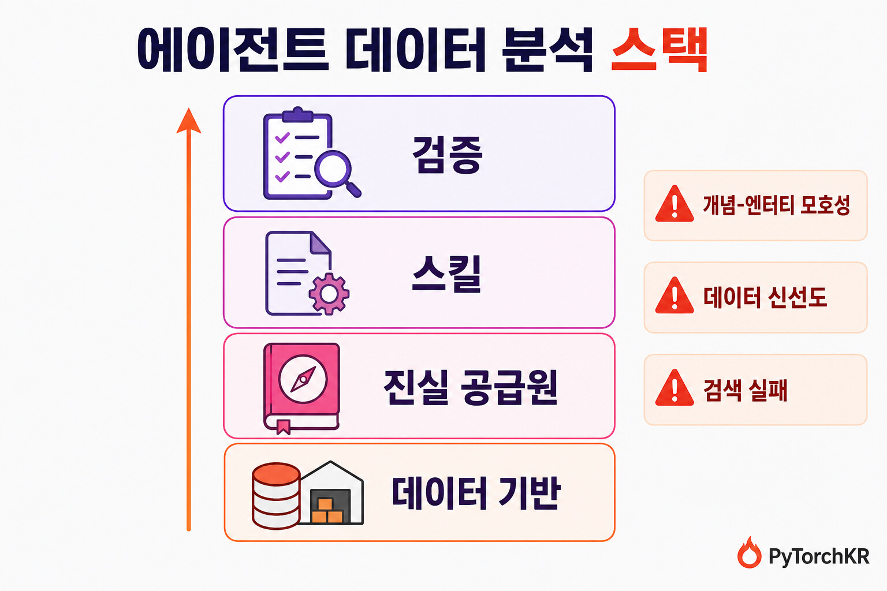
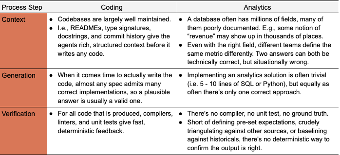
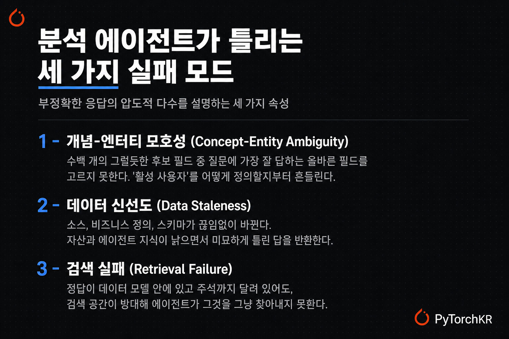
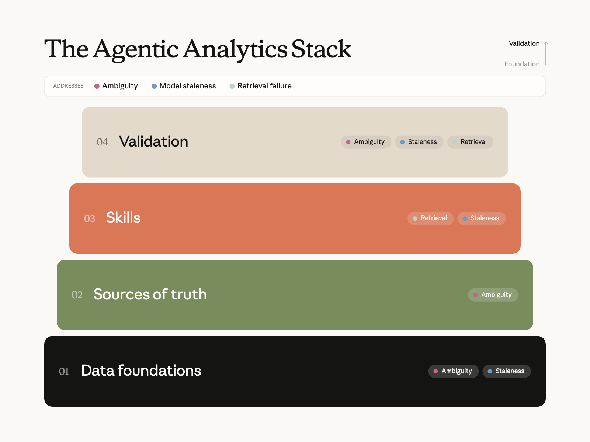
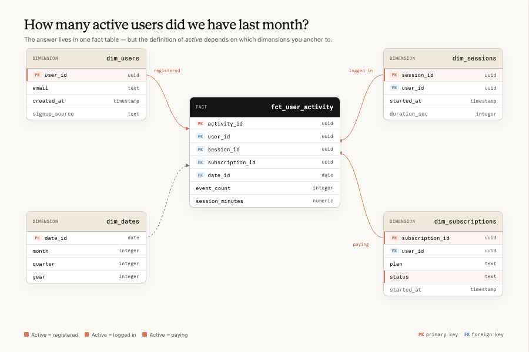
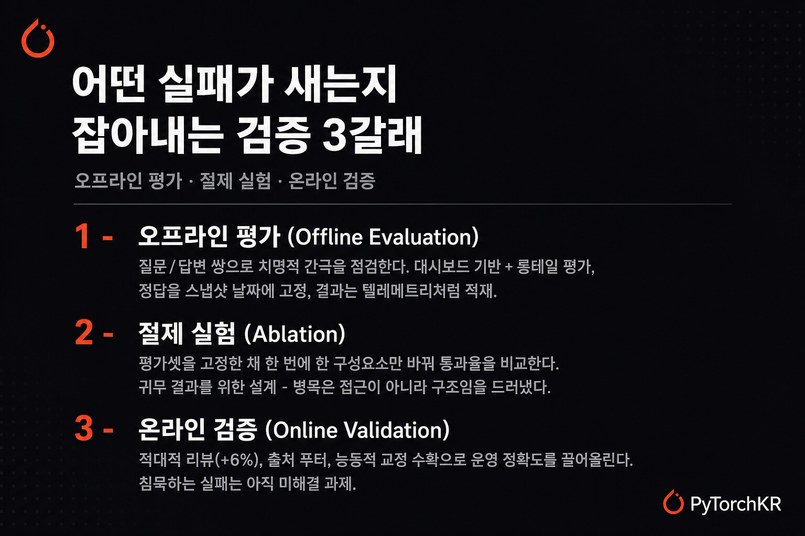
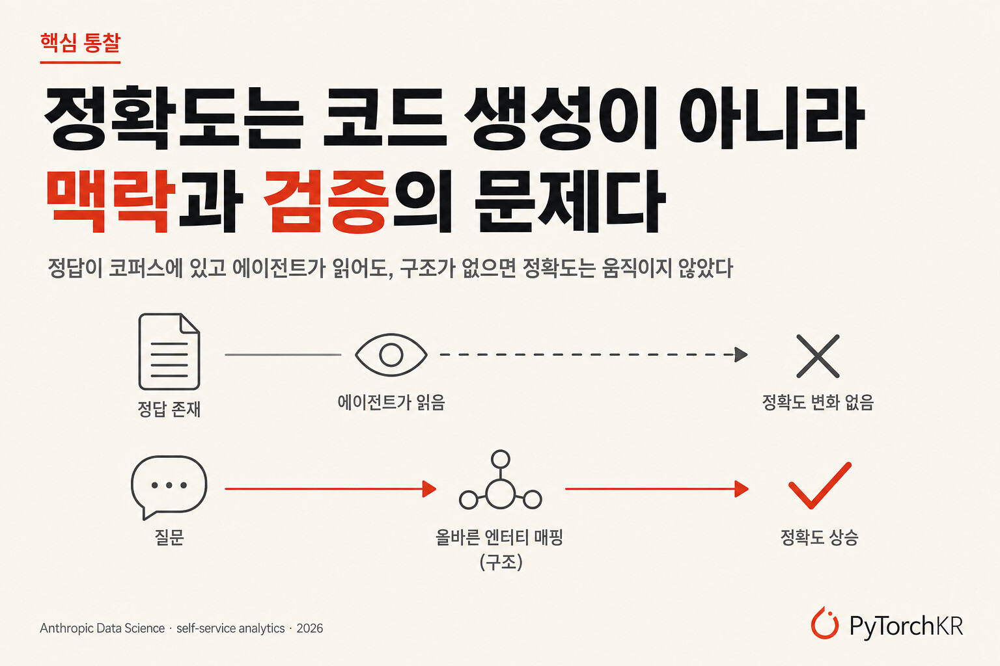

# Anthropic이 Claude로 95% 자동화한 '셀프-서비스 데이터 분석 스택'에 대한 소개

Source: https://discuss.pytorch.kr/t/anthropic-claude-95/10604
Shared URL: https://share.google/VirxRPLYnLvG5f8JA
Saved: 2026-06-12
Author: 박정환 (@9bow)
Published: 2026-06-09T06:30:16.973Z
Topic ID: 10604
Category: 읽을거리&정보공유 (category_id=14)
Tags: llm, claude-code, anthropic, agent, claude, data-analytics
Capture method: Discourse JSON cooked HTML manual conversion



## Anthropic의 셀프서비스 데이터 분석 소개

데이터 사이언스나 데이터 엔지니어링 팀이라면 누구나 공감하듯, 비전문가도 직접 데이터를 들여다보는 **셀프서비스 분석(self-service analytics)** 을 구축하는 일은 전통적으로 고된 작업이었습니다. 흔히 쓰이는 두 가지 접근은 각각 다른 방식으로 무너집니다. 첫째, 덜 기술적인 동료를 위해 넓고 비정규화된 테이블(wide denormalized table)을 만들어 데이터 모델을 더 접근하기 쉽게 만드는 방식은, 비즈니스가 커질수록 정의가 서로 어긋나는 중복 뷰(view)를 양산하고 SQL을 배울 의향이 없는 직원과의 간극을 좁혀주지도 못합니다. 둘째, 사용자를 위한 격리된 환경(ringfenced environment)을 따로 만드는 방식은 비즈니스 질문의 긴 꼬리(long tail)를 놓치고, 팀마다 작업을 사일로화하면서 지표와 대시보드가 비대해지는 결과로 이어집니다.

거대 언어 모델(LLM)의 부상은 이 난제들을 피해 갈 수 있는 또 다른 경로를 제시합니다. 그러나 그냥 [Claude](https://claude.com)를 데이터 웨어하우스에 연결해 두고 에이전트가 알아서 쿼리를 실행하게 두면, *정밀하다는 착각(false sense of precision)* 을 만들어내기 쉽습니다. 임시 분석 요청에서 해방되었다는 초기의 환희는, 이 구성이 사용자를 기존에 잘 큐레이션된 데이터셋으로 안내해 주던 인프라, 문서, 전문성으로부터 분리해 버린다는 사실을 깨닫는 순간 두려움으로 바뀝니다.

이 글은 [Anthropic](https://www.anthropic.com)의 데이터 사이언스 및 데이터 엔지니어링 팀이 사내에서 직접 [Claude Code](https://www.anthropic.com/claude-code)를 활용해 셀프서비스 분석을 구축하면서 쌓은 모범 사례를 정리한 것입니다. 현재 Anthropic에서는 비즈니스 분석 쿼리의 *95%가 Claude로 자동화* 되어 있고, 집계 기준 정확도 역시 *약 95%* 에 이릅니다. 반복적이고 기계적인 분석 업무를 Claude에 넘긴 덕분에, 데이터 사이언스 팀은 인과 모델링(causal modeling), 예측(forecasting), 머신러닝처럼 더 전략적인 작업에 집중할 수 있게 되었습니다. 핵심 메시지는 명확합니다. *분석의 정확도는 코드 생성의 문제가 아니라 맥락(context)과 검증(verification)의 문제* 라는 것입니다.

## 데이터는 소프트웨어가 아니다

LLM의 생성 능력은 양날의 검입니다. 복잡한 문제에 창의적인 해법을 제시하게 해주는 바로 그 메커니즘이, 동시에 잘못된 출력을 환각(hallucination)으로 만들어내기도 합니다. 분석 에이전트가 가진 난제를 제대로 이해하려면 **코딩 에이전트(coding agent)** 와 비교해 보는 것이 유용합니다.

코딩은 모델의 창의성에 보상을 주는 열린 해법 공간(open-ended solution space)이고, 문서와 테스트가 환각에 대한 자연스러운 가드레일 역할을 합니다. 반면 분석 작업은 흔히 단 하나의 올바른 소스를 사용해 단 하나의 정답을 내야 하는데, 그 정답의 정확성을 결정론적으로 증명할 방법이 없습니다. 같은 코드라도 테스트를 통과하면 "*맞다*"고 말할 수 있지만, 분석 결과의 숫자는 그렇게 검증할 수가 없습니다.



셀프서비스 에이전트 비즈니스 분석에서 복잡성은 주로 **데이터의 모호성(ambiguity)** 에 있습니다. 핵심 문제는 결국 *사용자의 질문을 데이터 모델 안의 구체적이고 최신인 엔터티(entity)로 매핑하고, 그것을 다루는 올바른 방식을 아는 능력* 으로 귀결됩니다. 이것만 해결되면 그 다음의 실행과 SQL 작성은 사소한 일이 됩니다. Anthropic은 부정확한 응답의 압도적 다수를 설명하는 세 가지 속성을 다음과 같이 정리합니다.

**개념-엔터티 모호성 (Concept-Entity Ambiguity)**: 데이터 모델에 (수백만 개의 필드 중) 수백 개의 그럴듯한 선택지가 있을 때, 에이전트는 사용자 질문에 가장 잘 답하는 올바른 필드를 고르지 못합니다. 예를 들어 *활성 사용자 수(active users)* 를 측정한다고 할 때, 어떤 행동을 "*활성*"으로 볼 것인지, 부정 사용자(fraudulent user)를 포함할지, 어떤 회귀 기간(lookback window)을 쓸지가 모두 모호합니다.

**데이터 신선도 (Data Staleness)**: 데이터 소스, 비즈니스 정의, 스키마는 끊임없이 바뀝니다. 그 결과 자산과 에이전트의 지식이 낡아지면서 미묘하게 틀린 답을 반환하기 시작합니다.

**검색 실패 (Retrieval Failure)**: 올바른 정보가 실제로 데이터 모델 안에 존재하고 제대로 주석까지 달려 있더라도, 검색 공간이 워낙 방대해서 에이전트가 그것을 그냥 찾아내지 못하는 경우입니다.



## 세 가지 오류를 잡는 에이전트 분석 스택

Anthropic이 이 세 가지 오류를 최소화하는 주된 방법은 자체적으로 구축한 **에이전트 데이터 스택(agentic data stack)** 입니다. 이 스택의 각 계층은 위 세 문제 중 하나 이상을 정조준하도록 설계되어 있습니다. 데이터 기반은 엔터티 모호성을, 유지보수와 검증 프로세스는 신선도 문제를, 그리고 스킬은 검색 실패를 각각 맡습니다.



### 데이터 기반: 모호성을 단 하나의 거버넌스된 답으로 좁히기

분석 에이전트의 정확성을 보장하는 가장 중요한 토대는 강력한 **데이터 기반(data foundations)** 입니다. 여기에는 데이터 웨어하우스 안의 데이터 모델, 변환(transform), 테스트, 테이블, 그리고 이들을 설명하는 메타데이터가 모두 포함됩니다. [차원 모델링(dimensional modeling)](https://en.wikipedia.org/wiki/Dimensional_modeling), 시프트 레프트 테스트(shift-left testing), 핵심 파이프라인에 대한 신선도 및 완전성 점검 같은 표준 데이터 엔지니어링 관행은 여전히 그대로 유효합니다.



달라진 점은, 이제 데이터 모델의 최종 사용자가 더 이상 데이터 사이언티스트 같은 데이터 전문가가 아니라, 데이터 이해도가 제각각인 사용자를 대신해 움직이는 **에이전트** 라는 사실입니다. 이 변화는 곤란한 문제를 낳습니다. 최종 사용자는 기반 데이터의 정확성을 검증할 능력이 없기 때문에, 결과물이 사용자에게 그 검증을 떠넘겨서는 안 됩니다. 데이터 기반 계층은 바로 이 모호성을 정조준합니다. 예컨대 *매출(revenue)* 이라는 개념이 마흔 개의 그럴듯한 후보가 아니라 단 하나의 거버넌스된 데이터셋으로 귀결된다면, 에이전트가 검색을 시작하기도 전에 문제의 대부분이 사라집니다. Anthropic이 특히 효과를 본 관행은 다음과 같습니다.

- **정규 데이터셋(canonical dataset) 구축**: 가장 흔한 실패는 에이전트가 *"제품 X의 매출"* 같은 개념을 단 하나의 올바른 테이블, 컬럼, 지표 정의에 매핑하지 못하는 것입니다. 미묘하게 다른 구현을 가진 여러 후보가 존재하기 때문입니다. 해법은 *더 적고 더 강하게 거버넌스되는 논리 모델* 입니다. 소유자가 명확하고, 바로 소비 가능하며, 발견하기 쉬운 정규 단일 진실 공급원(single source of truth) 데이터셋을 소수만 큐레이션하고, 거의 중복인 것들은 공격적으로 폐기(deprecate)합니다. 물리적 롤업(rollup)과 캐시는 비용과 성능을 위해 여전히 중요하지만, 정규 모델과 나란히 대안으로 두기보다 정규 모델에서 기계적으로 파생시켜야 합니다.

- **표준의 강제(enforce standards)**: 거버넌스는 *도구(tooling)*, *CI*, *권한(mandate)* 세 가지로 강제될 때만 유지됩니다. 에이전트는 구조적으로 정규 모델을 먼저 거치도록 라우팅되고, 이를 우회하는 변경은 리뷰에서 실패하며, 다운스트림 팀은 거버넌스된 계층 위에 빌드하거나 그러지 않는 이유를 설명해야 합니다.

- **산출물 코로케이션(colocate artifacts)**: 끊임없이 바뀌는 데이터 모델과 비즈니스 로직에 대한 핵심 방어책은 코로케이션입니다. 거의 모든 데이터 코드(모델링, 시맨틱 레이어, 참조 문서, 정규 대시보드 정의)가 하나의 저장소에 모여 있고, CI 점검이 계층 간 무결성을 보호합니다. 모델링 변경이 다운스트림 대시보드를 깨뜨리면 CI가 이를 잡아내고, 수정은 같은 PR에서 함께 배포됩니다.

- **메타데이터를 일급 제품으로 취급**: 코딩 에이전트가 잘 동작하는 이유 중 하나는 코드베이스가 *읽기 쉽기(legible)* 때문입니다. README, 타입 시그니처, 독스트링 등이 그 역할을 합니다. 웨어하우스도 컬럼/테이블 설명, 정규 지표 정의, 그레인(grain) 문서, 유효 값 범위, 계보(lineage), 소유권, 모델 등급을 변환 로직만큼 엄격하게 관리하면 똑같이 읽기 쉬워집니다.

### 진실 공급원: 질문을 거버넌스된 엔터티로 변환하기

데이터 기반이 데이터 웨어하우스 그 자체라면, **진실 공급원(sources of truth)** 은 에이전트가 그 웨어하우스를 항해하기 위해 참조하는 기준면입니다. 이 계층은 개념-엔터티 모호성을 줄여서, 이해관계자 질문 속의 *"주간 활성 사용자(weekly active users)"* 를 데이터 모델 안의 구체적이고 거버넌스된 엔터티로 바꿔줍니다. 신뢰도가 높은 순서대로 정리하면 다음과 같습니다.

- **시맨틱 레이어(Semantic Layer)**: 컴파일된 지표와 차원 정의입니다. 질문이 정의된 지표에 깔끔하게 매핑되면, 에이전트는 함수를 호출해 회사 내 다른 모든 표면이 산출하는 것과 동일한 단 하나의 숫자를 얻습니다. Anthropic의 에이전트는 (스킬 지침에 의해) 구조적으로 시맨틱 레이어를 *먼저* 활용하도록 요구됩니다. 한 가지 시도해 봤지만 *실패한* 아이디어가 있는데, LLM이 원시 테이블과 쿼리 로그로부터 지표 정의를 자동 생성하게 해 시맨틱 레이어를 부트스트랩하는 방법이었습니다. 그럴듯해 보이는 정의를 만들어냈지만 정작 제거하려던 모호성을 그대로 인코딩해 버렸고, 사람이 큐레이션한 더 작은 레이어보다 평가 점수가 오히려 낮았습니다. 따라서 *문서* 는 Claude로 생성하되 *정의* 의 소유는 사람이 맡기를 권합니다.

- **계보와 변환 그래프(Lineage)**: 시맨틱 레이어가 질문을 커버하지 못할 때, 계보와 (참조 횟수 기반의) 테이블 랭킹은 어떤 업스트림 모델이 특정 개념을 떠받치는지, 무엇이 폐기되었는지, 무엇이 같은 그레인을 공유하는지 추론하게 해줍니다. 이는 *"지표를 모르겠다"* 를 *"어떤 거버넌스 모델에서 집계해야 하는지는 안다"* 로 바꿔줍니다.

- **쿼리 코퍼스(Query Corpus)**: 대시보드, 노트북, 과거 분석에서 나온 역사적 SQL입니다. 직관적으로는 이미 올바르게 답해진 모든 질문의 기록이니 가치가 높아야 합니다. *그러나 실제로는, 수천 개의 과거 쿼리에 대한 원시 검색 접근권을 에이전트에게 줬더니 정확도가 1%포인트도 채 움직이지 않았습니다.* 비정형 검색은 새 질문을 올바른 선례에 매핑하지 못했습니다. 효과가 있었던 것은 그 코퍼스를 도메인별 구조화된 참조 문서와 재사용 가능한 분석 패턴으로 *증류(distill)* 하는 것이었습니다.

- **비즈니스 맥락(Business Context)**: 대부분의 팀이 건너뛰는, 그리고 Anthropic이 가장 오래 과소평가했던 계층입니다. 비즈니스를 이해하지 못하는 에이전트는 사용자가 *물어본 것* 에는 답하지만 사용자가 *의도한 것* 에는 답하지 못합니다. *"Q2 출시"* 가 특정 제품을 가리킨다는 것, 두 팀이 같은 용어를 다르게 정의한다는 것, 어떤 질문이 목요일 이사회 때문에 나왔다는 것을 알지 못하기 때문입니다. Anthropic은 색인된 문서, 로드맵, 의사결정 로그, 조직 구조로 구성된 회사 지식 그래프(knowledge graph)를 주입해 에이전트가 이런 암묵적 참조를 해소하고 더 나은 명료화 질문을 던지게 합니다.

이 네 가지에 공통으로 나타나는 실패 패턴은 데이터 기반 계층에서와 동일한 **빈약하거나 낡은 문서** 입니다. Claude는 이 간극을 메우는 데 대단히 유용하지만(컬럼 설명 초안 작성, 쿼리 패턴으로부터 지표 문서 제안, CI에서 미문서화 모델 플래그), 큐레이션과 소유권은 사람이 관리합니다.

### 스킬: 에이전트의 절차적 지식

진실 공급원이 에이전트의 *선언적(declarative)* 지식(지표가 무엇을 의미하는가)이라면, **스킬(Skill)** 은 그것의 *절차적(procedural)* 지식입니다. 어떤 소스를 어떤 순서로 참조할지, 모호한 데이터를 어떻게 항해할지, 완성된 분석이 어떤 모습이어야 하는지를 담습니다. Claude Code에서 [스킬](https://code.claude.com/docs/en/skills)은 에이전트가 필요할 때 읽어 들이는 마크다운 폴더입니다.

스킬의 효과는 극적이었습니다. *스킬이 없을 때 Claude의 분석 질문 정확도는 평가에서 21%를 넘지 못했지만, 스킬을 추가하자 집계 기준으로 일관되게 95%를 넘었고 특정 도메인에서는 정기적으로 99% 안팎* 에 도달했습니다. 주요 모범 사례는 다음과 같습니다.

**짝(pairwise) 스킬을 만든다**: ***지식(knowledge)*** 스킬은 도메인 세부사항을 필요할 때 로드하게 해주는 얇은 최상위 라우터(router) 역할을 합니다. *"먼저 시맨틱 레이어를 시도하되, 커버리지가 없으면 이 도메인의 관련 테이블/컬럼/조인/함정을 설명하는 약 30개의 참조 파일이 여기 있다"* 고 안내하는 식입니다. 이 라우터가 곧 검색 실패에 대한 Anthropic의 답입니다. 백만 개 필드의 웨어하우스를 에이전트가 헤매게 두는 대신, 쿼리가 작성되기도 전에 검색 공간을 수십 개의 큐레이션된 파일로 좁혀줍니다. ***언북(unbook)*** 스킬은 시니어 분석가가 따를 법한 과정(질문 명료화 → 소스 탐색 → 쿼리 실행 → 결과를 적대적 리뷰 서브에이전트로 순회)을 인코딩하고, 리텐션 곡선, 비율 분해, 퍼널 분석 같은 재사용 가능한 분석 패턴 십여 개를 번들로 묶습니다.

**제대로 된 참조 문서를 만든다**: LLM이 검색하기 좋도록 작성합니다. Anthropic의 참조 문서는 테이블(그레인, 범위, 제외 조건), 함정의 메커니즘(예: *"알려진 무료 이메일 도메인은 제외하되 [anthropic.com](http://anthropic.com) 같은 커스텀 도메인은 유지하라"*), 그리고 명시적인 라우팅 트리거(예: *"IF 질문이 실험 리프트에 관한 것이면 원시 이벤트 카운트에는 사용하지 마라"*)를 담습니다. 아래는 참조 문서 작성에 쓰는 스켈레톤입니다.

```
# [Domain] Tables

## Quick Reference
### Business Context — [what this domain means in plain words]
### Entity Grain — [what one row represents]
### Standard Hygiene Filter — [the filter every query in this domain applies]

## Dimensions
- [How the key dimensions are encoded, and how the same concept is named
  differently across tables]

## Key Tables
### [table_name]
- **Grain**: [...] · **Scope/exclusions**: [...]
- **Usage**: [when to use it, when NOT to, join keys, required filters]
[... one short section per governed table ...]

## Gotchas
- [The wrong-answer modes a senior analyst would warn you about]

## Best Practices / Common Query Patterns
- [Default choices, standard cuts, worked patterns where the exact query
  form is the hard part]

## Cross-References
- [Neighboring domain docs that own adjacent questions]

```

**스킬 유지보수를 일급 시민으로 취급한다**: 스킬 문서는 매일 바뀌는 데이터 모델을 설명하므로, 능동적 유지보수가 없으면 몇 주 안에 틀린 내용이 됩니다. Anthropic은 오프라인 정확도가 출시 시점의 약 95%에서 한 달 만에 약 65%까지 떨어지는 것을 지켜본 뒤, 이를 엔지니어링 문제로 다루기 시작했습니다. 스킬 마크다운 파일을 변환 모델과 같은 저장소에 코로케이션해서, 모델을 바꾸는 PR이 곧 그 모델을 설명하는 문서를 갱신하는 PR이 되도록 만든 것입니다. 코드 리뷰 훅(hook)이 스킬 파일을 건드리지 않은 리포팅 모델 변경을 플래그합니다. 그 결과 *데이터 모델 PR의 약 90%가 이제 같은 diff 안에 스킬 변경을 포함* 합니다. 또한 모델이 개선되어 과거의 실패 모드가 더는 적용되지 않으면, 낡은 스킬 스캐폴딩을 주기적으로 정리(prune)합니다.

**모든 표면에서 일관되고 매끄러운 경험을 만든다**: 같은 스킬은 Slack, IDE, 대시보드 도구, 독립 에이전트 세션 어디서 물어도 *반드시* 같은 답을 줘야 합니다. Anthropic은 단일 정규 소스(데이터 저장소)를 보장하고 스킬 변경을 자동 동기화해 이를 달성했습니다. 병합되면 스킬은 (IDE 사용자용) 플러그인 마켓플레이스, (단일 파일을 읽는 호스팅 앱용) 클라우드 스토리지 블롭으로 동기화되고, [MCP(Model Context Protocol)](https://modelcontextprotocol.io)를 통해 리소스로도 직접 제공됩니다. 또한 처음부터 이식성(portability)을 염두에 두고, 하드코딩된 저장소 경로와 특정 표면에 종속된 네임스페이스를 피해 설계했습니다.

### 검증: 어떤 실패 모드가 새어 나가는지 찾아내기

마지막으로 **검증(validation)** 은 세 가지 실패 모드 중 무엇이 여전히 새어 나가는지를 알아내는 방법입니다. Anthropic은 이를 오프라인 평가, 절제 실험, 온라인 검증의 세 갈래로 운영합니다.



**오프라인 평가(Offline Evaluation)** 는 단순한 질문/답변 쌍입니다. ML 모델의 오프라인 테스트와 비슷하게, 온라인 에이전트의 성능을 알려주지는 않지만 치명적인 간극이 있는지에 대한 좋은 감을 줍니다. Anthropic은 두 종류를 배포합니다. *대시보드 기반 평가* 는 가장 흔한 이해관계자 질문을 다루도록 Claude가 자동 생성한 뒤 사람이 검증하고, *롱테일 평가* 는 Claude에 비즈니스 맥락(로드맵, 테이블 문서)을 먹여 도메인 전반에 걸친 그럴듯한 질문을 생성하게 합니다. 추가로 이해관계자가 스레드에서 에이전트를 교정할 때마다 그 교정을 평가 후보로 계속 수확합니다. 주요 원칙으로는 *드리프트하지 않도록 정답을 스냅샷 날짜에 고정* 하기, *결과를 테스트 로그가 아니라 텔레메트리처럼 저장* 하기(스킬 버전, git SHA, 모델 ID, 어서션별 통과/실패, 토큰 수, 실행 시간을 웨어하우스 테이블에 적재), *도메인별로 출시를 게이팅* 하기(평가셋이 임계치 약 90%를 넘기 전까지 도메인 담당자는 에이전트를 이해관계자에게 알릴 수 없음), *비즈니스와 데이터 모델의 복잡도에 맞춰 평가 수를 보정* 하기(토픽당 수십 개를 넘어서면 수익이 체감하고, 그 천장은 새 모델 세대가 나올 때마다 더 낮아짐), *오프라인 평가 정확도는 약 100%를 목표로* 하기(모든 정답이 시맨틱 레이어를 거치도록 하되, 이는 시스템이 틀린 답을 절대 내지 않는다는 보장이 아니라 평가 커버리지가 충분할 때 명백한 간극이 없다는 뜻일 뿐임) 등이 있습니다.

**절제 실험(Ablation)** 에서는 오프라인 평가셋을 고정한 채 정확히 한 가지 구성요소만 바꿔 통과율을 비교합니다. 각 실행은 한 시간이면 끝나고 수많은 논쟁을 대체합니다. Anthropic이 강조하는 것은 *귀무 결과(null result)를 위한 설계* 입니다. 가장 유용했던 절제는 부정적인 것이었는데, 에이전트에게 전체 대시보드/변환/노트북 SQL(수천 개 파일)에 대한 직접 grep 접근권을 주고, 트랜스크립트에서 실제로 그것을 읽었는지까지 확인했습니다. 그런데 정확도는 어느 방향으로도 1%포인트 미만으로 움직였습니다. 틀린 질문의 경우 정답이 코퍼스에 있었는지 확인해 보니 약 80%는 있었지만, *"정답이 존재함"* 이 *"이제 맞춤"* 을 예측하지는 못했습니다.

>

정보는 거기 있었고, 에이전트도 그것을 봤지만, 그래도 사용하지 않았습니다. 그 단 하나의 실험이, 우리의 병목은 과거 작업에 대한 *접근* 이 아니라 *구조*(질문을 올바른 엔터티에 매핑하는 것)라는 것을 알려줬고, 이 통찰이 수개월의 로드맵 방향을 바꿔놓았습니다.

이 결과는 글 첫머리의 *"정확도는 코드 생성이 아니라 맥락과 검증의 문제"* 라는 주장을 그대로 뒷받침합니다.

귀무 결과 설계 외에 Anthropic이 강조하는 절제 방법론이 두 가지 더 있습니다. 하나는 *PR 단위 절제* 입니다. 의미 있는 스킬 편집마다 관련 평가 슬라이스에 before/after 실행을 돌려 그 차이(delta)를 PR 설명에 적으면, *"문서를 개선했다"* 는 주장이 정직해지고 선의의 추가가 오히려 결과를 악화시키는, 의외로 흔한 경우를 잡아냅니다. 다른 하나는 *효과 없던 것의 짧은 목록을 유지* 하는 것입니다. 예컨대 문서 다듬기를 일정 수준 이상 반복하자 세 번 연속 역효과가 났고(문서는 길어지기만 하고 좋아지지는 않았습니다), 지연을 줄이려 적대적 리뷰어를 더 저렴한 모델로 바꿨더니 정확도 이득의 대부분을 잃고 속도 향상도 거의 없었습니다. 귀무 결과는 기록 비용이 싸고, 다음 사람이 같은 실험을 반복하는 것을 막아줍니다.

**온라인 검증(Online Validation)** 은 실제 운영 시스템의 정확성을 최대한 끌어올리는 단계입니다. 핵심 장치는 다음과 같습니다.

- **적대적 리뷰(Adversarial Review)**: 최종 답안 후보의 모든 기반 가정을 공격적으로 따져 묻는 Claude 스킬을 두면 평가셋 정확도가 6% 올랐습니다. 다만 토큰은 32% 더 들고 지연은 72% 더 늘었습니다.

- **출처 푸터(Provenance Footer)**: 모든 응답에는 그 답이 어느 신뢰 등급(시맨틱 레이어 › 큐레이션된 참조 › 원시 테이블)에서 왔는지, 데이터가 얼마나 신선한지, 모델 소유자가 누구인지를 담은 푸터가 붙습니다. 답을 더 정확하게 만들지는 않지만, 소비자가 그 응답을 얼마나 신뢰할지 판단하게 돕습니다. *"원시 테이블, 신선도 불명"* 같은 푸터는 상부로 전달하기 전에 검증하라는 신호가 됩니다.

- **데이터 품질 점검(Data Quality Checks)**: 에이전트가 올바른 필드를 적절한 방식으로 썼더라도 데이터 그 자체가 틀렸을 수 있습니다. 참조하는 필드가 최신이고 완전하며 이상치가 없는지 확인하는 기본 점검은 대체로 좋은 위생 습관입니다.

- **수동 모니터링(Passive Monitoring)**: 상시 추적하는 두 가지 운영 신호가 있습니다. 에이전트 쿼리 중 시맨틱 레이어로 해소되는 비율과, 교정 표현(*"그건 틀린 테이블이다"*, *"사기 필터가 빠졌다"*)을 담은 응답의 비율입니다. 둘 다 오프라인 통과율과 함께 매주 검토되는 대시보드로 모입니다.

- **능동적 교정 수확(Active Correction Harvesting)**: 루프를 닫는 부분입니다. 예약된 에이전트가 몇 시간마다 이해관계자 채널을 훑어 교정 표현을 찾아내고, 관련 참조 문서에 대한 한 줄짜리 수정 초안을 작성해 도메인 담당자에게 태그된 PR을 엽니다. 수정 경로는 의도적으로 지루하게(마크다운 파일 수정 → 병합 → 자동 동기화) 설계되어, 같은 교정이 다시 오프라인 평가셋으로 환류됩니다.

이 모든 것으로도 완전히 잡히지 않는 것이 바로 **침묵하는 실패(silent failure)** 입니다. 답이 틀렸는데도 그럴듯해 보여서 아무 이의 없이 사용되는 경우입니다. Anthropic의 완화책은 출처 푸터, 리더십에 전달되는 답에 대한 명시적 사람의 사인오프, 그리고 도메인별 핵심 KPI를 매일 검증된 대시보드와 대조하는 상시 평가지만, 아직 견고한 해법은 없다고 솔직히 인정합니다.

## 무엇부터 시작해야 하는가

만약 맨바닥에서 출발한다면, *소수의 정규 데이터셋, 수십 개의 오프라인 평가, 얇은 지식 스킬* 만으로 이점의 대부분을 얻을 수 있습니다. 이 글의 나머지는 모두 그 토대가 갖춰진 뒤에 추가한 것들입니다. 한편 모든 모범 사례가 모든 데이터 팀에 적합한 것은 아닙니다. Anthropic은 접근 방식을 결정하기 전에 다음 질문들로 조직과 원칙을 맞춰보길 권합니다.

- **지금의 정답이 얼마나 중요한가, 아니면 미래의 정답이 중요한가**: AI 모델은 빠르게 발전합니다. 현재 모델의 한계를 메우려고 막대한 인프라를 짓다가, 모델이 개선되면 그 인프라가 무의미해지는 경우를 자주 봅니다. 모델의 약점을 파악하고 모델 개선을 기다리는 편이 오버헤드가 훨씬 적지만, 회사의 위험 감수 성향과 맞지 않을 수 있습니다.

- **비즈니스 복잡성이 어떻게 변할 것으로 보는가**: 데이터가 많지 않거나, 출력 소비자가 소수이거나, 데이터 모델이 단순하게 유지될 가능성이 높다면 일부 프로세스는 과한 투자일 수 있습니다.

- **출력의 대상 독자가 얼마나 기술적인가**: 답이 틀렸음을 알아챌 수 있는 데이터 사이언티스트를 위한 시스템이라면, 기반 데이터 모델에 익숙하지 않은 독자를 위한 경우보다 오류에 더 관대해도 됩니다.

- **정확도 향상에 얼마를 쓸 의향이 있는가**: 적대적 검증 같은 일부 프로세스는 정확도를 크게 높이지만 종종 더 높은 비용과 지연을 동반합니다.

- **접근 제어와 내부 데이터 프라이버시에 대한 입장은 어떤가**: 에이전트는 맥락이 많을수록 성능이 좋지만, 광범위한 데이터 접근은 대부분 회사의 거버넌스 태세와 충돌합니다. 이것이 하나의 에이전트를 만들지, 범위가 좁은 여러 에이전트를 만들지를 가릅니다.

## 개발자 관점에서의 시사점

이 글의 가장 큰 가치는 LLM 분석 시스템을 바라보는 관점의 전환에 있습니다. 흔히 *"좋은 모델에 좋은 데이터만 연결하면 된다"* 고 생각하기 쉽지만, Anthropic의 절제 실험은 정반대를 보여줍니다. 정답이 코퍼스에 존재하고 에이전트가 그것을 읽었는데도 정확도가 움직이지 않았다는 사실은, 병목이 *정보의 접근성* 이 아니라 *질문을 올바른 엔터티로 매핑하는 구조* 에 있음을 드러냅니다. 이는 검색 증강 생성(RAG) 시스템을 설계하는 모든 개발자에게도 똑같이 적용되는 교훈입니다. 단순히 더 많은 문서를 인덱싱하고 검색 범위를 넓히는 것보다, 모호성을 줄이고 단 하나의 거버넌스된 답으로 좁히는 *구조화* 가 정확도를 좌우한다는 것입니다.



또한 [Claude Code의 스킬](https://code.claude.com/docs/en/skills)이 단순한 코딩 보조 도구를 넘어, 도메인 지식을 *절차적 형태* 로 코드 저장소와 함께 버전 관리하는 운영 인프라로 쓰일 수 있다는 점도 주목할 만합니다. 스킬을 변환 모델과 같은 PR에서 갱신하고, CI 훅으로 문서 드리프트를 막고, 적대적 서브에이전트로 결과를 검증하는 흐름은, 그 자체로 신뢰할 수 있는 에이전트 시스템을 운영하기 위한 하나의 청사진입니다. 어떤 경로를 택하든, Anthropic의 가장 큰 성과는 세 가지 실패 모드를 정조준한 데서 나왔습니다. *모호성을 단 하나의 거버넌스된 답으로 좁히고, 그 답을 쉽게 발견할 수 있게 만들고, 둘 중 하나가 낡았을 때 그것을 플래그하는 것* 입니다.

## 부록: 메인 웨어하우스 스킬 스켈레톤

아래는 Anthropic이 대부분의 스킬을 만들 때 기준으로 삼는 **메인 웨어하우스 스킬(warehouse skill)** 의 스켈레톤입니다. 실제 파일의 구조를 그대로 두되, 내부 세부사항만 `[대괄호 자리표시자]` 로 가렸습니다. 그대로 복사해 쓰라는 의도가 아니라, 어떤 종류의 섹션을 적어둘 가치가 있다고 판단했는지를 보여주기 위한 것입니다. 앞서 살펴본 원칙들(시맨틱 레이어 우선 강제, 엔터티 명료화, 적대적 SQL 리뷰, 출처 푸터, 도메인별 참조 문서 라우팅)이 한 파일 안에서 어떻게 절차로 엮이는지가 그대로 드러납니다.

```
---
name: [warehouse-skill]
version: [x.y.z]
description: "IF the user asks to query [the company]'s data warehouse for any
  [list of business domains] question — THEN invoke this skill. DO NOT invoke
  for [adjacent engineering tasks] or questions with no data-warehouse component."
---

# [Warehouse] Skill Instructions

## Description
The single source of truth for safe and effective [warehouse] querying.
Referenced by other skills [listed] for query execution guidance.

Act as a Data Analyst, providing strategic insights and data-driven
recommendations but seek guidance along the way.

**Out-of-scope decisions**: [product areas, etc.] → surface data only,
state "decision is [owning team]'s call", do NOT take a position or author
code fixes.

## Executing queries
Priority:
1. **[Managed connection]** (if available): [query tool] / [schema tool]
2. **[CLI fallback]** (if installed): [default project, fallback project]
3. **Neither** — ask the user to authenticate, then stop

---

# Semantic Layer (REQUIRED first step)

The governed semantic layer is the **mandatory default path** for every data
question — same numbers as [the BI tool], joins/grain/filters baked in. Raw SQL
via the reference docs below is the **fallback**, used only after the
semantic-layer path is shown not to cover the ask.

## Required workflow
1. **Load** — [how to load the semantic layer in each runtime, with fallbacks]
2. **Discover** — search measures/dimensions by keyword; **always check
   segments** (the named canonical population filters — hand-rolled WHERE
   clauses for these are the dominant wrong-answer mode)
3. **Compile + run** — build the spec → compile to SQL → execute
4. **Fallback** — only if discovery finds no relevant metric or compile fails
   → raw SQL via `references/*.md` (PART 3 below)

> **Don't bail early.** Do NOT fall back to raw SQL on these grounds:
> - "[custom date filtering / cohorts]" → [covered by time-dimension specs]
> - "[needs a join]" → [the metric layer already encapsulates its joins]
> - [3–4 more pre-rebutted excuses agents use to skip the semantic layer]

### Date windows & timezone — decide before you query
- **As-of date vs trailing-N days**: [convention for each]
- **"Last week/month"** → the last *complete* calendar week/month, not trailing-7/30
- **Timezone default**: [TZ]; [exception for certain reporting rollups]
- **Freshness lag**: [some] tables settle late — anchor on MAX(date), not "yesterday"

---

# PART 1: MUST KNOW (Read First for Every Request)

## 🚀 Quick Start Workflow
1. **Check for red flags first**: [restricted/PII requests, gated domains,
   high-stakes asks that need extra validation]
2. **Out of scope — escalate, don't guess**: [access requests, pipeline
   troubleshooting, stale dashboards, root-cause assertions, product/pricing
   recommendations] → redirect to [the owning team], don't answer
3. **Clarify the request**: time period, segment, the business decision it informs
4. **Check for existing dashboards**: [per-domain dashboard catalogs]
5. **Identify the data source**: [navigation map below; prefer governed/aggregated tables]
6. **Execute the analysis**: [required filters + adversarial review]
7. **Deliver insights**: show methodology, differentiate observations from interpretations

## 🏢 Business Context

### Entity Disambiguation (MUST CLARIFY)
- **"[Term A]" can mean**: [entity 1] or [entity 2] — always clarify which
- **"[Term B]" can mean**: [entity 1] → [entity 2] → [entity 3] (one-to-many chain)
- **"Users"**: [which identifier gives accurate counts, and which ones inflate them]

### Business Terminology
- [Current product names vs deprecated aliases that still appear as frozen
  values in the data layer — write with the new names, filter with the old]
- [Key internal acronyms]
- **[Headline metric] calculations**: [monthly / default window / leading indicator]
- **Unfamiliar terms — search [internal docs], don't guess**

### Data Integrity Requirements ⚠️
- **NEVER**: make up data/columns; make speculative assertions beyond what data shows
- **ALWAYS**: use safe division; differentiate observations ("data shows X")
  from interpretations ("this suggests Y"); flag limitations

---

# PART 2: HOW TO DO (Follow During Execution)

## 🔧 Technical Execution Guide
- [Managed-connection tools and CLI invocation details]
- **PII protection**: for restricted data, return the SQL for the user to run
  themselves — do not return results

## 📊 Analysis Best Practices Guide
1. Clarify the ask before querying
2. Show your work (filters, inclusions/exclusions, freshness)
3. Clarify denominators
4. Consider sample bias
5. Connect to business impact
6. **Adversarial SQL review (MANDATORY)** — spawn the [sql-reviewer] sub-agent
   for every query before the final answer; blocking findings must be fixed
   and re-reviewed; do not self-certify
7. **Report with provenance** — every answer ends with a footer:
   > **Source:** [semantic layer | governed table | raw exploration] ·
   > **Confidence:** [tier] · **Reviewed:** [reviewer ✓, round N] ·
   > **Freshness:** [max date in the data] · **Owner:** [owning team]

---

# PART 3: DATA REFERENCES & RESOURCES

## 📚 Knowledge Base Navigation
### [Domain A] → `references/[domain_a].md`
- **Use for**: [kinds of questions]
- **Key tables**: [...]
- **Dashboards**: `references/[domain_a]_dashboards.json`

### [Domain B] → `references/[domain_b].md`
- **Use for**: [...]

[... one entry per business domain — a few dozen in total ...]

## ⚠️ Troubleshooting Guide

### When Information Is Missing
- [missing tables / access denied / outdated docs / unknown enum values → what to do]

### Field Naming Gotchas
- Use `[field_x_v2]` NOT `[field_x]`
- [Two similarly-named tables report the same metric at different grains — which to use]
- [Which of two plausible sources is canonical for the headline metric]
- [… a dozen more hard-won one-liners …]

```

이 스켈레톤에서 눈여겨볼 점은, 스킬이 *"시맨틱 레이어를 먼저 시도하라"* 를 단순 권고가 아니라 **구조적으로 강제** 한다는 것입니다. 에이전트가 원시 SQL로 빠져나가려 할 때 흔히 대는 핑계("커스텀 날짜 필터가 필요하다", "조인이 필요하다")를 미리 반박해 두고, 모든 쿼리에 적대적 SQL 리뷰 서브에이전트와 출처 푸터를 의무화합니다. 본문에서 설명한 *진실 공급원 → 스킬 → 검증* 의 흐름이 한 파일의 절차로 압축되어 있는 셈입니다.

##  How Anthropic enables self-service data analytics with Claude 원문 블로그

      [Claude](https://claude.com/blog/how-anthropic-enables-self-service-data-analytics-with-claude)

### [How Anthropic enables self-service data analytics with Claude | Claude](https://claude.com/blog/how-anthropic-enables-self-service-data-analytics-with-claude)

Tips and approaches to maximizing Claude’s ability to drive self-serve data insights

## 더 읽어보기

-

[Anthropic, Claude에 업무 방식과 조직 환경에 맞게 직접 커스터마이징할 수 있는 Claude Agent용 Skills 기능 출시](https://discuss.pytorch.kr/t/anthropic-claude-claude-agent-skills/7979)

-

[[Deep Research] Model Context Protocol(MCP) 개념 및 이해를 위한 학습 자료](https://discuss.pytorch.kr/t/deep-research-model-context-protocol-mcp/6594)

-

[Agent Skills: 소프트웨어 개발 생명주기 전체를 커버하는 AI 코딩 에이전트용 프로덕션급 20개 엔지니어링 스킬 모음](https://discuss.pytorch.kr/t/agent-skills-ai-20/9763)

*이 글은 GPT 모델로 정리한 글을 바탕으로 한 것으로, 원문의 내용 또는 의도와 다르게 정리된 내용이 있을 수 있습니다. 관심있는 내용이시라면 원문도 함께 참고해주세요! 읽으시면서 어색하거나 잘못된 내용을 발견하시면 덧글로 알려주시기를 부탁드립니다.*

[파이토치 한국 사용자 모임](https://pytorch.kr/)이 정리한 이 글이 유용하셨나요? [회원으로 가입](https://discuss.pytorch.kr/signup)하시면 주요 글들을 이메일로 보내드립니다!

[텔레그램(Telegram)](https://t.me/pytorchkr)이나 [Slack/Discord/Teams/Dooray/GoogleChat 등](https://discuss-noti.pytorch.kr)으로도 새 글 알림을 받으실 수 있습니다.

 아래쪽에 좋아요를 눌러주시면 새로운 소식들을 정리하고 공유하는데 힘이 됩니다~
