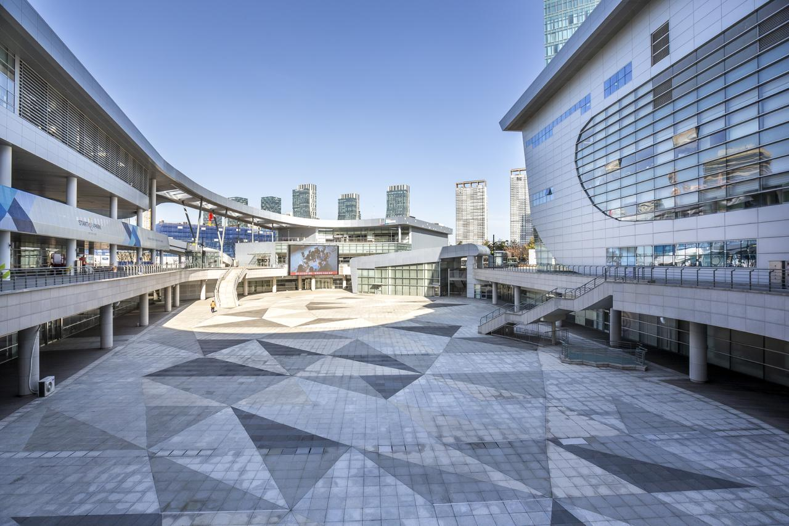
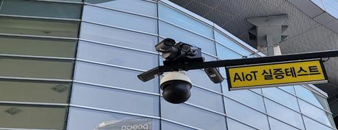

[← Back to index](../index_en.md)

# GY Networks | Vision Intelligence-Based Safety Management Solution

## Basic Information
- Demonstration company: 지와이네트웍스
- Demonstration year: 2021
- Support amount: 100,000,000원
- Location: 인천 연수구 컨벤시아대로 204 (송도동)
- Demonstration partner: IFEZ
- Demonstration target: 인천스타트업파크 전체의 공간 또는 장소
- Category: 공간

## Demonstration Overview
- Case name: 시각지능기반 안전관리솔루션
- Purpose: AI 이미지 태깅 기반 안전관리 솔루션을 현장에 적용하여 화재, 쓰러짐 등 이상징후와 재해 상황을 자동 분류·검색하고 긴급 알람을 제공하는 것

## Demonstration Details
- AI 이미지 태깅 기반 안전관리 솔루션을 실증하여, 현장 내 화재·쓰러짐 등 이상징후와 재해 상황을 자동 분류·검색하고 긴급 알람을 제공

## Demonstration Objectives
1. 이상징후 알고리즘 성능인증 인증통과
2. 감지 정확도를 설치 전 대비 10% 이상 향상
3. 감지 시간을 설치 전 대비 3초 이내 감축

## Demonstration Method
- CCTV 2대 / 영상저장서버 1대 / 분석서버 1대 / 운영서버 1대를 설치하여 현장에서 일반적으로 적용될 수 있는 인공지능기반 안전관리솔루션을 실증

## Demonstration Results
1. 이상징후 알고리즘 성능인증 인증통과 / 달성
2. 감지 정확도를 설치 전 대비 10% 이상 향상 / 달성
3. 감지 시간을 설치 전 대비 3초 이내 감축 / 달성

## Contact
- 강바람
- 010-5138-5858
- zakkdime@itp.or.kr

## Related Images

### Image 1

### Image 2

## Notes
- Within the same IFEZ / Incheon Startup Park-wide bundle, 오이스터에이블, 베스텔라랩, 소테리아, 웨인, 소무나, 청개구리, 퍼니테크21, 모이기술, 하벤 등의 사례가 함께 존재
- See the `raw/` folder for related images and source materials
- Quartz 배포 시에도 문서에서 바로 확인할 수 있도록 상대경로 이미지 링크를 추가함
- This document is organized based on shared screenshots and user-provided text
