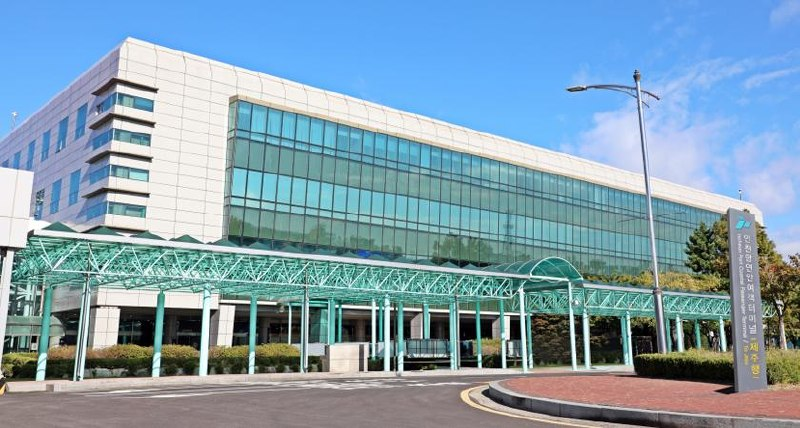
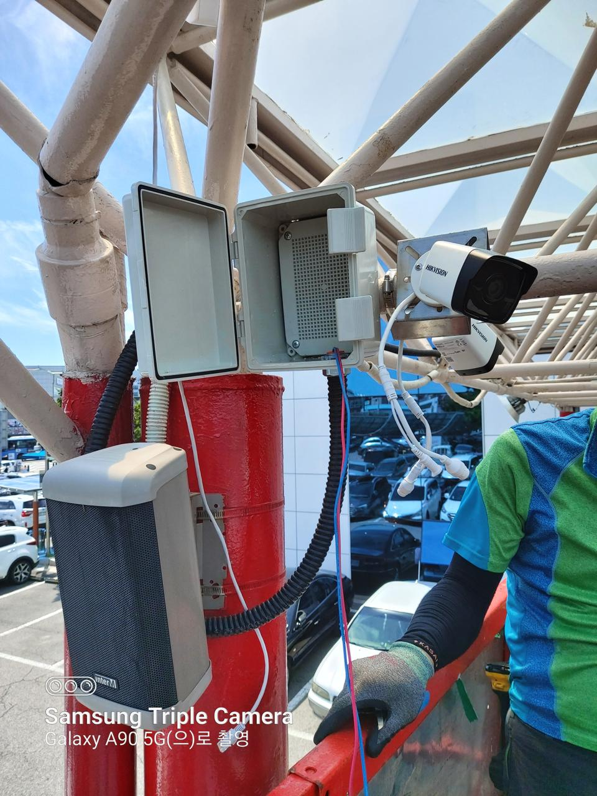

[← Back to index](../index_en.md)

# ParkingGo | Video AI-Based Parking Control Solution

## Basic Information
- Demonstration company: ParkingGo
- Demonstration year: 2022
- Support amount: KRW 40,000,000
- Location: 70 Yeonanbudu-ro, Jung-gu, Incheon (Hang-dong 7-ga)
- Demonstration partner: Incheon Port Authority
- Demonstration target: Incheon Coastal Ferry Terminal
- Space overview:
  - A ferry terminal connecting Incheon Port with islands in the West Sea region
  - Total floor area: 6,482.88㎡
  - Configured from basement level 1 to ground level 3
  - Equipped with ticket offices, restaurants, convenience stores, cafes, and other amenities
  - Includes a maritime safety experience center for emergency response education
- Category: Space

## Demonstration Overview
- Case name: Video AI-Based Parking Control Solution
- Purpose: To introduce a system that improves convenience for parking-lot users at the Incheon Coastal Ferry Terminal and to upgrade a video-based AI parking analytics solution.

## Demonstration Details
- Demonstration of a system for improving user convenience in the Incheon Coastal Ferry Terminal parking lot and advancement of a video-based AI parking analysis solution.

## Demonstration Objectives
1. 98% accuracy in video-based object detection
2. 98% precision in video-based vehicle recognition
3. 98% accuracy in video-based full-parking information

## Demonstration Method
- Installed CCTV at the Ongjin-bound and Jeju-bound parking lots of the Incheon Coastal Ferry Terminal and demonstrated a video-based parking-space control system, verifying the validity of object-detection accuracy.

## Demonstration Results
1. Video-based object detection accuracy: 99% (100% achieved)
2. Video-based vehicle recognition precision: 98.5% (100% achieved)
3. Video-based full-parking information accuracy: 99.25% (100% achieved)

## Contact
- Kang Baram
- 010-5138-5858
- zakkdime@itp.or.kr

## Related Images

### Image 1

### Image 2

## Notes
- The same partner bundle also includes the Appmedia case, but this document separates only the ParkingGo case.
- See the `raw/` folder for related images and source materials.
- This document is organized based on shared screenshots and user-provided text.
