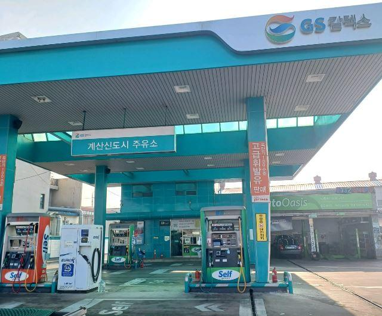
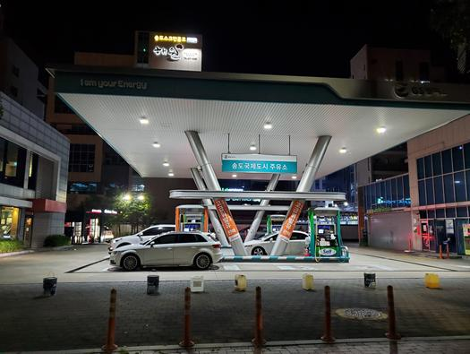
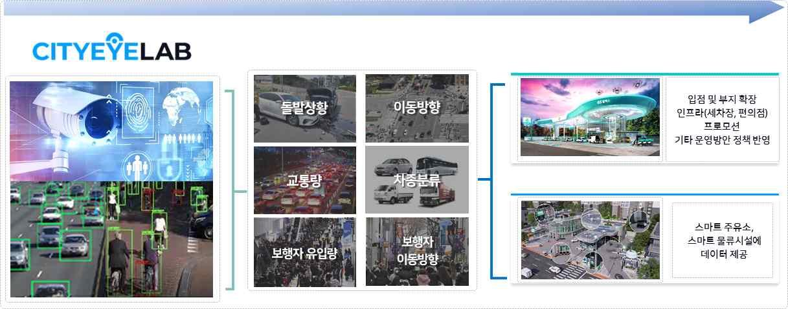

[← Back to index](../index_en.md)

# CityEyeLab | AI Video Analytics-Based Data Generation Solution for Smart Gas Stations

## Basic Information
- Demonstration company: 시티아이랩
- Demonstration year: 2023
- Support amount: 30,000,000원
- Location: 인천 계양구 봉오대로 942 (서운동)
- Demonstration partner: GS칼텍스
- Demonstration scope: 총 24개소, 인천(17개소) 및 경기(김포/부천/안산/시흥 7개소)
- Category: 데이터

## Demonstration Overview
- Case name: 스마트 주유소를 위한 AI 영상분석 기반 데이터 생성 솔루션
- Purpose: 주유소 환경에서 AI 영상분석을 통해 차량번호, 혼잡도, 이동경로, 안전관리 관련 데이터를 생성하고 공공·민간 활용 가능성을 검증하는 것

## Demonstration Details
1. ANPR(Auto Number Plate Recognition) 차량 번호판 인식 정확도 성능 검증
2. 카메라를 활용한 주유소 세차장 혼잡도 산출 및 이용 고객 대상 실시간 대기 차량 정보 제공
3. 주유소 안전관리를 위한 차량-차량 간의 상충분석 정보 제공과 안전관리 모니터링

## Demonstration Objectives
1. 차량 번호판(ANPR) 인식 정확도 분석 및 데이터 검증
2. 이동경로 및 체류시간 데이터 측정
3. 상충지점 데이터를 제공하여 안전관리 모니터링
4. 세차장 혼잡도 측정 및 대기 차량 정보 제공

## Demonstration Method
- 주유소에 설치된 카메라 인프라를 활용하거나 필요시에 카메라를 설치하여 차량 및 고객 AI 영상분석을 진행하고 데이터를 학습시켜 고도화를 진행함

## Demonstration Results
- 모든 목표 달성
- 투자유치 성공
- 성곽밸리 IR 피칭 대회 대상
- CCTV를 활용한 AI 영상분석에 대한 다양한 Background 및 요소 기술 확보

## Contact
- 강바람
- 010-5138-5858
- zakkdime@itp.or.kr

## Related Images

### Image 1

### Image 2

### Image 3

### Image 4

## Notes
- See the `raw/` folder for related images and source materials
- This document is organized based on shared screenshots and user-provided text
