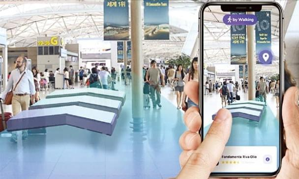
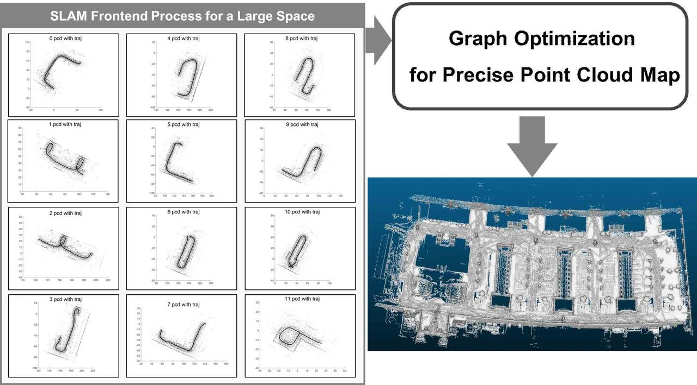
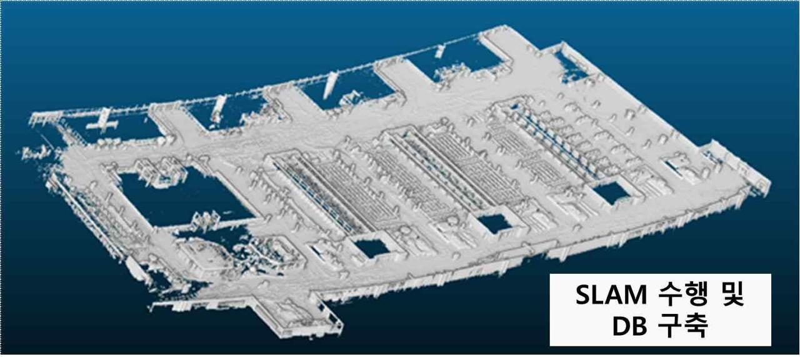
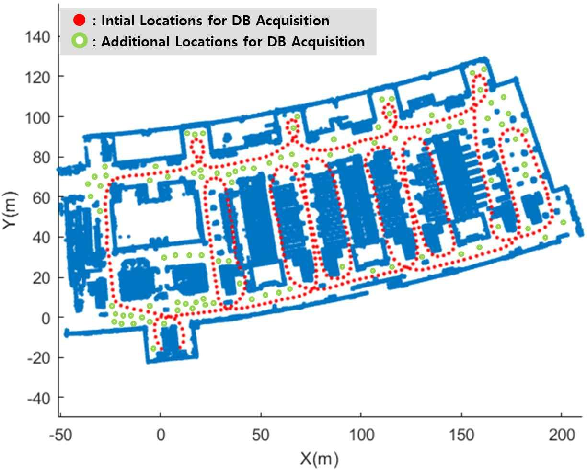
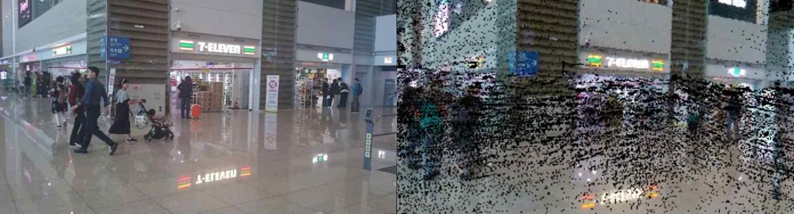

[← Back to index](../index_en.md)

# TLabs | VPS Technology Demonstration for Spaces and Facilities in Incheon International Airport Terminals 1 and 2

## Basic Information
- Demonstration company: 티랩스
- Demonstration year: 2023
- Support amount: 30,000,000원
- Location: 인천 중구 공항로 271 (운서동)
- Demonstration partner: 인천국제공항공사
- Demonstration target: 인천국제공항 제1~2 여객터미널 공간 및 시설물
  - 상세: 제1~2여객터미널, 진입도로, 시설(주차장) 등
  - 용도: 인천국제공항 공간 및 시설물의 디지털 전환

## Demonstration Overview
- Case name: 인천국제공항 이용자가 스마트폰을 이용하여 인천국제공항 제1, 2터미널에서 수십 cm 내외로 정확한 Location를 추정할 수 있도록 하는 상용 서비스 수준의 VPS 기술 실증
- 분야: 실내외 정밀측위, VPS, 디지털 전환, 공항 공간 서비스
- Purpose: 공항 이용자가 스마트폰 기반으로 제1, 2터미널 내에서 정밀 Location를 추정할 수 있는 상용 수준의 기술을 검증하는 것

## Demonstration Details
- 인천국제공항 이용자가 스마트폰을 이용하여 인천국제공항 제1,2터미널에서 (수십 cm 내외로) 정확한 Location를 추정하되 상용 서비스가 가능한 수준의 기술 실증

## Demonstration Objectives
- 필요 영상 정보량 : 5sec
- 초기Location 적확도 : 90%

## Demonstration Method
- 인천국제공항 제2터미널 3층에서 Lidar 기반의 스캐너를 이용하여 데이터 취득 및 VPS 알고리즘 성능 확인 실증

## Demonstration Results
- 필요 영상 정보량 : 3.9sec (달성)
- 초기Location 적확도 : 90% (달성)

## Contact
- 강바람
- 010-5138-5858
- zakkdime@itp.or.kr

## Related Images

### Image 1

### Image 2

### Image 3

### Image 4

### Image 5

### Image 6

## Notes
- See the `raw/` folder for related images and source materials
- This document is organized based on shared screenshots and user-provided text
