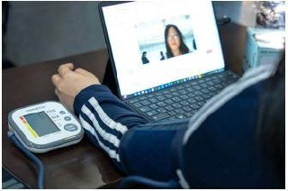
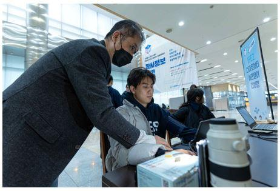

[← Back to index](../index_en.md)

# FunnyTech21 | Non-Invasive Biometric Data Detection and Monitoring

## Basic Information
- Demonstration company: FunnyTech21
- Demonstration year: 2024
- Support amount: KRW 10,000,000
- Location: 204 Convensia-daero, Yeonsu-gu, Incheon (Songdo-dong)
- Demonstration partner: IFEZ
- Demonstration target: Entire spaces or locations within Incheon Startup Park
- Category: Space
- Keywords: Living lab, civic participation, IFEZ, app

## Demonstration Overview
- Case name: Non-Invasive Biometric Data Detection and Monitoring
- Purpose: To use the Health Magnifier app with participants of various genders and ages in order to verify biometric-signal accuracy and improve usability and functions.

## Demonstration Details
- The main goal was to evaluate the performance of the Health Magnifier app by having users of different genders and age groups participate during the demonstration period and comparing the accuracy of measured biometric signals against certified medical devices.

## Demonstration Objectives
- Encourage participants to use the Health Magnifier app in daily life and collect routine health data
- Encourage regular measurement of biometric data such as heart rate, respiratory rate, and blood pressure during daily activities
- Keep a counseling service open at all times to provide immediate support for issues or questions arising during app use
- Regularly collect participant experiences and opinions to obtain feedback on app usability and functions
- Store real-time collected data on servers and improve app functions based on analysis of health indicators, accuracy, user participation, app functionality, and feedback

## Demonstration Method
- Supported usability evaluation and improvement through a living-lab demonstration program

## Demonstration Results
- Added new features: SDNN (heart rate variability), RMSSD, pNN50, autonomic nervous system (LF/HF), and blood glucose
- Enabled real-time health monitoring through camera-based measurement on mobile and web, with real-time health indicator detection and visualization
- Reflected personal health standing in real time through percentile analysis by age, gender, and disease group
- Quantitatively analyzed autonomic nervous system indicators to assess stress and support early dementia screening

## Contact
- Seo Hojun
- 032-228-1218
- ok0410@itp.or.kr

## Related Images

### Image 1

### Image 2

### Image 3

## Notes
- The same IFEZ / Incheon Startup Park-wide bundle also includes cases from OysterAble, VestellaLab, Soteria, GY Networks, Wayne, Somuna, Cheonggaeguri, Moi Technology, and Haben.
- This version is organized from user-provided text, and additional screenshots can be added later to the raw folder.
