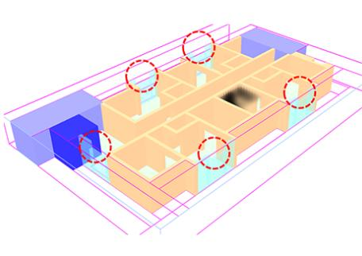
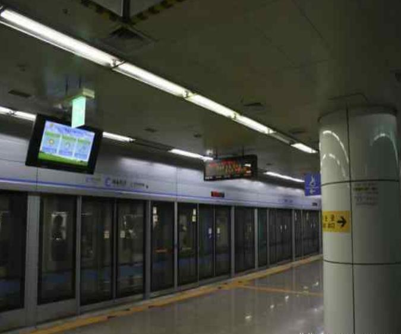
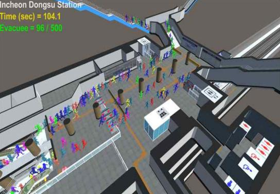
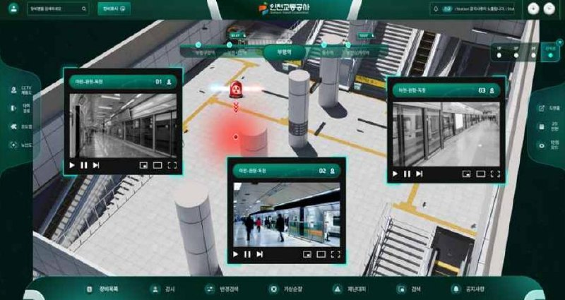

[← 인덱스로 돌아가기](../index_ko.md)

# 아이캡틴 | 군중 시뮬레이션과 능동 대피 유도 시스템을 적용한 인공지능 기반 스마트 대피 시스템(오픈이노베이션형)

## 기본 정보
- 실증기업: 아이캡틴
- 실증년도: 2024
- 지원금액: 25,000,000원
- 위치: 인천 남동구 경인로 674 (간석동)
- 실증파트너: 인천교통공사
- 실증대상:
  - 인천1호선 중 2개 역사(인천시청역, 동수역)
  - 인천2호선 중 2개 역사(인천가좌역, 석남역)
- 면적: 지하 3~5층
- 수용인원: 약 2,400여명(이용객 최대 시간 기준)
- 용도: 운수시설(역사)
- 특이사항: 인천1호선 동막역 및 인천1호선의 경우 터널, 역사외장재 3D 소유중
- 분류: 공간

## 실증 개요
- 사례명: 군중 시뮬레이션과 능동 대피 유도 시스템을 적용한 인공지능 기반 스마트 대피 시스템(오픈이노베이션형)
- 목적: 지하철 역사 재난 상황에서 재실자 대피 안정성을 높이기 위한 시뮬레이션 및 대피경로 산출 기술을 검증하는 것

## 실증내용
1. 대규모 인명피래를 초래할 수 있는 지하철 특성상 재난 상황 발생 시 대피 시간 분석이 되지 않아 안정성 평가 및 대응에 큰 어려움이 있음
2. 인천교통공사 관리 역사에 재실자 대피 안정성 향상을 위한 시뮬레이션 기술 적용 및 검증 실증 진행

## 실증목표
1. 지하철 역사 3D 모델 정확도 95%
2. 군중 및 화재 시뮬레이션 정확도 100%
3. 재난 대피경로 산출 시간 0.5sec 이하
4. 재난 대피경로 산출 정확도 100%

## 실증방법
1. 도면 기반의 3D 지하철 역사 모델 진행
2. 실시간 최적 대피 경로 알고리즘 및 군중 시뮬레이션 진행
3. 재난 대피 산출 시간 및 경로 산출 정확도 등 시뮬레이션 정확도 테스트 진행

## 실증결과
1. 지하철 역사 3D 모델 정확도 100% 달성
2. 군중 및 화재 시뮬레이션 정확도 100% 달성
3. 재난 대피경로 산출 시간 100% 달성
4. 재난 대피경로 산출 정확도 100% 달성

## 담당자
- 조예주
- 032-228-1220
- yeju@itp.or.kr

## 관련 이미지

### 이미지 1

### 이미지 2

### 이미지 3

### 이미지 4

## 비고
- 관련 이미지 및 근거자료는 `raw/` 폴더 참고
- 메테오시뮬레이션 사례도 같은 실증 파트너/공간 맥락에서 별도 정리 가능
- 현재 내용은 공유된 화면 캡처 및 사용자 제공 텍스트 기준 정리본
