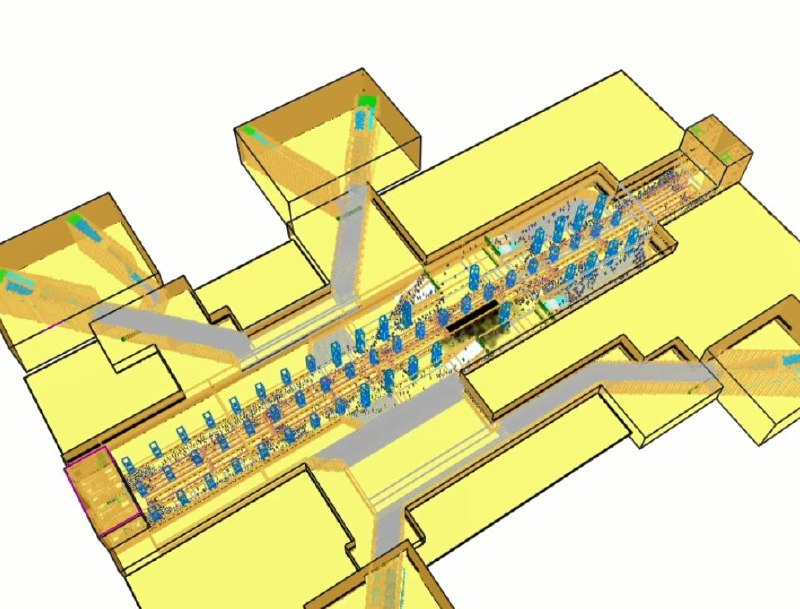
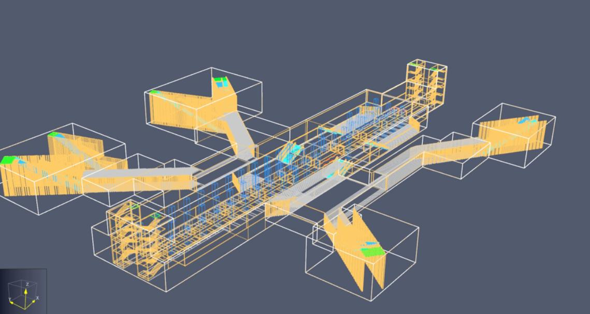

[← Back to index](../index_en.md)

# MeteoSimulation | Subway Station Fire and Evacuation Response Service Using Digital Twin Technology (Open Innovation Type)

## Basic Information
- Demonstration company: 메테오시뮬레이션
- Demonstration year: 2024
- Support amount: 25,000,000원
- Location: 인천 남동구 경인로 674 (간석동)
- Demonstration partner: 인천교통공사
- Demonstration target:
  - 인천1호선 중 2개 역사(인천시청역, 동수역)
  - 인천2호선 중 2개 역사(인천가좌역, 석남역)
- 면적: 지하 3~5층
- 수용인원: 약 2,400여명(이용객 최대 시간 기준)
- 용도: 운수시설(역사)
- 특이사항: 인천1호선 동막역 및 인천1호선의 경우 터널, 역사외장재 3D 소유중

## Demonstration Overview
- Case name: 디지털트윈 기술을 활용한 지하철 역사 화재 및 피난 대응 서비스(오픈이노베이션형)
- Purpose: 지하철 역사 화재 대응과 피난 분석을 고도화하고, 성능위주 설계 관점에서 활용 가능한 화재 및 피난 대응 서비스를 검증하는 것

## Demonstration Details
- 지하철 역사 화재의 심각성 및 소방 성능위주 설계 의무화로 인한 지하철 화재 및 피난 대응 서비스 고도화
1. 지하철 역사 화재 및 피난(시뮬레이션) 분석 및 실증
2. 지하철 역사 화재 및 피난 관련 법 및 제도 분석
3. 지하철 역사 피난 안전 방법 및 안전기술 조사

## Demonstration Objectives
1. ASET 예측 정확도 95%
2. RSET 예측 정확도 95%
3. 온도 예측 정확도 90% ~ 95%
4. 시야거리 예측 정확도 95%
5. 성능위주 설계용 평가 보고서 합/불

## Demonstration Method
1. 지하철 역사 관련 현장 데이터 수집을 후 지하철 역사 화재 및 피난(시뮬레이션) 분석
   - 허용피난 시간과 필요피난 시간의 산출 진행, 피난 경로 평가 진행
2. 지하철 역사 화재 및 피난 관련 서고 특성 분석, 피난 시뮬레이션 특성 분석
3. 소방성능 위주 설계 전문가 심사 진행

## Demonstration Results
1. ASET 예측 정확도 99% / 달성
2. RSET 예측 정확도 90% / 달성
3. 온도 예측 정확도 100% / 달성
4. 시야거리 예측 정확도 100% / 달성
5. 성능위주 설계용 평가 보고서 합

## Contact
- 조예주
- 032-228-1220
- yeju@itp.or.kr

## Related Images

### Image 1

### Image 2

## Notes
- 같은 인천교통공사 파트너 사례이지만, 아이캡틴과는 별도 실증사례로 분리 정리함
- See the `raw/` folder for related images and source materials
- This document is organized based on shared screenshots and user-provided text
