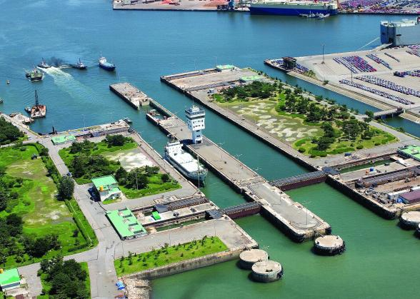
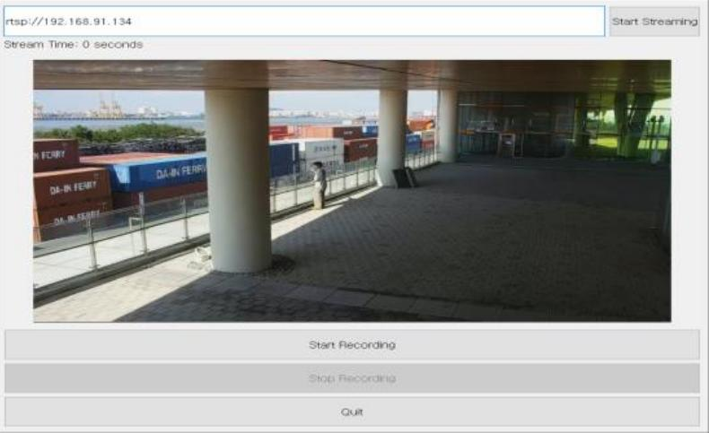
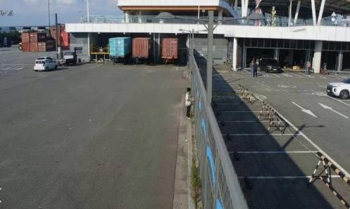

[← Back to index](../index_en.md)

# PIASPACE | Multimodal AI Video Analytics Solution for Improving False Positives and Missed Detections in Port Facility Security CCTV Monitoring (Open Innovation Type)

## Basic Information
- Demonstration company: 피아스페이스
- Demonstration year: 2024
- Support amount: 25,000,000원
- Location: 인천 연수구 센트럴로 263 (송도동)
- Demonstration partner: 인천항만공사
- Resource type: 실증자원이 아닌 인천항만공사의 다양한 데이터
  - 보안 CCTV(공유범위 내)
  - 도급사업 안전관리 전자문서 등

## Demonstration Overview
- Case name: 항만시설 보안관리 CCTV 선별관제 오탐지 및 미탐지 개선 멀티모달 AI 영상분석 솔루션(오픈이노베이션형)
- 분야: 항만 보안, CCTV 영상분석, 멀티모달 AI
- Purpose: 항만시설 보안관리 CCTV 선별관제 과정에서 오탐지 및 미탐지를 줄이고 이상상황 탐지 성능을 개선하는 것

## Demonstration Details
- 정확도 개선 지표(F1-Score) 및 선별관제(물체탐지 기술 기반)로 CCTV 채널 25개 이상 검증

## Demonstration Objectives
1. 정확도 개선 92% 이상
2. 복잡한 상황 탐지 가능성 확인 2건 이상
3. 비용 효율적 솔루션 25채널 이상
4. 소프트웨어 만족도 90점 이상

## Demonstration Method
1. 인천항만공사 내부 보유한 영상 데이터 활용해 다채널 실시간 CCTV 영상처리 기술 적용
2. 인천항만공사 이상상황 데이터셋 구축 위한 데이터 수집 진행

## Demonstration Results
1. 정확도 개선 100% / 달성
2. 복잡한 상황 탐지 가능성 확인 200% / 달성
3. 비용 효율적 솔루션 200% / 달성
4. 소프트웨어 만족도 100% / 달성

## Contact
- 조예주
- 032-228-1220
- yeju@itp.or.kr

## Related Images

### Image 1

### Image 2

### Image 3

### Image 4

## Notes
- See the `raw/` folder for related images and source materials
- This document is organized based on shared screenshots and user-provided text
