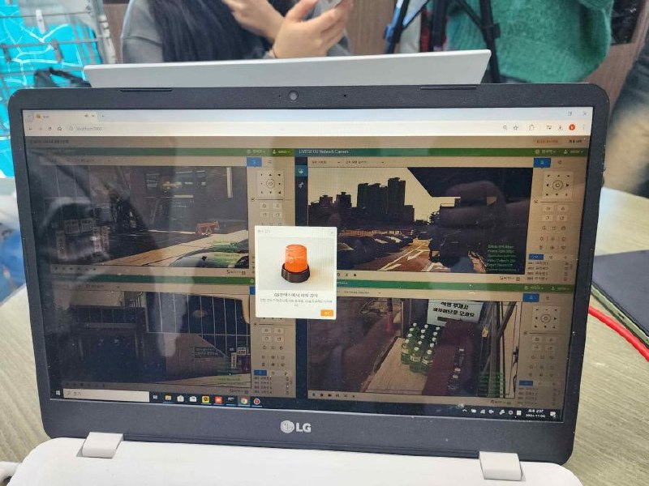

[← Back to index](../index_en.md)

# WithPi | Real-Time Fire Safety Service with AI-Linked CCTV and Automatic Fire Reporting (Open Innovation Type)

## Basic Information
- Demonstration company: 위드피
- Demonstration year: 2024
- Support amount: 25,000,000원
- Location: 인천 연수구 하모니로 128 (송도동)
- Demonstration partner: GS칼텍스
- Demonstration scope: 총 24개소, 인천(17개소) 및 경기(김포/부천/안산/시흥 7개소)
- Category: 공간

## Demonstration Overview
- Case name: AI기반 CCTV 연계한 스스로 화재신고하는 실시간 소방 안전서비스(오픈이노베이션형)
- Purpose: 주유소 환경에서 AI 기반 CCTV, 화재 버튼 센서, 화재 신고 시스템을 연동하여 화재를 실시간 감지하고 즉시 소방서로 신고 접수하는 안전서비스를 검증하는 것

## Demonstration Details
1. AI 기반 CCTV, 화재 버튼 센서, 화재 신고 시스템을 실증 사이트에 구축
2. 24시간 무중단 AI 기반 CCTV가 화재를 탐지, 화재 발생 시 언제든 바로 소방서로 화재 신고 접수
3. 주유소 건물을 사용하는 누구라도 화재 발견 시 화재 신고 버튼을 누름으로써 신속하게 소방서로 화재 출동 신고

## Demonstration Objectives
1. 연기, 불꽃 감지 데이터 전송 속도 5초 이내
2. 화재버튼 신고 접수 10회 성공
3. 오류 탐지 9회 감지 성공
4. 소방본부 화재 신고 접수 3회 성공

## Demonstration Method
1. 현재 운영 중인 주유소의 자동화재탐지 설비에 다매체 화재(소방프로그램) 화재 신고 시스템 연동
2. AI기반 CCTV(연기, 불꽃 감지)를 설치하여 다매체 화재신고 시스템에 연동
3. 화재 이벤트 발생 시 직접 신고가 가능한 화재 신고 버튼을 설치
4. CCTV를 통해 화재 감지 시 인천소방본부 화재 신고 서버로 화재 신고 접수해 출동 요청
5. 화재 이벤트 발생 시 주유소 Contact에게 화재 알림 문자 전송

## Demonstration Results
1. 감지데이터 전송 속도 (100% 달성)
2. 신고 버튼 발생 감지 (100% 달성)
3. 오류 신호 감지 (100% 달성)
4. 화재 신고 접수 (100% 달성)

## Contact
- 강지원
- 032-228-1222
- lily@itp.or.kr

## Related Images

### Image 1

### Image 2

## Notes
- 같은 GS칼텍스 묶음 안에 어반모빌리티, 시티아이랩 사례가 함께 존재
- See the `raw/` folder for related images and source materials
- This document is organized based on shared screenshots and user-provided text
