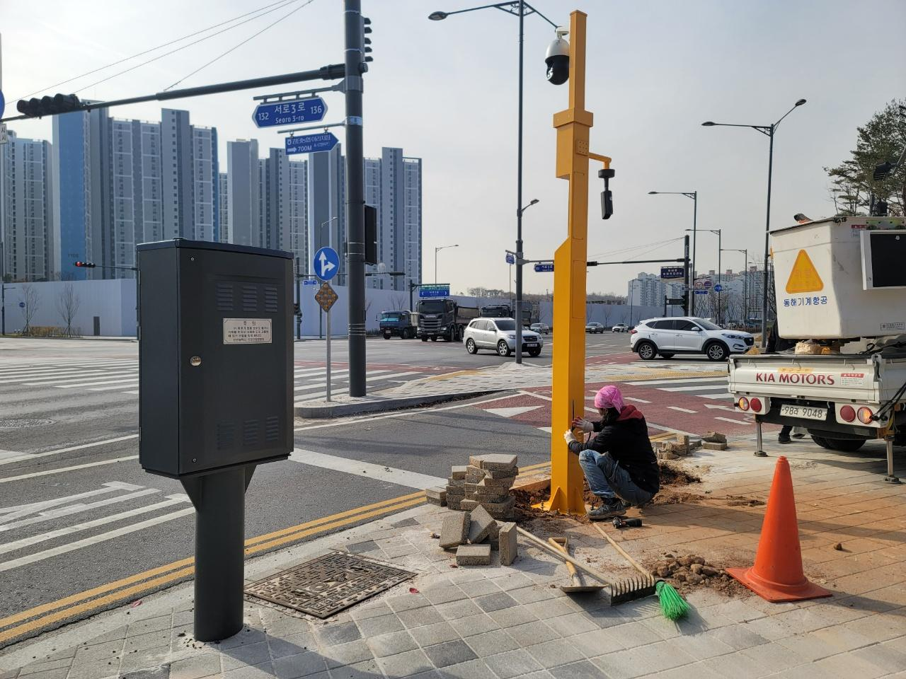
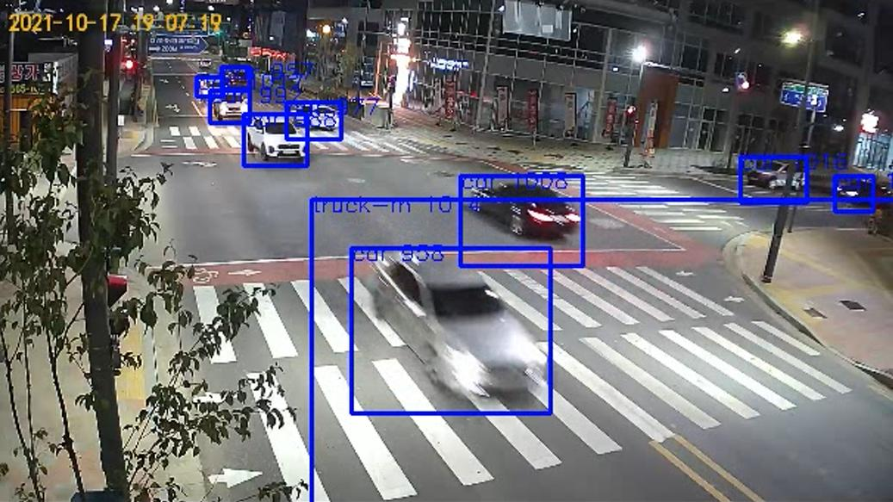

[← 인덱스로 돌아가기](../index_ko.md)

# 시티아이랩 | AI 기반 실시간 교통정보 모니터링 플랫폼 실증

## 기본 정보
- 실증기업: 시티아이랩
- 위치: 인천 서구 원당대로 929 (원당동)
- 실증파트너: 인천도시공사
- 실증대상: 인천도시공사 검단사업단 앞 교차로(사거리)
- 분류: 공간

## 실증 개요
- 사례명: AI 기반 실시간 교통정보 모니터링 플랫폼 실증
- 목적: 교차로 영상 데이터를 활용하여 실시간 교통정보를 예측하고 통행차량 자동 검지율을 측정함으로써 비즈니스 모델의 유효성을 검증하는 것

## 실증방법
- 검단신도시 내 6개 교차로에 카메라를 설치하고, 수신데이터를 통해 실시간 교통정보 예측 및 통행차량 자동 검지율을 측정하여 비즈니스모델 유효성 검증

## 현재 확인 가능한 정보
- 위치, 실증파트너, 실증기업, 사례명, 실증방법 확인
- 현장 설치 사진과 영상 검지 화면 확보
- 실증년도, 지원금액, 목표, 결과, 담당자 정보는 추가 확인 필요

## 관련 이미지

### 이미지 1

### 이미지 2

## 비고
- 관련 이미지 및 근거자료는 `raw/` 폴더 참고
- 현재 내용은 공유된 화면 캡처 및 사용자 제공 텍스트 기준 정리본
