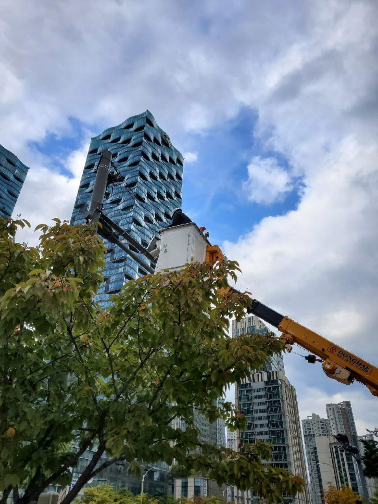
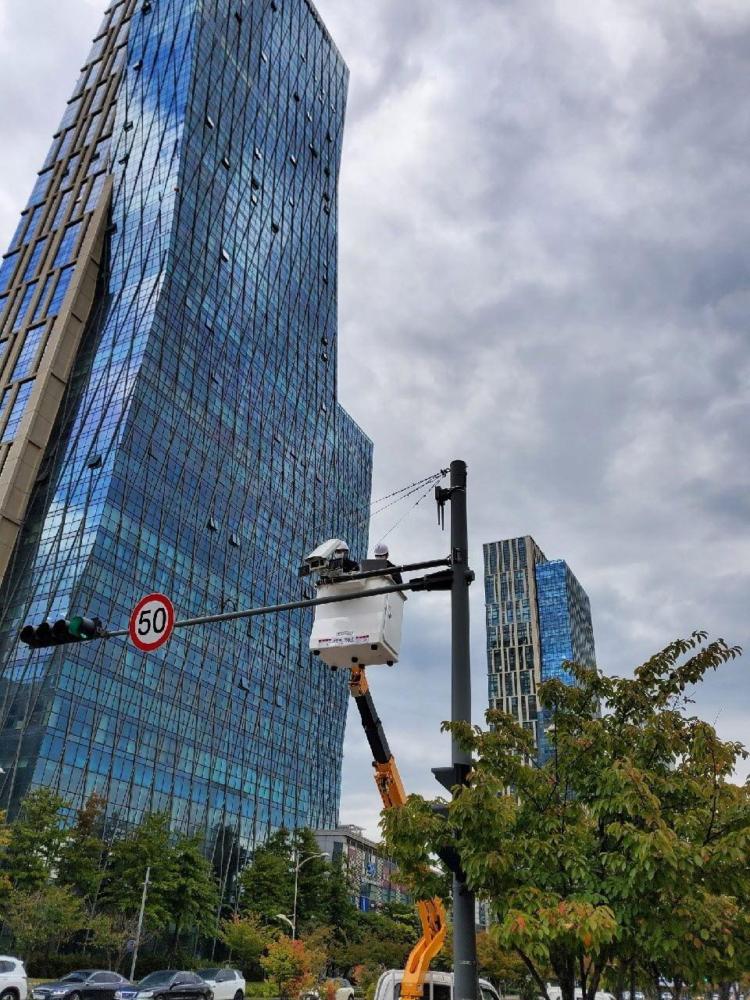
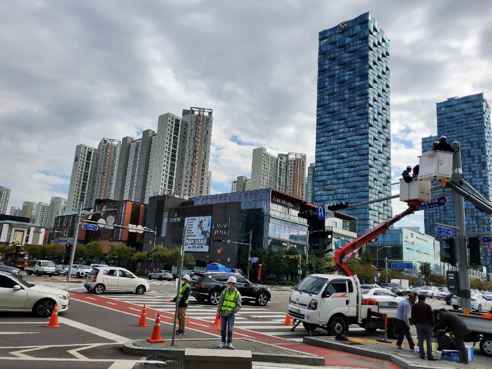
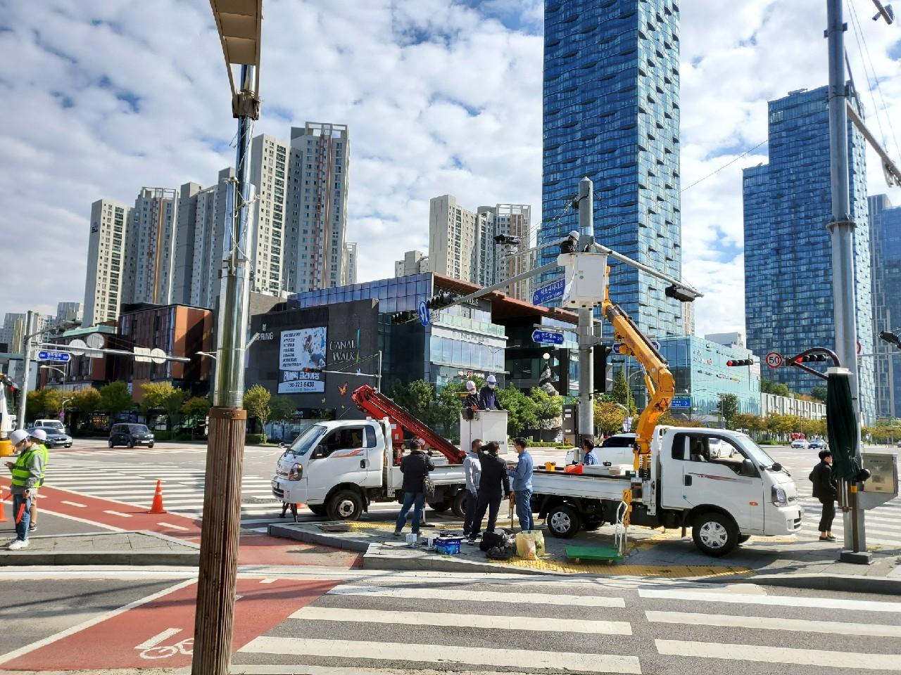

[← Back to index](../index_en.md)

# GlobalBridge | Data Acquisition and Analysis of Specific Vehicle Entry Status for Safer Urban Traffic Environments

## Basic Information
- Demonstration company: (주)글로벌브릿지
- Location: 인천 연수구 아트센터대로 175 (송도동)
- Demonstration partner: IFEZ
- Demonstration resources: 인천경제자유구역 도심 내 CCTV 및 가로등
- Category: 인프라/플랫폼
- Demonstration method: IoT 실증 지원사업(실증비용 지원형)

## Demonstration Overview
- Case name: 도심 내 안전한 교통환경 보장을 위해 특정차량의 도심 진입 현황을 분석하고 이를 통해 지자체 및 공공기관이 활용할 수 있는 실효성 있는 데이터 확보 및 분석
- Purpose: 특정차량의 도심 진입 현황을 분석하여 공공기관이 활용 가능한 실효성 있는 데이터를 확보하는 것
- Usage context: 도심 교통안전, 도시 데이터 수집, 공공기관 활용형 분석

## 실증대상 및 환경
- 인천경제자유구역 도심 내 CCTV 및 가로등 인프라 활용
- 도심 교차로 및 차량 통행 구간 현장 설치 사진 확인 가능

## Currently Confirmed Information
- Location, Demonstration partner, Demonstration company, 분류, Demonstration method, 현장 이미지 확보
- 세부적인 Demonstration year, Support amount, 목표, 결과 수치 등은 추가 확인 필요

## Related Images

### Image 1

### Image 2

### Image 3

### Image 4

## Notes
- 관련 이미지 및 동영상, 근거자료는 `raw/` 폴더 참고
- This document is organized based on shared screenshots and user-provided text
