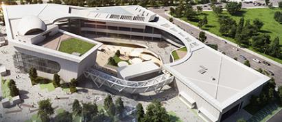
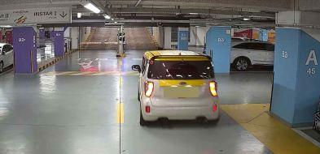
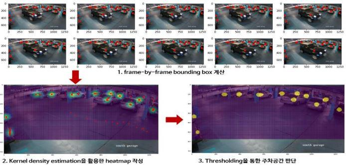

[← Back to index](../index_en.md)

# Propwave | Parking Space Management and Demand Vehicle Matching Solution Using CCTV Video Analytics

## Basic Information
- Demonstration company: Propwave
- Location: 204 Convensia-daero, Yeonsu-gu, Incheon (Songdo-dong)
- Demonstration partner: Incheon Startup Park
- Demonstration target: Interior spaces of Incheon Startup Park Instar I, II, and III, as well as positioning markers

## Demonstration Overview
- Case name: Parking Space Management and Demand Vehicle Matching Solution Using CCTV Video Analytics
- Purpose: To verify, in a real environment, a CCTV video analytics-based solution for parking-space management and matching demand vehicles.

## Demonstration Method
- Parking-space management and demand vehicle matching solution using CCTV video analytics technology

## Currently Confirmed Information
- Demonstration partner, location, demonstration target, demonstration company, and demonstration method confirmed
- Images secured for the Instar buildings, parking-lot scenes, and analysis examples such as frame-by-frame analytics, heatmaps, and parking-space judgment
- Demonstration year, support amount, objectives, results, and contact information require further confirmation

## Related Images

### Image 1

### Image 2

### Image 3

## Notes
- See the `raw/` folder for related images and source materials.
- This document is organized based on shared screenshots and user-provided text.
