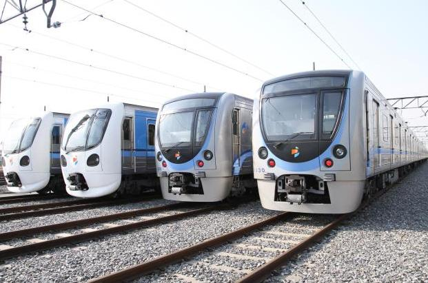
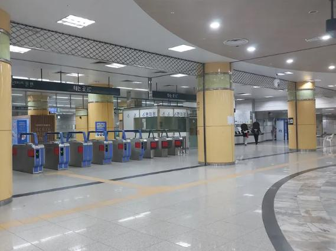
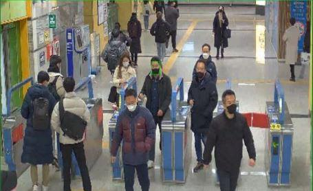

[← 인덱스로 돌아가기](../index_ko.md)

# 제브라앤시퀀스 | 보행자(이동피사체) 얼굴인식 SW 시스템을 통한 인천대입구역사 안전망 구축

## 기본 정보
- 실증기업: 제브라앤시퀀스
- 위치: 인천 연수구 인천타워대로 지하 155 (송도동)
- 실증파트너: 인천교통공사
- 실증대상: 인천지하철 1호선, 2호선, 7호선 시설물
- 용도: 운수시설(터널 및 교량), 화장실 등
- 주요 실증 내역: 인천대입구역 화장실 재실정보 알람 기능 구축 완료
- 분류: 공간

## 실증 개요
- 사례명: 보행자(이동피사체) 얼굴인식 SW 시스템을 통한 인천대입구역사 안전망 구축 (실종자 조기발견, 범죄 예방)
- 목적: 인천대입구역사에서 얼굴인식 기반 감지 시스템을 통해 실종자 조기 발견 및 범죄 예방 등 안전망을 구축하는 것

## 실증방법
- 지하철역사에 기존 설치되어 있는 지능형 CCTV(4번 출구 무빙워크, 대합실: 2대)를 AI 기반의 이동피사체 얼굴인식 S/W 시스템과 연동하여 무임승차자 등의 대상자 인식률, 감지율 실증
- 실증 후 인천교통공사 무상증여

## 현재 확인 가능한 정보
- 위치, 실증파트너, 실증기업, 실증방법, 현장 사진 확보
- 같은 묶음 안에 시스콘, 이안에스아이티, 페타브루, 한줌, 디플리 사례가 함께 존재
- 실증년도, 지원금액, 정량 목표/결과, 담당자 정보는 추가 확인 필요

## 관련 이미지

### 이미지 1

### 이미지 2

### 이미지 3

## 비고
- 관련 이미지 및 근거자료는 `raw/` 폴더 참고
- 현재 내용은 공유된 화면 캡처 및 사용자 제공 텍스트 기준 정리본
